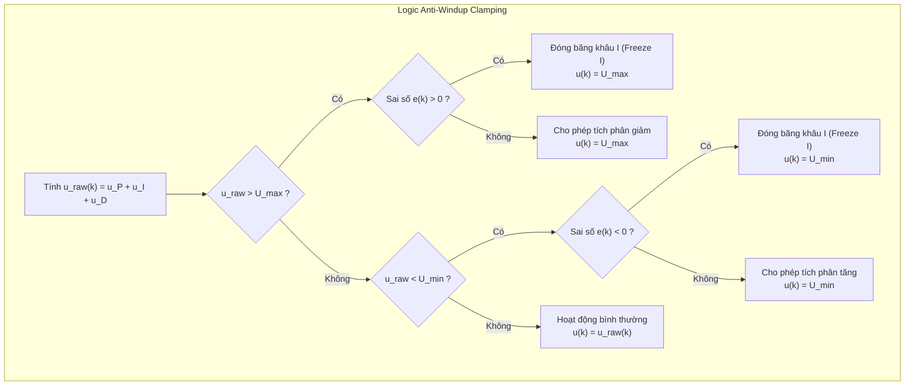

Trong các bài giảng tự động hóa hoặc mô phỏng phần mềm, thuật toán **PID (Proportional - Integral - Derivative)** thường được biểu diễn bằng những phương trình vi tích phân tuyến tính rất đẹp mắt. Tuy nhiên, khi kỹ sư nạp thuật toán PID vào PLC để điều khiển trạm bơm áp suất, lò nung công nghiệp hay hệ thống phân phối lưu lượng, hàng loạt sự cố thực tế bắt đầu nảy sinh:

* Bơm tăng áp khởi động giật cục, áp suất vọt đỉnh gây vỡ đường ống hoặc nhảy rơ-le an toàn do **bão hòa tích phân (Integral Windup)**.
* Mỗi lần người vận hành thay đổi giá trị đặt (Setpoint) trên màn hình HMI, van tuyến tính lập tức bị giật mạnh do **cú sốc vi phân (Derivative Kick)**.
* Tín hiệu cảm biến 4-20mA bị nhiễu sóng hài từ biến tần làm ngõ ra điều khiển rung lắc liên tục, làm giảm tuổi thọ động cơ và cơ cấu chấp hành.
* Chuyển đổi giữa chế độ điều khiển bằng tay (Manual) sang tự động (Auto) làm quy trình bị nhảy bước đột ngột.

Bài viết này sẽ phân tích chi tiết bản chất toán học số hóa của PID trong PLC, 5 kỹ thuật nâng cao bắt buộc phải có để hệ thống vận hành êm ái, cũng như cách cấu hình thực tế trên PLC Mitsubishi và Siemens.

{/* truncate */}

---

## 1. Số hóa thuật toán PID trong PLC (Discrete PID)

PLC hoạt động theo chu kỳ quét (Scan Cycle). Do đó, phương trình vi tích phân liên tục kinh điển:

```math
u(t) = K_p \cdot e(t) + K_i \int_{0}^{t} e(\tau) d\tau + K_d \frac{de(t)}{dt}
```

bắt buộc phải được **rời rạc hóa (Discretization)** theo chu kỳ lấy mẫu $T_s$ (Sampling Time).

```mermaid
graph LR
    SP["Giá trị đặt (SP)"] --> Sum((+ / -))
    PV["Giá trị đo (PV)"] -->|Cảm biến 4-20mA| Filter["Lọc thông thấp (Filter)"]
    Filter --> Sum
    Sum -->|Sai số e| PID["Thuật toán Số hóa PID (Ts)"]
    PID --> AW["Chống bão hòa (Anti-Windup)"]
    AW --> Limit["Giới hạn ngõ ra (0 - 100%)"]
    Limit --> MV["Ngõ ra điều khiển (MV)"]
    MV --> Actuator["Cơ cấu chấp hành (Van/Biến tần)"]
    Actuator --> Process["Đối tượng điều khiển"]
    Process -.->|Phản hồi| PV
```



### a) Tại sao phải gọi hàm PID trong khối ngắt thời gian (Cyclic Interrupt)?

Một sai lầm rất phổ biến của người mới lập trình là đặt hàm PID trực tiếp trong khối chương trình chính (như `OB1` trong Siemens hay khối Main Scan của Mitsubishi).

* Thời gian quét của `OB1` **không bao giờ cố định** (thay đổi tùy theo số lượng nhánh lệnh đang thực thi, truyền thông mạng, xử lý ngắt...).
* Khi thời gian quét dao động (Jitter), đại lượng $\Delta t$ giữa hai lần tính toán bị sai lệch, dẫn đến thành phần tích phân $\int e \cdot dt$ và vi phân $\frac{de}{dt}$ bị tính sai hoàn toàn, làm hệ thống mất ổn định.

> **Quy tắc vàng:** Luôn luôn gọi hàm PID bên trong khối **Ngắt định chu kỳ (Cyclic Interrupt)** với khoảng thời gian cố định $T_s$ (Ví dụ: `OB30` / `OB35` trong Siemens với chu kỳ $100\text{ms}$, hoặc sử dụng ngắt Timer `I6xx` / ngắt hằng thời gian trong Mitsubishi).

---

### b) Hai dạng thuật toán số hóa: Vị trí (Positional) và Gia lượng (Velocity)

#### 1. Dạng vị trí (Positional Form)
Tính trực tiếp giá trị ngõ ra tuyệt đối $u(k)$ tại chu kỳ lấy mẫu thứ $k$:

```math
u(k) = K_p \cdot e(k) + K_i \sum_{j=0}^{k} e(j) \cdot T_s + K_d \frac{e(k) - e(k-1)}{T_s}
```

* **Ưu điểm:** Trực quan, dễ hiểu, phản ánh trực tiếp trạng thái của van hay tần số.
* **Nhược điểm:** Phải lưu trữ toàn bộ tổng sai số quá khứ $\sum e(j)$, dễ bị tràn số và cần thuật toán Anti-Windup phức tạp.

#### 2. Dạng gia lượng (Velocity / Incremental Form)
Thay vì tính toàn bộ giá trị $u(k)$, thuật toán chỉ tính toán **mức thay đổi** $\Delta u(k) = u(k) - u(k-1)$:

```math
\Delta u(k) = K_p [e(k) - e(k-1)] + K_i \cdot T_s \cdot e(k) + \frac{K_d}{T_s} [e(k) - 2e(k-1) + e(k-2)]
```

Giá trị ngõ ra thực tế được cập nhật: $u(k) = u(k-1) + \Delta u(k)$.

* **Ưu điểm vượt trội:**
  1. Tự động hỗ trợ **Bumpless Transfer**: Khi chuyển từ Manual sang Auto, hệ thống chỉ cần cộng thêm $\Delta u(k)$ vào vị trí van hiện tại mà không làm nhảy ngõ ra.
  2. Khả năng chống bão hòa tích phân tự nhiên: Nếu ngõ ra chạm giới hạn $100\%$, chỉ cần khóa không cho $\Delta u(k) > 0$.

---

## 2. 5 Kỹ thuật nâng cao giải quyết các sự cố thực tế

### Kỹ thuật 1: Chống bão hòa tích phân (Anti-Windup Clamping)

**Hiện tượng:** Khi hệ thống khởi động hoặc có tải lớn đột ngột, sai số $e(t)$ rất lớn khiến ngõ ra điều khiển $u(t)$ chạm ngưỡng cực đại ($100\%$). Tuy nhiên, đối tượng điều khiển (như nhiệt độ lò) cần thời gian để tăng lên. Trong thời gian này, khâu tích phân $I$ tiếp tục cộng dồn sai số thành một giá trị khổng lồ. Đến khi nhiệt độ $PV$ đã chạm $SP$, ngõ ra $u(t)$ vẫn bị "kẹt" ở $100\%$ và mất rất nhiều thời gian mới xả hết tích phân, gây hiện tượng vọt lố nghiêm trọng.



**Giải pháp:** Áp dụng phương pháp **Conditional Integration (Clamping)**:
* Nếu $u(k) \ge U_{max}$ và $e(k) > 0$: Ngắt không cho khâu $I$ tích lũy thêm.
* Nếu $u(k) \le U_{min}$ và $e(k) < 0$: Ngắt không cho khâu $I$ giảm thêm.

---

### Kỹ thuật 2: Chống cú sốc vi phân (Derivative on PV)

**Hiện tượng:** Theo công thức cổ điển, khâu vi phân tính theo đạo hàm của sai số:

```math
u_D(t) = K_d \frac{d(SP - PV)}{dt} = K_d \left( \frac{dSP}{dt} - \frac{dPV}{dt} \right)
```

Khi người vận hành thay đổi giá trị đặt $SP$ dạng bậc thang (Step change, ví dụ chỉnh từ $50^\circ\text{C} \to 80^\circ\text{C}$), đạo hàm $\frac{dSP}{dt} \to \infty$. Khâu $D$ lập tức tạo ra một xung đột biến (Spike) ở ngõ ra, làm van đập hết hành trình hoặc biến tần tăng tốc giật cục.

**Giải pháp (Derivative on PV):**
Vì giá trị đặt $SP$ thường là hằng số hoặc thay đổi theo từng bước nhảy của con người, ta loại bỏ $SP$ khỏi khâu vi phân và chỉ tính vi phân dựa trên tốc độ thay đổi của đại lượng quá trình $PV$:

```math
u_D(k) = - K_d \frac{PV(k) - PV(k-1)}{T_s}
```

Dấu trừ thể hiện tính chất cản trở sự thay đổi đột ngột của $PV$. Khi thay đổi $SP$, ngõ ra sẽ tăng dần êm ái mà không sinh ra xung sốc.

---

### Kỹ thuật 3: Bộ lọc thông thấp khử nhiễu ngõ vào (Low-Pass Filter)

Tín hiệu cảm biến công nghiệp truyền về PLC (4-20mA, 0-10V, RTD Pt100) luôn bị ảnh hưởng bởi nhiễu điện từ. Khâu vi phân $D$ có đặc tính khuếch đại nhiễu tần số cao. Nếu tín hiệu $PV$ có gợn sóng nhiễu dù chỉ $\pm 0.5\%$, khâu vi phân sẽ nhân biên độ dao động lên hàng chục lần, làm ngõ ra rung giật liên tục.

**Giải pháp:** Lọc tín hiệu $PV$ qua bộ lọc số thông thấp bậc 1 trước khi đưa vào hàm PID:

```math
PV_f(k) = \alpha \cdot PV(k) + (1 - \alpha) \cdot PV_f(k-1)
```

Trong đó hệ số lọc $\alpha = \frac{T_s}{T_f + T_s}$ ($T_f$ là hằng số thời gian lọc của bộ lọc).

---

### Kỹ thuật 4: Vùng chết sai số (Deadband / Error Gap)

Trong các hệ thống cơ khí (van điều khiển khí nén, động cơ bước, biến tần bơm), nếu cố gắng triệt tiêu sai số nhỏ đến từng $0.1\%$, cơ cấu chấp hành sẽ phải đảo chiều và nhấp nhả liên tục (Hunting), dẫn đến mòn phớt, cháy cuộn hút hoặc hỏng hộp giảm tốc.

```math
e'(k) = \begin{cases} 
0 & \text{khi } |e(k)| \le e_{deadband} \\
e(k) - e_{deadband} & \text{khi } e(k) > e_{deadband} \\
e(k) + e_{deadband} & \text{khi } e(k) < -e_{deadband}
\end{cases}
```

Khi sai số nằm trong vùng dung sai cho phép $e_{deadband}$, thuật toán xem như $e=0$, giữ nguyên trạng thái cơ cấu chấp hành và kéo dài tuổi thọ thiết bị.

---

### Kỹ thuật 5: Chuyển đổi êm tay/tự động (Bumpless Transfer)

Khi hệ thống đang vận hành ở chế độ Manual với công suất mở van $40\%$, nếu người vận hành gạt công tắc sang Auto:
* Nếu không có Bumpless Transfer: Hàm PID bắt đầu tính toán từ đầu, ngõ ra có thể nhảy vọt về $0\%$ hoặc $100\%$, gây sốc áp lực cho toàn bộ dây chuyền.
* Có Bumpless Transfer: Khi ở chế độ Manual, thuật toán liên tục gán giá trị tích phân $u_I = u_{manual} - u_P$. Ngay thời điểm chuyển sang Auto, giá trị ngõ ra PID tiếp tục bắt đầu đúng từ mức $40\%$ và điều chỉnh tịnh tiến êm dịu.

---

## 3. Cấu hình PID trên các dòng PLC phổ biến

### a) Mitsubishi FX / Q / L / iQ-R Series

Mitsubishi cung cấp tập lệnh chuyên dụng `PID`:

```text
[ PID   S1   S2   S3   D ]
```

* `S1`: Địa chỉ lưu giá trị đặt **Setpoint (SP)**.
* `S2`: Địa chỉ lưu giá trị đo **Process Value (PV)**.
* `S3`: Vùng nhớ bắt đầu của khối **25 thanh ghi tham số cài đặt (Parameter Block)**.
* `D`: Địa chỉ lưu giá trị ngõ ra điều khiển **Manipulated Variable (MV)**.

| Thanh ghi | Tên tham số | Đơn vị / Định dạng | Ý nghĩa kỹ thuật |
|---|---|---|---|
| `S3 + 0` | Sampling Time ($T_s$) | 1 ~ 32767 ($ms$ hoặc $10ms$) | Chu kỳ tính toán thuật toán PID. |
| `S3 + 1` | Action Direction (ACT) | Bit field | Bit 0 = 0: Thuận (Direct), Bit 0 = 1: Nghịch (Reverse). |
| `S3 + 2` | Input Filter ($\alpha$) | 0 ~ 99 (%) | Hằng số lọc nhiễu ngõ vào. |
| `S3 + 3` | Proportional Gain ($K_p$) | 1 ~ 32767 (%) | Hệ số khuếch đại tỷ lệ. |
| `S3 + 4` | Integral Time ($T_i$) | 0 ~ 32767 ($100ms$) | Thời gian tích phân ($0 = \text{Tắt I}$). |
| `S3 + 5` | Derivative Gain ($K_D$) | 0 ~ 100 (%) | Hệ số bộ lọc vi phân. |
| `S3 + 6` | Derivative Time ($T_d$) | 0 ~ 32767 ($10ms$) | Thời gian vi phân ($0 = \text{Tắt D}$). |
| `S3 + 20` | Output Upper Limit | -32768 ~ 32767 | Giới hạn ngõ ra trên (Anti-Windup High Limit). |
| `S3 + 21` | Output Lower Limit | -32768 ~ 32767 | Giới hạn ngõ ra dưới (Anti-Windup Low Limit). |

---

### b) Siemens S7-1200 / S7-1500 (TIA Portal)

Siemens hỗ trợ khối hàm công nghệ chuyên nghiệp **`PID_Compact`**:

```text
       +--------------------+
       |    PID_Compact     |
       |       (FB1130)     |
-------| Setpoint    Output |------- (Real 0.0 - 100.0%)
-------| Input    Output_PER|------- (Word 0 - 27648 ra Analog Module)
-------| Input_PER  Output_PWM|----- (Bit đóng mở Solid State Relay)
-------| ManualEnable       |
-------| ManualValue        |
-------| Reset      State   |------- (Trạng thái Auto/Tuning/Manual)
       +--------------------+
```

* **Khối ngắt thực thi:** Bắt buộc đặt trong `Cyclic Interrupt` (Ví dụ `OB30` chu kỳ `100ms`).
* **Input vs Input_PER:** 
  * `Input`: Dành cho giá trị thực tế sau khi đã scale (ví dụ $0.0 \sim 150.0^\circ\text{C}$).
  * `Input_PER`: Nối trực tiếp vào thanh ghi kênh Analog thô của module (`%IW...` từ $0 \sim 27648$), khối hàm sẽ tự động chuẩn hóa.
* **Tích hợp Tuning:** Hỗ trợ tính năng *Pre-Tuning* (dò tham số thô khi hệ thống nguội) và *Fine-Tuning* (tinh chỉnh tối ưu ở điểm làm việc).

---

## 4. Chiến lược chọn P, PI hay PID theo từng đối tượng thực tế

| Loại ứng dụng | Đặc tính quá trình | Cấu hình khuyên dùng | Lưu ý thực tế tại công trường |
|---|---|---|---|
| **Áp suất đường ống (Bơm nước/Khí nén)** | Phản ứng cực nhanh, độ trễ rất nhỏ, tín hiệu nhiều xung rung thủy lực | **PI** | **Tuyệt đối không dùng D**. Khâu $K_p$ đặt vừa phải, thời gian $T_i$ từ $0.5\text{s} \sim 2\text{s}$. Cần giới hạn tần số tối thiểu (ví dụ $\ge 20\text{Hz}$) để giải nhiệt động cơ bơm. |
| **Nhiệt độ (Lò nung, nhiệt máy đùn nhựa)** | Quán tính nhiệt lớn, thời gian trễ (Dead time) dài | **PID** | **Bắt buộc dùng D** để hãm vọt lố nhiệt. $K_p$ đặt lớn, $T_i$ dài từ $30\text{s} \sim 300\text{s}$, $T_d$ từ $5\text{s} \sim 30\text{s}$. Cần lọc nhiễu ngõ vào. |
| **Lưu lượng dòng chảy (Flow Control)** | Đáp ứng tức thời, nhiễu thủy lực dòng xoáy mạnh | **PI** | Cần bộ lọc $PV$ thời gian $0.5\text{s} \sim 1\text{s}$. Dùng $K_p$ nhỏ ($0.2 \sim 0.8$), $T_i$ ngắn. |
| **Mực nước bồn chứa (Level Control)** | Quá trình tích phân (Integrating process) | **P** hoặc **PI** | Nếu là bồn đệm trung gian (Surge tank), chỉ cần dùng **P** thuần túy để giảm dao động van. Nếu cần mức nước chuẩn xác tuyệt đối, dùng thêm $I$ với $T_i$ rất dài. |
| **Điều khiển sức căng / Vị trí con lăn (Dancer Roll)** | Đáp ứng nhanh, đòi hỏi độ nhạy cao | **PID** | Cần khâu $D$ phản ứng tức thời khi cuộn màng/dây cáp bị giật tải. |

---

## 5. Checklist 8 bước kiểm tra trước khi chạy thử PID tại công trường

Trước khi chuyển bộ điều khiển sang chế độ `AUTO` và cấp tải thật, hãy kiểm tra danh sách sau:

1. **Xác định đúng chiều tác động (Action Direction):**
   * *Direct Acting (Tác động thuận):* $PV$ tăng thì $MV$ phải tăng (Ví dụ: Hệ thống làm mát Chiller - Nhiệt độ càng cao thì van nước lạnh mở càng lớn).
   * *Reverse Acting (Tác động nghịch):* $PV$ tăng thì $MV$ phải giảm (Ví dụ: Lò nhiệt - Nhiệt độ càng cao thì công suất sấy càng giảm).
2. **Kiểm tra độ chính xác của tín hiệu Analog:** Sử dụng [Công cụ Chuyển đổi Analog](pathname:///shareme/tools/#/tools/analog-scaling) để đối chiếu giá trị dòng điện $4-20\text{mA}$ với giá trị hiển thị trên HMI.
3. **Cài đặt giới hạn ngõ ra an toàn ($MV_{min} \sim MV_{max}$):** Đảm bảo van hoặc biến tần không bị ép chạy ngoài dải cơ khí cho phép.
4. **Kiểm tra chu kỳ ngắt thời gian:** Đảm bảo thời gian gọi khối hàm trong `OB` ngắt trùng khớp với tham số $T_s$ trong bộ điều khiển.
5. **Thử nghiệm ngõ ra bằng tay (Manual Mode):** Ép ngõ ra $MV$ lên $10\%, 20\%, 50\%$ và quan sát xem đối tượng điều khiển có biến thiên đúng hướng hay không.
6. **Bắt đầu dò tham số với $K_p$ thấp:** Khóa khâu $I$ ($T_i = \infty$) và khâu $D$ ($T_d = 0$). Tăng dần $K_p$ đến khi hệ thống đáp ứng khoảng $50\% - 70\%$ độ lệch mong muốn.
7. **Đưa khâu tích phân $I$ vào để triệt tiêu sai số tĩnh:** Giảm dần $T_i$ cho đến khi $PV$ đạt đúng $SP$ mà không bị dao động quá $\pm 5\%$.
8. **Thêm khâu vi phân $D$ (nếu là hệ nhiệt độ):** Tăng nhẹ $T_d$ để dập tắt hiện tượng vọt lố khi khởi động lò.

---

## 6. Tài liệu tham khảo & Tiêu chuẩn kỹ thuật

* **[IEC 61131-3 Standard](https://webstore.iec.ch/publication/4555)**: Tiêu chuẩn quốc tế về ngôn ngữ và cấu trúc khối hàm điều khiển quá trình trong thiết bị khả trình PLC.
* **[Mitsubishi Electric - FX Series Programming Manual (Applied Instructions)](https://www.mitsubishielectric.com/fa/)**: Hướng dẫn chi tiết mã lệnh `PID (FNC 88)`, cấu trúc bảng tham số 25 word và các bit trạng thái điều khiển.
* **[Siemens AG - SIMATIC S7-1200 / S7-1500 PID Control Function Manual](https://support.industry.siemens.com/)**: Tài liệu hướng dẫn cấu hình khối công nghệ `PID_Compact`, `PID_3Step`, thuật toán dò tham số tự động và kỹ thuật Anti-Windup.
* **[ISA (International Society of Automation) - Control Loop Foundation](https://www.isa.org/)**: Các nguyên lý nền tảng về thiết kế vòng lặp điều khiển phản hồi kín, xử lý nhiễu và bảo vệ cơ cấu chấp hành trong công nghiệp.
