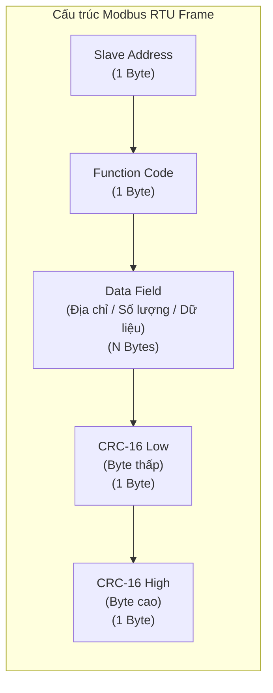
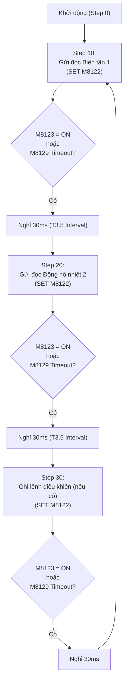

Trong các dự án tự động hóa công nghiệp sử dụng PLC Mitsubishi dòng FX (đặc biệt là FX3U/FX3G), nhu cầu giao tiếp mạng truyền thông **RS-485 Modbus RTU** với biến tần, đồng hồ nhiệt độ, cảm biến công nghiệp hay đồng hồ đa năng là vô cùng phổ biến.

Nếu sử dụng module mở rộng chuyên dụng **`FX3U-485ADP-MB`**, PLC sẽ hỗ trợ sẵn tập lệnh Modbus chuyên dụng như `ADPRW` (tự động tính CRC và quản lý luồng gửi nhận). Tuy nhiên, trên thực tế rất nhiều nhà xưởng và tủ điện sử dụng bo mạch mở rộng giá rẻ **`FX3U-485-BD`** (hoặc các dòng PLC FX3U clone phổ biến). Board này chỉ hỗ trợ chuẩn **Non-Protocol (Giao thức tự do)**.

Để PLC FX3U đóng vai trò làm **Modbus RTU Master** với board 485-BD, kỹ sư cần phải tự tay đóng gói từng byte của khung truyền Modbus (Frame), sử dụng lệnh tính mã kiểm tra **`CRC` (FNC 188)**, gửi/nhận dữ liệu bằng lệnh **`RS` (FNC 80)** và giải mã (parse) dữ liệu phản hồi từ Slave. Bài viết này sẽ hướng dẫn chi tiết từ bản chất khung truyền, cấu hình thanh ghi đặc biệt đến các ví dụ thực chiến điều khiển biến tần và đọc đồng hồ nhiệt.

{/* truncate */}

---

## 1. Cấu trúc khung truyền Modbus RTU (Modbus RTU Frame Structure)

Giao thức Modbus RTU truyền dữ liệu theo định dạng nhị phân 8-bit (Binary). Mỗi gói tin (Frame) truyền trên đường cáp xoắn đôi RS-485 bắt buộc phải tuân theo cấu trúc chuẩn:



### a) Chi tiết các thành phần trong Frame

1. **Slave Address (1 byte):** Địa chỉ của thiết bị tớ trên mạng (từ `01H` đến `F7H`, tương đương 1 đến 247). Địa chỉ `00H` dùng cho chế độ Broadcast (gửi đồng loạt cho tất cả slave, không có phản hồi).
2. **Function Code (1 byte):** Mã chức năng yêu cầu thực thi:
   * **`03H` (Read Holding Registers):** Đọc dữ liệu từ một hoặc nhiều thanh ghi 16-bit (đọc tần số, dòng điện, nhiệt độ, áp suất).
   * **`06H` (Write Single Register):** Ghi giá trị vào một thanh ghi 16-bit duy nhất (lệnh Run/Stop, cài đặt tần số, cài đặt Setpoint nhiệt độ).
   * **`10H` (0x10 - Write Multiple Registers):** Ghi đồng thời dữ liệu vào nhiều thanh ghi liên tiếp.
3. **Data Field (N bytes):** Chứa địa chỉ thanh ghi bắt đầu, số lượng thanh ghi cần đọc/ghi, hoặc dữ liệu cần ghi xuống.
4. **CRC-16 (2 bytes):** Mã kiểm tra lỗi vòng (Cyclic Redundancy Check) 16-bit tính toán trên toàn bộ các byte phía trước (từ Slave Address đến hết Data Field).
   * **Quy tắc Modbus RTU:** **Byte thấp (CRC Low) truyền trước, Byte cao (CRC High) truyền sau**.

---

## 2. Cấu hình tham số truyền thông FX3U (D8120, M8161, D8129)

Khi lập trình Non-Protocol trên kênh truyền thông 1 (Channel 1 - cổng BD của FX3U), PLC Mitsubishi sử dụng các thanh ghi và rơ-le phụ đặc biệt sau:

### a) Thanh ghi định dạng truyền thông `D8120`

Thanh ghi `D8120` quy định tốc độ truyền (Baudrate), số bit dữ liệu, Parity, Stop bit và giao thức hoạt động:

```text
D8120 (16-bit):
b15 b14 b13 b12 | b11 b10 b9  b8  | b7  b6  b5  b4  | b3  b2  b1  b0
 0   0   0   0  |  0   0   0   0  | 0   1   1   0   | 0   0   0   1   --> H0081 (9600-8-N-1)
```

| Nhóm Bit | Chức năng | Ý nghĩa giá trị |
|---|---|---|
| **b0** | Data Length | `0`: 7-bit, `1`: 8-bit (Modbus RTU bắt buộc chọn **`1`**) |
| **b2, b1** | Parity Bit | `00`: None (Không parity), `01`: Odd (Lẻ), `11`: Even (Chẵn) |
| **b3** | Stop Bit | `0`: 1 Stop bit, `1`: 2 Stop bits |
| **b7 ~ b4** | Baud Rate | `0100`: 2400 bps<br/>`0101`: 4800 bps<br/>`0110`: 9600 bps<br/>`0111`: 19200 bps<br/>`1000`: 38400 bps |
| **b8** | Header | `0`: Không dùng Header (D8124) |
| **b9** | Terminator | `0`: Không dùng Terminator (D8125) |
| **b11, b10**| Interface | `00`: Chuẩn RS-485 / RS-232 thông thường |
| **b15 ~ b12**| Protocol | `0000`: Chế độ Non-protocol (Sử dụng lệnh `RS`) |

**Bảng tra cứu giá trị Hex nạp vào `D8120` thông dụng:**
* **`H0081`**: 9600 bps, 8-N-1 (8 data bits, No parity, 1 stop bit) - Phổ biến nhất.
* **`H0099`**: 9600 bps, 8-E-1 (8 data bits, Even parity, 1 stop bit).
* **`H0087`**: 19200 bps, 8-N-1.
* **`H009F`**: 19200 bps, 8-E-1.

> **Lưu ý quan trọng:** Giá trị nạp vào `D8120` chỉ có hiệu lực sau khi nạp bằng xung quét đầu tiên `M8002` và phải **tắt/bật lại nguồn PLC (Power Cycle)** nếu có sự thay đổi cấu hình cổng phần cứng.

---

### b) Cờ chuyển đổi chế độ 8-bit `M8161` (BẮT BUỘC BẬT ON)

Trong PLC FX3U, thanh ghi `D` có độ dài 16-bit (2 byte).
* **Khi `M8161 = OFF` (Chế độ 16-bit):** Mỗi thanh ghi `D` chứa 2 byte (Byte cao và Byte thấp). Việc xử lý từng byte của Modbus rất phức tạp vì phải dịch bit liên tục.
* **Khi `M8161 = ON` (Chế độ 8-bit):** Các lệnh truyền thông (`RS`, `CRC`, `ASCI`, `HEX`) sẽ hoạt động ở chế độ 8-bit: **Mỗi thanh ghi `D` chỉ chứa đúng 1 byte dữ liệu ở 8-bit thấp (b0~b7), 8-bit cao (b8~b15) luôn bằng 0**.

> **Bắt buộc:** Luôn luôn dùng lệnh `SET M8161` hoặc nối tiếp điểm `M8000` vào cuộn hút `M8161` ở đầu chương trình.

---

### c) Thanh ghi cài đặt thời gian chờ phản hồi `D8129` & Cờ Timeout `M8129`

Khi Master phát một frame yêu cầu đi, nếu Slave bị tắt nguồn, đứt dây hoặc sai địa chỉ thì sẽ không có dữ liệu trả về. Nếu không có bộ định thời timeout, PLC sẽ bị treo ở trạng thái chờ nhận vĩnh viễn.

* `MOV K200 D8129`: Cài đặt thời gian timeout là **200ms** (hoặc $100\text{ms} \sim 500\text{ms}$ tùy khoảng cách đường truyền và tốc độ baud).
* `M8129`: Cờ báo lỗi Timeout. Khi hết thời gian $200\text{ms}$ mà không nhận được dữ liệu, `M8129` sẽ tự động bật `ON` để báo cho chương trình biết và chuyển sang chu kỳ kế tiếp.

---

## 3. Các lệnh Ladder cốt lõi trong FX3U

### a) Lệnh `RS` (Serial Send/Receive - FNC 80)

Lệnh `RS` đảm nhận việc phát và nhận luồng byte qua cổng nối tiếp:

```text
[ RS    S    m    D    n ]
```

* `S`: Vùng nhớ bắt đầu chứa mảng dữ liệu cần **gửi đi** (Send Buffer, ví dụ `D100`).
* `m`: Số lượng byte cần gửi đi (ví dụ `K8` cho frame gửi 8 byte).
* `D`: Vùng nhớ bắt đầu lưu mảng dữ liệu **nhận về** (Receive Buffer, ví dụ `D200`).
* `n`: Số lượng byte dự kiến nhận về (ví dụ `K7` khi đọc 1 thanh ghi, hoặc `K8` khi ghi thanh ghi).

**Các cờ đi kèm lệnh `RS`:**
* **`M8122` (Send Request Flag):** Khi ta kích `SET M8122`, PLC sẽ tự động lấy $m$ byte từ vùng `S` đẩy ra đường truyền RS-485. Khi truyền xong byte cuối cùng, PLC **tự động reset `M8122 = OFF`** và lập tức mở cổng chuyển sang chế độ lắng nghe (Listening mode).
* **`M8123` (Receive Complete Flag):** Khi nhận đủ $n$ byte chỉ định trong lệnh `RS`, cờ `M8123` sẽ tự động bật `ON`.
  * **Cực kỳ quan trọng:** Sau khi đọc và xử lý xong dữ liệu trong mảng nhận `D`, lập trình viên **BẮT BUỘC phải thực thi lệnh `RST M8123`** trong chương trình. Nếu quên reset `M8123`, cổng truyền thông sẽ bị khóa cứng và không thể nhận thêm bất kỳ gói tin nào nữa!

---

### b) Lệnh `CRC` (Cyclic Redundancy Check - FNC 188)

PLC FX3U tích hợp sẵn lệnh tính mã kiểm tra lỗi CRC-16 chuẩn Modbus RTU:

```text
[ CRC    S    D    n ]
```

* `S`: Địa chỉ bắt đầu của mảng dữ liệu cần tính CRC (ví dụ `D100`).
* `D`: Địa chỉ lưu kết quả mã CRC tính toán được.
* `n`: Số lượng byte dữ liệu cần tính (ví dụ `K6` cho 6 byte đầu của frame Modbus).

**Cơ chế lưu kết quả CRC tuyệt vời của FX3U:**
Khi `M8161 = ON` (chế độ 8-bit), khi thực thi lệnh:

```text
[ CRC   D100   D106   K6 ]
```

Lệnh `CRC` sẽ tự động:
1. Tính toán giá trị CRC-16 trên 6 byte từ `D100` đến `D105`.
2. Ghi **Byte thấp (CRC Low)** vào thanh ghi `D106`.
3. Ghi **Byte cao (CRC High)** vào thanh ghi `D107`.

Như vậy, toàn bộ 8 byte của khung truyền Modbus hoàn chỉnh sẽ nằm liên tục từ `D100` đến `D107`:
* `D100`: Slave ID
* `D101`: Function Code
* `D102`: Register Address High
* `D103`: Register Address Low
* `D104`: Data/Count High
* `D105`: Data/Count Low
* `D106`: **CRC Low**
* `D107`: **CRC High**

Ta không cần phải viết bất kỳ thuật toán tách bit hay đảo byte nào, chỉ cần đưa trực tiếp mảng `D100` với chiều dài `K8` vào lệnh `RS` để phát đi!

---

## 4. Các ví dụ thực chiến lập trình Modbus Master

### Ví dụ 1: Ghi lệnh Chạy/Dừng và Đặt tần số Biến tần (Function 06)

Giả sử ta cần điều khiển biến tần (như Mitsubishi D700/E700, INVT GD20, Schneider ATV310 hoặc Delta VFD) có **Slave Address = `01H`**.

#### 1. Lệnh điều khiển Chạy Thuận (Run FWD)
Theo bảng thanh ghi của biến tần INVT GD20, thanh ghi điều khiển là `2000H`:
* Giá trị `0001H`: Chạy thuận (FWD)
* Giá trị `0005H`: Dừng (STOP)

**Khung truyền gửi đi (8 bytes):**
* Byte 1 (Slave Address): `01H`
* Byte 2 (Function Code): `06H`
* Byte 3 (Address High): `20H`
* Byte 4 (Address Low): `00H`
* Byte 5 (Data High): `00H`
* Byte 6 (Data Low): `01H`
* Byte 7 & 8 (CRC-16): Tính bằng lệnh `CRC` $\implies$ Ra kết quả `43CAH` (`D106 = 43H` (Low), `D107 = CAH` (High)).

**Đoạn lệnh Ladder thực hiện:**

```text
// Nạp dữ liệu vào Buffer phát
|--[ M8000 ]-----------------[ MOV H01 D100 ]--|  // Slave ID = 1
|                            [ MOV H06 D101 ]--|  // Function = 06 (Write Single)
|                            [ MOV H20 D102 ]--|  // Địa chỉ thanh ghi High (20H)
|                            [ MOV H00 D103 ]--|  // Địa chỉ thanh ghi Low (00H)
|                            [ MOV H00 D104 ]--|  // Giá trị High (00H)
|                            [ MOV H01 D105 ]--|  // Giá trị Low: 01H = Chạy thuận
|
// Tính toán CRC-16 tự động
|--[ M8000 ]-----------------[ CRC D100 D106 K6 ]--|
|
// Khai báo lệnh RS: Phát 8 byte từ D100, dự kiến nhận 8 byte về D200
|--[ M8000 ]-----------------[ RS D100 K8 D200 K8 ]--|
|
// Kích phát truyền thông khi có lệnh Run
|--[ M10 ]---[ PLS M100 ]--|
|--[ M100 ]-----------------[ SET M8122 ]--|
```

*Frame hoàn chỉnh gửi trên dây RS-485:* `01 06 20 00 00 01 43 CA`

---

#### 2. Lệnh Cài đặt Tần số 50.00 Hz
Thanh ghi cài đặt tần số của biến tần là `2001H`. Tần số $50.00\text{ Hz} \times 100 = 5000\text{ (Dec)} = 1388\text{ (Hex)}$.

* `D100 = H01` (Slave ID)
* `D101 = H06` (Function Code)
* `D102 = H20` (Address High)
* `D103 = H01` (Address Low)
* `D104 = H13` (Data High: `13H`)
* `D105 = H88` (Data Low: `88H`)
* Thực thi `CRC D100 D106 K6` $\implies$ Tự động sinh `D106 = DAH` (CRC Low) và `D107 = 5EH` (CRC High).

*Frame hoàn chỉnh gửi trên dây RS-485:* `01 06 20 01 13 88 DA 5E`

---

### Ví dụ 2: Đọc Giá trị Nhiệt độ từ Đồng hồ Nhiệt độ (Function 03)

Giả sử kết nối với Đồng hồ nhiệt Autonics TK4S / Omron E5CC / RKC REX-C100 có **Slave Address = `02H`**. Ta muốn đọc giá trị nhiệt độ hiện tại (PV) tại thanh ghi `0000H` (1 thanh ghi = 2 byte).

#### 1. Khung truyền yêu cầu (Master Request - 8 bytes):
* Byte 1: `02H` (Slave Address)
* Byte 2: `03H` (Function Code: Read Holding Registers)
* Byte 3: `00H` (Start Address High)
* Byte 4: `00H` (Start Address Low)
* Byte 5: `00H` (Number of Points High)
* Byte 6: `01H` (Number of Points Low: Đọc 1 thanh ghi)
* Thực thi `CRC` $\implies$ Sinh `D106 = 84H`, `D107 = 39H`.

*Frame Request:* `02 03 00 00 00 01 84 39`

#### 2. Khung truyền phản hồi từ Slave (Slave Response - 7 bytes):
Khi nhận được lệnh đọc hợp lệ, đồng hồ nhiệt sẽ trả về 7 byte vào vùng nhớ nhận `D200..D206`:

| Byte nhận | Thanh ghi lưu | Ý nghĩa | Ví dụ giá trị nhận được |
|---|---|---|---|
| Byte 1 | `D200` | Slave Address | `02H` |
| Byte 2 | `D201` | Function Code | `03H` |
| Byte 3 | `D202` | Byte Count (Số byte dữ liệu) | `02H` (2 byte dữ liệu cho 1 thanh ghi) |
| Byte 4 | `D203` | Data High Byte (Giá trị nhiệt độ cao) | `01H` |
| Byte 5 | `D204` | Data Low Byte (Giá trị nhiệt độ thấp) | `04H` |
| Byte 6 | `D205` | CRC Low | `B9H` |
| Byte 7 | `D206` | CRC High | `9BH` |

#### 3. Xử lý ghép dữ liệu nhận được trong PLC:
Giá trị nhiệt độ nằm ở 2 thanh ghi 8-bit riêng biệt: `D203` (chứa `01H`) và `D204` (chứa `04H`).
Để ghép lại thành số 16-bit nguyên vẹn trong thanh ghi `D300`:

```text
// Dịch byte cao sang trái 8 bit: D203 (0001H) -> D210 (0100H)
|--[ M8123 ]-----------------[ MOV D203 D210 ]--|
|                            [ SHL D210 K8 ]----|
|
// Cộng gộp với byte thấp: D210 (0100H) + D204 (0004H) = D300 (0104H = 260 Dec = 26.0 °C)
|--[ M8123 ]-----------------[ ADD D210 D204 D300 ]--|
|
// Reset cờ nhận M8123 để sẵn sàng cho chu kỳ kế tiếp
|--[ M8123 ]-----------------[ RST M8123 ]--|
```

---

## 5. Kỹ thuật lập trình Polling tuần tự nhiều Slave (State Machine)

Trên một mạng RS-485 (Half-Duplex), tại một thời điểm **chỉ có duy nhất 1 gói tin được phép truyền**. Nếu Master gửi liên tiếp nhiều lệnh cùng một lúc, tín hiệu sẽ bị đụng độ (Collision) và hỏng toàn bộ dữ liệu.

Do đó, kỹ sư phải thiết kế một **Bộ tuần tự Polling (State Machine)** bằng một thanh ghi bước (ví dụ `D500`):



### Nguyên lý thiết kế vòng quét tuần tự:
1. **Bước 10:** Nạp mảng phát cho Biến tần 1 $\to$ Tính `CRC` $\to$ Cấu hình `RS` $\to$ `SET M8122`.
2. Khi `M8123` bật (nhận thành công) hoặc `M8129` bật (timeout do lỗi thiết bị):
   * Lưu dữ liệu đọc được (nếu nhận thành công).
   * `RST M8123` và `RST M8129`.
   * Kích hoạt Timer tạo khoảng nghỉ **Silent Interval ($30\text{ms} \sim 50\text{ms}$)**.
3. Khi Timer đếm xong: Chuyển bước sang `D500 = 20` (Đọc Đồng hồ nhiệt 2).
4. Lặp lại chu trình để quét liên tục toàn bộ thiết bị trên mạng mà không bao giờ bị nghẽn mạng.

---

## 6. Checklist & Các lỗi kinh điển khi truyền thông Modbus trên FX3U

Nếu hệ thống không phản hồi hoặc báo lỗi không nhận được dữ liệu, hãy kiểm tra lần lượt các điểm sau:

1. **Đảo chéo dây tín hiệu A và B:**
   * Cực $A$ (thường là $D+$ hoặc $RS485+$) trên PLC phải nối vào $A$ của tất cả các Slave.
   * Cực $B$ (thường là $D-$ hoặc $RS485-$) phải nối vào $B$.
   * *Mẹo:* Nếu đèn `SD` (Send Data) nháy mà đèn `RD` (Receive Data) không bao giờ nháy, hãy thử đảo chéo 2 đầu dây $A$ và $B$.
2. **Quên điện trở đầu cuối $120\ \Omega$:** Khi khoảng cách truyền thông dài ($> 50\text{m}$) hoặc có từ 3 thiết bị trở lên, bắt buộc phải bật switch gạt điện trở đầu cuối $120\ \Omega$ ở 2 thiết bị nằm ở 2 đầu mút xa nhất của đường dây để triệt tiêu sóng phản xạ.
3. **Quên bật cờ `M8161`:** Nếu `M8161` ở trạng thái `OFF`, lệnh `RS` và `CRC` sẽ xử lý ở chế độ 16-bit, làm toàn bộ khung truyền bị sai lệch vị trí byte.
4. **Quên lệnh `RST M8123`:** Đây là lỗi phổ biến nhất của người mới lập trình. Sau khi nhận được frame đầu tiên, nếu không reset `M8123`, cờ này sẽ giữ nguyên mức `1` và PLC từ chối nhận các gói tin tiếp theo.
5. **Trùng địa chỉ Slave ID:** Mỗi thiết bị trên mạng RS-485 phải có một Slave Address duy nhất ($1, 2, 3...$).
6. **Lệch cấu hình Baudrate / Parity:** Kiểm tra xem biến tần hoặc đồng hồ nhiệt có đang cài đúng $9600\text{ bps}$, Data $8$, Parity `None`, Stop bit $1$ khớp với giá trị `H0081` trong `D8120` hay không.
7. **Công cụ tra cứu:** Bạn có thể sử dụng [Công cụ Phân tích RS485 HEX & Tính CRC16](pathname:///shareme/tools/#/tools/rs485-hex) trên ShareMe để kiểm tra tính chính xác của chuỗi byte và mã CRC trước khi nạp vào PLC.

---

## 7. Tài liệu kỹ thuật tham khảo chính thức

* **[Mitsubishi Electric - FX Series User's Manual (Data Communication Edition - JY997D16901)](https://www.mitsubishielectric.com/fa/)**: Hướng dẫn chi tiết về cấu hình thanh ghi `D8120`, các cờ `M8120 ~ M8129`, tập lệnh `RS` (FNC 80) và sơ đồ đấu nối board `FX3U-485-BD`.
* **[Mitsubishi Electric - FX3S/FX3G/FX3GC/FX3U/FX3UC Series Programming Manual (Basic & Applied Instruction Edition - JY997D16601)](https://www.mitsubishielectric.com/fa/)**: Hướng dẫn chi tiết tập lệnh tính mã kiểm tra lỗi `CRC` (FNC 188) và nguyên lý hoạt động của cờ chế độ 8-bit `M8161`.
* **[Modbus Organization - Modbus Application Protocol Specification V1.1b3](https://www.modbus.org/docs/Modbus_Application_Protocol_V1_1b3.pdf)**: Đặc tả tiêu chuẩn quốc tế về cấu trúc khung truyền Modbus RTU, mã chức năng và thuật toán kiểm tra lỗi CRC-16.
* **[INVT Electric - Goodrive20 Series VFD User Manual](https://www.invt.com/)**: Bảng địa chỉ thanh ghi Modbus điều khiển biến tần qua truyền thông RS-485.
* **[Autonics TK Series High Performance Temperature Controller Manual](https://www.autonics.com/)**: Bảng địa chỉ thanh ghi Modbus RTU của đồng hồ đo và điều khiển nhiệt độ.
