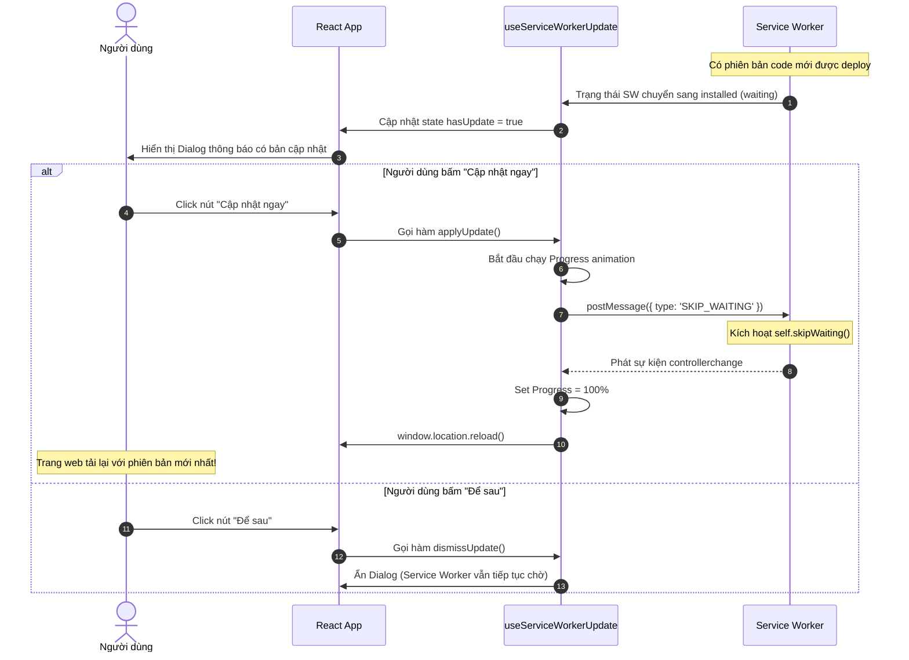

Bài viết giải thích chi tiết kiến trúc, vòng đời Service Worker và cách triển khai tính năng **Cập nhật PWA chủ động theo thao tác người dùng (User-driven PWA Update)** trong ứng dụng **ShareMe Tools**, giúp tránh hiện tượng reload trang đột ngột làm gián đoạn trải nghiệm của người dùng.

{/* truncate */}

## 1. Tổng Quan Kiến Trúc

Thông thường, khi một Progressive Web App (PWA) có phiên bản mới, Service Worker mới sẽ được tải về ở background. Nếu cấu hình tự động `self.skipWaiting()`, Service Worker mới sẽ chiếm quyền kiểm soát ngay lập tức, làm ngắt kết nối hoặc reload trang đột ngột gây ảnh hưởng đến trải nghiệm của người dùng.

Để giải quyết vấn đề trên, ứng dụng **ShareMe Tools** áp dụng mô hình **Cập nhật có xác nhận (User-driven update)** với các tiêu chí:
1. **Không tự động kích hoạt**: Bản cập nhật mới tải về sẽ ở trạng thái chờ (`waiting`).
2. **Hiển thị thông báo trực quan**: Sử dụng UI Dialog (shadcn/ui) kết hợp với hình ảnh/icon minh họa.
3. **Chỉ cập nhật khi người dùng xác nhận**: Người dùng bấm nút **"Cập nhật ngay"** thì mới gửi lệnh kích hoạt Service Worker mới và reload lại trang.
4. **Thanh tiến trình (Progress Bar)**: Hiển thị phần trăm tiến trình mượt mượt giúp người dùng biết ứng dụng đang xử lý.

---

## 2. Các Thành Phần Chính Trong Hệ Thống

Kiến trúc cập nhật PWA gồm 4 thành phần kết nối với nhau:

```text
┌─────────────────┐       ┌──────────────────────┐
│  index.html     │ ────> │ window.__swRegister  │
└─────────────────┘       └──────────┬───────────┘
                                     │
                                     ▼
┌─────────────────┐       ┌──────────────────────┐
│  public/sw.js   │ <──── │ use-sw-update.js     │
└─────────────────┘       └──────────┬───────────┘
                                     │
                                     ▼
                          ┌──────────────────────┐
                          │ PwaUpdateNotification│
                          └──────────────────────┘
```

### 2.1. Service Worker (`apps/tools/public/sw.js`)
- Trong sự kiện `install`, **không gọi** `self.skipWaiting()`. Bản SW mới sẽ dừng ở trạng thái `waiting`.
- Thêm sự kiện lắng nghe `message`:
  ```javascript
  self.addEventListener("message", (event) => {
    if (event.data && event.data.type === "SKIP_WAITING") {
      self.skipWaiting();
    }
  });
  ```

### 2.2. Đăng ký Service Worker (`apps/tools/index.html`)
- Đoạn mã inline script thực hiện đăng ký Service Worker và lưu đối tượng registration vào biến toàn cục `window.__swRegistration`.
- Đồng thời phát một custom event `sw-registered` để các React component/hook có thể đăng ký lắng nghe kịp thời.

### 2.3. Custom Hook (`apps/tools/src/hooks/use-sw-update.js`)
Hook quản lý toàn bộ logic kiểm tra và cập nhật SW với các giá trị trả về:
- `hasUpdate` *(boolean)*: Bằng `true` khi phát hiện có Service Worker mới đang chờ kích hoạt.
- `isUpdating` *(boolean)*: Bằng `true` khi người dùng bấm nút cập nhật và tiến trình đang chạy.
- `updateProgress` *(number)*: Phần trăm tiến trình (0% - 100%).
- `applyUpdate()` *(function)*: Gửi tin nhắn `{ type: "SKIP_WAITING" }` tới SW đang chờ và tự động reload trang khi `controllerchange` kích hoạt.
- `dismissUpdate()` *(function)*: Tạm ẩn thông báo cập nhật (người dùng chọn "Để sau").

### 2.4. UI Component (`apps/tools/src/components/PwaUpdateNotification.jsx`)
- Được xây dựng dựa trên bộ thư viện **shadcn/ui** (`Dialog`, `Button`, `Progress`).
- Đặt tại cấp cao nhất trong `main.jsx` (bên trong `ThemeProvider`) để có thể hiển thị ở bất kỳ trang nào.
- Hỗ trợ prop `forceShow={true}` phục vụ việc kiểm thử giao diện (Test Mode UI) mà không cần tạo bản build SW thật.

---

## 3. Luồng Hoạt Động (Sequence Diagram)



---

## 4. Hướng Dẫn Kiểm Thử (Testing)

### 4.1. Kiểm Thử Giao Diện (UI Test Mode)
Để xem trước giao diện Modal mà không cần trigger Service Worker thật, bạn chỉ cần truyền prop `forceShow={true}` vào component:

```jsx
// Ví dụ tại một trang bất kỳ:
<PwaUpdateNotification forceShow={true} />
```

Khi ở chế độ `forceShow`:
- Dialog thông báo sẽ luôn hiển thị.
- Khi bấm **"Cập nhật ngay"**, thanh Progress bar sẽ chạy giả lập từ 0% đến 100% trong vòng 3 giây để kiểm tra animation.

### 4.2. Kiểm Thử Service Worker Thực Tế (DevTools)
1. Chạy dự án ở môi trường dev hoặc preview (`npm run build && npm run preview`).
2. Mở trình duyệt Chrome/Edge, nhấn **F12** mở **DevTools**.
3. Chuyển sang tab **Application** > **Service Workers**.
4. Chỉnh sửa một nội dung nhỏ trong `apps/tools/public/sw.js` (ví dụ đổi `CACHE_NAME = "shareme-tools-cache-v2"`).
5. Lưu file, trình duyệt sẽ tải bản SW mới về và hiển thị dòng trạng thái **waiting to activate**.
6. Lúc này `PwaUpdateNotification` trên giao diện sẽ tự động xuất hiện.

---

## 5. Quy Trình Phát Hành Bản Cập Nhật (Release Workflow trên GitHub Pages)

Khi muốn phát hành một phiên bản cập nhật PWA mới cho người dùng cuối trên **GitHub Pages**, bạn thực hiện quy trình chuẩn hóa theo các bước sau:

### 5.1. Bước 1: Tăng Phiên Bản Cache Service Worker (`sw.js`)
Trình duyệt chỉ nhận biết có bản Service Worker mới khi tệp `sw.js` có sự thay đổi nội dung trên server.
- Mở tệp `apps/tools/public/sw.js` (và `apps/docs/static/sw.js` nếu có).
- Cập nhật hằng số `CACHE_NAME` sang phiên bản mới:
  ```javascript
  // Đổi tên cache để trigger trình duyệt nhận diện SW mới:
  const CACHE_NAME = "shareme-tools-cache-v1.1.0";
  ```

### 5.2. Bước 2: Commit & Push Code Lên Nhánh `main`
Đưa toàn bộ các thay đổi ứng dụng và tệp `sw.js` đã tăng version lên repository GitHub:
```bash
git add .
git commit -m "feat: release update v1.1.0 and bump SW cache version"
git push origin main
```

### 5.3. Bước 3: Tiến Trình Tự Động Build & Deploy (GitHub Actions)
- GitHub Workflow (`.github/workflows/deploy.yml`) sẽ tự động được kích hoạt khi phát hiện commit mới trên nhánh `main`.
- Tiến trình tự động chạy `npm run build` -> Đưa mã nguồn đã đóng gói vào `./apps/docs/build` -> Xuất bản lên **GitHub Pages**.

### 5.4. Trải Nghiệm Tự Động Của Người Dùng
1. Khi người dùng mở lại PWA ShareMe, trình duyệt tự động kiểm tra `sw.js` trên server và tải bản Service Worker mới ở chế độ chạy ngầm (`waiting to activate`).
2. Hộp thoại **PwaUpdateNotification** tự động xuất hiện trên màn hình thông báo: *"Đã có bản cập nhật mới!"*.
3. Người dùng bấm **"Cập nhật ngay"**, thanh tiến trình chạy từ **0% -> 100%**, kích hoạt Service Worker mới và tự động reload trang với đầy đủ tính năng mới nhất.
