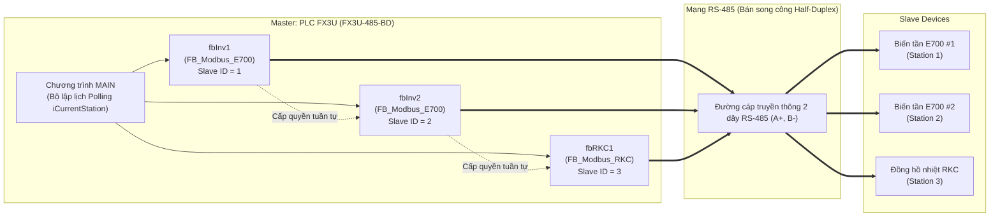

1. **Mô hình Structured Project**: Đóng gói toàn bộ thuật toán Modbus RTU thành các **Function Block (FB)** tái sử dụng nhiều lần (kéo thả Instance cho từng biến tần, đồng hồ nhiệt).
2. **Mô hình Simple Project + Label**: Viết bằng **Ladder thuần kết hợp nhãn biến (Global Labels)** và cơ chế phân bước (State Machine) dành cho các dự án đơn giản hoặc thói quen lập trình truyền thống.

{/* truncate */}

---

## 1. Bản chất truyền thông Modbus RTU trên PLC FX3U (Non-Protocol)

Khác với các dòng PLC đời mới có sẵn khối hàm truyền thông độc lập, bo mạch **FX3U-485-BD** sử dụng cơ chế truyền thông tự do (**Non-Protocol**). Toàn bộ PLC chia sẻ chung các tài nguyên phần cứng sau:

* **`D8120`**: Thanh ghi cài đặt thông số giao thức cổng truyền thông (Baud rate, Data bit, Parity, Stop bit).
* **`M8161`**: Cờ chọn chế độ dữ liệu 8-bit (Byte Mode) cho lệnh `RS` và `CRC`.
* **`M8122`**: Cờ yêu cầu phát dữ liệu (Send Request Flag). Khi bật lên, PLC sẽ phát đi $N$ byte từ mảng gửi.
* **`M8123`**: Cờ báo nhận hoàn tất (Receive Complete Flag). Phải được xóa bằng lệnh `RST M8123` sau khi đọc xong.
* **`M8129` / `D8129`**: Cờ và giá trị thời gian giám sát Timeout truyền thông.



> **Nguyên tắc cốt lõi:** Vì đường truyền RS-485 là **Bán song công (Half-Duplex)**, tại một thời điểm **chỉ duy nhất một thiết bị được phép chiếm dụng kênh phát `M8122`**. Do đó, việc giao tiếp phải được kích hoạt xoay tua theo cơ chế **Token-Passing Polling**.

---

## 2. Tiêu chuẩn đặt tên biến (Hungarian Notation & IEC 61131-3)

Để chương trình và các chân I/O của Function Block dễ đọc, chuẩn hóa và tránh ép sai kiểu dữ liệu, chúng ta tuân thủ quy ước đặt tên tiền tố:

| Tiền tố | Kiểu dữ liệu | Số Bit | Dải giá trị | Mục đích sử dụng |
| :--- | :--- | :---: | :--- | :--- |
| **`b...`** | `BOOL (Bit)` | 1 bit | `0` hoặc `1` (`TRUE`/`FALSE`) | Tín hiệu logic: `bEnable`, `bRunFwd`, `bDone`, `bCommError` |
| **`u8...`** | `USINT / BYTE` | 8 bit | $0 \dots 255$ | Giá trị 1 Byte: `u8SlaveID`, địa chỉ trạm |
| **`u16...`**| `UINT / WORD` | 16 bit | $0 \dots 65{,}535$ | Số nguyên không dấu 16-bit: `u16FreqSet`, `u16ActVolt` |
| **`i16...`**| `INT` | 16 bit | $-32{,}768 \dots +32{,}767$ | Số nguyên có dấu: `iStep`, `i16ActTemp` (nhiệt độ âm/dương) |
| **`w...`** | `WORD` | 16 bit | `16#0000` $\dots$ `16#FFFF` | Dữ liệu dạng mã Hex, Bitmask |
| **`t...`** | `TIMER` | - | Thời gian | Biến timer đếm trễ, timer timeout: `tTimeout` |
| **`fb...`**| `Instance` | - | Khối đối tượng | Tên gọi instance của FB: `fbInv1`, `fbRKC1` |

---

## 3. Cấu hình thông số phần cứng thiết bị

### A. Cấu hình PLC FX3U
Trong chương trình chính khi khởi động (`M8002`):
* Nạp giá trị `MOV H0C97 D8120`: Cấu hình truyền thông **19200 bps, 8 Data bits, Parity Even (chẵn), 1 Stop bit**.
* Bật `SET M8161`: Bắt buộc kích hoạt chế độ **8-bit Mode**. Khi cờ này bật:
  * Mỗi thanh ghi dữ liệu chỉ chứa 1 byte ở 8-bit thấp.
  * Lệnh `[CRC D100 D106 K6]` sẽ tính toán 6 byte từ `D100..D105`, tự động lưu **CRC Low vào `D106`** và **CRC High vào `D107`**.

### B. Cấu hình Biến tần Mitsubishi FR-E700
* **`Pr. 549 = 1`** (*Bắt buộc*): Chuyển giao thức sang **Modbus RTU** (Mặc định là 0: giao thức Mitsu). Sau khi đổi phải tắt/bật lại nguồn biến tần.
* **`Pr. 117 = 1`**: Địa chỉ trạm (Station Number).
* **`Pr. 118 = 192`**: Tốc độ Baud 19200 bps.
* **`Pr. 119 = 1`**: 8 data bits, 1 stop bit.
* **`Pr. 120 = 2`**: Parity Chẵn (Even).
* **`Pr. 340 = 1`**: Khởi động ở chế độ mạng truyền thông (Net Mode).
* **`Pr. 79 = 0` hoặc `2`**: Cho phép điều khiển qua mạng RS-485.

### C. Cấu hình Đồng hồ nhiệt độ RKC REX-C100 / CH402
* **`Add (Address)` = 3**: Địa chỉ trạm (Slave ID = 3).
* **`bPS (Baud rate)` = 19.2**: Tốc độ 19200 bps.
* **`PrTY (Parity)` = E**: Parity Chẵn (Even).
* **`Stop (Stop bit)` = 1**: 1 Stop bit.

---

## 4. Bảng địa chỉ Modbus của thiết bị

### 1. Biến tần Mitsubishi FR-E700
| Mục tiêu | Địa chỉ Hex | Mã hàm | Ghi chú dữ liệu |
| :--- | :---: | :---: | :--- |
| **Lệnh Chạy / Dừng** | `0008H` (40009) | `06H` (Write) | `H0002`: Chạy thuận (STF)<br/>`H0004`: Chạy nghịch (STR)<br/>`H0000`: Dừng (STOP) |
| **Cài đặt Tần số** | `000DH` (40014) | `06H` (Write) | Đơn vị $0.01\text{ Hz}$ (VD: $50.00\text{ Hz} \rightarrow 5000$) |
| **Đọc Giám sát 3 thông số** | `00C8H` (40201) | `03H` (Read) | Đọc liên tiếp **3 thanh ghi**:<br/>• `00C8H`: Tần số thực ($0.01\text{ Hz}$)<br/>• `00C9H`: Dòng điện thực ($0.01\text{ A}$)<br/>• `00CAH`: Điện áp thực ($0.1\text{ V}$) |

### 2. Đồng hồ nhiệt độ RKC REX-C100
| Mục tiêu | Địa chỉ Hex | Mã hàm | Ghi chú dữ liệu |
| :--- | :---: | :---: | :--- |
| **Nhiệt độ hiện tại (PV)** | `0000H` (40001) | `03H` (Read) | Giá trị nhiệt độ đo thực tế ($\times 1$ hoặc $\times 10$ tuỳ can nhiệt) |
| **Nhiệt độ cài đặt (SV)** | `0001H` (40002) | `03H` / `06H` | Đọc / Ghi nhiệt độ mục tiêu cần khống chế |

---

## 5. Xây dựng Function Block 1: `FB_Modbus_E700` (Structured Project)

### Bảng Local Label của `FB_Modbus_E700`
| Class | Label Name | Data Type | Ý nghĩa |
| :--- | :--- | :--- | :--- |
| **`VAR_INPUT`** | `bEnable` | `Bit (BOOL)` | Tín hiệu kích hoạt truyền khi đến lượt |
| **`VAR_INPUT`** | `u8SlaveID` | `Word[Signed] (INT)` | Địa chỉ trạm biến tần (1, 2...) |
| **`VAR_INPUT`** | `bRunFwd` | `Bit (BOOL)` | Lệnh Chạy thuận |
| **`VAR_INPUT`** | `bRunRev` | `Bit (BOOL)` | Lệnh Chạy nghịch |
| **`VAR_INPUT`** | `u16FreqSet` | `Word[Signed] (INT)` | Tần số cài đặt ($5000 = 50.00\text{ Hz}$) |
| **`VAR_OUTPUT`** | `bDone` | `Bit (BOOL)` | Xung báo hoàn thành lượt truyền |
| **`VAR_OUTPUT`** | `bCommError` | `Bit (BOOL)` | Cờ báo mất kết nối (Timeout) |
| **`VAR_OUTPUT`** | `u16ActHz` | `Word[Signed] (INT)` | Tần số thực tế phản hồi |
| **`VAR_OUTPUT`** | `u16ActCurr` | `Word[Signed] (INT)` | Dòng điện thực tế phản hồi |
| **`VAR_OUTPUT`** | `u16ActVolt` | `Word[Signed] (INT)` | Điện áp thực tế phản hồi |
| **`VAR`** | `iStep` | `Word[Signed] (INT)` | Bước tuần tự nội bộ (`0, 10, 20, 30`) |
| **`VAR`** | `bTrig` | `Bit (BOOL)` | Cờ chốt phát xung lệnh 1 lần duy nhất |
| **`VAR`** | `tTimeout` | `Timer` | Timer giám sát thời gian chờ 100ms |

---

### Mã nguồn Structured Text (ST) bên trong `FB_Modbus_E700`

```pascal
(* ==============================================================
   FUNCTION BLOCK: FB_Modbus_E700
   Điều khiển & Giám sát biến tần Mitsubishi E700 qua Modbus RTU
   ============================================================== *)

(* 1. KHỞI ĐỘNG VÒNG QUÉT KHI ĐƯỢC CẤP LƯỢT *)
IF bEnable AND (iStep = 0) THEN
    bDone := FALSE;
    bTrig := FALSE;
    iStep := 10;
END_IF;

(* 2. BƯỚC 10: GHI LỆNH CHẠY / DỪNG (FUNCTION 06H, ADDRESS 0008H) *)
IF (iStep = 10) THEN
    IF NOT bTrig THEN
        D100 := u8SlaveID;
        D101 := 16#06;
        D102 := 16#00;
        D103 := 16#08;
        D104 := 16#00;
        
        IF bRunFwd THEN
            D105 := 16#02; (* Chạy thuận STF *)
        ELSIF bRunRev THEN
            D105 := 16#04; (* Chạy nghịch STR *)
        ELSE
            D105 := 16#00; (* Lệnh Dừng STOP *)
        END_IF;
        
        CRC(TRUE, D100, D106, 6); (* Tự động nạp CRC Low -> D106, High -> D107 *)
        SET(TRUE, M8122);         (* Kích phát dữ liệu *)
        bTrig := TRUE;            (* Khoá lại chỉ phát đúng 1 lần *)
    END_IF;

    OUT_T(TRUE, tTimeout, 10);    (* Đếm thời gian chờ 100ms *)

    IF M8123 THEN                 (* Nhận phản hồi thành công *)
        RST(TRUE, M8123);
        bTrig := FALSE;
        iStep := 20;
    ELSIF tTimeout THEN           (* Bị Timeout *)
        RST(TRUE, M8122);
        bCommError := TRUE;
        bTrig := FALSE;
        iStep := 20;              (* Vẫn chuyển bước để tránh treo hệ thống *)
    END_IF;
END_IF;

(* 3. BƯỚC 20: GHI TẦN SỐ CÀI ĐẶT (FUNCTION 06H, ADDRESS 000DH) *)
IF (iStep = 20) THEN
    IF NOT bTrig THEN
        D100 := u8SlaveID;
        D101 := 16#06;
        D102 := 16#00;
        D103 := 16#0D;
        
        (* Tách 16-bit thành Byte Cao và Byte Thấp *)
        D104 := u16FreqSet / 256;          (* Byte Cao *)
        D105 := u16FreqSet MOD 256;          (* Byte Thấp *)
        
        CRC(TRUE, D100, D106, 6);
        SET(TRUE, M8122);
        bTrig := TRUE;
    END_IF;

    OUT_T(TRUE, tTimeout, 10);

    IF M8123 THEN
        RST(TRUE, M8123);
        bTrig := FALSE;
        iStep := 30;
    ELSIF tTimeout THEN
        RST(TRUE, M8122);
        bCommError := TRUE;
        bTrig := FALSE;
        iStep := 30;
    END_IF;
END_IF;

(* 4. BƯỚC 30: ĐỌC GIÁM SÁT HZ, DÒNG, ÁP (FUNCTION 03H, ADDRESS 00C8H, 3 WORDS) *)
IF (iStep = 30) THEN
    IF NOT bTrig THEN
        D100 := u8SlaveID;
        D101 := 16#03;
        D102 := 16#00;
        D103 := 16#C8;
        D104 := 16#00;
        D105 := 16#03; (* Đọc 3 thanh ghi liên tiếp *)
        
        CRC(TRUE, D100, D106, 6);
        SET(TRUE, M8122);
        bTrig := TRUE;
    END_IF;

    OUT_T(TRUE, tTimeout, 10);

    IF M8123 THEN
        RST(TRUE, M8123);
        bCommError := FALSE;
        
        (* Giải mã dữ liệu phản hồi từ mảng đệm nhận D200 *)
        u16ActHz   := (D203 * 256) + D204;
        u16ActCurr := (D205 * 256) + D206;
        u16ActVolt := (D207 * 256) + D208;
        
        bDone := TRUE;
        bTrig := FALSE;
        iStep := 0; (* Kết thúc chu kỳ *)
    ELSIF tTimeout THEN
        RST(TRUE, M8122);
        bCommError := TRUE;
        bDone := TRUE;
        bTrig := FALSE;
        iStep := 0;
    END_IF;
END_IF;
```

---

## 6. Xây dựng Function Block 2: `FB_Modbus_RKC` (Đồng hồ nhiệt độ)

Để quản lý đồng hồ nhiệt độ RKC REX-C100, ta tạo một FB riêng biệt **`FB_Modbus_RKC`**:
* Chu kỳ mặc định: Luôn đọc giá trị nhiệt độ hiện tại **PV** (Function `03H`).
* Khi có yêu cầu thay đổi nhiệt độ đặt từ người dùng (`bWriteSV = TRUE`), FB sẽ chèn thêm bước ghi giá trị **SV** (Function `06H`) xuống đồng hồ.

```pascal
(* ==============================================================
   FUNCTION BLOCK: FB_Modbus_RKC
   Đọc nhiệt độ PV & Cài đặt SV đồng hồ nhiệt RKC REX-C100
   ============================================================== *)

IF bEnable AND (iStep = 0) THEN
    bDone := FALSE;
    bTrig := FALSE;
    IF bWriteSV THEN
        iStep := 10; (* Có lệnh ghi SV *)
    ELSE
        iStep := 20; (* Chỉ đọc PV *)
    END_IF;
END_IF;

(* BƯỚC 10: GHI GIÁ TRỊ CÀI ĐẶT SV (FUNCTION 06H, ADDRESS 0001H) *)
IF (iStep = 10) THEN
    IF NOT bTrig THEN
        D100 := u8SlaveID;
        D101 := 16#06;
        D102 := 16#00;
        D103 := 16#01; (* Địa chỉ SV = 0001H *)
        D104 := i16SetTemp / 256;
        D105 := i16SetTemp MOD 256;
        
        CRC(TRUE, D100, D106, 6);
        SET(TRUE, M8122);
        bTrig := TRUE;
    END_IF;

    OUT_T(TRUE, tTimeout, 10);

    IF M8123 THEN
        RST(TRUE, M8123);
        bTrig := FALSE;
        iStep := 20;
    ELSIF tTimeout THEN
        RST(TRUE, M8122);
        bCommError := TRUE;
        bTrig := FALSE;
        iStep := 20;
    END_IF;
END_IF;

(* BƯỚC 20: ĐỌC NHIỆT ĐỘ THỰC TẾ PV (FUNCTION 03H, ADDRESS 0000H) *)
IF (iStep = 20) THEN
    IF NOT bTrig THEN
        D100 := u8SlaveID;
        D101 := 16#03;
        D102 := 16#00;
        D103 := 16#00; (* Địa chỉ PV = 0000H *)
        D104 := 16#00;
        D105 := 16#01; (* Đọc 1 thanh ghi *)
        
        CRC(TRUE, D100, D106, 6);
        SET(TRUE, M8122);
        bTrig := TRUE;
    END_IF;

    OUT_T(TRUE, tTimeout, 10);

    IF M8123 THEN
        RST(TRUE, M8123);
        bCommError := FALSE;
        i16ActTemp := (D203 * 256) + D204; (* Ghép nhiệt độ PV *)
        bDone := TRUE;
        bTrig := FALSE;
        iStep := 0;
    ELSIF tTimeout THEN
        RST(TRUE, M8122);
        bCommError := TRUE;
        bDone := TRUE;
        bTrig := FALSE;
        iStep := 0;
    END_IF;
END_IF;
```

---

## 7. Chương trình `MAIN`: Bộ lập lịch xoay tua (Structured Project)

Trong chương trình `MAIN`, ta khai báo duy nhất **1 lệnh `RS`** và điều phối lượt truyền cho từng thiết bị thông qua biến đếm trạm **`iCurrentStation`**:

```ladder
|-- ( 1. KHỞI TẠO CỔNG TRUYỀN THÔNG KHI CẤP NGUỒN ) ------------------------
|--[ M8002 ]---------------------------------[ MOV H0C97 D8120 ]--| (19200, 8, E, 1)
|                                           -[ SET M8161 ]--------| (Bắt buộc 8-bit mode)
|                                           -[ MOV K1 iCurrentStation ]-| (Bắt đầu với Trạm 1)
|
|-- ( 2. LỆNH TRUYỀN THÔNG RS DUY NHẤT TOÀN HỆ THỐNG ) ---------------------
|--[ M8000 ]---------------------------------[ RS D100 K8 D200 K15 ]-|
|
|-- ( 3. ĐIỀU PHỐI BIẾN TẦN 1 - SLAVE ID 1 ) ------------------------------
|--[ == iCurrentStation K1 ]-----------------[ fbInv1.bEnable = ON ]
|
|   +---[ fbInv1 : FB_Modbus_E700 ]---------------+
|---| bEnable                               bDone |---[ MOV K2 iCurrentStation ]--|
|---| u8SlaveID := 1                   bCommError |
|---| bRunFwd   := M10                    u16ActHz|---> D500 (Hz Inv1)
|---| bRunRev   := M11                   u16ActCurr|---> D501 (Dòng Inv1)
|---| u16FreqSet:= D1000                 u16ActVolt|---> D502 (Áp Inv1)
|   +---------------------------------------------+
|
|-- ( 4. ĐIỀU PHỐI BIẾN TẦN 2 - SLAVE ID 2 ) ------------------------------
|--[ == iCurrentStation K2 ]-----------------[ fbInv2.bEnable = ON ]
|
|   +---[ fbInv2 : FB_Modbus_E700 ]---------------+
|---| bEnable                               bDone |---[ MOV K3 iCurrentStation ]--|
|---| u8SlaveID := 2                   bCommError |
|---| bRunFwd   := M20                    u16ActHz|---> D510 (Hz Inv2)
|---| bRunRev   := M21                   u16ActCurr|---> D511 (Dòng Inv2)
|---| u16FreqSet:= D1010                 u16ActVolt|---> D512 (Áp Inv2)
|   +---------------------------------------------+
|
|-- ( 5. ĐIỀU PHỐI ĐỒNG HỒ NHIỆT RKC - SLAVE ID 3 ) -----------------------
|--[ == iCurrentStation K3 ]-----------------[ fbRKC1.bEnable = ON ]
|
|   +---[ fbRKC1 : FB_Modbus_RKC ]----------------+
|---| bEnable                               bDone |---[ MOV K1 iCurrentStation ]--|
|---| u8SlaveID := 3                   bCommError |
|---| i16SetTemp:= D1020                i16ActTemp|---> D520 (Nhiệt độ PV)
|---| bWriteSV  := M30                            |
|   +---------------------------------------------+
```

---

## 8. Phương án triển khai trên Simple Project + Label (Sử dụng Ladder thuần)

Nếu dự án của bạn được tạo ở chế độ **`Simple Project (Use Label)`**, phần mềm sẽ không hỗ trợ kéo thả FB Instance như Structured Project. Bạn có thể xây dựng trực tiếp bằng **Ladder thuần phân bước (State Machine)** kết hợp với **Global Labels**.

### Bảng khai báo Global Labels trong Simple Project
| Class | Label Name | Data Type | Device (Tùy chọn) | Ý nghĩa |
| :--- | :--- | :--- | :--- | :--- |
| `VAR_GLOBAL` | `g_bInv1_RunFwd` | `Bit (BOOL)` | `M10` | Lệnh chạy thuận biến tần 1 |
| `VAR_GLOBAL` | `g_u16Inv1_FreqSet` | `Word[Signed] (INT)` | `D500` | Tần số cài đặt biến tần 1 |
| `VAR_GLOBAL` | `g_u16Inv1_ActHz` | `Word[Signed] (INT)` | `D600` | Tần số thực tế biến tần 1 |
| `VAR_GLOBAL` | `g_u16Inv1_ActCurr` | `Word[Signed] (INT)` | `D601` | Dòng điện thực tế biến tần 1 |
| `VAR_GLOBAL` | `g_u16Inv1_ActVolt` | `Word[Signed] (INT)` | `D602` | Điện áp thực tế biến tần 1 |
| `VAR_GLOBAL` | `g_i16RKC_ActTemp` | `Word[Signed] (INT)` | `D700` | Nhiệt độ thực tế đồng hồ RKC |
| `VAR_GLOBAL` | `g_iStep` | `Word[Signed] (INT)` | `D0` | Thanh ghi quản lý bước tuần tự |
| `VAR_GLOBAL` | `g_bTrig` | `Bit (BOOL)` | `M100` | Cờ chốt phát 1 lần |

---

### Chương trình Ladder chi tiết (Simple Project)

#### Khởi tạo & Lệnh `RS`
```ladder
|--[ M8002 ]---------------------------------[ MOV H0C97 D8120 ]--| (19200, 8, E, 1)
|                                           -[ SET M8161 ]--------| (Chế độ 8-bit)
|                                           -[ MOV K10 g_iStep ]--| (Bắt đầu với Bước 10)
|
|--[ M8000 ]---------------------------------[ RS D100 K8 D200 K15 ]-| (Lệnh RS giao tiếp chung)
```

#### TRẠM 1: Biến tần E700 (Slave ID = 1)

##### Bước 10: Ghi lệnh Chạy / Dừng (`g_iStep = 10`)
```ladder
|-- ( KÍCH XUNG 1 LẦN NẠP LỆNH CHẠY/DỪNG ) ---------------------------------
|--[ == g_iStep K10 ]---[ / g_bTrig ]--------[ MOV H1 D100 ]------| (Slave ID: 1)
|                                           -[ MOV H6 D101 ]------| (Mã hàm 06H)
|                                           -[ MOV H0 D102 ]------| (Địa chỉ 0008H)
|                                           -[ MOV H8 D103 ]------|
|                                           -[ MOV H0 D104 ]------|
|
|--[ == g_iStep K10 ]---[ / g_bTrig ]---[ g_bInv1_RunFwd ]---[ MOV H2 D105 ]--| (Chạy thuận)
|--[ == g_iStep K10 ]---[ / g_bTrig ]---[ / g_bInv1_RunFwd ]--[ MOV H0 D105 ]--| (Dừng)
|
|--[ == g_iStep K10 ]---[ / g_bTrig ]--------[ CRC D100 D106 K6 ]-| (Tính CRC)
|                                           -[ SET M8122 ]-------| (Phát truyền thông)
|                                           -[ SET g_bTrig ]------| (Khoá lại)
|
|-- ( TIMER TIMEOUT & CHUYỂN BƯỚC 20 ) -------------------------------------
|--[ == g_iStep K10 ]------------------------( T10 K10 )----------| (Timer 100ms)
|
|--[ == g_iStep K10 ]---[ M8123 ]------------[ RST M8123 ]-------| (Nhận xong)
|     |                                     -[ RST g_bTrig ]-----|
|     |                                     -[ MOV K20 g_iStep ]-| (Sang Bước 20)
|     |
|     +-----------------[ T10 ]--------------[ RST M8122 ]-------| (Timeout)
|                                           -[ RST g_bTrig ]-----|
|                                           -[ MOV K20 g_iStep ]-|
```

##### Bước 20: Ghi Tần số đặt (`g_iStep = 20`)
```ladder
|-- ( TÁCH TẦN SỐ & GHI XUỐNG BIẾN TẦN ) -----------------------------------
|--[ == g_iStep K20 ]---[ / g_bTrig ]--------[ MOV H1 D100 ]------| (Slave ID: 1)
|                                           -[ MOV H6 D101 ]------| (Mã hàm 06H)
|                                           -[ MOV H0 D102 ]------| (Địa chỉ 000DH)
|                                           -[ MOV H0D D103 ]-----|
|                                           -[ DIV g_u16Inv1_FreqSet K256 D104 ]-| (D104: Hi, D105: Lo)
|                                           -[ CRC D100 D106 K6 ]-|
|                                           -[ SET M8122 ]-------|
|                                           -[ SET g_bTrig ]------|
|
|--[ == g_iStep K20 ]------------------------( T20 K10 )----------|
|
|--[ == g_iStep K20 ]---[ M8123 ]------------[ RST M8123 ]-------|
|     |                                     -[ RST g_bTrig ]-----|
|     |                                     -[ MOV K30 g_iStep ]-| (Sang Bước 30)
|     |
|     +-----------------[ T20 ]--------------[ RST M8122 ]-------|
|                                           -[ RST g_bTrig ]-----|
|                                           -[ MOV K30 g_iStep ]-|
```

##### Bước 30: Đọc Giám sát 3 thanh ghi (Hz, Dòng, Áp) (`g_iStep = 30`)
```ladder
|-- ( GỬI LỆNH ĐỌC 3 THANH GHI TỪ 00C8H ) ---------------------------------
|--[ == g_iStep K30 ]---[ / g_bTrig ]--------[ MOV H1 D100 ]------| (Slave ID: 1)
|                                           -[ MOV H3 D101 ]------| (Mã hàm 03H)
|                                           -[ MOV H0 D102 ]------| (Địa chỉ 00C8H)
|                                           -[ MOV H0C8 D103 ]----|
|                                           -[ MOV H0 D104 ]------| (Độ dài: 3 Word)
|                                           -[ MOV H3 D105 ]------|
|                                           -[ CRC D100 D106 K6 ]-|
|                                           -[ SET M8122 ]-------|
|                                           -[ SET g_bTrig ]------|
|
|--[ == g_iStep K30 ]------------------------( T30 K10 )----------|
|
|-- ( GIẢI MÃ DỮ LIỆU NHẬN ĐƯỢC TỪ D200 ) ---------------------------------
|--[ == g_iStep K30 ]---[ M8123 ]------------[ RST M8123 ]-------|
|     |                                     -[ MOV D203 g_u16Inv1_ActHz ]---|
|     |                                     -[ MUL g_u16Inv1_ActHz K256 g_u16Inv1_ActHz ]-|
|     |                                     -[ ADD g_u16Inv1_ActHz D204 g_u16Inv1_ActHz ]-|
|     |                                     
|     |                                     -[ MOV D205 g_u16Inv1_ActCurr ]-|
|     |                                     -[ MUL g_u16Inv1_ActCurr K256 g_u16Inv1_ActCurr ]-|
|     |                                     -[ ADD g_u16Inv1_ActCurr D206 g_u16Inv1_ActCurr ]-|
|     |                                     
|     |                                     -[ MOV D207 g_u16Inv1_ActVolt ]-|
|     |                                     -[ MUL g_u16Inv1_ActVolt K256 g_u16Inv1_ActVolt ]-|
|     |                                     -[ ADD g_u16Inv1_ActVolt D208 g_u16Inv1_ActVolt ]-|
|     |                                     -[ RST g_bTrig ]-----|
|     |                                     -[ MOV K40 g_iStep ]-| (Chuyển sang Trạm 2: Đồng hồ RKC)
|     |
|     +-----------------[ T30 ]--------------[ RST M8122 ]-------|
|                                           -[ RST g_bTrig ]-----|
|                                           -[ MOV K40 g_iStep ]-|
```

---

#### TRẠM 2: Đồng hồ nhiệt RKC REX-C100 (Slave ID = 3)

##### Bước 40: Đọc nhiệt độ thực tế PV (`g_iStep = 40`)
```ladder
|-- ( GỬI LỆNH ĐỌC NHIỆT ĐỘ PV TỪ ĐỊA CHỈ 0000H ) -------------------------
|--[ == g_iStep K40 ]---[ / g_bTrig ]--------[ MOV H3 D100 ]------| (Slave ID: 3)
|                                           -[ MOV H3 D101 ]------| (Mã hàm 03H)
|                                           -[ MOV H0 D102 ]------| (Địa chỉ 0000H)
|                                           -[ MOV H0 D103 ]------|
|                                           -[ MOV H0 D104 ]------| (Độ dài: 1 Word)
|                                           -[ MOV H1 D105 ]------|
|                                           -[ CRC D100 D106 K6 ]-|
|                                           -[ SET M8122 ]-------|
|                                           -[ SET g_bTrig ]------|
|
|--[ == g_iStep K40 ]------------------------( T40 K10 )----------|
|
|-- ( GIẢI MÃ NHIỆT ĐỘ & QUAY LẠI BƯỚC 10 ) --------------------------------
|--[ == g_iStep K40 ]---[ M8123 ]------------[ RST M8123 ]-------|
|     |                                     -[ MOV D203 g_i16RKC_ActTemp ]-|
|     |                                     -[ MUL g_i16RKC_ActTemp K256 g_i16RKC_ActTemp ]-|
|     |                                     -[ ADD g_i16RKC_ActTemp D204 g_i16RKC_ActTemp ]-|
|     |                                     -[ RST g_bTrig ]-----|
|     |                                     -[ MOV K10 g_iStep ]-| (Quay lại vòng lặp với Biến tần 1)
|     |
|     +-----------------[ T40 ]--------------[ RST M8122 ]-------|
|                                           -[ RST g_bTrig ]-----|
|                                           -[ MOV K10 g_iStep ]-|
```

---

## 9. Các lỗi kinh điển và Kinh nghiệm thực chiến

### 1. Lỗi kích `SET M8122` liên tục ở mỗi chu kỳ quét (Scan Cycle)
* **Hiện tượng:** Cờ `M8123` không bao giờ bật lên, truyền thông đứng im, timer timeout không nhảy.
* **Nguyên nhân:** Dùng tiếp điểm duy trì `[ == g_iStep K20 ]` nối trực tiếp vào `[SET M8122]`. Mỗi chu kỳ quét (vài ms), PLC lại phát đè một khung mới làm cổng RS-485 bị nghẽn mạch phát, không kịp chuyển sang lắng nghe.
* **Giải pháp:** Sử dụng cờ chốt `g_bTrig` hoặc xung cạnh lên để **chỉ kích `SET M8122` đúng 1 lần duy nhất** khi vừa chuyển bước.

### 2. Lỗi tràn ký tự Inline ST (`exceeded 2048 characters`) trong GX Works 2
* **Hiện tượng:** Thông báo lỗi popup khi dán code ST vào màn hình vẽ Ladder.
* **Giải pháp:** Khi tạo FB trong `FB_Pool`, chọn ngôn ngữ của FB là **`ST`** thay vì `Ladder`. Khi đó bạn có một trang soạn thảo văn bản thuần túy không bị giới hạn ký tự.

### 3. Mẹo tách Byte dữ liệu bằng lệnh `DIV`
* Trong Ladder Mitsubishi không có lệnh `SHR`. Để tách một Word 16-bit thành Byte Cao và Byte Thấp, chỉ cần dùng 1 lệnh chia duy nhất:
  ```
  [ DIV  g_u16Inv1_FreqSet  K256  D104 ]
  ```
  * `D104` (Thương số): Lưu **Byte Cao** ($FreqSet / 256$).
  * `D105` (Số dư): Lưu **Byte Thấp** ($FreqSet \pmod{256}$).

### 4. Phần cứng và Chống nhiễu công nghiệp
* Luôn gạt bật điện trở đầu cuối $110\,\Omega \sim 120\,\Omega$ ở **2 điểm xa nhất** trên đường trục RS-485.
* Dùng dây cáp xoắn đôi có lớp lưới chống nhiễu (Shielded Twisted Pair - STP). Nối đất chống nhiễu tại **duy nhất 1 điểm** ở phía tủ điện PLC để tránh dòng vòng tiếp địa (Ground Loop).
