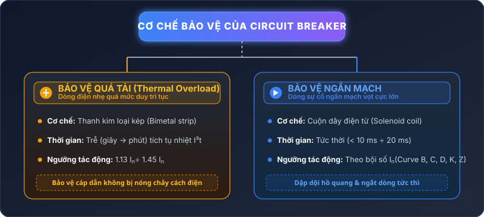
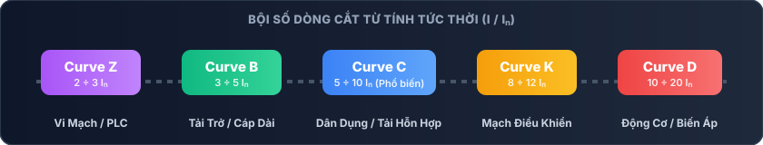
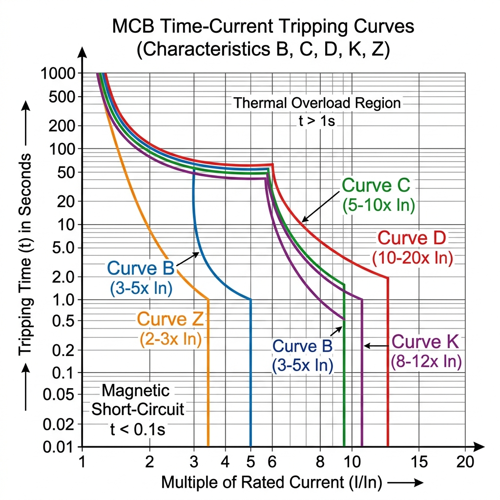
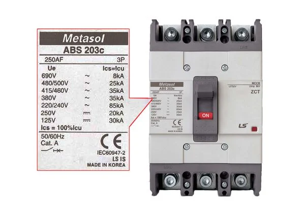
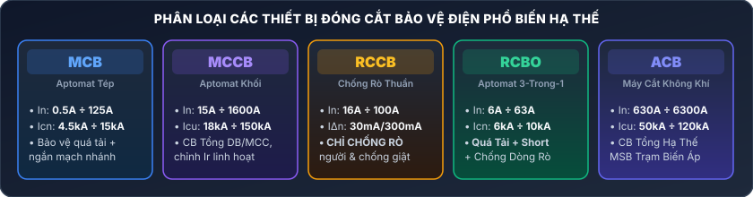

Bài viết này sẽ phân tích chi tiết ý nghĩa các thông số trên nhãn CB, đồ thị đường đặc tính cắt thực tế, phân loại các dòng CB trên thị trường.

{/* truncate */}

---

## 1. Nguyên Lý Bảo Vệ Của CB: Nhiệt & Từ Tính

Một CB tiêu chuẩn tích hợp hai cơ chế dập cắt chính làm việc độc lập nhưng bổ trợ cho nhau:

1. **Bộ giải phóng nhiệt (Thermal Release - Bimetal)**: 
   - Bảo vệ quá tải trường hợp dòng điện vượt nhẹ so với định mức ($1.13 I_n \div 1.45 I_n$).
   - Thanh bimetal uốn cong do nhiệt tích tụ ($I^2 t$), ngắt mạch sau một khoảng thời gian trễ thích hợp.
2. **Bộ giải phóng từ tính (Electromagnetic Release - Solenoid Coil)**:
   - Bảo vệ ngắn mạch khi dòng điện tăng vọt đột ngột.
   - Lực từ trường cuộn dây hút chốt cắt tức thời trong thời gian cực ngắn ($< 10\text{ ms}$). **Đường đặc tính B, C, D, K, Z chính là thước đo bội số dòng điện kích hoạt bộ giải phóng từ tính này.**

---

## 2. Giải Thích Các Đường Đặc Tính Cắt (Tripping Curves)

Tùy theo loại tải điện, dòng điện khởi động (Inrush Current) sẽ khác nhau. Tiêu chuẩn **IEC 60898-1** (cho dân dụng) và **IEC 60947-2** (cho công nghiệp) phân chia các đường đặc tính cắt dựa trên **bội số dòng cắt từ tính tức thời ($I_{\text{mag}} / I_n$)**.

### Dải Bội Số Dòng Cắt Từ Tính Tức Thời ($I/I_n$)

---

### Đồ Thị Đường Đặc Tính Cắt Chuẩn (Log-Log Chart)

*Hình 1: Đồ thị trục tọa độ Log-Log thể hiện thời gian tác động (giây) theo bội số dòng điện $I/I_n$ của các đặc tính cắt B, C, D, K, Z.*

---

### Bảng Tổng Hợp Chi Tiết Các Đường Đặc Tính CB

| Đường Đặc Tính | Bội Số Dòng Cắt Từ Tức Thời ($I_{\text{mag}} / I_n$) | Tiêu Chuẩn Quy Định | Tải Ứng Dụng Thực Tế | Lý Do Chọn |
| :--- | :--- | :--- | :--- | :--- |
| **Đặc tính B** | $3 \div 5 \times I_n$ | IEC 60898-1 | Tải thuần trở: Bình nóng lạnh, lò sưởi điện, dây dẫn dài, hệ thống chiếu sáng sợi đốt. | Dòng khởi động rất nhỏ. Cắt nhanh để bảo vệ đường dây cáp dài có trở kháng cao. |
| **Đặc tính C** | $5 \div 10 \times I_n$ | IEC 60898-1 | **Tải phổ thông**: Ổ cắm dân dụng, điều hòa, tủ lạnh, đèn huỳnh quang/LED, bơm nhỏ. | Chịu được dòng inrush trung bình từ động cơ nhỏ và bộ nguồn switching điện tử. |
| **Đặc tính D** | $10 \div 14 \times I_n$ (đến $20 I_n$) | IEC 60898-1 | Tải cảm lớn: Động cơ công nghiệp, máy biến áp nguồn, máy hàn, bộ lưu điện UPS lớn. | Tránh hiện tượng nhảy CB nhầm do dòng đỉnh vọt lớn (Inrush Current) lúc bật nguồn. |
| **Đặc tính K** | $8 \div 12 \times I_n$ | IEC 60947-2 | Động cơ công nghiệp, cuộn hút khởi động từ (Contactor), mạch điều khiển nhà máy. | Tương tự Curve D nhưng bảo vệ quá tải nhạy hơn, tối ưu cho mạch điều khiển công nghiệp. |
| **Đặc tính Z** | $2 \div 3 \times I_n$ | IEC 60947-2 | **Thiết bị điện tử nhạy cảm**: Bo mạch PLC, bộ biến đổi bán dẫn (SCR, IGBT), thiết bị y tế. | Cực kỳ nhạy! Cắt tức thời ngay khi phát hiện sự cố nhỏ nhất để tránh hỏng linh kiện bán dẫn. |

:::tip[Lưu Ý Quan Trọng]
* **Curve B, C, D** tuân theo tiêu chuẩn dân dụng **IEC 60898-1**.
* **Curve K, Z** tuân theo tiêu chuẩn công nghiệp **IEC 60947-2**.
* Đặc tính bảo vệ **nhiệt (quá tải)** của tất cả các curve B, C, D là **như nhau**: Không ngắt ở $1.13 I_n$ và bắt buộc ngắt trong vòng 1 giờ ở $1.45 I_n$.
:::

---

## 3. Giải Mã Chi Tiết Thông Số Trên Nhãn CB (Hình Ảnh Kỹ Thuật)

Dưới đây là sơ đồ phân tích kỹ thuật giải thích chi tiết các thông số in trên nhãn CB:

*Hình 2: Sơ đồ phân tích kỹ thuật mặt trước Aptomat khối (MCCB LS Metasol ABS 203c) kèm các chú thích thông số thực tế.*

### Ý Nghĩa Chi Tiết 8 Vùng Thông Số Kỹ Thuật Trực Quan Trên Nhãn:

1. **[1] Thương Hiệu & Mã Dòng Sản Phẩm (Brand & Model)**:
   - **Metasol**: Dòng sản phẩm MCCB cao cấp của thương hiệu **LS Electric (Hàn Quốc)**.
   - **ABS 203c**: Mã kiểu dáng khung vỏ (Frame series) 200AF, 3 Cực đóng cắt thế hệ nâng cấp 'c'.
2. **[2] Kích Cắt Khung ($AF$) & Số Cực Đóng Cắt ($P$)**:
   - **250AF** (Ampere Frame): Khung vỏ chịu lực và chịu nhiệt cho phép lắp cuộn ngắt lên tới $250\text{A}$.
   - **3P** (3 Poles): Aptomat 3 cực dùng cho hệ thống điện 3 pha công nghiệp.
3. **[3] Bảng Dòng Cắt Ngắn Mạch Lớn Nhất ($I_{cu}$) Theo Điện Áp Vận Hành ($U_e$)**:
   - Khả năng dập dội ngắt ngắn mạch tức thời an toàn cực đại ($I_{cu}$) tùy thuộc vào mức điện áp lưới ($U_e$):
     - Ở điện áp công nghiệp **$380\text{V} \sim$** / **$415\text{V} \sim$**: Khả năng cắt dòng ngắn mạch $I_{cu} = \mathbf{35\text{kA}}$ ($35,000\text{A}$).
     - Ở điện áp hạ thế **$220/240\text{V} \sim$**: Khả năng cắt dòng ngắn mạch lên tới $I_{cu} = \mathbf{85\text{kA}}$.
     - Ở điện áp cao **$690\text{V} \sim$**: Khả năng cắt dòng ngắn mạch $I_{cu} = \mathbf{8\text{kA}}$.
     - Điện áp một chiều **$250\text{V} \dots$ (DC)**: $I_{cu} = \mathbf{20\text{kA}}$; **$125\text{V} \dots$ (DC)**: $I_{cu} = \mathbf{30\text{kA}}$.
4. **[4] Dòng Cắt Ngắn Mạch Vận Hành Mở Lại ($I_{cs} = 100\% I_{cu}$)**:
   - **$I_{cs} = 100\% I_{cu}$**: Sau sự cố dập cắt dòng ngắn mạch cực đại $I_{cu}$, CB vẫn giữ nguyên $100\%$ độ bền tiếp điểm, cho phép đóng điện tiếp tục vận hành bình thường mà không cần thay mới thiết bị.
5. **[5] Tần Số Lưới Điện & Nhóm Phân Loại Sử Dụng (Category A)**:
   - **50/60Hz**: Tần số mạng điện tương thích.
   - **Cat. A** (Utilization Category A): CB không có thời gian trễ chịu dòng ngắn mạch chọn lọc, lập tức dập cắt tức thời ngay khi phát hiện ngắn mạch để bảo vệ đường dây.
6. **[6] Sơ Đồ Ký Hiệu Cơ Chế Ngắt Kép (Thermal-Magnetic Trip Unit)**:
   - Biểu tượng cuộn dây **ngắt từ tính** (bảo vệ ngắn mạch tức thì) kết hợp với thanh **lưỡng kim nhiệt** (bảo vệ quá tải trễ nhiệt tích tụ $I^2t$).
7. **[7] Tiêu Chuẩn Quốc Tế & Chứng Nhận Xuất Xứ**:
   - **IEC 60947-2**: Tiêu chuẩn quốc tế bắt buộc đối với thiết bị đóng cắt hạ thế dùng trong môi trường công nghiệp.
   - **CE**: Chứng nhận đạt chuẩn an toàn Châu Âu.
   - **LS IS / MADE IN KOREA**: Thương hiệu LS Industrial Systems, xuất xứ chính hãng tại Hàn Quốc.
8. **[8] Điện Áp Cách Điện ($U_i$) & Điện Áp Chịu Xung ($U_{imp}$)** (In trên vỏ nhựa khung):
   - **$U_i = 750\text{V}$** (Rated Insulation Voltage): Điện áp chịu cách điện an toàn định mức giữa các cực.
   - **$U_{imp} = 8\text{kV}$** (Rated Impulse Withstand Voltage): Khả năng chịu đựng xung quá áp sét đánh hoặc quá áp thao tác bất ngờ lên tới $8,000\text{V}$.

---

## 4. Phân Loại Các Dòng CB Phổ Biến Trên Hiện Trường

Sơ đồ phân loại tổng hợp các dòng CB đóng cắt thực tế đang được sử dụng phổ biến trong các hệ thống điện hạ thế:

*Hình 3: Các dòng thiết bị đóng cắt bảo vệ điện thực tế trên hiện trường (MCB, MCCB, RCCB, RCBO, ACB).*

### Bảng So Sánh Chi Tiết Các Loại CB:

| Loại CB | Tên Đầy Đủ | Dải Dòng Điện Định Mức ($I_n$) | Khả Năng Cắt Ngắn Mạch | Chức Năng Bảo Vệ Chính | Ứng Dụng Thực Tế |
| :--- | :--- | :--- | :--- | :--- | :--- |
| **MCB** | Miniature Circuit Breaker | $0.5\text{A} \div 125\text{A}$ | $4.5\text{kA} \div 15\text{kA}$ | Quá tải + Ngắn mạch | Tủ phân phối nhánh căn hộ, văn phòng, tủ điều khiển nhỏ. |
| **MCCB** | Molded Case Circuit Breaker | $15\text{A} \div 1600\text{A}$ | $18\text{kA} \div 150\text{kA}$ | Quá tải + Ngắn mạch (có chỉnh $I_r$) | CB tổng nhà máy, tủ điện tầng DB, đầu nguồn phụ tải động cơ lớn. |
| **RCCB / RCD** | Residual Current Circuit Breaker | $16\text{A} \div 100\text{A}$ | Phụ thuộc MCB | **Chỉ chống dòng rò / chống giật** ($10\text{mA} \div 300\text{mA}$) | Bảo vệ an toàn chống giật người và phòng chống cháy nổ. |
| **RCBO** | Residual Current Breaker with Overcurrent | $6\text{A} \div 63\text{A}$ | $6\text{kA} \div 10\text{kA}$ | **3-trong-1**: Chống rò + Quá tải + Ngắn mạch | Lắp cho mạch ổ cắm gia đình, thiết bị nhà bếp, nhà tắm. |
| **ACB** | Air Circuit Breaker | $630\text{A} \div 6300\text{A}$ | $50\text{kA} \div 120\text{kA}$ | Quá tải + Ngắn mạch + Dòng rò (Selectable Trip Unit) | Aptomat tổng hạ thế trạm biến áp, tủ MSB nhà máy lớn. |

---

## 5. Hướng Dẫn Chọn CB Phù Hợp Cho Tải (Quy Trình & Công Thức)

Để chọn CB an toàn và đúng kỹ thuật, ta cần áp dụng điều kiện tiêu chuẩn **IEC 60364-4-43**:

$$I_B \le I_n \le I_z$$

Và điều kiện bảo vệ quá tải dây dẫn:

$$I_2 \le 1.45 \times I_z$$

Trong đó:
* $I_B$: Dòng điện tính toán của phụ tải ($\text{A}$).
* $I_n$: Dòng điện định mức của CB chọn ($\text{A}$).
* $I_z$: Dòng điện mang tải liên tục cho phép của dây cáp điện ($\text{A}$).
* $I_2$: Dòng cắt đảm bảo của CB ($I_2 = 1.45 I_n$ đối với CB tiêu chuẩn).

---

### Ví Dụ Thực Tế 1: Chọn CB Cho Căn Hộ Dân Dụng (Tải Trở & Tải Hỗn Hợp)

**Yêu cầu**: Chọn MCB bảo vệ cho nhánh bình nóng lạnh công suất $P = 2500\text{W}$, điện áp $U = 220\text{V}$, $\cos\phi = 1.0$.

1. **Tính dòng tính toán $I_B$**:
   $$I_B = \frac{P}{U \cdot \cos\phi} = \frac{2500}{220 \cdot 1.0} \approx 11.36\text{ A}$$

2. **Chọn dòng định mức CB ($I_n$)**:
   Theo nguyên tắc $I_n \ge I_B = 11.36\text{A}$. Ta chọn dòng chuẩn thương mại cấp tiếp theo là **$I_n = 16\text{A}$**.

3. **Chọn đường đặc tính cắt**:
   - Bình nóng lạnh là tải thuần trở (không có dòng inrush vọt).
   - Chọn **MCB Curve B** (hoặc **Curve C**) 1P+N / RCBO 16A 30mA để bảo vệ chống giật an toàn tuyệt đối.

4. **Kiểm tra chọn dây dẫn ($I_z$)**:
   - Dây cáp đồng Cu/PVC $2.5\text{ mm}^2$ lắp âm tường có $I_z \approx 21\text{A}$.
   - Kiểm tra điều kiện: $I_B (11.36\text{A}) \le I_n (16\text{A}) \le I_z (21\text{A})$ $\rightarrow$ **ĐẠT AN TOÀN**.

---

### Ví Dụ Thực Tế 2: Chọn CB Cho Động Cơ 3 Pha (DOL - Khởi Động Trực Tiếp)

**Yêu cầu**: Chọn MCCB/MCB bảo vệ động cơ bơm nước 3 pha $P = 7.5\text{ kW}$ ($10\text{ HP}$), điện áp $U = 380\text{V}$, $\cos\phi = 0.85$, hiệu suất $\eta = 0.88$. Khởi động trực tiếp DOL có dòng đỉnh $I_{\text{start}} = 6 \times I_n$.

1. **Tính dòng định mức động cơ ($I_B$)**:
   $$I_B = \frac{P}{\sqrt{3} \cdot U \cdot \cos\phi \cdot \eta} = \frac{7500}{1.732 \cdot 380 \cdot 0.85 \cdot 0.88} \approx 15.24\text{ A}$$

2. **Dòng khởi động cực đại ($I_{\text{start}}$)**:
   $$I_{\text{start}} = 6 \cdot I_B = 6 \cdot 15.24 \approx 91.44\text{ A}$$

3. **Phân tích chọn đường đặc tính cắt CB**:
   - Nếu chọn **MCB Curve B 20A** ($I_{\text{mag}} = 3 \div 5 I_n = 60\text{A} \div 100\text{A}$): Dòng khởi động $91.44\text{A}$ nằm trong vùng ngắt từ tính $\rightarrow$ **NHẢY CB NGAY KHI BẬT**.
   - Nếu chọn **MCB Curve C 20A** ($I_{\text{mag}} = 5 \div 10 I_n = 100\text{A} \div 200\text{A}$): Dòng $91.44\text{A}$ sát ngưỡng $100\text{A}$, có rủi ro cắt nhầm khi tải nặng.
   - **Giải pháp chuẩn**: Chọn **MCB / MCCB Curve D (hoặc Curve K) 20A 3P**.
     - Vùng ngắt từ tính Curve D 20A: $10 \div 14 \cdot 20\text{A} = 200\text{A} \div 280\text{A}$.
     - Dòng khởi động $91.44\text{A} < 200\text{A}$ $\rightarrow$ Động cơ khởi động êm ái, **KHÔNG BỊ NHẢY NHẦM**.

---

### Ví Dụ Thực Tế 3: Chọn CB Bảo Vệ Thiết Bị Điện Tử Vi Mạch Nhạy Cảm (PLC / Biến Tần)

**Yêu cầu**: Bảo vệ tủ điều khiển chứa PLC và bo mạch truyền thông nhạy cảm dòng $I_B = 4\text{A}$.

- **Chọn**: **MCB Curve Z 6A** (hoặc 4A).
- **Lý do**: Ngưỡng cắt từ tính cực nhanh $2 \div 3 I_n$ ($12\text{A} \div 18\text{A}$). Ngay khi xảy ra chạm chập nhỏ ở đầu ra bo mạch, CB Curve Z sẽ ngắt tức thời trước khi dòng ngắn mạch làm cháy linh kiện bán dẫn đắt tiền.

---

## 6. Nguồn Tham Khảo & Tiêu Chuẩn Quốc Tế

Bài viết được tổng hợp dựa trên các tiêu chuẩn kỹ thuật điện quốc tế và tài liệu chuyên ngành:

1. **IEC 60898-1 Standard**: *Electrical accessories – Circuit-breakers for overcurrent protection for household and similar installations*. [Xem chi tiết tại IEC Webstore](https://webstore.iec.ch/publication/3874).
2. **IEC 60947-2 Standard**: *Low-voltage switchgear and controlgear – Part 2: Circuit-breakers*. [Xem chi tiết tại IEC Webstore](https://webstore.iec.ch/publication/3951).
3. **Schneider Electric Technical Guide**: *Tripping Curves and Application Guide for Acti9 MCB*. [Tải tài liệu Schneider Electric Guide](https://www.se.com/ww/en/download/doc/CA908004E/).
4. **ABB Technical Application Handbook**: *Protection and Control Devices - Circuit Breakers Selection*. [Tải tài liệu ABB Handbook](https://search.abb.com/library/Download.aspx?DocumentID=1SCC011001C0201).
5. **Siemens Power Distribution Guide**: *Miniature Circuit Breakers Technical Specifications*. [Tải tài liệu Siemens Guide](https://assets.new.siemens.com/siemens/assets/api/uuid:1c888d3f-5d4f-4d39-b9d9-1c9f8072049e/miniature-circuit-breakers-catalog.pdf).

---

## Lời Kết

Việc nắm rõ **đường đặc tính cắt (B, C, D, K, Z)** và **ký hiệu kỹ thuật trên nhãn CB** giúp ní thiết kế và lắp đặt hệ thống điện an toàn, tối ưu chi phí và tránh hoàn toàn sự cố nhảy CB nhầm. 

Hãy luôn tuân thủ nguyên tắc: **Tải trở chọn Curve B, Tải phổ thông chọn Curve C, Động cơ/Biến áp chọn Curve D/K, và Thiết bị điện tử nhạy cảm chọn Curve Z!**
