import DownloadBox from "@site/src/components/blog/DownloadBox";

**EFORT RPL** (*Robot Programming Language*) là ngôn ngữ lập trình mạnh mẽ được tích hợp trên các hệ thống cánh tay robot công nghiệp EFORT (hỗ trợ nền tảng hệ điều hành V3.8.0 trở lên). Bài viết này giúp tra cứu cú pháp nhanh (Cheat Sheet) các lệnh nội suy quỹ đạo `MJOINT`, `MLIN`, `MCIRC`, `JUMPMOVE`, toolbox hàm hệ thống, biến đổi động học thuận/ngược, đến quản lý quỹ đạo dừng khẩn cấp và sơ đồ phím nóng trên Teach Pendant.

{/* truncate */}

---

## 1. Năm "Nguyên Liệu" Chuyển Động Cốt Lõi (Motion Data Primitives)

Mọi chuyển động của Robot EFORT trong không gian đều được định hình từ **5 khối dữ liệu nguyên tử** nền tảng:

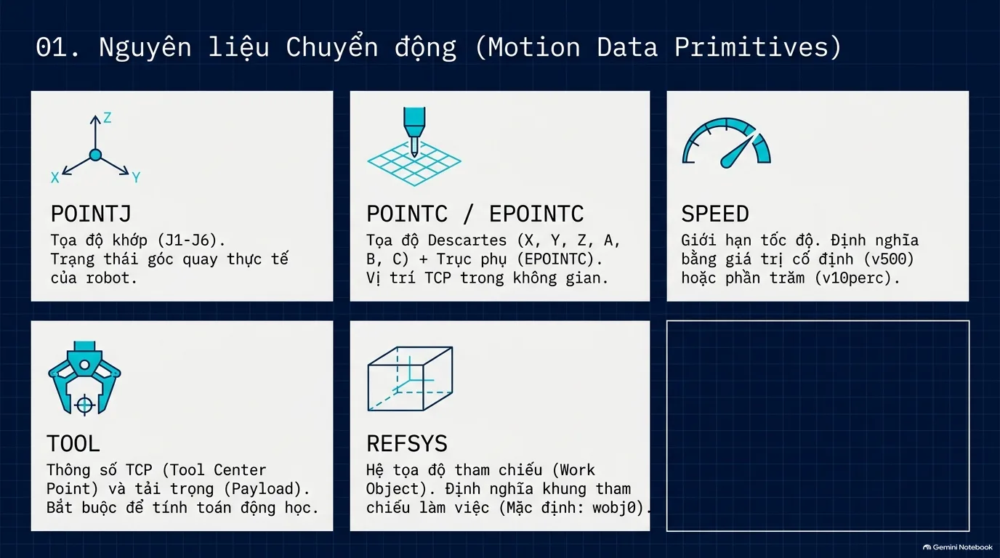

| Kiểu Dữ Liệu | Tên Gọi & Ý Nghĩa Kỹ Thuật | Đặc Điểm Cốt Lõi & Ví Dụ |
| :--- | :--- | :--- |
| **`POINTJ`** | **Tọa độ Khớp (Joint Coordinates)** | Lưu trữ góc quay thực tế của 6 khớp trục $(J_1, J_2, J_3, J_4, J_5, J_6)$ bằng đơn vị độ $(^\circ)$. Xác định hình thái vật lý chính xác của cánh tay robot. |
| **`POINTC` / `EPOINTC`** | **Tọa độ Descartes (Cartesian Coordinates)** | Vị trí tâm điểm công cụ (**TCP**) trong không gian 3 chiều: tọa độ tuyến tính $(X, Y, Z)$ tính theo $\text{mm}$ và góc hướng $(A, B, C)$ theo độ Euler. `EPOINTC` bổ sung thêm các trục phụ mở rộng (External Axes). |
| **`SPEED`** | **Dữ liệu Tốc độ Di chuyển** | Giới hạn vận tốc khi robot di chuyển. Có thể chỉ định giá trị cố định theo vận tốc đường thẳng (ví dụ: `v500` tương đương $500\text{ mm/s}$) hoặc theo tỉ lệ phần trăm năng lực động cơ (ví dụ: `v10perc`). |
| **`TOOL`** | **Dữ liệu Dụng Cụ Làm Việc (TCP)** | Định nghĩa kích thước, khoảng cách bù từ bích gắn cổ tay robot đến mũi dao/kẹp, trọng lượng tải trọng (*Payload*), và trọng tâm (*Center of Gravity*). Bắt buộc để hệ điều hành tính toán động học và động lực học. |
| **`REFSYS`** | **Hệ Tọa Độ Tham Chiếu (Work Object)** | Khung tọa độ làm việc của phôi gia công hoặc đồ gá. Mặc định là tọa độ chân đế robot (**`wobj0`**). Cho phép dịch chuyển toàn bộ đường chạy dao chỉ bằng cách thay đổi gốc tọa độ. |

---

## 2. Vùng Chuyển Tiếp ZONE: Bí Quyết Tối Ưu Hóa Cycle Time

Khi robot di chuyển liên tục qua một chuỗi các điểm $(P_1 \rightarrow P_2 \rightarrow P_3)$, tham số **`ZONE`** quyết định cách thức robot đi qua điểm trung gian $P_2$:

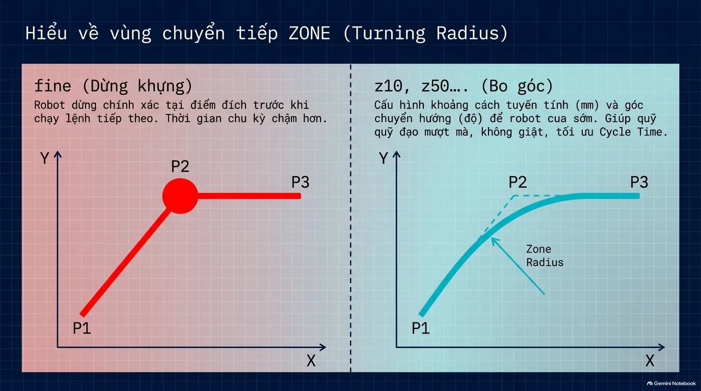

### A. Chế độ Dừng Khựng (`fine`):
* Robot giảm tốc về $0$ và **dừng chính xác $100\%$** tại điểm đích $P_2$ trước khi bắt đầu đọc và thực thi lệnh chuyển động tiếp theo.
* **Hạn chế**: Khiến robot bị giật cơ khí, gây rung lắc đồ gá và làm chu kỳ sản xuất (*Cycle Time*) kéo dài đáng kể.
* **Khi nào nên dùng**: Chỉ dùng tại các điểm thao tác then chốt như: điểm bắt đầu gắp/nhả sản phẩm, điểm chọc mỏ hàn xuống tiếp xúc phôi, hoặc điểm chụp hình camera thị giác.

### B. Chế độ Bo Góc Lượn (`z10`, `z50`, `z100`...):
* Thay vì ghé sát $P_2$, hệ điều hành mở một bán kính vùng rẽ (**Turning Radius**). Ngay khi TCP chạm vào ranh giới vùng bo góc của $P_2$, robot sẽ bắt đầu cua mượt sang hướng $P_3$.
* **Lợi ích**:
  * Động cơ duy trì vận tốc ổn định, không bị ngắt quãng quán tính.
  * Giảm tải mài mòn cho hộp số giảm tốc Cycloid/Harmonic.
  * Cắt giảm đến **$15\% \div 30\%$ Cycle Time** của toàn bộ dây chuyền tự động.

---

## 3. Giải Phẫu Cú Pháp Một Lệnh Di Chuyển Cốt Lõi

Mọi câu lệnh di chuyển nền tảng trong RPL đều tuân thủ một chuẩn tham số thống nhất và chặt chẽ:

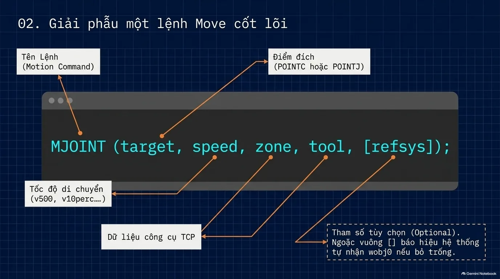

```c
MJOINT (target, speed, zone, tool, [refsys]);
```

* **`MJOINT`**: Tên lệnh chuyển động (*Motion Command*).
* **`target`**: Tọa độ điểm đích đến (chấp nhận biến kiểu `POINTC`, `EPOINTC` hoặc `POINTJ`).
* **`speed`**: Bộ thông số vận tốc di chuyển (ví dụ: `v1000`, `v50perc`).
* **`zone`**: Tham số vùng chuyển tiếp bo góc (`fine`, `z5`, `z20`...).
* **`tool`**: Biến công cụ chỉ định vị trí TCP đang gắn (ví dụ: `tGripper`, `tGun`).
* **`[refsys]`**: Tham số tùy chọn (*Optional*). Nếu bỏ trống, bộ điều khiển EFORT sẽ tự động gán hệ tọa độ chuẩn mặc định là `wobj0`.

---

## 4. Ba Lệnh Di Chuyển Nền Tảng: MJOINT, MLIN, MCIRC

---

### A. Lệnh MJOINT (Move Joint - Nội Suy Khớp PTP)

Tất cả các trục động cơ khớp của robot cùng xuất phát và cùng tăng tốc/giảm tốc đồng bộ để về đích cùng một thời điểm.

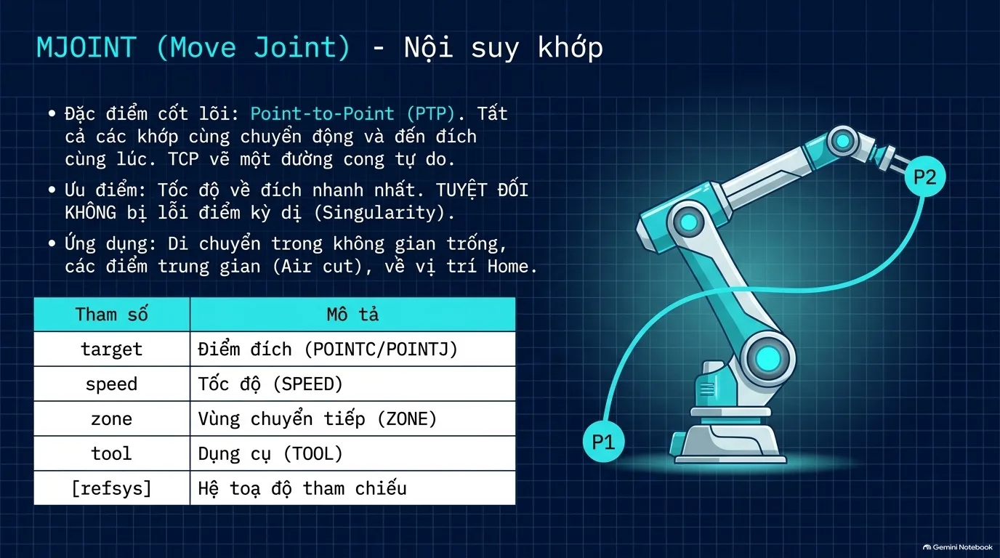

* **Đặc tính quỹ đạo**: Đầu công cụ TCP sẽ vẽ một **đường cong tự do trong không gian** (không phải đường thẳng).
* **Ưu điểm lớn nhất**:
  * Tốc độ di chuyển từ $P_1$ đến $P_2$ là **nhanh nhất** trong tất cả các kiểu chuyển động.
  * **TUYỆT ĐỐI KHÔNG BAO GIỜ bị lỗi điểm kỳ dị (Singularity)** vì hệ thống điều khiển trực tiếp góc quay trục động cơ thay vì giải thuật toán ma trận động học ngược.
* **Ứng dụng**: Dùng cho các chuyển động bay trên không (*Air Cut*), di chuyển giữa các trạm máy cách xa nhau, hoặc khi đưa robot về vị trí An toàn (*Home Position*).

```c
// Ví dụ: Đưa Robot về vị trí Home bằng nội suy khớp
MJOINT (pHome, v1000, fine, tool0);
```

---

### B. Lệnh MLIN (Move Linear - Nội Suy Tuyến Tính Đường Thẳng)

Đầu công cụ TCP được thuật toán điều khiển bắt buộc phải di chuyển theo một **đường thẳng tuyệt đối** từ tọa độ hiện tại đến tọa độ đích.

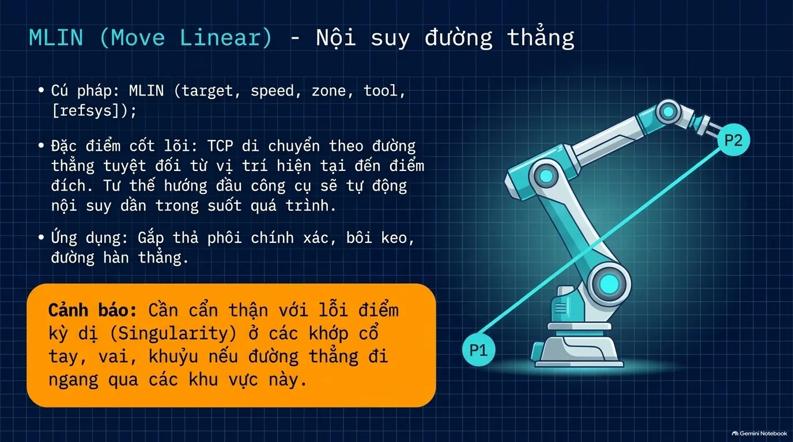

* **Đặc tính quỹ đạo**: Đường đi thẳng tắp trong không gian Descartes. Hướng tư thế của công cụ (góc Euler) được xoay nội suy đều đặn theo tỷ lệ hành trình.
* **Ứng dụng**: Các đường bôi keo thẳng, kéo mối hàn thẳng, chuyển động tịnh tiến cắm linh kiện hoặc hạ phôi vào lòng khuôn ép.
* **Cảnh báo cực kỳ quan trọng**: Khi chạy `MLIN`, robot rất dễ vấp phải **Lỗi điểm kỳ dị (Singularity)** — đặc biệt là điểm kỳ dị cổ tay (Wrist Singularity khi trục 4 và trục 6 thẳng hàng) hoặc điểm kỳ dị vươn vai tối đa. Khi vấp phải lỗi này, robot sẽ dừng khẩn cấp và báo lỗi quá vận tốc khớp.

```c
// Ví dụ: Hạ mỏ hàn xuống điểm tiếp xúc phôi theo đường thẳng
MLIN (pWeldingStart, v200, fine, tWeldingGun, wobj_Fixture);
```

---

### C. Lệnh MCIRC (Move Circular - Nội Suy Cung Tròn Không Gian)

Cho phép đầu công cụ TCP vẽ một đường cong tròn hoàn hảo đi qua 3 điểm trong không gian.

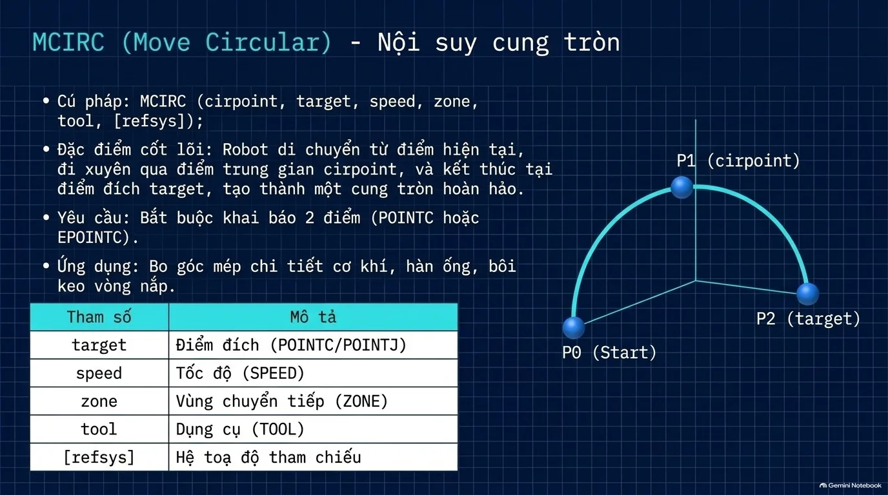

* **Cú pháp**:
  ```c
  MCIRC (cirpoint, target, speed, zone, tool, [refsys]);
  ```
* **Nguyên lý hình học**: Cần xác định đủ **3 điểm**:
  * Điểm bắt đầu $P_0$: Vị trí hiện tại của robot trước khi gọi lệnh.
  * Điểm trung gian $P_1$ (`cirpoint`): Điểm nằm trên thân cung tròn.
  * Điểm kết thúc $P_2$ (`target`): Điểm đích đến của cung tròn.
* **Ứng dụng**: Bo tròn các góc mép tấm kim loại, đường hàn ống tròn, hoặc bôi keo nắp đậy mặt bích hình trụ.

---

### D. Ma Trận So Sánh & Hướng Dẫn Lựa Chọn Lệnh

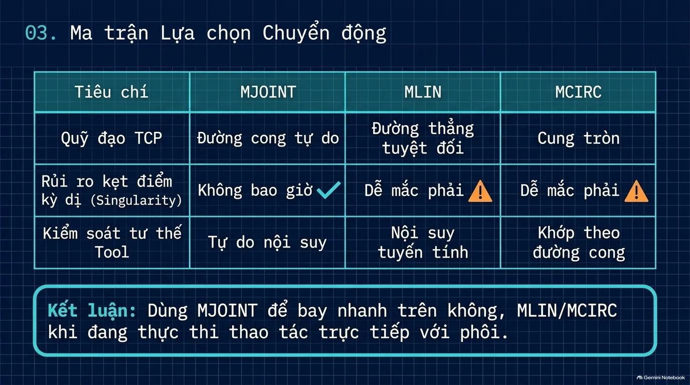

| Tiêu Chí Kỹ Thuật | `MJOINT` (Khớp) | `MLIN` (Đường Thẳng) | `MCIRC` (Cung Tròn) |
| :--- | :--- | :--- | :--- |
| **Quỹ đạo đầu TCP** | Đường cong tự do | Đường thẳng tuyệt đối | Cung tròn không gian |
| **Rủi ro dính Điểm Kỳ Dị** | **Không bao giờ bị (An toàn 100%)** | Dễ mắc phải ⚠️ | Dễ mắc phải ⚠️ |
| **Kiểm soát tư thế Tool** | Tự do biến thiên | Nội suy tuyến tính góc | Xoay đồng pha theo đường cong |
| **Tốc độ di chuyển thực tế** | Nhanh nhất | Trung bình | Trung bình |

:::tip[Quy Tắc Kinh Nghiệm Cho Lập Trình Viên]
**Dùng `MJOINT` để bay nhanh trên không trung**, chỉ chuyển sang dùng **`MLIN` hoặc `MCIRC` khi robot chuẩn bị tiếp cận và thao tác trực tiếp với bề mặt phôi**.
:::

---

## 5. Quỹ Đạo Chuyên Dụng & Nâng Cao

---

### A. Họ Lệnh CMOVE & TMOVE (Tối Ưu Vận Tốc & Mô-men)

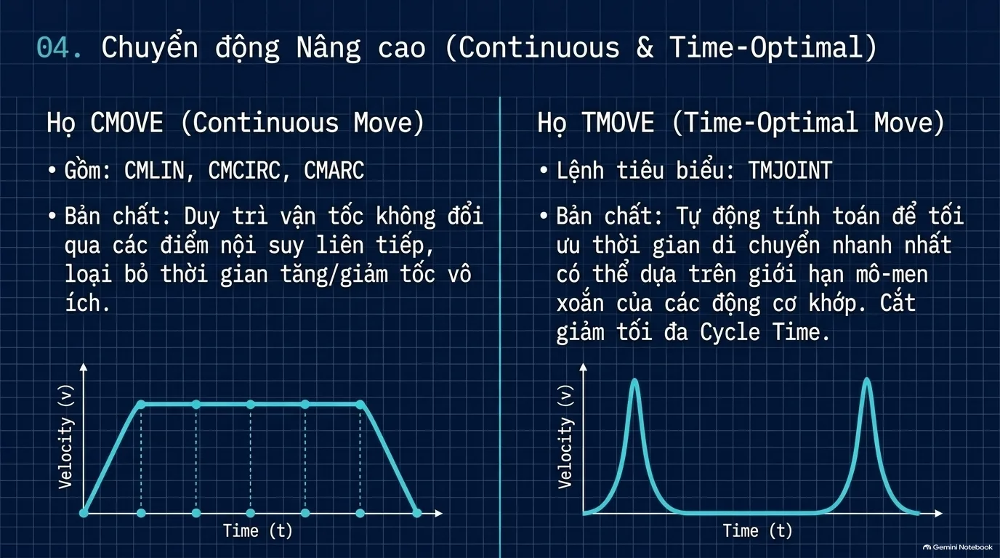

1. **Họ `CMOVE` (*Continuous Move - Lệnh CMLIN, CMCIRC*)**:
   - Duy trì vận tốc dài của TCP không đổi qua nhiều đoạn nội suy liên tiếp, triệt tiêu hoàn toàn thời gian giảm tốc rồi lại tăng tốc vô ích giữa các phân đoạn. Rất thích hợp cho máy bôi keo liên tục hoặc cắt laser/plasma.
2. **Họ `TMOVE` (*Time-Optimal Move - Lệnh TMJOINT*)**:
   - Hệ thống tự động phân tích ma trận quán tính và giới hạn mô-men xoắn tức thời cực đại của từng động cơ để ép robot chạy với gia tốc lớn nhất có thể mà vẫn nằm trong giới hạn an toàn phần cứng.

---

### B. Quỹ Đạo Vòm Cổng Gắp Thả: JUMPMOVE

Trong các ứng dụng gắp thả (Pick & Place) hoặc đóng thùng (Palletizing), nếu lập trình thủ công Ní phải viết ít nhất 3 lệnh (`MLIN nhấc lên` $\rightarrow$ `MJOINT sang ngang` $\rightarrow$ `MLIN hạ xuống`). Lệnh **`JUMPMOVE`** tích hợp toàn bộ chu trình vòm cổng này trong một dòng mã duy nhất:

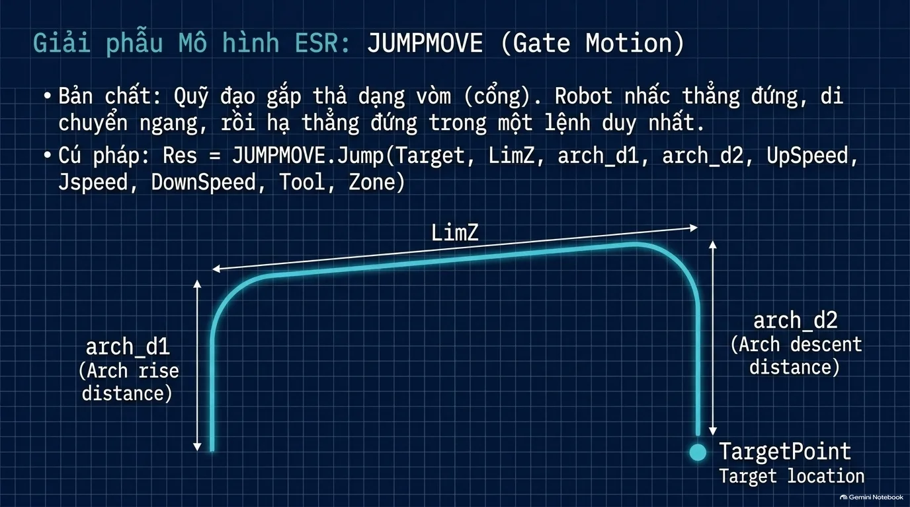

```c
Res = JUMPMOVE.Jump(Target, LimZ, arch_d1, arch_d2, UpSpeed, Jspeed, DownSpeed, Tool, Zone);
```

* **`arch_d1`**: Khoảng cách nhấc thẳng đứng lên từ điểm lấy hàng trước khi bắt đầu rẽ.
* **`LimZ`**: Cao độ trần tối đa trong hành trình bay ngang.
* **`arch_d2`**: Khoảng cách bắt đầu hạ tịnh tiến thẳng đứng xuống điểm đích.
* **`UpSpeed` / `Jspeed` / `DownSpeed`**: Vận tốc riêng biệt cho 3 giai đoạn: Nhấc lên, Bay ngang và Hạ xuống.

---

## 6. Toolbox Các Hàm Hệ Thống Tiêu Biểu (System Functions)

Hệ điều hành EFORT cung cấp một bộ công cụ hàm dựng sẵn (Built-in Functions) vô cùng mạnh mẽ:

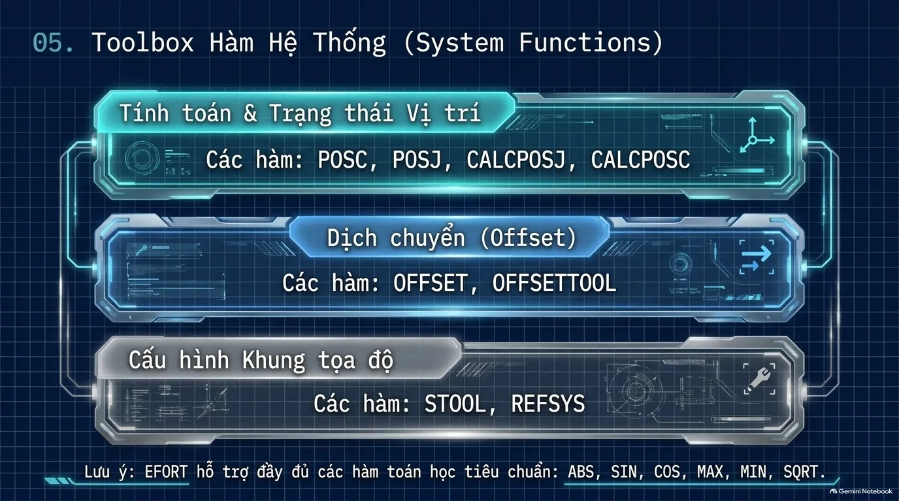

---

### 1. Đọc Trạng Thái Vị Trí Hiện Tại

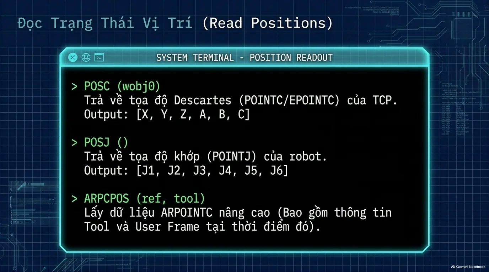

* **`POSC (wobj0)`**: Trả về tọa độ Descartes thực tế của TCP gồm mảng 6 phần tử `[X, Y, Z, A, B, C]`.
* **`POSJ ()`**: Trả về góc quay thực tế của 6 khớp trục `[J1, J2, J3, J4, J5, J6]`.
* **`ARPCPOS (ref, tool)`**: Lấy dữ liệu tọa độ mở rộng kết hợp đồng thời cả hệ quy chiếu công cụ và phôi.

---

### 2. Chuyển Đổi Động Học Thuận - Ngược (Kinematics)

Trước khi gửi lệnh điều khiển robot đến một tọa độ nào đó từ camera truyền về, việc tính toán trước tính khả thi là bắt buộc để tránh sự cố:

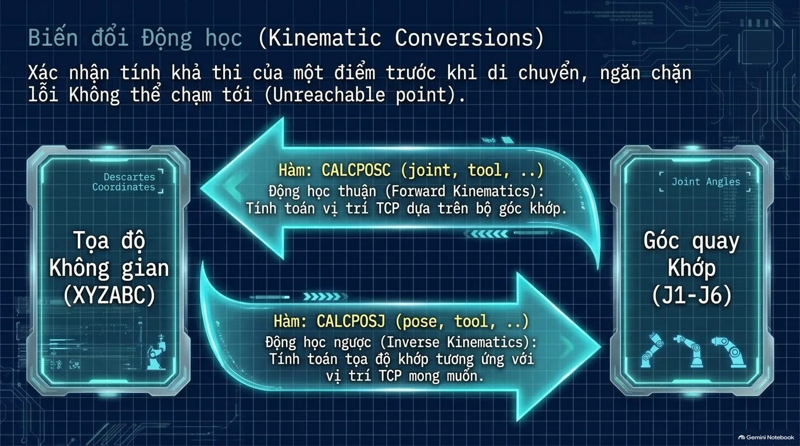


* **`CALCPOSC (joint, tool)`**: *Forward Kinematics* - Nhập vào bộ 6 góc khớp, hàm tính toán ra vị trí TCP trong không gian.
* **`CALCPOSJ (pose, tool)`**: *Inverse Kinematics* - Nhập vào tọa độ không gian mong muốn, hàm giải bài toán động học ngược để trả về 6 góc khớp. **Nếu điểm nằm ngoài tầm với hoặc bị kẹt góc trục, hàm sẽ báo mã lỗi giúp chương trình tránh được va chạm!**

---

### 3. Các Hàm Dịch Chuyển Tọa Độ (Offset Functions)

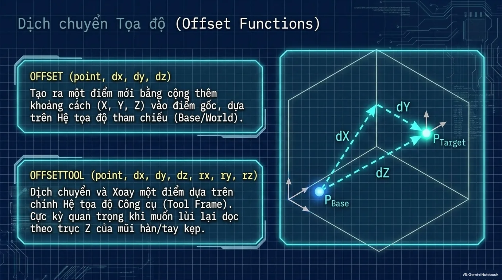

* **`OFFSET (point, dx, dy, dz)`**: Cộng thêm khoảng cách $dX, dY, dZ$ vào điểm gốc dựa trên **Hệ tọa độ nền tảng (Base/World Frame)**.
* **`OFFSETTOOL (point, dx, dy, dz, rx, ry, rz)`**: Dịch chuyển và xoay điểm dựa trên **chính hệ tọa độ của đầu công cụ (Tool Frame)**. Cực kỳ hữu ích khi bạn muốn robot rút lui thẳng lùi về phía sau theo phương trục $Z$ của mỏ hàn/mũi khoan mà không cần quan tâm robot đang quay nghiêng theo hướng nào trong không gian.

---

### 4. Cấu Hình Công Cụ & Khung Phôi Động

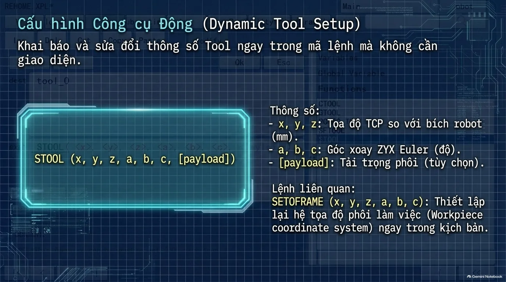

* **`STOOL (x, y, z, a, b, c, [payload])`**: Cấu hình hoặc ghi đè thông số TCP của công cụ làm việc trực tiếp ngay trong mã lệnh mà không cần thao tác qua giao diện Teach Pendant.
* **`SETOFRAME (x, y, z, a, b, c)`**: Thiết lập lại hệ tọa độ phôi làm việc (*Workpiece coordinate system*) thời gian thực (ví dụ: bù độ lệch góc của phôi do đồ gá cơ khí xô lệch).

---

## 7. Quản Lý Quỹ Đạo, Dừng Khẩn & Ghi Hình Quỹ Đạo

---

### A. Quản Lý Luồng Di Chuyển & Dừng Khẩn Cấp

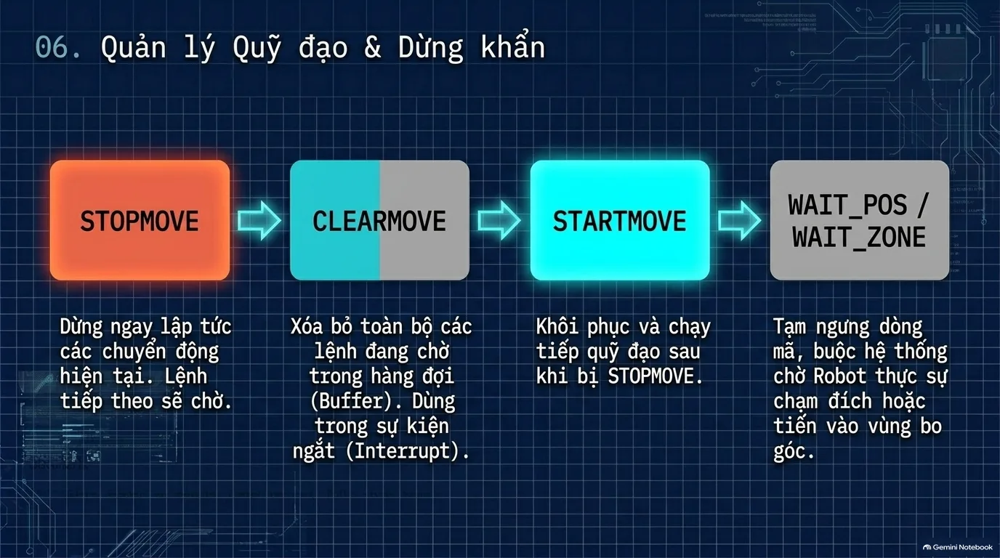

* **`STOPMOVE`**: Lập tức phanh dừng mọi chuyển động vật lý của cánh tay robot. Dòng lệnh kế tiếp trong mã nguồn sẽ rơi vào trạng thái chờ.
* **`CLEARMOVE`**: Xóa sạch toàn bộ các câu lệnh di chuyển đang nằm chờ trong bộ đệm hàng đợi (*Buffer*). Rất quan trọng khi xảy ra sự kiện ngắt (Interrupt).
* **`STARTMOVE`**: Cho phép robot khôi phục và tiếp tục chạy tiếp quỹ đạo dang dở sau khi tín hiệu an toàn được thiết lập lại.
* **`WAIT_POS` / `WAIT_ZONE`**: Tạm dừng dòng lệnh chương trình logic, bắt hệ điều hành phải đợi cho đến khi robot thực sự đi vào vùng đích trước khi bật các tín hiệu van khí hoặc giác hút.

---

### B. Ghi Hình Và Phục Hồi Quỹ Đạo (Path Recorder)

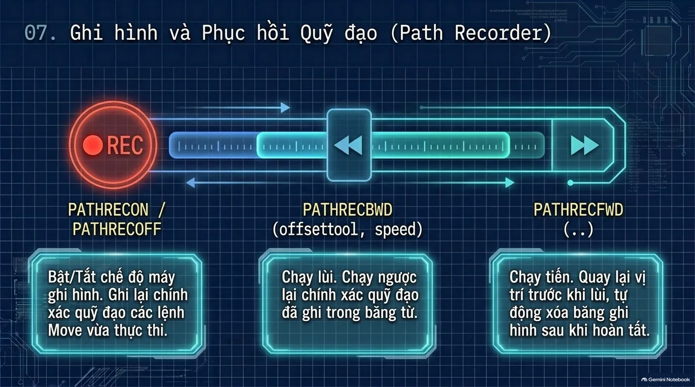

Hệ thống cho phép "bật máy quay" để lưu lại toàn bộ các vi phân quỹ đạo vừa chạy qua:
* **`PATHRECON` / `PATHRECOFF`**: Bật/Tắt tính năng ghi nhớ quỹ đạo đường chạy.
* **`PATHRECBWD (offsettool, speed)`**: Chạy lùi! Robot sẽ tự động tua ngược lại chính xác từng milimet quãng đường vừa đi (cực kỳ hữu ích khi kẹt mối hàn hoặc cần rút mũi dao ra khỏi hốc sâu mà không va quẹt thành phôi).
* **`PATHRECFWD (..)`**: Sau khi đã lùi ra kiểm tra, gọi lệnh này để robot tự động tiến thẳng lại đúng vị trí dở dang ban đầu.

---

### C. Lưu Trữ Quỹ Đạo Trong Sự Kiện Ngắt (Path Store)

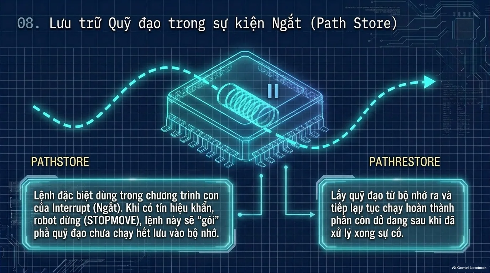

Khi có tín hiệu cảm biến khẩn cấp (ví dụ: công nhân mở cửa lồng bảo vệ hoặc cảm biến quang phát hiện chướng ngại vật):
1. Robot nhận tín hiệu ngắt $\rightarrow$ Gọi lệnh `STOPMOVE`.
2. Gọi lệnh **`PATHSTORE`**: Đóng băng và cất toàn bộ trạng thái vị trí, vận tốc, điểm đích chưa hoàn thành vào một vùng nhớ an toàn tạm thời.
3. Sau khi xử lý xong sự cố, gọi lệnh **`PATHRESTORE`**: Lấy dữ liệu từ bộ nhớ ra và tiếp tục hoàn thành đúng quỹ đạo dang dở mà không cần phải lập trình chạy lại từ đầu chu trình.

---

## 8. Phím Nóng Trên Teach Pendant & Gỡ Lỗi Vận Hành

---

### A. Sơ Đồ Phím Cứng Trên Teach Pendant EFORT

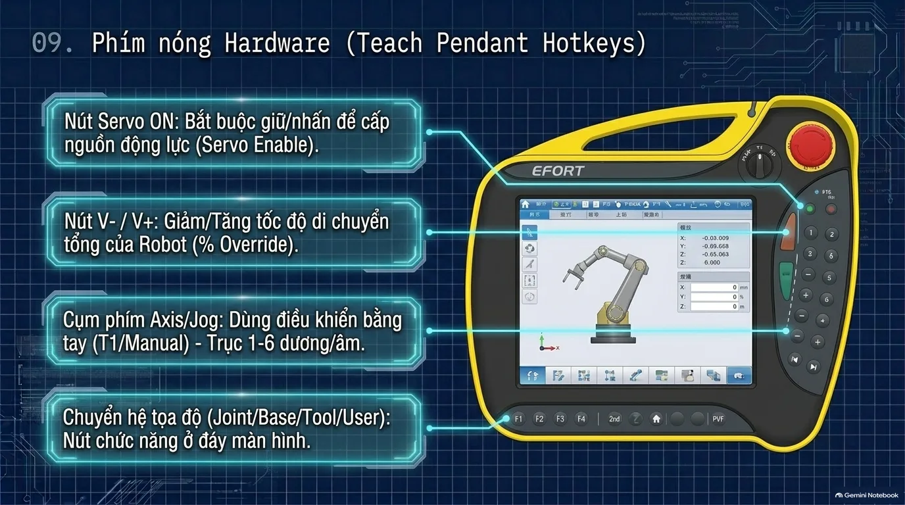

* **Nút Servo ON (Nút nguồn động lực)**: Công tắc 3 vị trí (Deadman switch) bắt buộc phải nhấn ở nấc giữa để cấp nguồn cho các bộ servo drive.
* **Nút `V-` / `V+`**: Tăng hoặc giảm tốc độ vận hành tổng thể (*Manual Override Percentage*) theo các mức $1\%, 5\%, 20\%, 50\%, 100\%$.
* **Cụm phím Axis / Jog (+/-)**: Điều khiển bằng tay các trục từ 1 đến 6 theo chiều dương hoặc chiều âm trong chế độ cài đặt (T1/Manual).
* **Hàng phím chức năng đáy màn hình (`F1` - `F4`, `2nd`, `PVF`)**: Chuyển đổi nhanh hệ tọa độ hiển thị giữa `Joint` (Khớp), `Base` (Chân đế), `Tool` (Công cụ) và `User` (Hệ tọa độ người dùng).

---

### B. Quy Trình Gỡ Lỗi Thực Chiến (Running Error Handling)


Khi bộ điều khiển phát tín hiệu báo động màu đỏ (*Alarm Triggered*):
1. **Dừng ngay chương trình**: Không cố gắng ép robot chạy tiếp bằng tay khi chưa rõ nguyên nhân.
2. **Kiểm tra Log chi tiết**: Nhấn vào biểu tượng **Log** trên thanh trạng thái Teach Pendant để đọc mã số lỗi cụ thể (*Error Code*) và số dòng lệnh đang bị nghẽn.
3. **Phân tích lỗi quỹ đạo**: Kiểm tra xem điểm đích có vi phạm **Điểm kỳ dị (Singularity)** hoặc có vượt quá phạm vi sải tay tối đa của robot (**Out of reach**) hay không.

---

## 9. Tổng Kết & Tải Bộ Tài Liệu Gốc

Lập trình Robot công nghiệp EFORT với ngôn ngữ **RPL V3.8.0** mang lại tính linh hoạt cực cao nhờ sự kết hợp hài hòa giữa các lệnh chuyển động nền tảng (`MJOINT`, `MLIN`, `MCIRC`), mô hình vòm `JUMPMOVE` và hệ thống xử lý ngắt linh hoạt (`PATHSTORE`, `PATHRECBWD`). Hy vọng cẩm nang tra cứu này sẽ đồng hành cùng Ní trong việc thiết lập và vận hành các trạm robot tự động một cách chuẩn xác và an toàn nhất.

<DownloadBox
  headerTitle="Tải tài liệu tại đây"
  headerDescription="Tài liệu Gehihi có thể đưa ra không chính xác, nên hãy xác minh kỹ:"
  items={[
    {
      title: "Cẩm Nang Tra Cứu Cú Pháp EFORT RPL",
      size: "24.1 MB",
      type: "pdf",
      url: "https://drive.google.com/file/d/1corQKD30my6UZ7AcIDVaLSWoancibGaC/view?usp=sharing",
      buttonText: "Tải file PDF",
    },
    {
      title: "Tài liệu tổng hợp các lệnh RPL",
      description: "Tài liệu tổng hợp các lệnh RPL của Robot EFORT",
      size: "9 MB",
      type: "pdf",
      url: "https://drive.google.com/file/d/1hyex5EnaJEglsSzLt7pi0U6nMrix6z-J/view?usp=sharing",
      buttonText: "Tải file PDF",
    },
    {
      title: "Phần mềm mô phỏng V392_Virtual",
      size: "73.1 MB",
      type: "zip",
      url: "https://drive.google.com/file/d/1w0IF2vztHDdbwc9mTpbklFiHvRle4sKC/view?usp=sharing",
      buttonText: "Tải file PDF",
    },
     {
      title: "Phần mềm Openmind Robotics · MoDou IDE",
      size: "xxx MB",
      type: "code",
      url: "https://ide.efort.com.cn/en/",
      buttonText: "Truy cập",
      hideIcon: true,
    },
  ]}
/>

