import DownloadBox from "@site/src/components/blog/DownloadBox";

Cảm biến laser CMOS tự thu phát **Keyence LR-ZB Series** (gồm các model thông dụng như `LR-ZB100N/P/CN/CP` và `LR-ZB500N/P/CN/CP`) là giải pháp phát hiện vật thể tin cậy hàng đầu trong môi trường công nghiệp khắc nghiệt nhờ thân vỏ thép không gỉ SUS316L đạt chuẩn IP68/IP69K. Bài viết này tổng hợp trọn bộ cẩm nang vận hành trực quan từ tài liệu chính hãng Keyence: từ sơ đồ cơ khí 3D, quy chuẩn lực siết $0.6\text{ Nm}$, sơ đồ chân M8 mạch NPN/PNP, logic Light-ON/Dark-ON, 4 chiến lược hiệu chuẩn độ nhạy (2 điểm BGS, mốc chuẩn Datum FGS, độ nhạy tối đa, toàn tự động), giải mã toàn diện menu nâng cao đến bảng tra cứu mã lỗi và tấm Cheat Sheet trạm làm việc.

{/* truncate */}

---

## 1. Cấu Tạo Phần Cứng & Cảnh Báo An Toàn Tuyệt Đối

Cảm biến **Keyence LR-ZB Series** hoạt động dựa trên nguyên lý tam giác đạc quang học laser (**Laser Triangulation**) với bộ thu nhận ảnh CMOS hiện đại. Thiết bị định vị vật thể dựa trên **khoảng cách vật lý thực tế**, hoàn toàn triệt tiêu sai số do màu sắc, độ tương phản hay độ bóng bẩy của bề mặt chi tiết gia công.

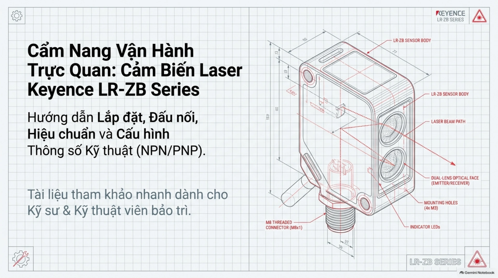

### Cấu tạo cơ khí & cụm quang học:
* **Thân cảm biến (Sensor Body)**: Chế tạo nguyên khối bằng thép không gỉ cao cấp **SUS316L**, chịu được hóa chất tẩy rửa mạnh và chống ăn mòn cực cao.
* **Mặt quang học thấu kính kép (Dual-Lens Optical Face)**: Tích hợp thấu kính phát tia laser và thấu kính hội tụ CMOS thu nhận ánh sáng phản xạ, bề mặt phủ lớp PMMA chống trầy xước.
* **Lỗ lắp đặt (Mounting Holes)**: 4 lỗ định vị ren xuyên thân dùng ốc vít tiêu chuẩn **M3**.
* **Đầu nối M8 (M8 Threaded Connector)**: Ren tiêu chuẩn **$M8 \times 1$** tích hợp gioăng cao su làm kín nước.

---

### Thông số cốt lõi & Cảnh báo an toàn điện/quang học:

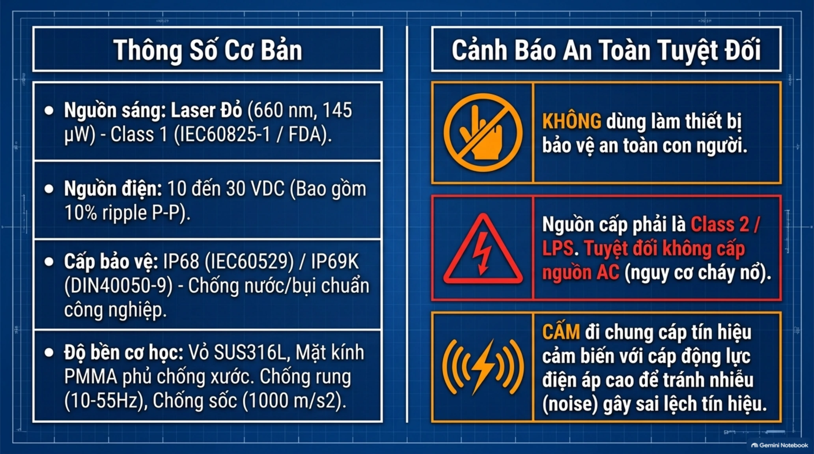

| Thông Số Kỹ Thuật | Giá Trị & Quy Chuẩn Tiêu Chuẩn |
| :--- | :--- |
| **Nguồn phát quang** | Laser bán dẫn màu đỏ ($\lambda = 660\text{ nm}$, công suất đỉnh $145\text{ }\mu\text{W}$). |
| **Cấp an toàn Laser** | **Class 1** (theo chuẩn quốc tế IEC60825-1 và FDA(CDRH) Part 1040.10). |
| **Điện áp cấp nguồn** | $10 \div 30\text{V (DC)}$ (bao gồm độ gợn sóng $10\%\text{ ripple P-P}$). |
| **Cấp bảo vệ vỏ ngoài** | **IP68** (IEC60529) & **IP69K** (DIN40050-9) - Chịu được tia nước áp lực cao và ngâm nước. |
| **Độ bền cơ học** | Chống rung $10 \div 55\text{ Hz}$ (biên độ kép $1.5\text{ mm}$), chống sốc va đập lên tới $1000\text{ m/s}^2$. |

:::danger[3 NGUYÊN TẮC AN TOÀN BẮT BUỘC KHI LẮP ĐẶT]
1. **KHÔNG DÙNG LÀM CẢM BIẾN AN TOÀN BẢO VỆ CON NGƯỜI**: Keyence LR-ZB là cảm biến phát hiện vật thể công nghiệp, tuyệt đối không sử dụng làm thiết bị dừng khẩn cấp hay bảo vệ an toàn tính mạng theo chuẩn OSHA/ISO 13849.
2. **NGUỒN CẤP BẮT BUỘC LÀ CLASS 2 / LPS**: Nguồn điện một chiều cấp cho cảm biến phải đạt tiêu chuẩn **Class 2 / LPS (Limited Power Source)**. Tuyệt đối không cấp nguồn điện xoay chiều AC (nguy cơ phát nổ và cháy bo mạch).
3. **CẤM ĐI CHUNG VỚI CÁP ĐỘNG LỰC**: Tuyệt đối không luồn dây tín hiệu của cảm biến chung máng hoặc chung ống bảo vệ với cáp nguồn động lực, đường dây cao thế hoặc ngõ ra biến tần/servo motor để ngăn chặn xung sét và sóng hài nhiễu cao tần (*noise*) gây đo sai lệch hoặc đánh thủng transistor.
:::

---

## 2. Ma Trận Model & Tiêu Chuẩn Lắp Đặt Cơ Khí

### Ma trận phân loại thiết bị & Khoảng cách phát hiện

Tùy vào cự ly công nghệ của trạm máy và hệ thống điều khiển trung tâm (PLC NPN hay PNP), Keyence chia dòng LR-ZB thành các biến thể tiêu chuẩn sau:

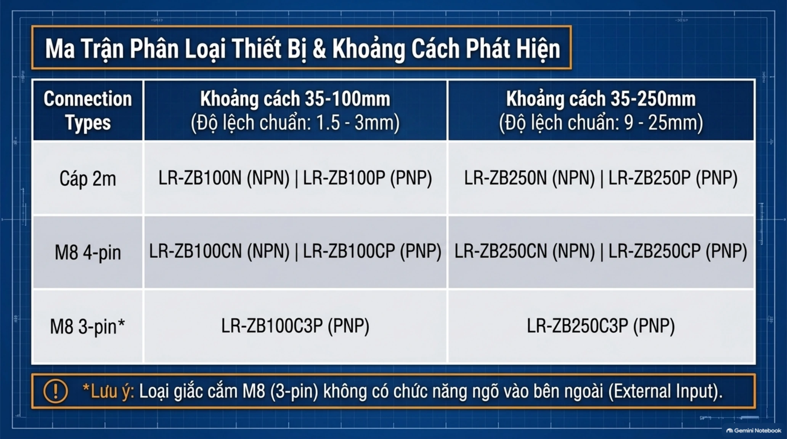

  | Dòng Model | Cự Ly Phát Hiện | Độ Lệch Chuẩn (Standard Deviation) | Kiểu Đấu Dây | Logic Ngõ Ra Transistor |
  | :--- | :--- | :--- | :--- | :--- |
  | **LR-ZB100N** / **LR-ZB100P** | $35 \div 100\text{ mm}$ | $1.5 \div 3\text{ mm}$ | Cáp liền $2\text{m}$ (4 sợi) | NPN (`N`) / PNP (`P`) |
  | **LR-ZB100CN** / **LR-ZB100CP** | $35 \div 100\text{ mm}$ | $1.5 \div 3\text{ mm}$ | Giắc M8 4-chân | NPN (`CN`) / PNP (`CP`) |
  | **LR-ZB100C3P** | $35 \div 100\text{ mm}$ | $1.5 \div 3\text{ mm}$ | Giắc M8 3-chân | PNP (`C3P`) |
  | **LR-ZB250N** / **LR-ZB250P** | $35 \div 250\text{ mm}$ | $9 \div 25\text{ mm}$ | Cáp liền $2\text{m}$ (4 sợi) | NPN (`N`) / PNP (`P`) |
  | **LR-ZB250CN** / **LR-ZB250CP** | $35 \div 250\text{ mm}$ | $9 \div 25\text{ mm}$ | Giắc M8 4-chân | NPN (`CN`) / PNP (`CP`) |
  | **LR-ZB250C3P** | $35 \div 250\text{ mm}$ | $9 \div 25\text{ mm}$ | Giắc M8 3-chân | PNP (`C3P`) |

:::note[Lưu Ý Quan Trọng Về Biến Thể C3P]
Model có đuôi mã **`C3P`** sử dụng giắc cắm M8 3-chân rút gọn (chỉ gồm chân nguồn dương `+V`, nguồn âm `0V` và ngõ ra `OUT`). Phiên bản này **không hỗ trợ chân tín hiệu điều khiển ngoài (External Input - Chân Trắng)**.
:::

---

### Tiêu chuẩn lắp đặt cơ khí & Quy chuẩn lực siết $0.6\text{ Nm}$

Độ ổn định phát hiện của cảm biến quang học phụ thuộc trực tiếp vào độ vững chắc của giá gá cơ khí. Khi lắp ráp, kỹ sư cần tuân thủ nghiêm ngặt chỉ dẫn sau:

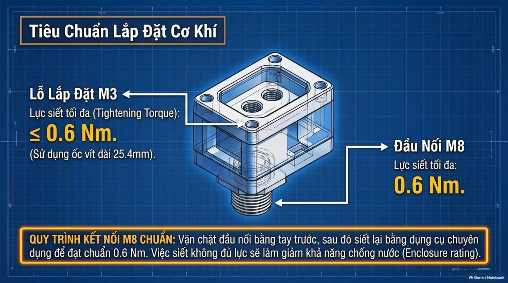

* **Lỗ bắt vít định vị M3**: Bắt vít xuyên qua 2 lỗ định vị thân cảm biến với ốc dài **$25.4\text{ mm}$**. Lực siết tối đa cho phép: **$\le 0.6\text{ Nm}$** (tránh siết quá lực làm vỡ tai gá thân vỏ).
* **Quy trình kết nối giắc M8 chuẩn**: Vặn ren bằng tay trước cho thật thẳng khớp ren, sau đó dùng cờ-lê lực chuyên dụng siết chặt tới mô-men **$0.6\text{ Nm}$**. Nếu siết quá lỏng, nước làm mát và bụi bẩn sẽ thâm nhập làm mất chuẩn IP68/IP69K; nếu siết quá chặt bằng kìm mỏ quạ sẽ làm vỡ đầu ren đồng.

---

## 3. Sơ Đồ Đấu Nối Điện & Mạch Giao Tiếp I/O

Cảm biến Keyence LR-ZB trang bị ngõ ra transistor cực thu hở (**Open Collector**) với khả năng chịu dòng liên tục lên tới **$100\text{ mA}$**, tích hợp mạch bảo vệ quá dòng và triệt xung điện áp ngược.

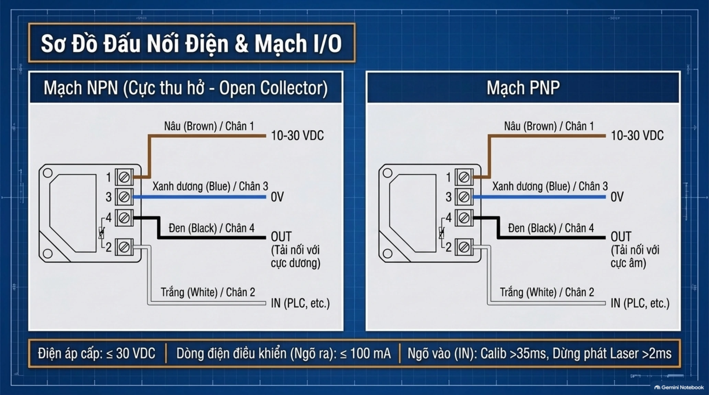

### Bảng định danh chân giắc M8 & Màu dây cáp:

  | Thứ Tự Chân Giắc M8 | Màu Cáp Liền | Ký Hiệu Tín Hiệu | Chức Năng Chi Tiết |
  | :---: | :---: | :---: | :--- |
  | **Chân 1** | **Nâu (Brown)** | `10-30 VDC` | Cấp nguồn dương cho cảm biến từ bộ nguồn tủ điện. |
  | **Chân 2** | **Trắng (White)** | `IN (External Input)` | Ngõ vào đa năng: Hiệu chuẩn ngoài (xung $> 35\text{ ms}$) hoặc Dừng phát laser (xung $> 2\text{ ms}$). |
  | **Chân 3** | **Xanh dương (Blue)** | `0V (GND)` | Cấp nguồn âm chung với hệ thống điều khiển. |
  | **Chân 4** | **Đen (Black)** | `OUT (Control Output)` | Tín hiệu kích hoạt điều khiển (Dòng tải $I_{\max} \le 100\text{ mA}$). |

### Phân biệt bản chất mạch điện tử NPN và PNP:
* **Mạch NPN (Cực thu hở - Sink Type)**: Ngõ ra chân Đen sẽ đóng xuống mass ($0\text{V}$) khi dẫn điện. Tải nối ngoài (cuộn hút rơ-le hoặc ngõ vào PLC kiểu Source) được nối giữa chân Đen (OUT) và cực dương `10-30 VDC`.
* **Mạch PNP (Cực phát hở - Source Type)**: Ngõ ra chân Đen sẽ phát điện thế dương ($+V$) khi dẫn điện. Tải nối ngoài (cuộn hút rơ-le hoặc ngõ vào PLC kiểu Sink) được nối giữa chân Đen (OUT) và cực âm `0V`.

---

## 4. Giao Diện Người Dùng (HMI) & Cấu Hình Logic L.ON / D.ON

Mặt trên của cảm biến được bố trí cụm màn hình hiển thị trực quan và các phím nhấn thao tác vật lý, giúp kỹ thuật viên cài đặt trực tiếp tại trạm máy mà không cần phần mềm hỗ trợ.

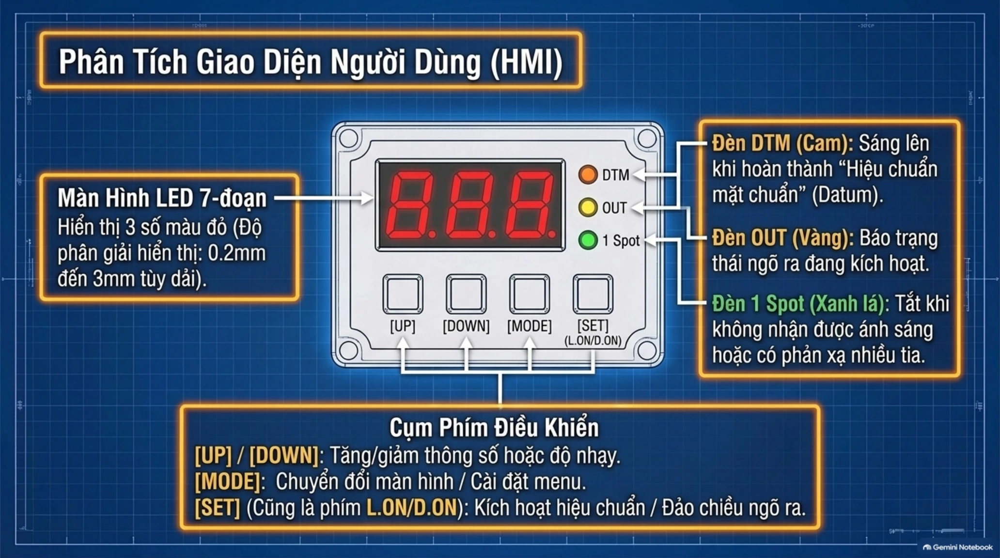

### Chi tiết các khối hiển thị và phím chức năng:
1. **Màn hình hiển thị LED 7-đoạn**: Gồm 3 ký tự màu đỏ, hiển thị khoảng cách đo tức thời, giá trị ngưỡng cài đặt hoặc mã cài đặt hệ thống.
2. **Hệ thống 3 đèn LED chỉ báo trạng thái**:
   * **`DTM` (Đèn màu Cam)**: Phát sáng khi cảm biến đã hoàn thành chế độ **Hiệu chuẩn mặt chuẩn (Datum Calibration)**.
   * **`OUT` (Đèn màu Vàng)**: Báo trạng thái ngõ ra điều khiển đang dẫn điện (ON).
   * **`1 Spot` (Đèn màu Xanh Lá)**: Đèn ổn định thu nhận chùm tia laser. Đèn sẽ tắt nếu cảm biến không thu được ánh sáng phản xạ hoặc mặt phản xạ gây tán xạ đa tia hỗn loạn.
3. **Cụm 4 phím điều hướng & thao tác**:
   * `[UP]` / `[DOWN]`: Tăng hoặc giảm giá trị ngưỡng cài đặt (Manual Tuning) hoặc duyệt menu.
   * `[MODE]`: Chuyển đổi màn hình đo / Nhấn giữ $> 3\text{ giây}$ để vào menu cài đặt thông số nâng cao.
   * `[SET]` (Đồng thời là phím `L.ON / D.ON`): Dạy độ nhạy / Nhấn nhấp $< 1\text{ giây}$ để đảo chiều logic kích hoạt ngõ ra.

---

### Cấu hình Logic Ngõ Ra: Light-ON (L.ON) vs Dark-ON (D.ON)

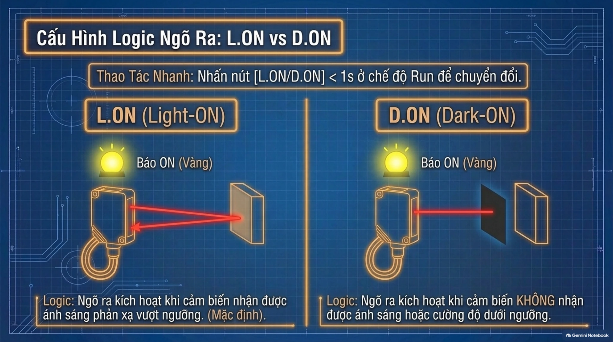

* **Thao tác nhanh**: Tại màn hình đo lường bình thường (*Run Mode*), **nhấn nút `[SET / L.ON/D.ON]` dưới 1 giây (`< 1s`)** để chuyển đổi qua lại giữa `L.on` và `d.on`.

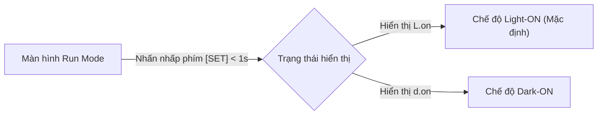

* **`L.on` (Light-ON - Mặc định nhà máy)**:
  * Ngõ ra `OUT` kích hoạt đóng mạch (**ON**, đèn vàng sáng) khi cảm biến nhận được ánh sáng phản xạ từ vật thể vượt ngưỡng cài đặt (khi có vật xuất hiện).
* **`d.on` (Dark-ON)**:
  * Ngõ ra `OUT` kích hoạt đóng mạch (**ON**, đèn vàng sáng) khi cảm biến **KHÔNG** nhận được ánh sáng hoặc cường độ phản xạ nằm dưới ngưỡng cài đặt (dùng cho ứng dụng phát hiện thiếu vật, báo đứt phôi hoặc cảnh báo an toàn máng dập).

---

## 5. Chiến Lược & 4 Phương Pháp Hiệu Chuẩn Độ Nhạy (Calibration / Tuning)

Khác với các cảm biến quang điện thu phát thông thường, Keyence LR-ZB được trang bị thuật toán phân tích CMOS thông minh với 4 giải pháp hiệu chuẩn thích ứng cho từng dạng bài toán thực tế:

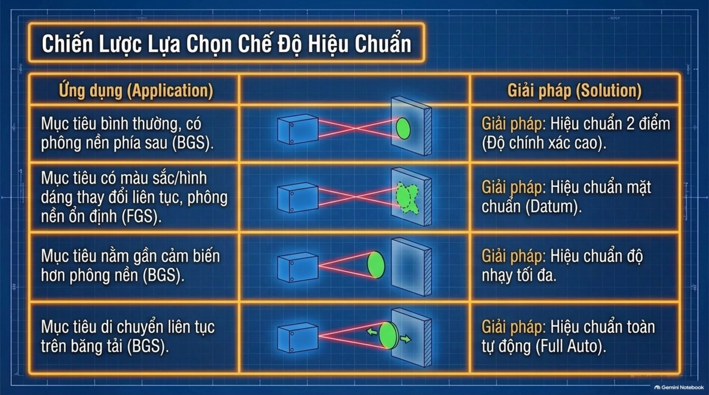

---

### A. Hiệu Chuẩn 2 Điểm (2-Point Calibration - BGS)
* **Ứng dụng tiêu biểu**: Mục tiêu bình thường, khoảng cách giữa vật thể và phông nền phía sau rõ ràng. Đây là phương pháp cho độ chính xác cao nhất (**High Accuracy**).
* **Quy trình thao tác**:

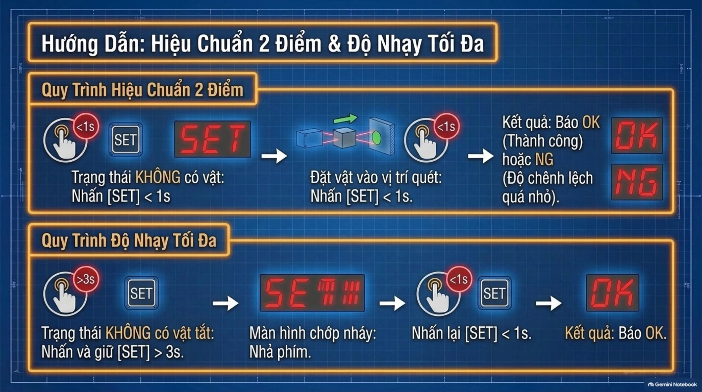

1. **Bước 1**: Đặt chùm tia laser chiếu vào phông nền phía sau (trạng thái **KHÔNG** có vật) $\rightarrow$ Nhấn nhấp phím **`[SET] < 1s`**. Màn hình sẽ hiển thị chữ `SET`.
2. **Bước 2**: Đặt vật mẫu thực tế vào vị trí cần phát hiện $\rightarrow$ Nhấn nhấp phím **`[SET] < 1s`** lần thứ 2.
3. **Đánh giá kết quả**:
   * Nếu thành công: Màn hình nhấp nháy giá trị ngưỡng cài đặt tối ưu và hiển thị chữ **`OK`**.
   * Nếu thất bại: Màn hình hiển thị chữ **`NG`** (Do khoảng cách sai biệt giữa vật và phông nền quá bé, không đủ biên độ phân giải).

---

### B. Hiệu Chuẩn Độ Nhạy Tối Đa (Maximum Sensitivity Tuning - BGS)
* **Ứng dụng tiêu biểu**: Phía sau không có phông nền cố định, hoặc phông nền ở vô cực, bạn muốn phát hiện tất cả các vật thể xuất hiện phía trước trong phạm vi cho phép.
* **Quy trình thao tác**:
1. **Bước 1**: Chiếu chùm tia vào không gian (trạng thái **KHÔNG** có vật tắt) $\rightarrow$ **Nhấn và giữ phím `[SET] > 3s`**.
2. **Bước 2**: Khi màn hình bắt đầu chớp nháy chữ `SET` $\rightarrow$ Nhả phím ra.
3. **Bước 3**: **Nhấn lại phím `[SET] < 1s`** một lần nữa $\rightarrow$ Kết quả màn hình hiển thị **`OK`**.

---

### C. Hiệu Chuẩn Mặt Chuẩn (Datum Tuning - FGS)
* **Ứng dụng tiêu biểu**: Mục tiêu có bề mặt gồ ghề, góc nghiêng bất thường, màu sắc thay đổi liên tục (đen/trắng xen kẽ) hoặc bề mặt có độ bóng bẩy cao khiến tia phản xạ bị tán xạ. Cảm biến sẽ sử dụng phông nền cố định làm **mốc tham chiếu chuẩn (Datum Background)**.
* **Quy trình thao tác**:

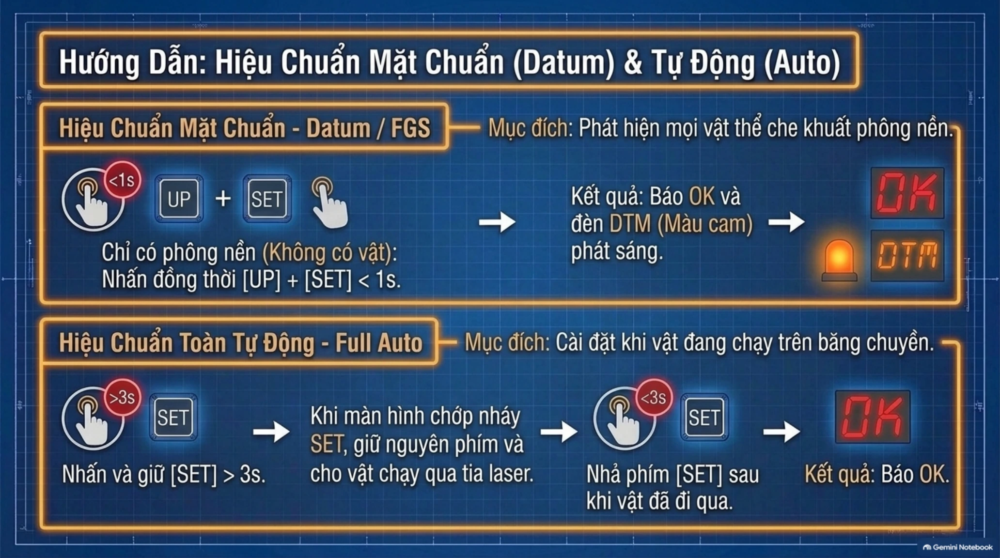

1. **Bước 1**: Chiếu tia laser vào bề mặt phông nền cố định (như mặt băng chuyền cơ khí) trong trạng thái **KHÔNG** có vật.
2. **Bước 2**: **Nhấn đồng thời hai phím `[UP] + [SET]` trong thời gian dưới 1 giây (`< 1s`)**.
3. **Kết quả**: Màn hình hiển thị chữ **`OK`**, đồng thời đèn chỉ báo cam **`DTM` phát sáng cố định**. Kể từ thời điểm này, bất kể vật mẫu có màu sắc hay hình thù khó phát hiện đến đâu đi qua che khuất nền, ngõ ra `OUT` đều sẽ kích hoạt chắc chắn $100\%$.

---

### D. Hiệu Chuẩn Toàn Tự Động (Full Auto Tuning - BGS)
* **Ứng dụng tiêu biểu**: Sản phẩm đang di chuyển liên tục với tốc độ cao trên băng tải, không thể dừng máy để đặt từng sản phẩm dạy mẫu tĩnh.
* **Quy trình thao tác**:
1. **Bước 1**: Nhấn và **giữ liên tục phím `[SET]` trong $> 3\text{ giây}$**.
2. **Bước 2**: Khi màn hình bắt đầu chớp nháy chữ `SET`, tiếp tục **giữ nguyên ngón tay trên phím** và cho các sản phẩm thực tế chạy qua chùm tia laser.
3. **Bước 3**: **Nhả phím `[SET]`** sau khi các sản phẩm đã đi qua hoàn toàn $\rightarrow$ Cảm biến tự động lấy mẫu phân tích và hiển thị chữ **`OK`**.

---

## 6. Sơ Đồ Cấu Hình Menu Nâng Cao (Advanced Settings)

Để truy cập vào cây menu quản trị hệ điều hành của cảm biến, tại màn hình đo chính (*Run Mode*), bạn **nhấn và giữ phím `[MODE]` trong thời gian $> 3\text{ giây}$**.

---

### Phần 1: Cấu hình Thời Gian Đáp Ứng (SPd) & Bộ Định Thời (Timer)

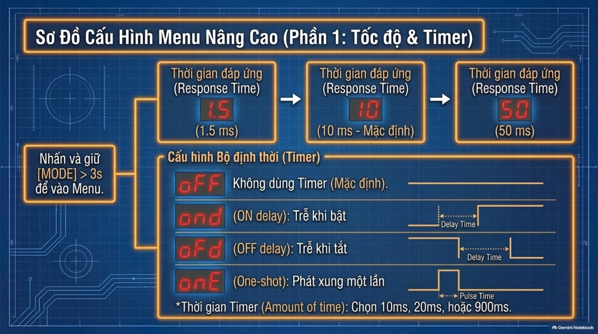

#### 1. Thời gian đáp ứng (`SPd` - Response Time):
* **`10` ($10\text{ ms}$)**: Chế độ tiêu chuẩn mặc định nhà máy, phù hợp cho đa số ứng dụng công nghiệp.
* **`1.5` ($1.5\text{ ms}$)**: Chế độ đáp ứng siêu tốc, chuyên dùng cho các dây chuyền chiết rót, đóng gói phôi bay qua ở tốc độ cực lớn.
* **`50` ($50\text{ ms}$)**: Chế độ làm chậm, tích hợp bộ lọc trung bình chống rung chập chờn khi bề mặt sản phẩm hoặc phông nền bị rung lắc cơ khí mạnh.

#### 2. Cấu hình Bộ định thời (`dLY` - Delay Timer):
* **`oFF`**: Không dùng bộ định thời (Mặc định).
* **`ond` (ON-delay)**: Trễ khi bật. Ngõ ra chỉ kích hoạt nếu vật thể duy trì trong vùng phát hiện đủ thời gian cài đặt $dt$. Giúp loại trừ các chi tiết vụn rơi thoáng qua.
* **`oFd` (OFF-delay)**: Trễ khi tắt. Duy trì trạng thái ngõ ra ON thêm một khoảng thời gian $dt$ sau khi vật đã đi khỏi, giúp module ngõ vào của PLC kịp thời bắt tín hiệu đối với phôi nhỏ đi nhanh.
* **`onE` (One-shot)**: Phát một xung điện áp duy nhất có độ rộng xung bằng đúng thời gian $dt$ ngay khi phát hiện rìa đầu của vật thể.
* **`dt` (Timer Time)**: Cài đặt thời gian duy trì trễ ($10\text{ ms}$, $20\text{ ms}$ đến $900\text{ ms}$).

---

### Phần 2: Cấu hình Hiển Thị & Chức Năng Mở Rộng (Shift, Hold, Clamp)

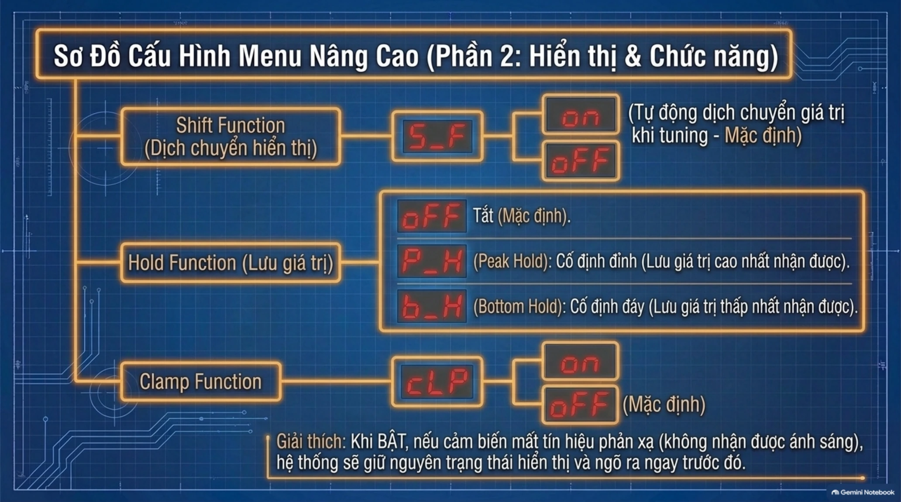

  | Tên Tham Số | Mã Hiển Thị | Các Tùy Chọn Cấu Hình | Ý Nghĩa Thực Tế & Lời Khuyên Ứng Dụng |
  | :--- | :---: | :---: | :--- |
  | **Shift Function** *(Dịch chuyển hiển thị)* | **`S_F`** | **`on`** (Mặc định)   **`oFF`** | Khi `on`, cảm biến sẽ tự động dịch chuyển điểm tham chiếu về mốc $0$ tương đối tại vị trí vừa hiệu chuẩn, giúp giá trị khoảng cách hiển thị trực quan và dễ theo dõi độ lệch. |
  | **Hold Function** *(Lưu giữ giá trị đo)* | **`HLd`** | **`oFF`** (Mặc định)   **`P_H`** (Peak Hold)   **`b_H`** (Bottom Hold) | • `P_H` *(Peak Hold)*: Cố định và lưu giữ lại giá trị khoảng cách cao nhất nhận được. • `b_H` *(Bottom Hold)*: Cố định và lưu giữ lại giá trị khoảng cách thấp nhất nhận được. |
  | **Clamp Function** *(Kẹp giữ trạng thái)* | **`cLP`** | **`oFF`** (Mặc định)   **`on`** | Khi bật sang `on`, nếu cảm biến bị mất hoàn toàn tín hiệu phản xạ (chùm tia bắn ra không gian trống vô cực), hệ thống sẽ **giữ nguyên trạng thái hiển thị và tín hiệu ngõ ra trước đó** thay vì chuyển sang trạng thái lỗi ngắt tức thì. |

---

## 7. Các Lệnh Phím Tắt & Khôi Phục Cài Đặt Gốc (Factory Reset)

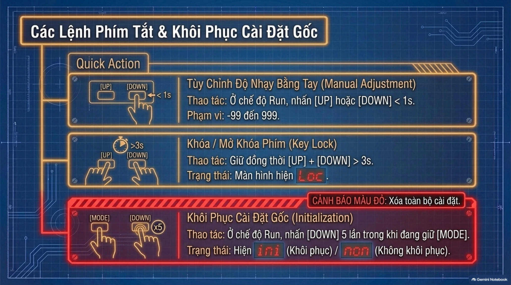

### 1. Tùy chỉnh độ nhạy bằng tay (Manual Adjustment)
* **Thao tác**: Tại màn hình đo lường bình thường (*Run Mode*), bạn chỉ cần **nhấn phím `[UP]` hoặc `[DOWN]` dưới 1 giây (`< 1s`)**.
* **Phạm vi tinh chỉnh**: Cho phép dịch chuyển ngưỡng cài đặt trong dải rộng từ **`-99` đến `999`**. Sau 3 giây không bấm, giá trị mới sẽ tự động lưu vào bộ nhớ tạm.

### 2. Khóa & Mở khóa phím bảo vệ (Key Lock)
* **Mục đích**: Vô hiệu hóa toàn bộ bàn phím để ngăn chặn công nhân vận hành bấm nhầm làm sai lệch thông số đã căn chỉnh.
* **Thao tác khóa**: Nhấn và **giữ đồng thời hai phím `[UP] + [DOWN]` trong $> 3\text{ giây}$**. Màn hình sẽ nhấp nháy thông báo **`Loc`** (*Locked*).
* **Thao tác mở khóa**: Tiếp tục giữ đồng thời `[UP] + [DOWN]` trong $> 3\text{ giây}$ cho đến khi màn hình hiển thị **`unL`** (*Unlocked*).

### 3. Khôi phục cài đặt gốc nhà máy (Initialization)
:::warning[CẢNH BÁO: XÓA TOÀN BỘ CẤU HÌNH CẢM BIẾN]
Thao tác khôi phục cài đặt gốc sẽ xóa sạch mọi thông số hiệu chuẩn độ nhạy, thiết lập ngõ ra và giá trị timer đã lưu, đưa cảm biến về trạng thái nguyên bản xuất xưởng.
:::

<DocImage src={require('./img/keyence-lrz-2/keyence-reset.png')} alt="Quy trình khôi phục cài đặt gốc Keyence LR-Z" width="450" />

**Quy trình thực hiện**:
  1. Tại màn hình *Run Mode*, nhấn và **giữ phím `[DOWN/MODE]`**.
  2. Trong khi ngón tay vẫn đang giữ phím `[DOWN]`, **nhấn phím `[UP]` liên tục 5 lần (`x5`)**.
  3. Màn hình sẽ chuyển sang trạng thái xác nhận và hiển thị mã **`rSt`** (*Initialize*).
  4. Nhấn phím `[UP]` để chọn giữa **`no`** (Not initialize) hoặc **`yes`** (Initialize), sau đó nhấn phím `[DOWN]` để xác nhận.

**Thông số mặc định xuất xưởng của cảm biến Keyence LR-ZB**:
<DocImage src={require('./img/keyence-lrz-2/keyence-default-settings.png')} alt="Cài đặt gốc Keyence LR-Z" width="450" />
---

## 8. Ma Trận Chẩn Đoán & Khắc Phục Sự Cố (Troubleshooting)

Khi vận hành thực tế tại nhà máy, màn hình LED của cảm biến có thể hiển thị các mã cảnh báo sự cố kỹ thuật. Hãy tra cứu bảng ma trận dưới đây để xử lý nhanh chóng:

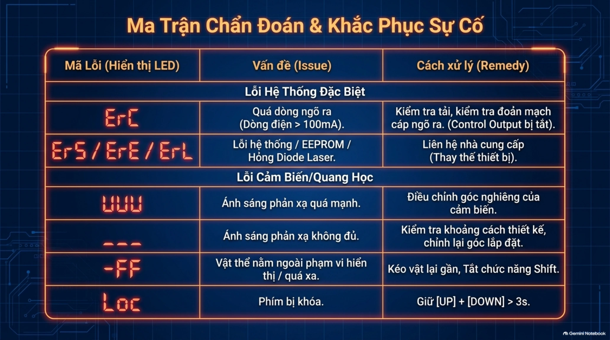

  | Mã Hiển Thị LED | Phân Loại Vấn Đề (Issue) | Nguyên Nhân Cốt Lõi | Biện Pháp Khắc Phục Xử Lý (Remedy) |
  | :---: | :--- | :--- | :--- |
  | **`ErC`** | **Quá dòng ngõ ra điều khiển** *(Dòng điện vượt quá $100\text{ mA}$)* | Chập cáp ngõ ra đen (OUT) sang nguồn dương/âm, hoặc tải relay/solenoid tiêu thụ dòng quá lớn. Khi này mạch bảo vệ sẽ tự động cắt ngắt ngõ ra (*Control Output OFF*). | Tắt nguồn kiểm tra chạm chập dây dẫn. Kiểm tra nội trở của tải ngoài đảm bảo $I \le 100\text{ mA}$. |
  | **`ErS`** / **`ErE`** / **`ErL`** | **Lỗi phần cứng hệ thống đặc biệt** | • `ErS`: Lỗi vi xử lý CPU. • `ErE`: Hỏng chip nhớ EEPROM. • `ErL`: Hỏng hoặc suy giảm Diode phát Laser. | Thử khôi phục cài đặt gốc (`ini`). Nếu vẫn xuất hiện lỗi, bắt buộc liên hệ đại diện Keyence để gửi bảo hành thay thế thiết bị. |
  | **`uuu`** | **Ánh sáng phản xạ quá mạnh** *(Chói cảm quang CMOS)* | Chùm tia laser chiếu vuông góc góc $90^\circ$ vào bề mặt gương kính, inox gương hoặc chi tiết kim loại bóng mạ crom. | **Nghiêng cảm biến một góc $5^\circ \div 10^\circ$** so với phương vuông góc bề mặt để phân tán tia phản xạ gương. |
  | **`---`** | **Ánh sáng phản xạ không đủ** | Bề mặt vật thể quá tối (vật màu đen hấp thụ quang) hoặc vật nằm vượt quá cự ly phát hiện tối đa ($100\text{ mm}$ hoặc $250\text{ mm}$). | Kiểm tra lại khoảng cách lắp đặt thực tế, đưa cảm biến lại gần hơn hoặc chuyển sang dùng chế độ hiệu chuẩn Datum FGS. |
  | **` -FF`** | **Vật thể nằm ngoài phạm vi hiển thị** | Điểm đo vượt quá cự ly giới hạn dải số cho phép hiển thị của màn hình. | Di chuyển vật lại gần hơn hoặc tắt chức năng dịch chuyển tọa độ Shift (`S_F = oFF`). |
  | **`Loc`** | **Bàn phím đang bị khóa** | Tính năng Key Lock đang được bật bảo vệ. | Nhấn giữ đồng thời hai phím `[UP] + [DOWN] > 3s` để mở khóa bàn phím (`unL`). |

---

## 9. [Tài Liệu Cắt Rời] Cheat Sheet Trạm Làm Việc & Tải Tài Liệu

Tấm infographic dưới đây được thiết kế như một bản tóm tắt nhanh gối đầu giường để dán trực tiếp lên mặt trước cánh tủ điện hoặc lưu trong điện thoại của kỹ thuật viên bảo trì khi xuống hiện trường:

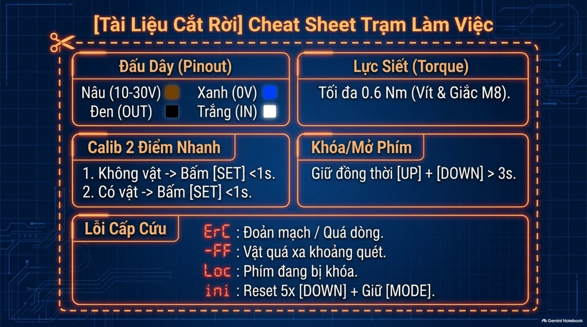

### Tóm tắt 5 khối trọng tâm tại trạm vận hành:
* **Đấu dây nhanh**: Nâu ($10-30\text{V}$), Xanh dương ($0\text{V}$), Đen (Ngõ ra `OUT`), Trắng (Ngõ vào `IN`).
* **Lực siết**: Tối đa **$0.6\text{ Nm}$** cho cả vít định vị M3 và đầu ren giắc giắc nối M8.
* **Calib 2 điểm tức thì**: Chiếu nền bấm `[SET] < 1s` $\rightarrow$ Đặt vật bấm `[SET] < 1s`.
* **Khóa/Mở phím**: Giữ đồng thời `[UP] + [DOWN] > 3s` (Màn hình hiện `Loc`).
* **Mã lỗi khẩn cấp**: `ErC` (Đoản mạch/quá dòng $100\text{ mA}$), `-FF` (Vật ngoài khoảng quét), `ini` (Khôi phục gốc: giữ `[MODE]` và bấm `[DOWN]` 5 lần).

<DownloadBox
  headerTitle="Tải tài liệu Keyence LR-ZB"
  headerDescription="Tài liệu Gehihi có thể đưa ra không chính xác, nên hãy xác minh kỹ:"
  items={[
    {
      title: "Keyence LR-ZB Series Operations Manual (Bản Gehihi)",
      description: "Cẩm nang vận hành trực quan và tra cứu mã lỗi",
      size: "19.6 MB",
      type: "pdf",
      url: "https://drive.google.com/file/d/1Au-u18mzAEXxiDQxYlAUfK6NSdkLC0UY/view?usp=sharing",
      buttonText: "Tải file PDF",
    },
    {
      title: "Keyence LR-ZB Series (Tài liệu hãng)",
      size: "1.63 MB",
      type: "pdf",
      url: "https://drive.google.com/file/d/1WS2RHUOJ7LA0ZJL99cr5cB2eG96ZZSNM/view?usp=sharing",
      buttonText: "Tải file PDF",
    },
  ]}
/>
