import DownloadBox from "@site/src/components/blog/DownloadBox";

Cảm biến áp suất kỹ thuật số **Delta DPA Series** là thiết bị đo lường khí nén và chân không phổ biến trong dây chuyền tự động hóa. Bài này tổng hợp toàn bộ sổ tay cài đặt nhanh trực quan (Quick Reference Guide): từ sơ đồ phần cứng, cách điều hướng phím bấm, phân tích 3 thuật toán kích hoạt ngõ ra (Easy, Hysteresis, Window Mode)

{/* truncate */}

---

## 1. Tổng Quan Phần Cứng & Giao Diện Hiển Thị

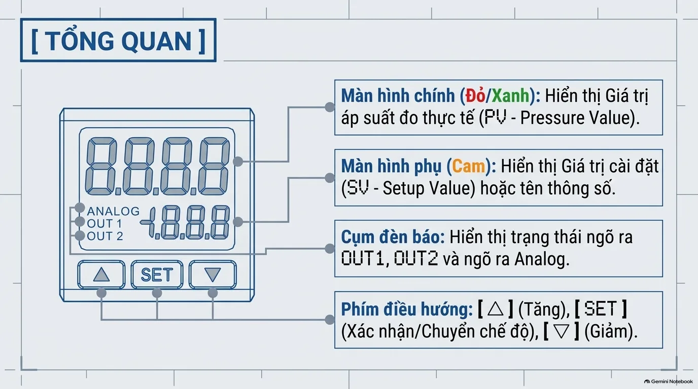

### Chi tiết các khu vực hiển thị & điều khiển:

1. **Màn hình chính (Đỏ/Xanh)**:
   - 4 chữ số LED 7 đoạn kích thước lớn.
   - Hiển thị giá trị áp suất đo thực tế thời gian thực (**PV** - *Process / Pressure Value*).
   - Có thể cấu hình đổi màu (Xanh sang Đỏ hoặc ngược lại) tùy theo trạng thái áp suất an toàn hay báo động.
2. **Màn hình phụ (Màu Cam)**:
   - 4 chữ số LED màu cam nằm ở góc dưới bên phải.
   - Hiển thị giá trị cài đặt ngưỡng (**SV** - *Setup Value*) hoặc tên thông số (Parameter Name) khi đang ở chế độ cài đặt.
3. **Cụm đèn LED chỉ báo trạng thái**:
   - `OUT 1`: Bật sáng khi ngõ ra transistor số 1 đang kích hoạt (ON).
   - `OUT 2`: Bật sáng khi ngõ ra transistor số 2 đang kích hoạt (ON).
   - `ANALOG`: Bật sáng chỉ báo model có hỗ trợ ngõ ra tương tự (tùy phiên bản $4 \div 20\text{ mA}$ hoặc $1 \div 5\text{ V}$).
4. **Cụm 3 phím chức năng**:
   - **`[ ▲ ]` (Tăng)**: Tăng giá trị thông số hoặc cuộn danh mục lên.
   - **`[ SET ]` (Cài đặt / Chuyển chế độ)**: Phím trung tâm dùng để xác nhận giá trị, chuyển thông số, hoặc giữ lâu để đổi chế độ làm việc.
   - **`[ ▼ ]` (Giảm)**: Giảm giá trị thông số hoặc cuộn danh mục xuống.

---

## 2. Cấu Trúc Menu & Bí Quyết Điều Hướng Chế Độ

Delta DPA phân chia cấu trúc vận hành thành **3 tầng chế độ** độc lập nhằm tránh việc kỹ thuật viên vô tình chỉnh nhầm các thông số cấu hình cốt lõi:

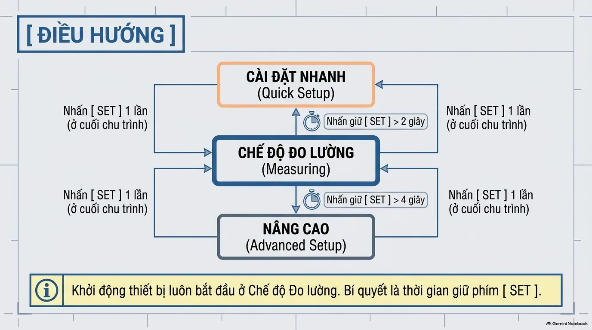

:::tip[Quy Tắc Vàng Khi Điều Hướng]
Khởi động thiết bị luôn bắt đầu ở **Chế độ Đo lường (Measuring Mode)**. Điểm mấu chốt để chuyển sang chế độ mong muốn chính là **thời gian giữ phím `[SET]`**:
* Giữ **$> 2$ giây**: Vào menu **Cài đặt nhanh (Quick Setup)**.
* Giữ **$> 4$ giây**: Vào menu **Nâng cao (Advanced Setup)**.
:::

### Quy trình 3 bước thao tác chỉnh sửa thông số:

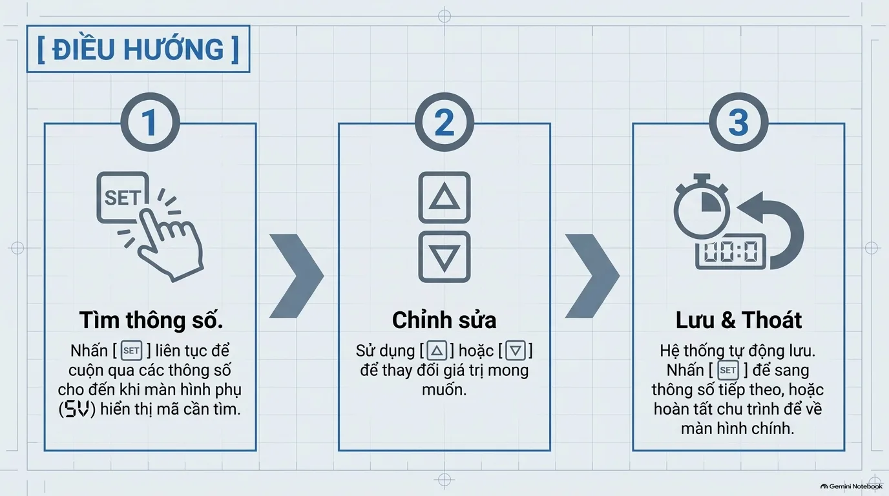

1. **Bước 1 - Tìm thông số**: Nhấn `[SET]` nhấp thả liên tục để cuộn qua các thông số cho đến khi màn hình phụ (SV màu cam) hiển thị đúng mã thông số cần sửa.
2. **Bước 2 - Chỉnh sửa**: Sử dụng phím `[ ▲ ]` hoặc `[ ▼ ]` để tăng/giảm giá trị theo yêu cầu kỹ thuật.
3. **Bước 3 - Lưu & Thoát**: Hệ thống tự động ghi nhớ giá trị mới. Tiếp tục nhấn `[SET]` để chuyển sang thông số kế tiếp, hoặc nhấn qua hết chu trình để thoát về màn hình đo lường chính.

---

## 3. Ba Thuật Toán Điều Khiển Ngõ Ra (Output Algorithms)

Ngõ ra transistor của Delta DPA hỗ trợ 3 thuật toán so sánh áp suất chuyên sâu phục vụ các bài toán công nghiệp khác nhau:

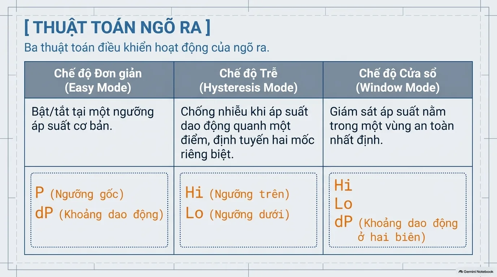

---

### A. Chế Độ Đơn Giản (Easy Mode)

Chế độ phù hợp cho các bài toán đóng ngắt cơ bản theo một điểm mốc áp suất.

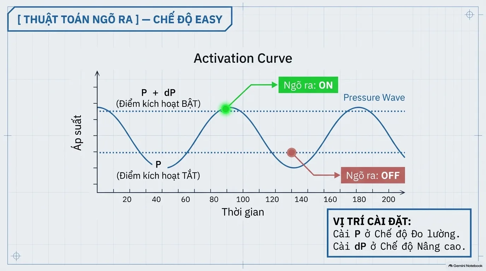

* **Nguyên lý**: Ngõ ra chuyển trạng thái tại ngưỡng áp suất gốc $P$ kết hợp một khoảng bù vi sai $dP$.
  * Áp suất vượt qua $P + dP$: Ngõ ra chuyển sang **ON**.
  * Áp suất giảm về dưới $P$: Ngõ ra chuyển sang **OFF**.
* **Vị trí cài đặt**:
  * Cài thông số $P$: Ngay tại **Chế độ Đo lường** (dùng phím `[▲] / [▼]`).
  * Cài độ lệch $dP$: Nằm trong menu **Chế độ Nâng cao**.

---

### B. Chế Độ Trễ (Hysteresis Mode)

Đây là chế độ **khuyên dùng nhiều nhất trong công nghiệp**, đặc biệt khi hệ thống khí nén hoặc bơm chân không có hiện tượng rung lắc áp suất (chập chờn ngõ ra).

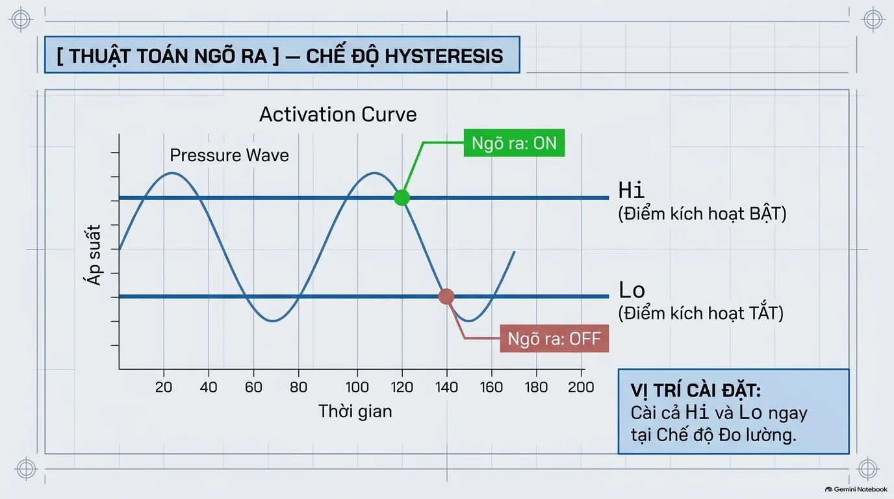

* **Nguyên lý**: Thiết lập 2 mốc áp suất tách biệt rõ ràng:
  * Điểm kích hoạt BẬT: Đặt tại ngưỡng cao $Hi$.
  * Điểm kích hoạt TẮT: Đặt tại ngưỡng thấp $Lo$.
  * Khoảng cách giữa $Hi$ và $Lo$ tạo thành dải trễ (Deadband), triệt tiêu hoàn toàn hiện tượng rung nhấp nháy contactor hoặc rơ-le khi áp suất dao động nhẹ quanh một ngưỡng.
* **Vị trí cài đặt**: Cài trực tiếp cả hai giá trị $Hi$ và $Lo$ ngay tại **Chế độ Đo lường**.

---

### C. Chế Độ Cửa Sổ (Window Mode)

Phù hợp cho các ứng dụng kiểm tra độ kín khí, đóng gói chân không, hoặc kiểm soát áp suất phòng sạch nằm trong khoảng tiêu chuẩn cho phép.

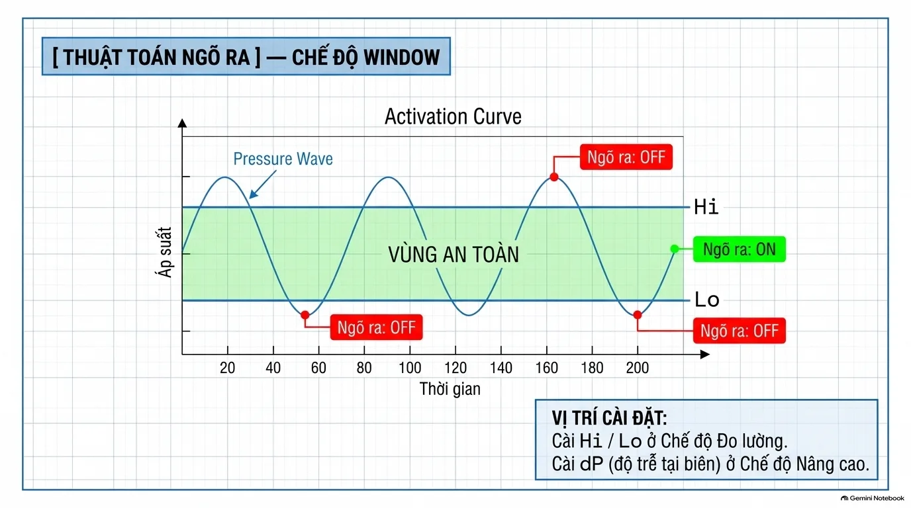

* **Nguyên lý**: Giám sát áp suất trong một "Vùng An Toàn" (Safe Zone):
  * Khi áp suất nằm **trong khoảng $[Lo, Hi]$**: Ngõ ra duy trì **ON**.
  * Khi áp suất vượt quá $Hi$ hoặc tụt xuống dưới $Lo$: Ngõ ra chuyển sang **OFF**.
  * Có thể cài thêm dải trễ biên $dP$ tại 2 biên trên/dưới để ngõ ra không bị ngắt tức thời do xung áp suất ngắn hạn.
* **Vị trí cài đặt**: Cài $Hi$ và $Lo$ tại **Chế độ Đo lường**; cài $dP$ (độ trễ tại biên) tại **Chế độ Nâng cao**.

---

## 4. Logic Ngõ Ra: Thường Mở (N.O.) & Thường Đóng (N.C.)

Tùy vào sơ đồ mạch điều khiển PLC (Sink/Source, kích mức 1 hay kích mức 0), kỹ thuật viên có thể đảo trạng thái logic của tiếp điểm ngõ ra:

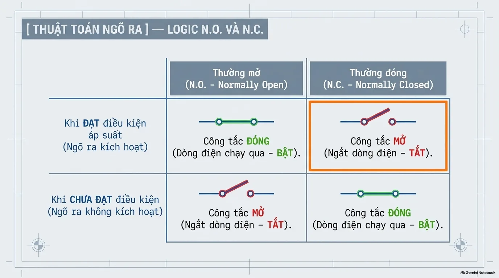

  | Logic Tiếp Điểm | Khi ĐẠT Điều Kiện Áp Suất | Khi CHƯA ĐẠT Điều Kiện Áp Suất | Ứng Dụng Điển Hình |
  | :--- | :--- | :--- | :--- |
  | **Thường Mở (N.O.)** | Công tắc **ĐÓNG** *(Có điện - BẬT)* | Công tắc **MỞ** *(Ngắt điện - TẮT)* | Báo áp suất đủ để chạy chu trình máy tiếp theo. |
  | **Thường Đóng (N.C.)** | Công tắc **MỞ** *(Ngắt điện - TẮT)* | Công tắc **ĐÓNG** *(Có điện - BẬT)* | Mạch bảo vệ an toàn (Fail-safe), ngắt khẩn cấp khi quá áp hoặc mất khí. |

---

## 5. Cài Đặt Nhanh: Đơn Vị Đo & Thời Gian Đáp Ứng

Để vào menu này, từ màn hình đo lường, nhấn giữ phím `[SET] > 2 giây`.

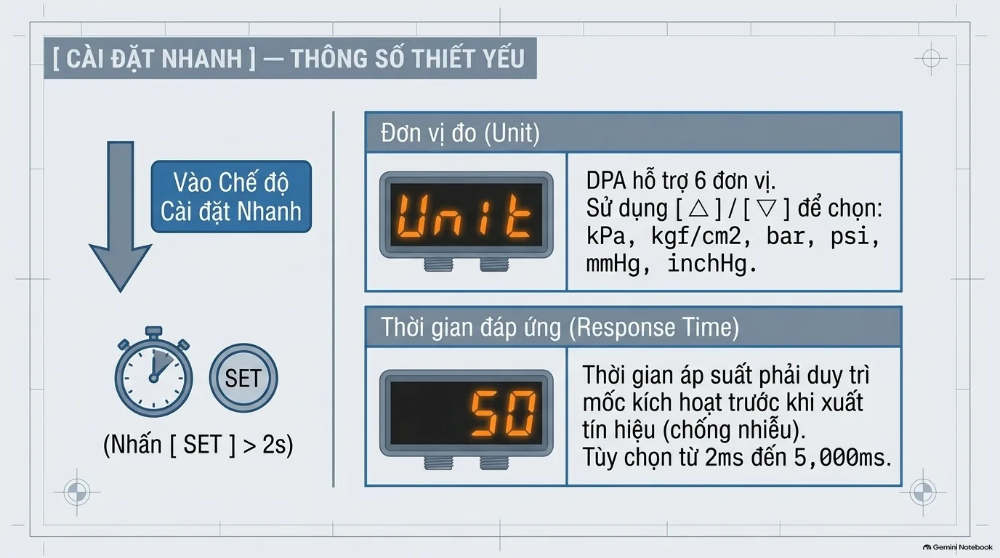

### 1. Lựa chọn Đơn vị đo (`Unit`):
Delta DPA hỗ trợ chuyển đổi linh hoạt qua lại giữa **6 đơn vị đo áp suất tiêu chuẩn quốc tế**. Dùng phím `[▲] / [▼]` để lựa chọn:
* `kPa`: Kilopascal (hệ SI phổ biến tại châu Á/châu Âu)
* `kgf/cm2`: Kilogram lực trên centimet vuông (chuẩn kỹ thuật truyền thống)
* `bar`: Bar (chuẩn thông dụng trong khí nén công nghiệp)
* `psi`: Pound per square inch (tiêu chuẩn Mỹ)
* `mmHg`: Milimet thủy ngân (chuyên dùng cho đo chân không - Vacuum)
* `inchHg`: Inch thủy ngân

### 2. Thời gian đáp ứng chống nhiễu (`Response Time`):
* Thời gian này quy định tín hiệu áp suất phải duy trì ổn định vượt ngưỡng trong bao lâu trước khi cảm biến chính thức xuất tín hiệu ra ngõ transistor.
* Dải điều chỉnh: từ **$2\text{ ms}$ đến $5,000\text{ ms}$** (màn hình hiển thị `2`, `5`, `10`, `20`, `50`, `100`... `5000`).
* Với hệ thống khí có xung dội (pressure spike), nâng thời gian đáp ứng lên $50 \div 100\text{ ms}$ sẽ loại bỏ hoàn toàn các báo động ảo.

---

## 6. Chuyển Đổi Màu Sắc LED Cảnh Báo Trực Quan

Delta DPA có khả năng đổi màu LED màn hình chính giữa **Xanh lục (Green)** và **Đỏ (Red)**, giúp người vận hành quan sát tình trạng áp suất từ xa mà không cần lại gần đọc số:

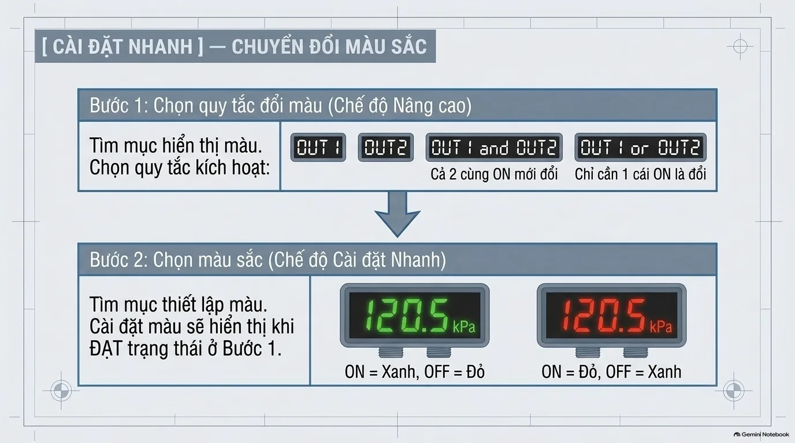

### Quy trình 2 bước thiết lập:
* **Bước 1 (Tại Chế độ Nâng cao)**: Chọn quy tắc kích hoạt đổi màu:
  * `OUT 1`: Đổi màu khi chỉ ngõ ra 1 kích hoạt.
  * `OUT 2`: Đổi màu khi chỉ ngõ ra 2 kích hoạt.
  * `OUT 1 and OUT 2`: Cả 2 ngõ ra cùng ON mới đổi màu.
  * `OUT 1 or OUT 2`: Chỉ cần 1 trong 2 ngõ ra ON là đổi màu ngay.
* **Bước 2 (Tại Chế độ Cài đặt Nhanh)**: Chọn màu hiển thị:
  * `ON = Xanh, OFF = Đỏ`: Áp suất bình thường màn hình Xanh, sự cố chuyển Đỏ.
  * `ON = Đỏ, OFF = Xanh`: Báo động khi đạt mốc kích hoạt.

---

## 7. Tiện Ích Thực Chiến Tại Xưởng

---

### A. Khóa Bàn Phím Bảo Vệ (Key Lock)

Ngăn ngừa công nhân hoặc người không có phận sự bấm nhầm làm thay đổi thông số hệ thống.

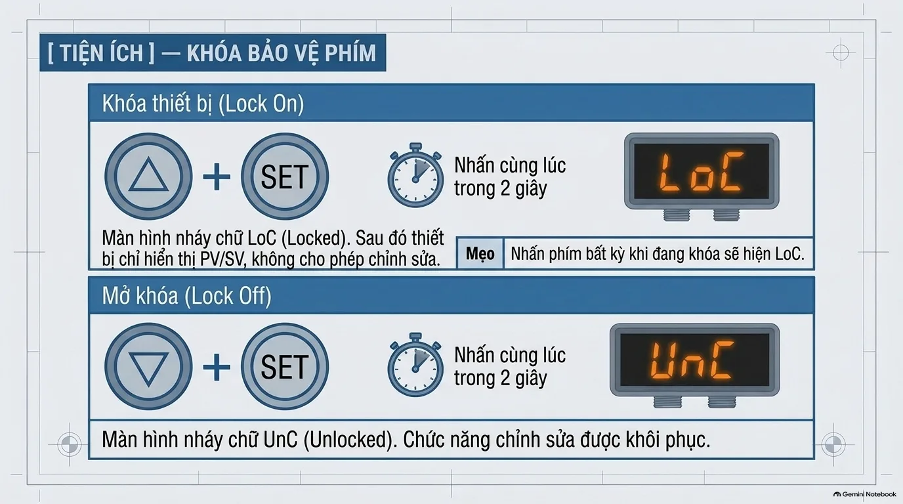

* **Khóa bàn phím (`Lock On`)**:
  * Nhấn giữ đồng thời hai phím **`[ ▲ ] + [ SET ]` trong 2 giây**.
  * Màn hình phụ nháy sáng chữ **`LoC`** (*Locked*).
  * Kể từ lúc này, thiết bị chỉ hiển thị giá trị PV/SV, mọi phím bấm đều bị khóa. Nhấn bất kỳ phím nào màn hình sẽ nháy cảnh báo `LoC`.
* **Mở khóa bàn phím (`Lock Off`)**:
  * Nhấn giữ đồng thời hai phím **`[ ▼ ] + [ SET ]` trong 2 giây**.
  * Màn hình phụ nháy sáng chữ **`UnC`** (*Unlocked*). Bàn phím được mở khóa hoàn toàn.

---

### B. Sao Chép Thông Số Master - Slave (Parameter Copy)

Khi lắp đặt tủ điện có hàng chục cảm biến Delta DPA có cùng thông số làm việc, tính năng **Copy trực tiếp qua dây dẫn** giúp tiết kiệm hàng giờ cài đặt thủ công.

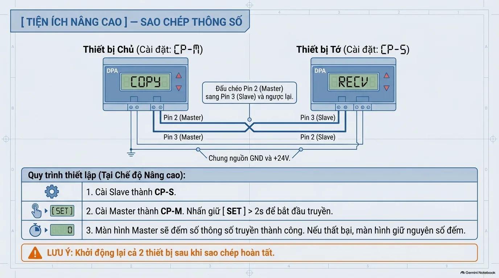

* **Sơ đồ đấu dây truyền thông**:
  * Cấp chung nguồn $+24\text{V (DC)}$ và chân $0\text{V (GND)}$ cho cả 2 thiết bị.
  * **Đấu chéo chân tín hiệu**:
    * Chân **Pin 2 (Master)** nối vào **Pin 3 (Slave)**.
    * Chân **Pin 3 (Master)** nối vào **Pin 2 (Slave)**.
* **Quy trình thực hiện**:
  1. Vào *Chế độ Nâng cao* của máy nhận (Slave), chọn thông số copy thành **`CP-S`** (*Copy Slave* - màn hình hiện `RECV`).
  2. Vào *Chế độ Nâng cao* của máy phát (Master), chọn thông số copy thành **`CP-M`** (*Copy Master* - màn hình hiện `COPY`). Nhấn giữ `[SET] > 2s` để bắt đầu truyền dữ liệu.
  3. Màn hình Master sẽ đếm số lượng thông số truyền thành công.
  4. Khởi động lại nguồn cả 2 thiết bị sau khi sao chép hoàn tất.

---

### C. Khôi Phục Cài Đặt Gốc Nhà Máy (Factory Reset)

Khi cảm biến hoạt động không như ý muốn hoặc bị cài đặt sai lệch quá nhiều thông số, đưa về trạng thái nguyên bản nhà máy là phương án nhanh nhất:

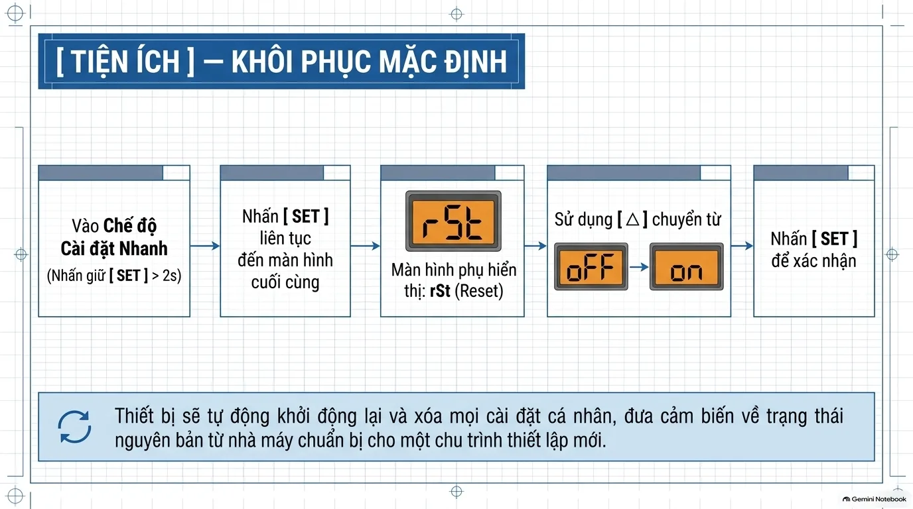

1. Từ màn hình đo lường, nhấn giữ phím `[SET] > 2s` để vào *Chế độ Cài Đặt Nhanh*.
2. Nhấn phím `[SET]` liên tục qua các menu cho đến màn hình cuối cùng hiển thị chữ **`rSt`** (*Reset*).
3. Sử dụng phím `[ ▲ ]` để chuyển trạng thái từ **`oFF`** sang **`on`**.
4. Nhấn `[SET]` để xác nhận. Cảm biến sẽ tự khởi động lại và tải toàn bộ cấu hình gốc của nhà sản xuất.

---

## 8. Tổng Kết & Tải Tài Liệu Bản In

Cảm biến áp suất **Delta DPA Series** kết hợp hoàn hảo giữa thiết kế cơ khí gọn nhẹ, giao diện hiển thị 2 màu trực quan và các tính năng chống nhiễu chuyên sâu. Việc nắm vững cấu trúc điều hướng thời gian giữ phím `[SET]` cùng 3 thuật toán kích hoạt $P$, $Hi/Lo$, $Window$ sẽ giúp kỹ sư tự động hóa tối ưu hóa độ tin cậy của toàn bộ hệ thống khí nén.

<DownloadBox
  headerTitle="Tải Trọn Bộ Tài Liệu Delta DPA"
  headerDescription="Tài liệu Gehihi có thể đưa ra không chính xác, nên hãy xác minh kỹ:"
  items={[
    {
      title: "Sổ Tay Cài Đặt Nhanh Delta DPA (Bản In PDF)",
      description: "Lưu trữ file PDF bản gốc (14 trang màu) để tra cứu nhanh khi bảo trì tại nhà máy",
      size: "12.2 MB",
      type: "pdf",
      url: "https://drive.google.com/file/d/1kJr35VOwIuvJWKo9LIqUEQdDyDvCUPjE/view?usp=sharing",
      buttonText: "Tải file PDF",
    },
  ]}
/>

