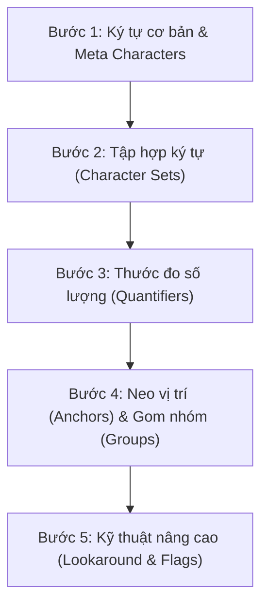

**Regex (Regular Expression)** hay *Biểu thức chính quy* thường được xem là "mật mã ma thuật" trong thế giới lập trình. Một chuỗi Regex như `^[a-zA-Z0-9._%+-]+@[a-zA-Z0-9.-]+\.[a-zA-Z]{2,}$` có thể khiến bất kỳ ai mới bắt đầu cảm thấy hoang mang. 

Tuy nhiên, khi đã nắm vững nguyên lý đọc hiểu và lộ trình luyện tập đúng đắn, Regex sẽ trở thành một **siêu công cụ** giúp bạn tìm kiếm, bóc tách và kiểm tra dữ liệu chuỗi (String Validation & Parsing) chỉ trong vài dòng code thay vì phải viết hàng chục vòng lặp phức tạp.

Bài viết này sẽ chia sẻ bí quyết tư duy "bóc tách" Regex và lộ trình 5 bước học Regex từ cơ bản đến nâng cao hiệu quả nhất.

{/* truncate */}

---

## 1. Tư duy cốt lõi: Làm sao để đọc hiểu một đoạn Regex?
Lỗi lớn nhất của người mới học Regex là **cố gắng đọc toàn bộ biểu thức cùng một lúc**. 

Regex thực chất được cấu tạo từ các **khối mã nhỏ (Tokens)** ghép nối lại với nhau theo thứ tự từ trái sang phải. 

### Quy tắc "Chẻ nhỏ chuỗi" (Token-by-Token Parsing)
Khi gặp một đoạn Regex dài, hãy chia nhỏ nó thành 4 câu hỏi cơ bản:
1. **Neo ở đâu?** (Bắt đầu `^` hay Kết thúc `$`)
2. **Tìm cái gì?** (Chữ cái, chữ số, hay khoảng trắng? `\d`, `\w`, `[a-z]`)
3. **Lặp lại bao nhiêu lần?** (Xuất hiện 1 lần, nhiều lần hay tùy chọn? `*`, `+`, `{m,n}`)
4. **Có gom nhóm hay điều kiện gì không?** (Nhóm `(...)` hay phủ định `[^...]`)

---

## 2. Lộ trình 5 bước chinh phục Regex từ Zero đến Master

###  Bước 1: Làm quen với Ký tự cơ bản & Meta Characters
Ký tự trong Regex chia làm 2 loại:
* **Ký tự thường (Literal)**: Tìm chính xác ký tự đó (Ví dụ: `abc` sẽ khớp đúng chuỗi "abc").
* **Ký tự đặc biệt (Meta Characters)**: Có ý nghĩa đại diện đặc biệt.

| Ký tự | Ý nghĩa | Ví dụ khớp |
| :--- | :--- | :--- |
| `.` | Đại diện cho **bất kỳ ký tự nào** (trừ xuống dòng) | `a.c` khớp với "abc", "a1c", "a#c" |
| `\d` | Chữ số (`0-9`) | `\d\d` khớp với "23", "09" |
| `\D` | Không phải chữ số | `\D` khớp với "a", "@" |
| `\w` | Chữ cái, chữ số và dấu gạch dưới `_` | `\w+` khớp với "user_123" |
| `\W` | Ký tự đặc biệt (không phải word) | `\W` khớp với "!", "@", "#" |
| `\s` | Khoảng trắng (Space, Tab, Enter) | `\s` khớp với " " |
| `\S` | Không phải khoảng trắng | `\S+` khớp với "Hello" |

---

###  Bước 2: Tập hợp ký tự (Character Sets `[...]`)
Khi bạn muốn cho phép chọn 1 trong nhiều ký tự tại một vị trí:

* `[aeiou]`: Khớp với 1 nguyên âm bất kỳ ('a', 'e', 'i', 'o', 'u').
* `[a-z]`: Khớp với 1 chữ cái viết thường từ a đến z.
* `[A-Z0-9]`: Khớp với 1 chữ cái viết hoa hoặc 1 chữ số.
* `[^0-9]`: Dấu `^` bên trong ngoặc vuông nghĩa là **Phủ định** (KHÔNG phải là chữ số).

---

###  Bước 3: Thước đo số lượng (Quantifiers)
Quantifier xác định ký tự/nhóm đứng trước nó được lặp lại bao nhiêu lần.

| Ký hiệu | Số lần lặp | Giải thích |
| :--- | :--- | :--- |
| `*` | 0 hoặc nhiều lần (`>= 0`) | Có thể không có hoặc có rất nhiều |
| `+` | 1 hoặc nhiều lần (`>= 1`) | Bắt buộc phải có ít nhất 1 lần |
| `?` | 0 hoặc 1 lần (`0 hoặc 1`) | Thành phần tùy chọn (Optional) |
| `{n}` | Đúng `n` lần | `\d{4}` khớp với đúng 4 chữ số (ví dụ: 2026) |
| `{n,}` | Tối thiểu `n` lần | `\d{2,}` khớp với 2 chữ số trở lên |
| `{n,m}` | Từ `n` đến `m` lần | `\d{2,4}` khớp với 2, 3 hoặc 4 chữ số |

>  **Lưu ý quan trọng (Greedy vs Lazy):**
> * Mặc định Quantifiers là **Greedy** (tham ăn - cố bắt chuỗi dài nhất có thể).
> * Thêm dấu `?` sau Quantifier (ví dụ `*?` hoặc `+?`) sẽ chuyển thành **Lazy** (cố bắt chuỗi ngắn nhất khớp điều kiện).

---

###  Bước 4: Neo vị trí (Anchors) & Gom nhóm (Capturing Groups)

#### 1. Neo vị trí (Anchors)
Anchors không đại diện cho ký tự nào, mà dùng để **khóa vị trí**:
* `^`: Bắt đầu chuỗi (hoặc dòng).
* `$`: Kết thúc chuỗi (hoặc dòng).
* `\b`: Ranh giới của một từ (Word boundary).

#### 2. Gom nhóm `(...)`
* Dấu ngoặc đơn `(abc)` gom các ký tự thành 1 nhóm để áp dụng Quantifier hoặc bắt giá trị (Capture Group).
* `(?:abc)`: Nhóm không bắt giá trị (Non-capturing group - giúp tối ưu hiệu năng).

---

###  Bước 5: Kỹ thuật nâng cao (Lookaround & Flags)

#### Lookaround (Nhìn trước / Nhìn sau)
Lookaround giúp kiểm tra điều kiện xung quanh mà không tính ký tự đó vào kết quả khớp (Zero-width assertions):

* `(?=pattern)` - **Positive Lookahead**: Đứng trước pattern này. (Ví dụ: `\d+(?=px)` khớp số đứng trước "px").
* `(?!pattern)` - **Negative Lookahead**: KHÔNG đứng trước pattern này.
* `(?<=pattern)` - **Positive Lookbehind**: Đứng sau pattern này. (Ví dụ: `(?<=\$)\d+` khớp số đứng sau dấu `$`).
* `(?<!pattern)` - **Negative Lookbehind**: KHÔNG đứng sau pattern này.

#### Cờ hiệu (Flags) phổ biến
* `g` (Global): Tìm tất cả các kết quả khớp chứ không dừng lại ở kết quả đầu tiên.
* `i` (Ignore Case): Không phân biệt chữ hoa / chữ thường.
* `m` (Multiline): Xử lý `^` và `$` trên từng dòng của văn bản nhiều dòng.

---

## 3. Thực hành phân tích 3 mẫu Regex thực tế từng bước

### Ví dụ 1: Regex kiểm tra Số điện thoại Việt Nam
Đoạn Regex: `^(?:0|\+84)(?:3|5|7|8|9)\d{8}$`

Phân tích từng Token từ trái qua phải:
1. `^`: Bắt đầu chuỗi.
2. `(?:0|\+84)`: Nhóm đầu số, chấp nhận bắt đầu bằng `0` HOẶC `+84`.
3. `(?:3|5|7|8|9)`: Nhóm mạng viễn thông, theo sau bởi 1 trong các số `3, 5, 7, 8, 9`.
4. `\d{8}`: Đúng 8 chữ số tiếp theo.
5. `$`: Kết thúc chuỗi.

 Kết quả: Khớp chính xác với "0912345678" hoặc "+84912345678".

---

### Ví dụ 2: Regex kiểm tra Địa chỉ Email chuẩn
Đoạn Regex: `^[a-zA-Z0-9._%+-]+@[a-zA-Z0-9.-]+\.[a-zA-Z]{2,}$`

Phân tích:
1. `^`: Bắt đầu.
2. `[a-zA-Z0-9._%+-]+`: Tên tài khoản email (chứa chữ, số, dấu chấm, gạch dưới...), xuất hiện 1 hoặc nhiều lần.
3. `@`: Ký tự `@` bắt buộc.
4. `[a-zA-Z0-9.-]+`: Tên miền (Domain name - ví dụ `gmail`, `yahoo`, `shareme`).
5. `\.`: Dấu chấm `.` phân cách tên miền (cần dấu `\` để thoát ký tự đặc biệt).
6. `[a-zA-Z]{2,}`: Tên miền cao cấp (TLD - ví dụ `com`, `vn`, `io`), tối thiểu 2 chữ cái.
7. `$`: Kết thúc chuỗi.

---

### Ví dụ 3: Regex bắt địa chỉ IP (IPv4)
Đoạn Regex: `^(?:(?:25[0-5]|2[0-4][0-9]|[01]?[0-9][0-9]?)\.){3}(?:25[0-5]|2[0-4][0-9]|[01]?[0-9][0-9]?)$`

Giải thích logic:
* Một octet của IP từ `0` đến `255` được chia làm 3 trường hợp:
  * `25[0-5]`: Từ 250 đến 255.
  * `2[0-4][0-9]`: Từ 200 đến 249.
  * `[01]?[0-9][0-9]?`: Từ 0 đến 199.
* `\.{3}`: Lặp lại 3 octet đầu kèm dấu chấm.

---

## 4. Công cụ & Website luyện tập Regex tốt nhất

Để học Regex nhanh nhất, bạn **không nên học thuộc lòng** mà hãy vừa học vừa thử nghiệm trực tiếp trên các công cụ trực quan:

1. **[Regex101.com](https://regex101.com/)**: Trang web "gối đầu giường" của mọi lập trình viên. Có trình giải thích từng Token bằng tiếng Anh cực chi tiết và tính năng Debugger.
2. **[RegexOne.com](https://regexone.com/)**: Trang web học Regex tương tác theo từng bài tập nhỏ từ dễ đến khó.
3. **[Regex Crossword](https://regexcrossword.com/)**: Trò chơi giải đố Sudoku dựa trên các luật Regex, cực kỳ giải trí và rèn tư duy phản xạ.

---

##  Lời kết

Regex không khó như bạn nghĩ, điều quan trọng là **rèn luyện tư duy chia nhỏ vấn đề**. Khi viết một đoạn Regex phức tạp trong dự án thực tế, hãy luôn nhớ:

>  **Quy tắc vàng**: Đừng quên thêm comment hoặc viết Unit Test giải thích đoạn Regex đó làm gì để đồng nghiệp (và chính bạn sau 6 tháng nữa) không phải "đau đầu" luận lại!

Chúc bạn sớm làm chủ Regex và áp dụng hiệu quả vào công việc lập trình & xử lý dữ liệu hàng ngày!
