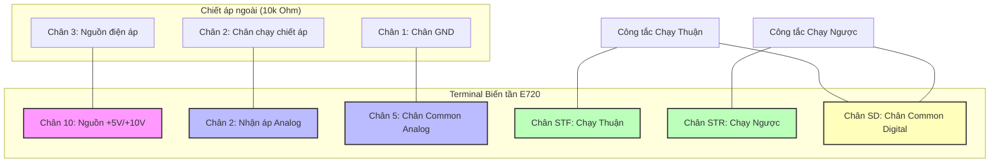
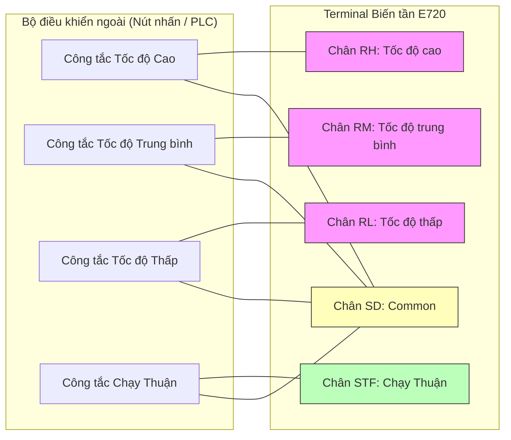

Tài liệu tổng hợp chi tiết các mã lệnh và dải cài đặt tham số của dòng biến tần **Mitsubishi FR-E720** (FR-E700 Series). Dưới đây là bảng tra cứu nhanh kèm giải thích chi tiết dải giá trị để thuận tiện cho quá trình cấu hình và vận hành thực tế.

---

## 1. Nhóm lệnh cơ bản và chế độ vận hành

| Mã lệnh | Tên thông số / Chức năng | Dải cài đặt | Mặc định |
| --- | --- | --- | --- |
| **ALLC** | All Parameter Clear (Khôi phục toàn bộ cài đặt gốc) | `0`, `1` | 0 |
| **Pr.79** | Operation mode selection (Lựa chọn chế độ vận hành PU/EXT) | `0` - `8` | 0 |
| **Pr.77** | Parameter write selection (Quyền khóa/cho phép ghi tham số) | `0`, `1`, `2` | 0 |
| **Pr.75** | Reset/PU stop selection (Lựa chọn lệnh Reset và nút Dừng PU) | `0` - `17` | 14 |
| **Pr.145** | PU display language (Ngôn ngữ hiển thị trên màn hình) | `0` - `7` | Tùy vùng |

### ALLC (Khôi phục cài đặt gốc)
    *   `0`: Không thực hiện.
    *   `1`: Khôi phục tất cả tham số về mặc định của nhà sản xuất (ngoại trừ các tham số được hiệu chuẩn đặc biệt hoặc lịch sử lỗi).
### Pr.79 (Chế độ vận hành) 
**Quyết định nơi biến tần nhận lệnh chạy (Start) và lệnh tần số (Speed).**
    *   `0`: Chế độ chuyển đổi PU/External (mặc định). Cho phép bấm phím **PU/EXT** trên bàn phím để chuyển đổi qua lại. Khi mới bật nguồn, biến tần sẽ tự động ở chế độ External.
    *   `1`: Cố định chế độ **PU** (điều khiển trực tiếp bằng phím RUN/STOP và núm xoay trên bàn phím biến tần).
    *   `2`: Cố định chế độ **External** (điều khiển bằng công tắc ngoài nối vào chân STF/STR và chiết áp ngoài nối vào chân 2/4).
    *   `3`: Kết hợp 1 (Tần số chỉnh bằng bàn phím PU; Lệnh chạy STF/STR kích hoạt từ công tắc ngoài).
    *   `4`: Kết hợp 2 (Tần số nhận từ chiết áp ngoài/tín hiệu analog; Lệnh chạy nhấn bằng phím RUN/STOP trên bàn phím PU).
    *   `6`: Chế độ chuyển đổi khi đang chạy (Switchover). Cho phép thay đổi linh hoạt chế độ vận hành PU ↔ External ↔ Network mà không cần dừng động cơ.
    *   `7`: Chế độ khóa PU (PU Operation Interlock). Khóa quyền điều khiển PU thông qua một chân input vật lý (MRS).
    *   `8`: Chế độ kết hợp JOG (Chạy nhấp). Cho phép kết hợp chạy nhấp PU và điều khiển External.
### Pr.77 (Quyền ghi tham số)
    *   `0`: Chỉ cho phép sửa tham số khi động cơ đã dừng hẳn và biến tần ở chế độ PU.
    *   `1`: Khóa ghi tham số. Không cho phép thay đổi bất kỳ tham số nào (ngoại trừ chính tham số [Pr.77](#pr77) và [Pr.79](#pr79)) nhằm tránh việc thay đổi ngoài ý muốn trong quá trình vận hành.
    *   `2`: Cho phép ghi và thay đổi tham số ngay cả khi động cơ đang chạy.
### Pr.75 (Lệnh Reset & nút STOP) 
**Cấu hình bảo vệ khi mất kết nối màn hình và quy định hoạt động nút STOP khẩn cấp.**
    *   **Reset Selection:** 
        *   Mã chẵn (`0`, `2`, `14`, `16`): Chân RES luôn hoạt động (Reset biến tần bất kỳ lúc nào).
        *   Mã lẻ (`1`, `3`, `15`, `17`): Chân RES chỉ có tác dụng khi biến tần đang báo lỗi (Trip).
    *   **Disconnected PU Detection (Phát hiện mất kết nối màn hình):**
        *   `0`, `1`, `14`, `15`: Cho phép tiếp tục chạy bình thường nếu mất kết nối màn hình PU.
        *   `2`, `3`, `16`, `17`: Biến tần sẽ ngắt ngõ ra ngay lập tức và báo lỗi `E.PU` nếu mất kết nối màn hình.
    *   **PU Stop Selection (Nút STOP trên bàn phím):**
        *   `0`, `1`, `2`, `3`: Nút STOP trên bàn phím biến tần chỉ có tác dụng dừng động cơ khi biến tần đang chạy ở chế độ PU.
        *   `14`, `15`, `16`, `17` (Mặc định là **14**): Nút STOP luôn có tác dụng dừng động cơ trong mọi chế độ chạy (PU, External, Network). *Khuyên dùng để đảm bảo an toàn.*
*   **Pr.145 (Ngôn ngữ hiển thị):**
    *   `0`: Tiếng Nhật (Japanese) | `1`: Tiếng Anh (English) | `2`: Tiếng Đức (German) | `3`: Tiếng Pháp (French) | `4`: Tiếng Tây Ban Nha (Spanish) | `5`: Tiếng Ý (Italian) | `6`: Tiếng Thụy Điển (Swedish) | `7`: Tiếng Phần Lan (Finnish).

---

## 2. Nhóm lệnh giới hạn tần số và đa cấp tốc độ

| Mã lệnh | Tên thông số / Chức năng | Dải cài đặt | Mặc định |
| --- | --- | --- | --- |
| **Pr.1** | Maximum Frequency (Tần số hoạt động tối đa) | `0` - `120` Hz | 120 Hz |
| **Pr.2** | Minimum Frequency (Tần số hoạt động tối thiểu) | `0` - `120` Hz | 0 Hz |
| **Pr.3** | Base Frequency (Tần số cơ bản của động cơ) | `0` - `400` Hz | 50/60 Hz |
| **Pr.4** | Multi-speed setting (Tốc độ cao - kích hoạt qua chân RH) | `0` - `400` Hz | 50/60 Hz |
| **Pr.5** | Multi-speed setting (Tốc độ trung bình - qua chân RM) | `0` - `400` Hz | 30 Hz |
| **Pr.6** | Multi-speed setting (Tốc độ thấp - qua chân RL) | `0` - `400` Hz | 10 Hz |
| **Pr.24-27** | Multi-speed setting (Tốc độ đa cấp mở rộng cấp 4 đến 7) | `0` - `400` Hz, `9999` | 9999 |
| **Pr.125** | Terminal 2 frequency setting gain (Tần số tối đa khi dùng chiết áp) | `0` - `400` Hz | 50/60 Hz |

### Pr.1 & Pr.2 (Giới hạn tần số)
Thiết lập ngưỡng tần số tối đa và tối thiểu để bảo vệ cơ cấu chấp hành. Ví dụ, nếu chiết áp ngoài vặn kịch kim mà tần số chỉ đạt tối đa là 50Hz, thì [Pr.1](#pr1) chính là giới hạn trên.
### Pr.24 - Pr.27 (Tốc độ mở rộng)
Các cấp tốc độ từ 4 đến 7 được kích hoạt bằng cách kết hợp đồng thời các chân đầu vào (ví dụ: RH + RM, RM + RL, v.v.). Giá trị mặc định là `9999` nghĩa là chức năng cấp tốc độ tương ứng chưa được kích hoạt.
### Pr.125 (Gain chân số 2)
Định cấu hình tần số tương ứng với mức điện áp Analog tối đa ở chân đầu vào số 2 (Ví dụ: mặc định điện áp 5V hoặc 10V tương ứng với tần số 50Hz hoặc 60Hz. Ta có thể tăng thông số này lên 80Hz để khi chiết áp đạt tối đa, tần số ngõ ra sẽ đạt 80Hz).

---

## 3. Nhóm lệnh động lực học, tăng/giảm tốc và bảo vệ

| Mã lệnh | Tên thông số / Chức năng | Dải cài đặt | Mặc định |
| --- | --- | --- | --- |
| **Pr.0** | Torque Boost (Tăng cường mô-men xoắn khởi động) | `0` - `30` % | Tùy công suất |
| **Pr.7** | Acceleration Time (Thời gian tăng tốc lên tần số định mức) | `0` - `3600` s | 5s / 10s |
| **Pr.8** | Deceleration Time (Thời gian giảm tốc về 0 Hz) | `0` - `3600` s | 5s / 10s |
| **Pr.9** | Electronic thermal O/L relay (Dòng bảo vệ quá tải nhiệt động cơ) | `0` - `500` A | Dòng định mức |
| **Pr.14** | Load pattern selection (Lựa chọn đường cong đặc tuyến V/F) | `0`, `1`, `2`, `3` | 0 |
| **Pr.22** | Stall prevention operation level (Mức dòng điện chống sụt tốc) | `0` - `200` % | 150% |
| **Pr.156** | Stall prevention operation selection (Cấu hình hành vi khi chống trượt) | `0` - `101` | 0 |
| **Pr.261** | Power-failure stop (Xử lý khi mất điện chớp nhoáng) | `0` - `12` | 0 |
| **Pr.882-886** | Regenerative avoidance (Tránh lỗi quá áp do năng lượng tái sinh) | Đa dạng | 9999 |

### Pr.14 (Đặc tuyến tải V/F)
**Phù hợp với tính chất cơ học của tải thực tế.**
    *   `0`: Tải mô-men không đổi (Constant torque load). Thích hợp cho băng tải, cẩu trục, máy nén, thang nâng... Biến tần giữ tỉ lệ điện áp và tần số (V/f) tuyến tính không đổi.
    *   `1`: Tải mô-men biến thiên (Variable torque load). Thích hợp cho quạt gió, bơm ly tâm... Tỉ lệ điện áp giảm ở tần số thấp để tiết kiệm điện năng do lực cản tải không lớn ở tốc độ thấp.
    *   `2`: Tải nâng hạ (Elevator load) - Chiều chạy thuận (Forward) được bù áp tăng cường (boost) để thắng lực cản trọng trường khi khởi động nâng.
    *   `3`: Tải nâng hạ (Elevator load) - Chiều chạy ngược (Reverse) được tăng cường mô-men xoắn.

---

## 4. Nhóm lệnh cấu hình động cơ (Vector Control / Auto-Tuning)

| Mã lệnh | Tên thông số / Chức năng | Dải cài đặt | Mặc định |
| --- | --- | --- | --- |
| **Pr.71** | Applied motor (Lựa chọn loại động cơ) | `0`, `1`, `3`, `13`, `40`, `50`... | 0 |
| **Pr.72** | PWM frequency selection (Tần số băm xung sóng mang - Carrier Frequency) | `0` - `15` | Tùy công suất |
| **Pr.80** | Motor capacity (Công suất động cơ - dùng cho Auto-Tuning) | `0.1` - `15` kW | 9999 |
| **Pr.81** | Number of motor poles (Số cực của động cơ) | `2`, `4`, `6`, `8`, `10` | 9999 |
| **Pr.83** | Rated motor voltage (Điện áp định mức của động cơ) | `0` - `1000` V | 200V / 400V |
| **Pr.84** | Rated motor frequency (Tần số định mức của động cơ) | `10` - `400` Hz | 50/60 Hz |

### Pr.71 (Loại động cơ sử dụng)
**Thiết lập bảo vệ nhiệt và hỗ trợ đo thông số động cơ (Auto-Tuning).**
    *   `0`: Động cơ tiêu chuẩn 3 pha không đồng bộ thông thường (ví dụ dòng Mitsubishi SF-JR).
    *   `1`: Động cơ chuyên dụng cho biến tần (Động cơ tải mô-men xoắn không đổi - Constant-torque motor, tích hợp quạt cưỡng bức độc lập để làm mát khi chạy ở tần số thấp, ví dụ dòng Mitsubishi SF-JRCA).
    *   `3`: Động cơ tiêu chuẩn và kích hoạt chế độ **Offline Auto-Tuning** (Biến tần tự động đo điện trở cuộn dây, tự cảm... khi chạy Tuning).
    *   `13`: Động cơ mô-men không đổi và kích hoạt chế độ **Offline Auto-Tuning**.
    *   `40`: Động cơ Mitsubishi hiệu suất cao (Dòng SF-HR).
    *   `50`: Động cơ Mitsubishi hiệu suất cao tải mô-men không đổi (Dòng SF-HRCA).
*   **Pr.72 (Tần số sóng mang):** Cài đặt từ `0` đến `15` (tương đương tần số băm xung từ 0.7kHz đến 14.5kHz).
    *   *Giá trị thấp:* Động cơ phát tiếng kêu o o lớn khi chạy, nhưng biến tần tỏa nhiệt ít hơn, giảm nhiễu dòng rò và nhiễu sóng điện từ (EMI).
    *   *Giá trị cao:* Động cơ chạy cực êm không tiếng ồn, nhưng biến tần sinh nhiệt nhiều hơn (có thể phải giảm công suất tải nếu chạy lâu) và tăng nhiễu dòng rò.

---

## 5. Nhóm lệnh cấu hình Terminal I/O và PID nâng cao

| Mã lệnh | Tên thông số / Chức năng | Dải cài đặt | Mặc định |
| --- | --- | --- | --- |
| **Pr.54** | FM terminal function selection (Gán chức năng ngõ ra xung FM) | `1` - `21` | 1 |
| **Pr.73** | Analog input selection (Cấu hình loại ngõ vào Analog - 0-5V/0-10V) | `0` - `17` | 1 |
| **Pr.128** | PID action selection (Kích hoạt bộ điều khiển PID thuận/nghịch) | `0`, `10`, `11`, `20`, `21` | 0 |
| **Pr.129-134** | Nhóm tham số điều chỉnh độ lợi Kp, Ki, Kd của bộ PID | Đa dạng | Đa dạng |
| **Pr.178-182** | Input terminal function (Lập trình chức năng chân STF, STR, RL...) | `0` - `9999` | Theo từng chân |
| **Pr.190-192** | Output terminal function (Gán chức năng cảnh báo ngõ ra Relay) | `0` - `9999` | Theo từng chân |
| **Pr.244** | Cooling fan operation (Điều khiển quạt tản nhiệt của biến tần) | `0`, `1`, `101` | 1 |
| **Pr.267** | Terminal 4 input selection (Cấu hình ngõ vào cho Terminal số 4) | `0`, `1`, `2` | 0 |

### Pr.128 (Lựa chọn chế độ PID)
    *   `0`: Không sử dụng điều khiển PID.
    *   `10`: Điều khiển **PID nghịch (Reverse Action)**. Tốc độ động cơ tăng khi sai số dương (Ví dụ: Hệ thống cấp nước ổn định áp suất - Áp suất thực tế thấp hơn áp suất đặt → Động cơ tăng tốc bơm để bù áp).
    *   `11`: Điều khiển **PID thuận (Forward Action)**. Tốc độ động cơ tăng khi sai số âm (Ví dụ: Hệ thống thông gió làm mát - Nhiệt độ phòng cao hơn nhiệt độ đặt → Động cơ tăng tốc quạt để làm mát).
    *   `20`: PID nghịch có ngưng đầu ra khi đạt giới hạn sai lệch thấp (giúp đưa biến tần vào chế độ ngủ - Sleep mode khi hệ thống không dùng nước).
    *   `21`: PID thuận có ngưng đầu ra khi đạt giới hạn sai lệch.
### Pr.178 - Pr.182 (Lập trình chức năng chân ngõ vào số - Digital Inputs)
**Gán chức năng cho các chân đầu vào điều khiển cơ vật lý (STF, STR, RL, RM, RH).**
    *   `0`: RL (Chạy đa cấp tốc độ - Tốc độ thấp)
    *   `1`: RM (Chạy đa cấp tốc độ - Tốc độ trung bình)
    *   `2`: RH (Chạy đa cấp tốc độ - Tốc độ cao)
    *   `3`: RT (Thời gian tăng giảm tốc thứ 2)
    *   `4`: AU (Kích hoạt ngõ vào Terminal số 4)
    *   `8`: JOG (Chọn chế độ chạy nhấp Jog)
    *   `14`: MRS (Ngắt ngõ ra biến tần tức thời để bảo vệ cơ cấu khẩn cấp)
    *   `16`: EXT (Chọn chế độ vận hành ngoài External)
    *   `60`: STF (Chạy thuận) | `61`: STR (Chạy ngược) | `62`: RES (Reset lỗi biến tần)
    *   `9999`: Không sử dụng chân này.
### Pr.190 - Pr.192 (Lập trình chức năng chân ngõ ra số - Digital/Relay Outputs)
**Gán chức năng kích hoạt rơ-le hoặc cổng transistor quang đầu ra (ví dụ RUN, FU, A-B-C).**
    *   `0`: RUN (Tín hiệu báo biến tần đang hoạt động/phát tần số).
    *   `1`: SU (Tín hiệu báo tần số thực đạt bằng tần số cài đặt).
    *   `2`: OL (Cảnh báo quá tải dòng điện).
    *   `3`: IPF (Báo lỗi mất điện chớp nhoáng nguồn cấp).
    *   `4`: FU (Báo tần số hoạt động vượt ngưỡng cài đặt).
    *   `11`: RY (Tín hiệu biến tần đã sẵn sàng vận hành).
    *   `98`: LF (Cảnh báo sự cố nhẹ).
    *   `99`: ALM (Cảnh báo lỗi nghiêm trọng - Relay kích hoạt ngắt mạch bảo vệ).
### Pr.244 (Hoạt động quạt tản nhiệt)
    *   `0`: Quạt chỉ hoạt động khi biến tần đang chạy động cơ (hoặc chạy trễ thêm một thời gian khi động cơ dừng). Giúp tiết kiệm năng lượng và tăng tuổi thọ quạt, giảm bụi tích tụ trong biến tần.
    *   `1`: Quạt luôn chạy liên tục kể từ khi biến tần được cấp điện.
### Pr.267 (Chọn tín hiệu Analog chân số 4)
    *   `0`: Nhận dòng điện hồi tiếp / điều khiển từ `4 - 20 mA` (mặc định).
    *   `1`: Nhận điện áp từ `0 - 5 V`.
    *   `2`: Nhận điện áp từ `0 - 10 V`. (Lưu ý: Phải gạt công tắc chuyển đổi phần cứng trên biến tần tương ứng với chế độ điện áp/dòng điện của chân số 4).

---

## 6. Các ví dụ cấu hình và sơ đồ đấu nối thực tế

### Ví dụ 1: Điều khiển bằng Công tắc ngoài & Chiết áp ngoài (Chế độ External)
Đây là cấu hình phổ biến nhất trong thực tế, sử dụng một công tắc xoay 2 hoặc 3 vị trí để ra lệnh chạy Thuận/Ngược và một chiết áp (biến trở) 10kΩ để điều chỉnh tốc độ động cơ.

#### 1. Sơ đồ đấu nối dây (Wiring Diagram)

#### 2. Các bước cài đặt tham số (Parameter Settings)

*   **Bước 1:** Chuyển biến tần sang chế độ vận hành `External`.
    *   Cài đặt **[Pr.79](#pr79) = 2** (Cố định chạy bằng nút nhấn/chiết áp ngoài).
*   **Bước 2:** Cài đặt thông số chiết áp nhận tín hiệu Analog.
    *   Cài đặt **[Pr.73](#pr73) = 1** (Nhận dải điện áp `0 - 5 VDC`, khuyên dùng vì nguồn chân 10 mặc định là 5V).
    *   *Lưu ý:* Nếu ní muốn dùng nguồn `0 - 10 VDC` (cần cấp nguồn 10V ngoài hoặc cấu hình chân), hãy cài **[Pr.73](#pr73) = 0**.
*   **Bước 3:** Hiệu chỉnh tần số tương ứng với chiết áp tối đa.
    *   Mặc định khi chiết áp vặn tối đa (5V), tần số đầu ra là 50Hz hoặc 60Hz. Nếu muốn thay đổi (ví dụ tối đa là 80Hz), hãy cài **[Pr.125](#pr125) = 80**.

---

### Ví dụ 2: Điều khiển Đa cấp tốc độ (Multi-speed Operation)
Ứng dụng cho các hệ thống máy chạy nhiều cấp tốc độ cố định mà không cần vặn chiết áp liên tục (ví dụ: máy giặt công nghiệp, máy khuấy bột, thang nâng hàng).

#### 1. Sơ đồ đấu nối dây (Wiring Diagram)

#### 2. Các bước cài đặt tham số (Parameter Settings)

*   **Bước 1:** Kích hoạt chế độ điều khiển External bằng cách cài đặt **[Pr.79](#pr79) = 2**.
*   **Bước 2:** Cài đặt các mức tần số mong muốn cho từng cấp tốc độ:
    *   **[Pr.4](#pr4) (Tốc độ cao - kích hoạt chân RH):** Cài đặt `50.00` Hz.
    *   **[Pr.5](#pr5) (Tốc độ trung bình - kích hoạt chân RM):** Cài đặt `30.00` Hz.
    *   **[Pr.6](#pr6) (Tốc độ thấp - kích hoạt chân RL):** Cài đặt `15.00` Hz.
*   **Bước 3 (Tùy chọn):** Nếu muốn chạy đa cấp mở rộng lên tới 7 cấp tốc độ bằng cách phối hợp logic các chân, ní cài đặt thêm các tham số **[Pr.24](#pr24-27)** (Cấp 4) đến **[Pr.27](#pr24-27)** (Cấp 7).
*   **Bảng logic kích hoạt đầu vào:**

| Chân RH | Chân RM | Chân RL | Tốc độ hoạt động | Tần số ngõ ra (Hz) |
| :---: | :---: | :---: | :---: | :---: |
| OFF | OFF | **ON** | Tốc độ thấp | **15.00 Hz** |
| OFF | **ON** | OFF | Tốc độ trung bình | **30.00 Hz** |
| **ON** | OFF | OFF | Tốc độ cao | **50.00 Hz** |
| OFF | **ON** | **ON** | Cấp tốc độ 4 ([Pr.24](#pr24-27)) | Tùy cài đặt (mặc định 9999) |

---

### Ví dụ 3: Điều khiển và giám sát qua truyền thông Modbus RTU (RS-485)
Ứng dụng kết nối biến tần với PLC (như Mitsubishi FX5U, Siemens S7-1200) hoặc HMI để gửi lệnh chạy, chỉnh tần số và đọc mã lỗi thời gian thực.

#### 1. Sơ đồ cổng kết nối RJ45 RS-485 của biến tần

Cổng cắm mạng (RJ45) phía trước mặt biến tần chính là cổng giao tiếp RS-485. Sơ đồ bố trí chân cáp kết nối từ biến tần đến PLC/HMI:

| Số chân RJ45 | Tên tín hiệu | Hướng tín hiệu | Mô tả chức năng |
| :---: | :---: | :---: | --- |
| **1** | **SG** | - | Chân Ground tín hiệu truyền thông |
| **2** | **P5S** | Ngõ ra | Nguồn cấp 5V vật lý (không đấu nối vào PLC) |
| **3** | **SDA** | Ngõ ra | Truyền dữ liệu (+) của biến tần |
| **4** | **SDB** | Ngõ ra | Truyền dữ liệu (-) của biến tần |
| **5** | **RDA** | Ngõ vào | Nhận dữ liệu (+) của biến tần |
| **6** | **RDB** | Ngõ vào | Nhận dữ liệu (-) của biến tần |
| **8** | **SG** | - | Chân Ground tín hiệu truyền thông |

*💡 Mẹo đấu nối 2 dây (RS-485 Half-Duplex):* Đấu chập chân **3 (SDA)** với **5 (RDA)** thành dây **DATA+**; đấu chập chân **4 (SDB)** với **6 (RDB)** thành dây **DATA-** để nối về cổng RS-485 của PLC/HMI.

#### 2. Các bước cài đặt tham số truyền thông Modbus RTU

Cần thực hiện cài đặt các tham số sau bằng bàn phím (trong chế độ PU) trước khi kết nối mạng:

1.  **Pr.549** = 1 (Lựa chọn giao thức Modbus RTU. Mặc định là `0` là giao thức riêng của Mitsubishi).
2.  **Pr.117** = 1 (Đặt địa chỉ Station của biến tần trong mạng. Tránh trùng lặp với các thiết bị khác).
3.  **Pr.118** = 96 (Tốc độ truyền dữ liệu - Baudrate. Số `96` tương đương với `9600 bps`. Nếu cần nhanh hơn, chọn `192` cho `19200 bps`).
4.  **Pr.119** = 10 (Định dạng khung dữ liệu: `8-bit data`, parity `Even` chẵn, `1 stop bit`. Đây là định dạng chuẩn cực kỳ phổ biến).
5.  **Pr.120** = 2 (Bật kiểm tra lỗi chẵn lẻ Parity chẵn).
6.  **Pr.122** = 9999 (Thời gian giám sát lỗi truyền thông. Đặt `9999` để tắt bảo vệ lỗi truyền thông trong quá trình lập trình/thử nghiệm đầu tiên để tránh biến tần báo lỗi sụt mạng liên tục).
7.  **Pr.340** = 10 (Chế độ khởi động mạng. Khi bật nguồn, biến tần sẽ tự động nhận lệnh điều khiển trực tiếp từ đường truyền RS-485 mạng NET mà không cần bấm nút chuyển đổi trên bàn phím).

:::warning[Quan trọng:]
Sau khi cài đặt xong các thông số trên, ní **phải tắt nguồn biến tần, đợi màn hình tắt hẳn rồi bật nguồn lại** để các cấu hình truyền thông chính thức được kích hoạt.
:::