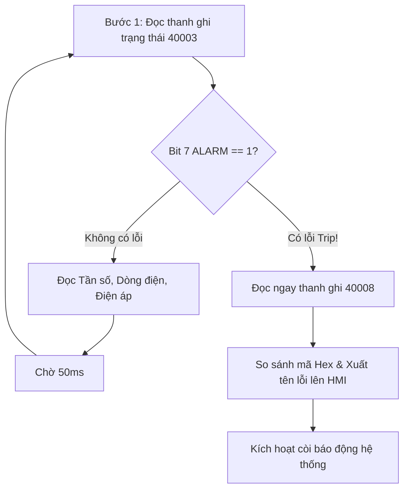

Trong các hệ thống tự động hóa công nghiệp, việc **giám sát trạng thái hoạt động và phát hiện sự cố (Fault Monitoring)**. Khi biến tần gặp sự cố (Trip), động cơ sẽ dừng khẩn cấp để bảo vệ phần cứng. 

Bài viết này hướng dẫn chi tiết 3 phương pháp giám sát lỗi biến tần **Mitsubishi Electric** (áp dụng cho các dòng phổ biến như **FR-D700, FR-E700, FR-A800, FR-F800**):
1. **Giám sát & Đọc thông số lỗi tại chỗ qua Bàn phím điều khiển (PU / Operation Panel)**.
2. **Giám sát qua tiếp điểm cảnh báo cứng (Relay Output)**.
3. **Giám sát & Tự động bóc tách mã lỗi từ xa qua Truyền thông RS-485 (Modbus RTU & Mitsubishi Dedicated Protocol)** gửi về PLC / HMI / SCADA.

---

## 1. Giám sát & Tra cứu lịch sử lỗi trực tiếp trên bàn phím (PU)

Mỗi khi biến tần Mitsubishi bị tác động dừng khẩn cấp (Trip), màn hình LED sẽ nhấp nháy mã lỗi bắt đầu bằng ký tự **`E.`** (ví dụ: `E.OC1`, `E.OV2`, `E.THM`...).

### 1.1 Xem lại 8 lỗi gần nhất trong lịch sử (Fault History)

Biến tần tự động lưu trữ **8 sự cố gần nhất** theo thứ tự từ mới nhất đến cũ nhất:


* **Bước 1:** Nhấn phím **`MODE`** liên tiếp cho đến khi màn hình hiển thị ký hiệu mã lỗi hoặc chế độ tra cứu lịch sử sự cố (Màn hình hiện mã lỗi gần nhất hoặc `E.---` nếu không có lỗi).
* **Bước 2:** Xoay núm vặn **Digital Dial** (hoặc bấm phím Lên/Xuống) để lần lượt duyệt qua các mã lỗi:
  * `E.---`: Lỗi xảy ra gần nhất (Latest fault).
  * `E. 1` đến `E. 7`: 7 lỗi xảy ra trước đó.

### 1.2 Đọc thông số vận hành tại thời điểm xảy ra sự cố (Snapshot Data)

Điểm đặc biệt trên biến tần Mitsubishi là khi xảy ra sự cố, biến tần sẽ **đóng băng dữ liệu vận hành** tại đúng thời khắc đó. Để xem thông số này:

1. Khi màn hình đang dừng ở mã lỗi bạn muốn kiểm tra (ví dụ `E.OC1`), nhấn phím **`SET`**.
2. Nhấn phím **`SET`** liên tục để xoay vòng kiểm tra 4 thông số cực kỳ quan trọng:
   * **Lần 1 - Tần số ngõ ra (Output Frequency):** Tần số biến tần đang phát ra khi bị ngắt (Hz).
   * **Lần 2 - Dòng điện ngõ ra (Output Current):** Dòng điện thực tế đang cấp cho motor tại thời điểm trip (A).
   * **Lần 3 - Điện áp ngõ ra (Output Voltage):** Điện áp đang cấp ra động cơ (V).
   * **Lần 4 - Thời gian chạy tích lũy (Cumulative Energization Time):** Tổng số giờ biến tần đã được cấp nguồn tính đến khi xảy ra lỗi (h).

:::tip[Kinh nghiệm xử lý sự cố]
Dữ liệu đóng băng giúp bạn phân tích chính xác nguyên nhân:
- Nếu lỗi `E.OC1` (Quá dòng khi tăng tốc) nhưng tần số chỉ mới đạt `5.00 Hz`, khả năng cao do motor kẹt tải cơ khí nặng hoặc cài đặt bù áp `Pr.0` (Torque boost) quá lớn.
- Nếu lỗi `E.OV3` (Quá áp khi giảm tốc) với thời gian giảm tốc đang để quá dốc, bạn cần tăng `Pr.8` hoặc lắp thêm điện trở xả.
:::

### 1.3 Cách xóa lịch sử lỗi trên bàn phím (Clear Fault History)

Sau khi khắc phục xong sự cố và muốn reset lại bộ nhớ nhật ký lỗi:
* Truy cập tham số **`Er.CL`** (Fault history clear) hoặc **`Pr.CL`**.
* Cài đặt giá trị = **`1`**, sau đó nhấn **`SET`**.
* Toàn bộ lịch sử 8 mã lỗi sẽ được xóa sạch về trạng thái `E.---`.

---

## 2. Giám sát lỗi bằng Tiếp điểm cứng (Relay I/O)

Biến tần tích hợp sẵn cụm tiếp điểm ngõ ra rơ-le cảnh báo lỗi tổng quát:

<div className="w-full overflow-x-auto my-6 text-xs sm:text-sm">

| Tên chân Relay | Trạng thái kỹ thuật | Mô tả chức năng |
| :---: | :---: | --- |
| **`A`** | Thường mở (NO) | Khi biến tần **Trip (báo lỗi)**, tiếp điểm A-C đóng lại. Dùng để kích còi hú, đèn báo đỏ hoặc đưa tín hiệu ngắt về ngõ vào Digital PLC. |
| **`B`** | Thường đóng (NC) | Tiếp điểm B-C mở ra khi biến tần gặp sự cố. Dùng nối chuỗi an toàn Interlock cắt cuộn hút khởi động từ (Contactor). |
| **`C`** | Cực chung (COM) | Chân chung cấp nguồn cho tiếp điểm A và B (Tối đa 230VAC 0.3A / 30VDC 0.3A). |

</div>

:::note[Lưu ý cấu hình ngõ ra]
Ngoài tiếp điểm A-B-C, bạn có thể gán các ngõ ra transistor số (như chân `RUN`, `FU`) thành các cảnh báo sớm thông qua tham số `Pr.190` - `Pr.192` như:
* Mã `0`: Biến tần đang chạy (RUN).
* Mã `3`: Cảnh báo quá tải (OL - Overload alarm).
* Mã `4`: Cảnh báo rơ-le nhiệt động cơ sắp tác động (TH).
* Mã `98`: Quạt làm mát gặp sự cố hoặc hư hỏng.
:::

---

## 3. Giám sát lỗi chuyên sâu qua Truyền thông RS-485

Giám sát qua tiếp điểm cứng chỉ cho biết biến tần *bị lỗi hay không*, chứ không biết *đang bị lỗi gì*. Để hệ thống SCADA / PLC / HMI hiển thị được chính xác tên mã lỗi (`E.OC1`, `E.OV2`, `E.GF`...) nhằm hướng dẫn người vận hành xử lý ngay lập tức, ta cần đọc thanh ghi trạng thái qua cổng truyền thông RS-485.

### 3.1 Cấu hình cổng kết nối & Tham số truyền thông

Cổng RJ45 trên mặt trước biến tần chính là giao tiếp chuẩn RS-485.

* **Sơ đồ đấu nối 2 dây RS-485 (Half-Duplex):**
  * Nối chập chân **3 (SDA)** và chân **5 (RDA)** $\rightarrow$ Đưa về chân **DATA+ (A)** của PLC/HMI.
  * Nối chập chân **4 (SDB)** và chân **6 (RDB)** $\rightarrow$ Đưa về chân **DATA- (B)** của PLC/HMI.
  * Chân **1** hoặc **8 (SG)** $\rightarrow$ Nối vỏ chống nhiễu Shield Ground.

* **Bảng tham số truyền thông bắt buộc trên biến tần:**

<div className="w-full overflow-x-auto my-6 text-xs sm:text-sm">

| Tham số | Tên cài đặt | Giá trị khuyên dùng | Diễn giải |
| :---: | --- | :---: | --- |
| **`Pr.79`** | Operation mode | `0` hoặc `2` | Chế độ chuyển đổi hoặc chế độ External/Network |
| **`Pr.117`** | Communication station number | `1` (1 ~ 31) | Địa chỉ trạm của biến tần trên mạng RS-485 |
| **`Pr.118`** | Communication speed (Baudrate) | `192` (19200 bps) | Tốc độ truyền (Khuyên dùng: 9600 hoặc 19200 bps) |
| **`Pr.119`** | Stop bit length / Data length | `10` | 8-bit dữ liệu, 1 stop bit (chuẩn Modbus) |
| **`Pr.120`** | Parity check | `2` | Kiểm tra chẵn Even Parity |
| **`Pr.122`** | Communication check time interval | `9999` | Tắt ngắt lỗi truyền thông khi đang thử nghiệm (hoặc 1.0s khi chạy thực tế) |
| **`Pr.549`** | Protocol selection | **`1`** | **`0`**: Chuẩn Mitsubishi Dedicated; **`1`**: Chuẩn quốc tế **Modbus RTU** |

</div>

---

### 3.2 Giám sát lỗi qua giao thức Modbus RTU

Khi chọn `Pr.549 = 1`, biến tần đóng vai trò là Modbus RTU Slave. Ta sử dụng Function Code `03 (03H - Read Holding Registers)` để đọc dữ liệu trạng thái và mã sự cố.

#### Bảng thanh ghi Modbus giám sát trạng thái và mã lỗi:

<div className="w-full overflow-x-auto my-6 text-xs sm:text-sm">

| Địa chỉ Modbus (1-based) | Địa chỉ Hex (0-based) | Tên thanh ghi | Ý nghĩa chi tiết |
| :---: | :---: | --- | --- |
| **`40003`** | `0002H` | **Inverter Status Monitor** | Đọc các cờ bit trạng thái (Xem phân tích bit bên dưới) |
| **`40008`** | `0007H` | **Fault Definition (Current)** | **Mã lỗi hiện tại** đang khiến biến tần bị Trip |
| **`40009`** | `0008H` | Fault History 1 | Mã lỗi quá khứ gần nhất (Lỗi số 1) |
| **`40010`** | `0009H` | Fault History 2 | Mã lỗi quá khứ số 2 |
| **`40011`** | `000AH` | Fault History 3 | Mã lỗi quá khứ số 3 |
| **`40012`** | `000BH` | Fault History 4 | Mã lỗi quá khứ số 4 |
| **`40013`** | `000CH` | Fault History 5 | Mã lỗi quá khứ số 5 |
| **`40014`** | `000DH` | Fault History 6 | Mã lỗi quá khứ số 6 |
| **`40015`** | `000EH` | Fault History 7 | Mã lỗi quá khứ số 7 |
| **`40016`** | `000FH` | Fault History 8 | Mã lỗi quá khứ số 8 |

</div>

#### Cấu trúc các Bit trong thanh ghi trạng thái `40003` (`0002H`):
Thanh ghi 16-bit này cho biết trạng thái vận hành tức thời:
* **Bit 0**: RUN (Biến tần đang chạy).
* **Bit 1**: FWD (Đang chạy chiều thuận).
* **Bit 2**: REV (Đang chạy chiều nghịch).
* **Bit 3**: SU (Đã đạt tốc độ cài đặt).
* **Bit 4**: OL (Đang bị quá dòng/quá tải nhẹ - kích hoạt chống trượt).
* **Bit 7**: **ALARM / FAULT (Biến tần đang bị sự cố Trip)** $\rightarrow$ Khi bit này = `1`, lập tức kích hoạt lệnh đọc thanh ghi `40008` để lấy mã lỗi.

---

### 3.3 Bảng giải mã giá trị Hex sang tên mã lỗi biến tần Mitsubishi

Khi đọc giá trị từ thanh ghi **`40008`** (Current Fault Code), giá trị trả về dạng số Hex/Thập phân. Kỹ sư lập trình chỉ cần so sánh giá trị này với bảng mã chuẩn sau đây để bóc tách thành chuỗi Text hiển thị lên giao diện HMI/SCADA:

<div className="w-full overflow-x-auto my-6 text-xs sm:text-sm">

| Giá trị Hex | Giá trị Decimal | Mã lỗi hiển thị | Ý nghĩa kỹ thuật |
| :---: | :---: | :---: | --- |
| `00H` | `0` | **Không có lỗi** | Biến tần hoạt động hoàn toàn bình thường |
| `10H` | `16` | **E.OC1** | Quá dòng ngõ ra trong quá trình tăng tốc |
| `11H` | `17` | **E.OC2** | Quá dòng ngõ ra khi đang chạy tốc độ ổn định |
| `12H` | `18` | **E.OC3** | Quá dòng ngõ ra trong quá trình giảm tốc / dừng |
| `20H` | `32` | **E.OV1** | Quá áp Bus DC trong quá trình tăng tốc |
| `21H` | `33` | **E.OV2** | Quá áp Bus DC khi đang chạy ổn định |
| `22H` | `34` | **E.OV3** | Quá áp Bus DC trong quá trình giảm tốc (quán tính lớn) |
| `30H` | `48` | **E.THT** | Quá tải biến tần (Inverter Overload Trip) |
| `31H` | `49` | **E.THM** | Quá tải động cơ (Motor Overload Trip) |
| `40H` | `64` | **E.FIN** | Quá nhiệt cánh tản nhiệt khối công suất |
| `50H` | `80` | **E.IPF** | Mất nguồn ngõ vào chớp nhoáng |
| `51H` | `81` | **E.UVT** | Điện áp nguồn ngõ vào / Bus DC sụt áp thấp |
| `52H` | `82` | **E.ILF** | Mất pha nguồn điện xoay chiều đầu vào |
| `60H` | `96` | **E.OLT** | Kẹt tải hoặc chống trượt quá thời gian cho phép |
| `70H` | `112` | **E.BE** | Lỗi mạch xả phanh hãm động năng (Braking Transistor) |
| `80H` | `128` | **E.GF** | Phát hiện chạm chập đất phía ngõ ra motor (Ground Fault) |
| `81H` | `129` | **E.LF** | Mất pha ngõ ra (Đứt 1 pha cáp cấp nguồn cho động cơ) |
| `90H` | `144` | **E.OHT** | Tiếp điểm rơ-le nhiệt bên ngoài tác động |
| `91H` | `145` | **E.PTC** | Cảm biến nhiệt điện trở PTC motor báo nhiệt độ cao |
| `A0H` | `160` | **E.OPT** | Lỗi khe cắm card truyền thông mở rộng (Option Fault) |
| `B0H` | `176` | **E.PE** | Lỗi chip nhớ EEPROM lưu trữ thông số cài đặt |
| `B1H` | `177` | **E.PUE** | Mất kết nối bàn phím điều khiển (PU Disconnection) |
| `B2H` | `178` | **E.RET** | Vượt quá số lần thử tự động khởi động lại sau sự cố |
| `C0H` | `192` | **E.CPU** | Lỗi vi xử lý hoặc nhiễu điện từ trường nghiêm trọng |

</div>

---

### 3.4 Giám sát lỗi qua Giao thức riêng của Mitsubishi (Dedicated Inverter Protocol)

Nếu cài đặt `Pr.549 = 0`, biến tần sẽ chạy theo chuẩn khung truyền ASCII chuyên dụng của Mitsubishi (thường dùng khi kết hợp với khối hàm **IVCK, IVRD, IVMD** trên dòng PLC FX3U qua module `FX3U-485ADP-MB`).

Các mã chỉ thị lệnh (Instruction Code) chuyên biệt để tra cứu lỗi:

<div className="w-full overflow-x-auto my-6 text-xs sm:text-sm">

| Mã lệnh (Hex) | Tên lệnh | Chức năng chi tiết |
| :---: | --- | --- |
| **`7B`** | Read Fault Definition | **Đọc mã sự cố hiện tại** (Trả về 2 ký tự mã Hex tương tự bảng mã trên) |
| **`74`** | Read Past Fault 1 | Đọc mã lỗi xảy ra lần trước gần nhất |
| **`75`** | Read Past Fault 2 | Đọc mã lỗi quá khứ lần 2 |
| **`76`** | Read Past Fault 3 | Đọc mã lỗi quá khứ lần 3 |
| **`77`** | Read Past Fault 4 | Đọc mã lỗi quá khứ lần 4 |
| **`02`** | Monitor Inverter Status | Đọc byte trạng thái hoạt động (b7 = Cờ báo có sự cố Alarm) |
| **`FD`** | Clear Fault History | Ghi mã `9696` để thực hiện xóa toàn bộ nhật ký lỗi qua mạng |

</div>

---

## 4. Ví dụ lập trình thực tế trên PLC & Thiết kế giao diện HMI

### 4.1 Quy trình quét giám sát vòng lặp (Polling State Machine)

Khi lập trình truyền thông RS-485, kỹ sư nên tổ chức vòng quét theo chu kỳ để tối ưu băng thông:



### 4.2 Đoạn code giải mã sự cố trên PLC (Structured Text / Ladder Logic)

Giả sử dữ liệu đọc từ thanh ghi Modbus `40008` được lưu vào ô nhớ **`D200`** của PLC:

```pascal
// Ví dụ giải mã lỗi biến tần Mitsubishi bằng Structured Text (ST)
CASE D200 OF
    16#00: 
        sFaultName := "Bình thường (Normal)";
        bInverterTrip := FALSE;
    16#10: 
        sFaultName := "E.OC1: Quá dòng khi tăng tốc";
        bInverterTrip := TRUE;
    16#11: 
        sFaultName := "E.OC2: Quá dòng tốc độ ổn định";
        bInverterTrip := TRUE;
    16#12: 
        sFaultName := "E.OC3: Quá dòng khi giảm tốc";
        bInverterTrip := TRUE;
    16#20, 16#21, 16#22: 
        sFaultName := "E.OV1-OV3: Quá áp Bus DC";
        bInverterTrip := TRUE;
    16#30: 
        sFaultName := "E.THT: Quá tải biến tần";
        bInverterTrip := TRUE;
    16#31: 
        sFaultName := "E.THM: Quá tải động cơ";
        bInverterTrip := TRUE;
    16#51: 
        sFaultName := "E.UVT: Sụt áp nguồn ngõ vào";
        bInverterTrip := TRUE;
    16#80: 
        sFaultName := "E.GF: Chạm chập đất ngõ ra";
        bInverterTrip := TRUE;
    16#81: 
        sFaultName := "E.LF: Mất pha động cơ";
        bInverterTrip := TRUE;
    ELSE
        sFaultName := "E.Unknown: Lỗi chưa xác định";
        bInverterTrip := TRUE;
END_CASE;
```

---

## 5. Chẩn đoán các lỗi truyền thông thường gặp (`E.PUE`, `E.SER`)

Trong quá trình điều khiển và giám sát qua cổng RS-485, bản thân khối truyền thông của biến tần cũng có thể báo các lỗi đặc thù:

1. **Lỗi `E.PUE` (PU Disconnection):**
   * *Nguyên nhân:* Giắc cắm mạng RJ45 bị lỏng chân tiếp xúc, đứt ngầm dây tín hiệu hoặc mất liên lạc quá thời gian cài đặt trong `Pr.122`.
   * *Khắc phục:* Bấm lại đầu hạt mạng RJ45, kiểm tra dây và tạm thời đặt `Pr.122 = 9999` để biến tần không ngắt do timeout.
2. **Lỗi `E.SER` (Communication Fault):**
   * *Nguyên nhân:* Sai cấu hình Baudrate, Parity giữa PLC và biến tần, hoặc do nhiễu điện từ mạnh từ cáp động lực chạy song song với cáp tín hiệu.
   * *Khắc phục:* Lắp **điện trở đầu cuối 110 Ω ~ 120 Ω** (1/2W) giữa chân `RDA` và `RDB` ở thiết bị cuối cùng của đường truyền; dùng cáp chống nhiễu xoắn đôi có vỏ kim bọc tiếp địa.

---

## 6. Tổng kết

Việc kết hợp **giám sát trạng thái qua tiếp điểm cứng (để ngắt khẩn cấp)** và **đọc mã lỗi qua truyền thông Modbus RTU / Dedicated Protocol (để lưu trữ và chẩn đoán)** là giải pháp tiêu chuẩn trong các nhà máy thông minh hiện đại:
* Giúp kỹ sư bảo trì xác định chính xác vị trí lỗi trong vòng vài giây mà không cần phải mở tủ điện xem bàn phím.
* Lưu lại thời điểm xảy ra sự cố cùng các thông số điện áp, dòng điện thực tế phục vụ phân tích tìm nguyên nhân gốc rễ (Root Cause Analysis).