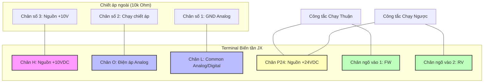
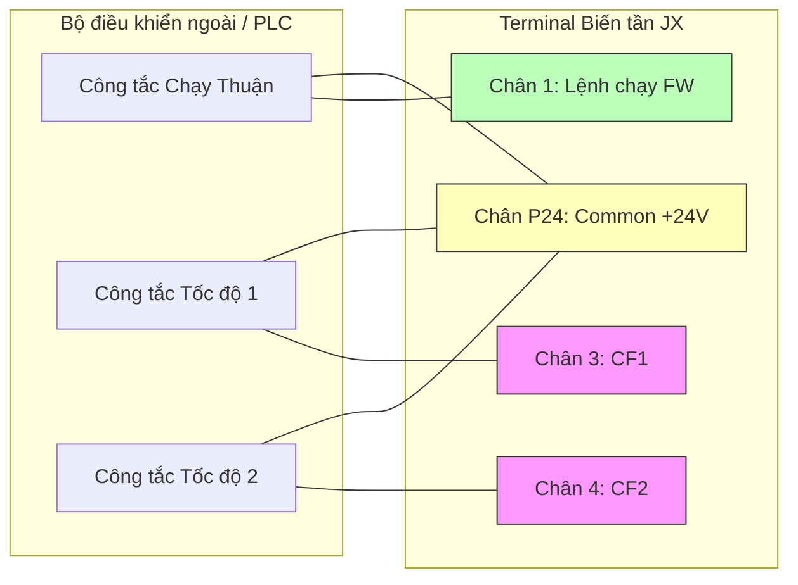

Tài liệu tổng hợp chi tiết các mã lệnh và dải cài đặt tham số của dòng biến tần **Omron 3G3JX** (JX Series) - dòng biến tần cơ bản, nhỏ gọn và tiết kiệm chi phí của hãng OMRON. Dưới đây là bảng tra cứu nhanh kèm giải thích chi tiết dải giá trị phục vụ thiết kế, đấu nối và cấu hình tủ điện.

---

## 1. Nhóm lệnh cơ bản và chế độ vận hành

| Mã lệnh | Tên thông số / Chức năng | Dải cài đặt | Mặc định |
| --- | --- | --- | --- |
| **b084** | Initialization selection (Lựa chọn kiểu khôi phục cài đặt gốc) | `00`, `01`, `02` | 00 |
| **A001** | Frequency source selection (Lựa chọn nguồn lệnh đặt tần số) | `00` - `10` | 01 |
| **A002** | Run command source selection (Lựa chọn nguồn phát lệnh chạy) | `01` - `03` | 01 |
| **F001** | Output frequency setting (Cài đặt tần số đầu ra trực tiếp) | `0.00` - [A004](#a004) Hz | 0.00 Hz |
| **F002** | Acceleration time 1 (Thời gian tăng tốc 1) | `0.01` - `3000.0` s | 10.0 s |
| **F003** | Deceleration time 1 (Thời gian giảm tốc 1) | `0.01` - `3000.0` s | 10.0 s |

### Khôi phục cài đặt gốc (Reset Default)
Để đưa toàn bộ tham số của biến tần Omron JX về giá trị mặc định của nhà sản xuất, thực hiện theo các bước sau:
1. Truy cập tham số **[b084](#b084)**:
   * `00`: Chỉ xóa lịch sử lỗi (Trip history).
   * `01`: Chỉ khôi phục toàn bộ tham số cài đặt về mặc định.
   * `02`: Khôi phục toàn bộ tham số cài đặt + Xóa lịch sử lỗi.
   * *Nên chọn:* `02`.
2. Bấm phím **SET** để lưu cấu hình.
3. Kích hoạt quá trình khởi tạo bằng cách: Nhấn giữ đồng thời 3 phím **STOP/RESET**, phím **LÊN (Up)** và phím **XUỐNG (Down)** trên bàn phím cho đến khi màn hình nhấp nháy chữ `d001` hoặc quay lại màn hình hiển thị chính.

### A001 (Nguồn đặt tần số - Tốc độ)
*   `00`: Nhận từ núm xoay chiết áp tích hợp trên bàn phím biến tần (OPE).
*   `01`: Nhận từ chân nhận tín hiệu analog ngoài (Chân O: điện áp `0-10V` hoặc chân OI: dòng điện `4-20mA`).
*   `02`: Nhận từ tham số cài đặt trực tiếp **[F001](#f001)** trên màn hình.
*   `03`: Nhận qua truyền thông Modbus RTU (cổng mạng RJ45).
*   `10`: Nhận tín hiệu chuỗi xung (Pulse train input).

### A002 (Nguồn lệnh chạy - Run/Stop)
*   `01`: Nhận lệnh chạy từ chân điều khiển ngoài (kích hoạt chân vật lý FW/RV).
*   `02`: Nhận lệnh chạy trực tiếp từ nút nhấn **RUN** và **STOP/RESET** trên bàn phím.
*   `03`: Nhận lệnh chạy qua truyền thông Modbus RTU.

---

## 2. Nhóm giới hạn tần số và đa cấp tốc độ

| Mã lệnh | Tên thông số / Chức năng | Dải cài đặt | Mặc định |
| --- | --- | --- | --- |
| **A003** | Base frequency (Tần số cơ bản của động cơ) | `30.0` - [A004](#a004) Hz | 50.0 Hz |
| **A004** | Maximum frequency (Tần số hoạt động tối đa) | `30.0` - `400.0` Hz | 50.0 Hz |
| **A061** | Frequency upper limit (Giới hạn tần số trên) | `0.0` - `400.0` Hz | 0.0 Hz |
| **A062** | Frequency lower limit (Giới hạn tần số dưới) | `0.0` - `400.0` Hz | 0.0 Hz |
| **A020** | Multi-speed 0 frequency (Tần số tốc độ cấp 0 - Mặc định) | `0.0` - `400.0` Hz | 0.0 Hz |
| **A021** | Multi-speed 1 frequency (Tần số tốc độ cấp 1) | `0.0` - `400.0` Hz | 0.0 Hz |
| **A022** | Multi-speed 2 frequency (Tần số tốc độ cấp 2) | `0.0` - `400.0` Hz | 0.0 Hz |
| **A023** | Multi-speed 3 frequency (Tần số tốc độ cấp 3) | `0.0` - `400.0` Hz | 0.0 Hz |
| **A024 - A035** | Multi-speed 4 to 15 frequency (Tốc độ đa cấp từ 4 đến 15) | `0.0` - `400.0` Hz | 0.0 Hz |

---

## 3. Nhóm động lực học, đặc tuyến tải và bảo vệ

| Mã lệnh | Tên thông số / Chức năng | Dải cài đặt | Mặc định |
| --- | --- | --- | --- |
| **A044** | Control mode selection (Phương pháp điều khiển động cơ V/F) | `00`, `01` | 00 |
| **A042** | Manual torque boost voltage (Tăng mô-men xoắn khởi động bằng tay) | `0.0` - `20.0` % | Tùy công suất |
| **b012** | Electronic thermal level (Dòng điện bảo vệ quá tải động cơ) | `0.2` × $I_{rated}$ - $I_{rated}$ | Dòng định mức |
| **b021** | Overload restriction operation mode (Chống sụt tốc/giới hạn dòng điện) | `00` - `02` | 01 |
| **b022** | Overload restriction level (Ngưỡng dòng điện chống sụt tốc) | `0.2` × $I_{rated}$ - `1.5` × $I_{rated}$ | 1.5 × dòng định mức |

### A044 (Lựa chọn thuật toán V/F)
*   `00`: VC - Tải mô-men không đổi (Constant torque V/F). Thích hợp cho băng tải nhỏ, máy khuấy, cẩu trục nhẹ.
*   `01`: VP - Tải mô-men biến thiên (Variable torque V/F). Phù hợp cho bơm ly tâm, quạt gió để tối ưu điện năng.
*(Lưu ý: Dòng JX không hỗ trợ thuật toán Vector không cảm biến SLV như dòng MX2).*

---

## 4. Nhóm cấu hình Terminal I/O (Chân vật lý điều khiển)

### Cấu hình chân đầu vào số (Digital Inputs - Chân từ 1 đến 5)

:::info
Khác với MX2 có 7 chân input số, dòng JX chỉ được trang bị tối đa **5 chân đầu vào số** (Chân từ 1 đến 5).
:::

Cài đặt chức năng cho các chân input thông qua nhóm tham số từ `C001` đến `C005`:

| Tham số | Chân vật lý | Chức năng mặc định | Mã gán mặc định |
| :---: | :---: | :---: | :---: |
| **C001** | Chân ngõ vào 1 | FW (Chạy thuận) | `00` |
| **C002** | Chân ngõ vào 2 | RV (Chạy ngược) | `01` |
| **C003** | Chân ngõ vào 3 | CF1 (Đa cấp tốc độ 1) | `02` |
| **C004** | Chân ngõ vào 4 | CF2 (Đa cấp tốc độ 2) | `03` |
| **C005** | Chân ngõ vào 5 | RS (Reset lỗi biến tần) | `18` |

#### Các mã chức năng đầu vào số thông dụng trên JX:
*   `00` (FW): Lệnh chạy thuận.
*   `01` (RV): Lệnh chạy ngược.
*   `02` (CF1) - `05` (CF4): Kích hoạt chạy đa cấp tốc độ.
*   `09` (2CH): Chọn thời gian tăng/giảm tốc thứ hai (chuyển đổi dốc).
*   `18` (RS): Chân Reset lỗi hệ thống.

---

### Cấu hình chân đầu ra (Outputs - Chân 11 và Relay AL0-AL1-AL2)

Dòng JX tích hợp 1 cổng đầu ra Transistor (chân 11) và 1 cổng rơ-le cảnh báo lỗi (chân AL0, AL1, AL2):

| Tham số | Chân vật lý | Chức năng mặc định | Mã gán mặc định |
| :---: | :---: | :---: | :---: |
| **C021** | Output 11 (Transistor) | RUN (Báo đang chạy) | `00` |
| **C026** | Ngõ ra Relay (AL0, AL1, AL2) | AL (Cảnh báo lỗi - Alarm) | `05` |

*   **Logic Relay:** Chân **AL0** là chân chung (Common), **AL1** là tiếp điểm thường đóng (N.C), **AL2** là tiếp điểm thường mở (N.O). Khi biến tần báo lỗi, rơ-le sẽ tác động (AL0 ngắt khỏi AL1 và đóng sang AL2).

---

## 5. Các ví dụ cấu hình và sơ đồ đấu nối thực tế

### Ví dụ 1: Điều khiển bằng Công tắc ngoài & Chiết áp ngoài (Chế độ Terminal)

#### 1. Sơ đồ đấu nối dây (Wiring Diagram)

Sơ đồ đấu nối dưới đây sử dụng logic **SOURCE (PNP)** (mặc định), sử dụng nguồn cấp `P24` trên biến tần để kích lệnh chạy.

#### 2. Các bước cài đặt tham số (Parameter Settings)

*   **Bước 1:** Cài đặt **[A001](#a001) = 01** để nhận dải điện áp `0-10V` từ chân O của chiết áp ngoài.
*   **Bước 2:** Cài đặt **[A002](#a002) = 01** để nhận lệnh chạy từ các công tắc ngoài nối vào chân 1 (FW) và chân 2 (RV).
*   **Bước 3:** Cài đặt **[C001](#c001) = 00** (Chân 1 làm lệnh chạy thuận FW).
*   **Bước 4:** Cài đặt **[C002](#c002) = 01** (Chân 2 làm lệnh chạy ngược RV).

---

### Ví dụ 2: Điều khiển Đa cấp tốc độ (Multi-speed)

Sử dụng các chân cấp tốc độ CF1 và CF2 phối hợp để chạy tối đa 4 cấp tốc độ khác nhau.

#### 1. Sơ đồ đấu nối dây (Wiring Diagram)

#### 2. Các bước cài đặt tham số (Parameter Settings)

*   **Bước 1:** Đặt nguồn lệnh chạy nhận từ công tắc ngoài: Cài **[A002](#a002) = 01**.
*   **Bước 2:** Định nghĩa chức năng chân 3 và 4:
    *   Cài **[C003](#c003) = 02** (CF1)
    *   Cài **[C004](#c004) = 03** (CF2)
*   **Bước 3:** Cài đặt các mức tần số đa cấp mong muốn:
    *   **Tốc độ 0:** Cài **[A020](#a020) = 10.00** Hz (Chạy khi chỉ có tiếp điểm FW đóng).
    *   **Tốc độ 1 (CF1):** Cài **[A021](#a021) = 20.00** Hz.
    *   **Tốc độ 2 (CF2):** Cài **[A022](#a022) = 30.00** Hz.
    *   **Tốc độ 3 (CF1 + CF2):** Cài **[A023](#a023) = 45.00** Hz.

---

### Ví dụ 3: Điều khiển và giám sát qua truyền thông Modbus RTU

Dòng JX cũng tích hợp sẵn cổng RJ45 cho truyền thông RS-485 Modbus RTU.

#### 1. Sơ đồ chân RJ45 của JX tương tự dòng MX2:
*   **Chân 5:** SP (RS-485 A+)
*   **Chân 6:** SN (RS-485 B-)
*   **Chân 1, 2, 8:** GND

#### 2. Các bước cài đặt tham số truyền thông trên JX:

*   **Bước 1:** Bật chế độ nhận lệnh và tần số từ Modbus.
    *   Cài **[A001](#a001) = 03** (Tần số qua truyền thông).
    *   Cài **[A002](#a002) = 03** (Lệnh chạy qua truyền thông).
*   **Bước 2:** Cấu hình giao thức và trạm:
    *   Cài **C070 = 02** (Giao thức Modbus RTU).
    *   Cài **C071 = 2** (Trạm số 2).
*   **Bước 3:** Cài đặt thông số cổng COM:
    *   Cài **C072 = 05** (Baud rate **9600 bps**).
    *   Cài **C074 = 02** (Cấu hình parity **Even parity, 1 stop bit**).
*   **Bước 4:** Tắt nguồn điện cấp vào biến tần, đợi màn hình biến tần tắt hẳn hoàn toàn, sau đó bật điện trở lại để biến tần nhận cấu hình phần cứng truyền thông mới.
