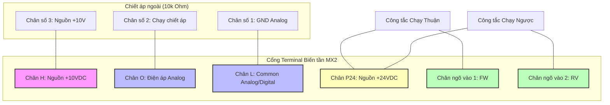
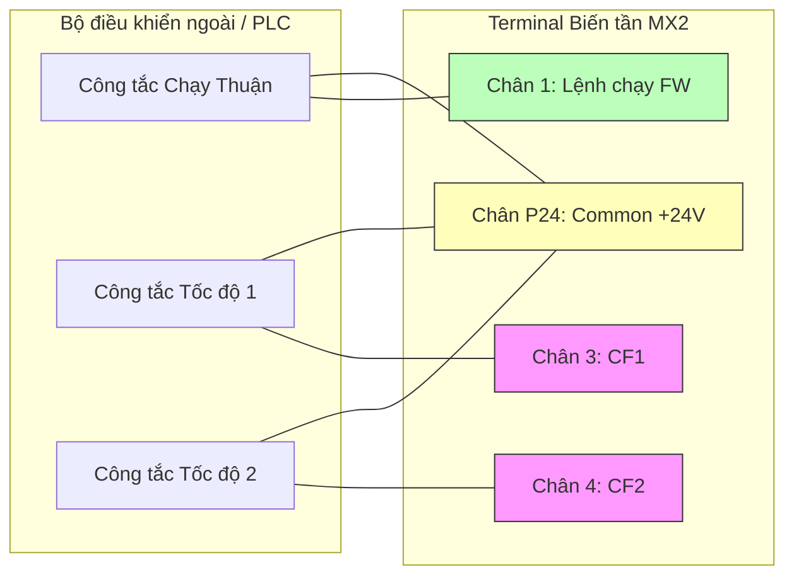

Tài liệu tổng hợp chi tiết các mã lệnh và dải cài đặt tham số của dòng biến tần **Omron 3G3MX2** (MX2 Series). Dưới đây là bảng tra cứu nhanh kèm giải thích chi tiết dải giá trị giúp ích cho quá trình thiết kế tủ điện, đấu nối và cấu hình thực tế.

---

## 1. Nhóm lệnh cơ bản và chế độ vận hành

| Mã lệnh | Tên thông số / Chức năng | Dải cài đặt | Mặc định |
| --- | --- | --- | --- |
| **b084** | Initialization selection (Lựa chọn kiểu khôi phục cài đặt gốc) | `00` - `03` | 00 |
| **b180** | Initialization trigger (Mã vùng kích hoạt khôi phục cài đặt) | `01`, `02`, `03` | 00 |
| **A001** | Frequency source selection (Lựa chọn nguồn lệnh đặt tần số) | `00` - `10` | 01 |
| **A002** | Run command source selection (Lựa chọn nguồn phát lệnh chạy) | `01` - `04` | 01 |
| **F001** | Output frequency setting (Cài đặt tần số đầu ra trực tiếp) | `0.00` - [A004](#a004) Hz | 0.00 Hz |
| **F002** | Acceleration time 1 (Thời gian tăng tốc 1) | `0.01` - `3600.00` s | 10.00 s |
| **F003** | Deceleration time 1 (Thời gian giảm tốc 1) | `0.01` - `3600.00` s | 10.00 s |

### Khôi phục cài đặt gốc (Reset Default)
Để đưa toàn bộ tham số của biến tần Omron MX2 về giá trị mặc định của nhà sản xuất, thực hiện theo quy trình sau:
1. Tìm đến tham số **[b084](#b084)**:
   * `00`: Chỉ xóa lịch sử lỗi (Trip history).
   * `01`: Chỉ khôi phục toàn bộ tham số cài đặt về mặc định.
   * `02`: Khôi phục toàn bộ tham số cài đặt + Xóa lịch sử lỗi.
   * `03`: Khôi phục tham số + Xóa lịch sử lỗi + Xóa chương trình lập trình nhúng ezSQ.
   * *Nên chọn:* `02`.
2. Tìm đến tham số **[b180](#b180)** (đây là khóa kích hoạt chọn mã vùng):
   * `01`: Kích hoạt khôi phục theo tiêu chuẩn Nhật Bản (Japan - 50Hz/60Hz).
   * `02`: Kích hoạt khôi phục theo tiêu chuẩn Châu Âu (Europe - 50Hz).
   * `03`: Kích hoạt khôi phục theo tiêu chuẩn Mỹ (USA - 60Hz).
   * *Cách làm:* Cài **[b180](#b180) = 02** rồi bấm phím **SET** để xác nhận lưu. Màn hình biến tần sẽ nhấp nháy chữ `---` và kêu bíp báo hiệu quá trình khôi phục thành công.

### A001 (Nguồn đặt tần số - Tốc độ)
*   `00`: Nhận từ núm xoay chiết áp tích hợp trên bàn phím màn hình (Digital Operator).
*   `01`: Nhận từ chân nhận tín hiệu analog ngoài (Chân O: điện áp `0-10V` hoặc chân OI: dòng điện `4-20mA`).
*   `02`: Nhận từ tham số cài đặt trực tiếp **[F001](#f001)** hoặc phím Lên/Xuống trên màn hình.
*   `03`: Nhận qua truyền thông Modbus RTU (cổng mạng RJ45).
*   `04`: Nhận từ card Option gắn thêm.
*   `07`: Nhận từ chương trình lập trình logic ezSQ chạy ngầm.
*   `10`: Nhận tín hiệu chuỗi xung (Pulse train input) cấp vào chân số 3.

### A002 (Nguồn lệnh chạy - Run/Stop)
*   `01`: Nhận lệnh chạy từ chân điều khiển ngoài (kích hoạt chân vật lý FW/RV).
*   `02`: Nhận lệnh chạy trực tiếp từ nút nhấn **RUN** và **STOP/RESET** trên bàn phím biến tần.
*   `03`: Nhận lệnh chạy qua truyền thông Modbus RTU.
*   `04`: Nhận lệnh qua card mở rộng Option.

---

## 2. Nhóm giới hạn tần số và đa cấp tốc độ

| Mã lệnh | Tên thông số / Chức năng | Dải cài đặt | Mặc định |
| --- | --- | --- | --- |
| **A003** | Base frequency (Tần số cơ bản của động cơ) | `30.0` - [A004](#a004) Hz | 50.0 Hz |
| **A004** | Maximum frequency (Tần số hoạt động tối đa) | `30.0` - `400.0` Hz | 50.0 Hz |
| **A061** | Frequency upper limit (Giới hạn tần số trên) | `0.0` - `400.0` Hz | 0.0 Hz |
| **A062** | Frequency lower limit (Giới hạn tần số dưới) | `0.0` - `400.0` Hz | 0.0 Hz |
| **A020** | Multi-speed 0 frequency (Tần số tốc độ cấp 0 - Mặc định) | `0.0` - `400.0` Hz | 0.0 Hz |
| **A021** | Multi-speed 1 frequency (Tần số tốc độ cấp 1) | `0.0` - `400.0` Hz | 0.0 Hz |
| **A022** | Multi-speed 2 frequency (Tần số tốc độ cấp 2) | `0.0` - `400.0` Hz | 0.0 Hz |
| **A023** | Multi-speed 3 frequency (Tần số tốc độ cấp 3) | `0.0` - `400.0` Hz | 0.0 Hz |
| **A024 - A035** | Multi-speed 4 to 15 frequency (Tốc độ đa cấp từ 4 đến 15) | `0.0` - `400.0` Hz | 0.0 Hz |

### A061 & A062 (Giới hạn dải tần số)
*   **[A061](#a061)**: Giới hạn tần số trên. Nếu đặt là `50.0` Hz, dù người dùng vặn chiết áp lên tối đa hay đặt tần số cao hơn thì biến tần vẫn chỉ chạy ở tốc độ 50Hz.
*   **[A062](#a062)**: Giới hạn tần số dưới. Thường dùng cho các ứng dụng tải bơm nước, quạt hút để động cơ luôn chạy ở một tốc độ tối thiểu nhằm tản nhiệt và giữ áp lực đường ống ổn định.

---

## 3. Nhóm động lực học, đặc tuyến tải và bảo vệ

| Mã lệnh | Tên thông số / Chức năng | Dải cài đặt | Mặc định |
| --- | --- | --- | --- |
| **A044** | Control mode selection (Phương pháp điều khiển động cơ) | `00` - `03` | 00 |
| **A042** | Manual torque boost voltage (Tăng mô-men xoắn khởi động bằng tay) | `0.0` - `20.0` % | Tùy công suất |
| **b012** | Electronic thermal level (Dòng điện bảo vệ quá tải động cơ) | `0.2` × $I_{rated}$ - $I_{rated}$ | Dòng định mức |
| **b013** | Electronic thermal characteristic (Đặc tính bảo vệ quá tải nhiệt) | `00`, `01`, `02` | 01 |
| **b021** | Overload restriction operation mode (Chống sụt tốc/giới hạn dòng điện) | `00` - `05` | 01 |
| **b022** | Overload restriction level (Ngưỡng dòng điện kích hoạt chống sụt tốc) | `0.2` × $I_{rated}$ - `1.5` × $I_{rated}$ | 1.5 × dòng định mức |

### A044 (Lựa chọn thuật toán điều khiển động cơ)
*   `00`: VC - Tải mô-men không đổi (Constant torque V/F). Phù hợp băng tải, cẩu trục nâng hạ.
*   `01`: VP - Tải mô-men biến thiên (Variable torque V/F). Phù hợp bơm ly tâm, quạt gió.
*   `02`: Free V/F - Đặc tuyến V/F tự do thiết lập các điểm.
*   `03`: SLV - Vector không cảm biến (Sensorless Vector Control). Cung cấp mô-men xoắn lớn ngay tại dải tốc độ rất thấp, thích hợp cho các ứng dụng cần độ chính xác cao mà không có Encoder.

### b012 (Bảo vệ quá tải nhiệt động cơ)
*   Cài đặt giá trị của **[b012](#b012)** bằng với dòng định mức (ghi trên nhãn động cơ) để kích hoạt relay nhiệt điện tử bảo vệ động cơ không bị cháy khi gặp sự cố kẹt cơ khí hoặc quá tải kéo dài.

---

## 4. Nhóm cấu hình Terminal I/O (Chân vật lý điều khiển)

### Cấu hình chân đầu vào số (Digital Inputs - Chân từ 1 đến 7)

Cài đặt chức năng cho các chân input thông qua nhóm tham số từ `C001` đến `C007`:

| Tham số | Chân vật lý | Chức năng mặc định | Mã gán mặc định |
| :---: | :---: | :---: | :---: |
| **C001** | Chân ngõ vào 1 | FW (Chạy thuận) | `00` |
| **C002** | Chân ngõ vào 2 | RV (Chạy ngược) | `01` |
| **C003** | Chân ngõ vào 3 | CF1 (Đa cấp tốc độ 1) | `02` |
| **C004** | Chân ngõ vào 4 | CF2 (Đa cấp tốc độ 2) | `03` |
| **C005** | Chân ngõ vào 5 | CF3 (Đa cấp tốc độ 3) | `04` |
| **C006** | Chân ngõ vào 6 | CF4 (Đa cấp tốc độ 4) | `05` |
| **C007** | Chân ngõ vào 7 | RS (Reset lỗi biến tần) | `18` |

#### Các mã chức năng đầu vào số quan trọng:
*   `00` (FW): Lệnh chạy thuận.
*   `01` (RV): Lệnh chạy ngược.
*   `02` (CF1) - `05` (CF4): Kích hoạt chạy đa cấp tốc độ (tối đa 16 cấp tốc độ từ 0 đến 15).
*   `09` (2CH): Chọn thời gian tăng/giảm tốc thứ hai (chuyển đổi dốc tăng tốc).
*   `18` (RS): Thiết lập chân Reset lỗi cho biến tần.
*   `28` (F-CON): Chuyển quyền điều khiển bằng tay (Force Operator).

#### Trạng thái kích hoạt chân (N.O / N.C):
Mặc định các chân input hoạt động ở dạng thường mở (NO - nối chân Common để kích hoạt). Nếu muốn đổi sang thường đóng (NC), cài đặt thông số:
*   `C011` đến `C017` tương ứng chân 1 đến 7: cài `00` cho **N.O** (mặc định), hoặc `01` cho **N.C**.

---

### Cấu hình chân đầu ra (Outputs - Chân 11, 12 và Relay MA-MB-MC)

| Tham số | Chân vật lý | Chức năng mặc định | Mã gán mặc định |
| :---: | :---: | :---: | :---: |
| **C021** | Output 11 (Cổng Transistor) | RUN (Báo đang chạy) | `00` |
| **C022** | Output 12 (Cổng Transistor) | FA1 (Đạt tần số) | `01` |
| **C026** | Ngõ ra Relay (MA, MB, MC) | AL (Cảnh báo lỗi - Alarm) | `05` |

#### Các mã chức năng đầu ra thông dụng:
*   `00` (RUN): Báo biến tần đang phát tần số (đang chạy động cơ).
*   `01` (FA1): Tín hiệu báo tần số thực đạt bằng tần số cài đặt.
*   `03` (OL): Cảnh báo dòng tải động cơ vượt mức thiết lập (Overload Warning).
*   `05` (AL): Biến tần xảy ra sự cố nghiêm trọng, ngắt rơ-le báo động bảo vệ.

---

## 5. Nhóm cấu hình bộ điều khiển PID

| Mã lệnh | Tên thông số / Chức năng | Dải cài đặt | Mặc định |
| --- | --- | --- | --- |
| **A071** | PID enable (Kích hoạt bộ điều khiển PID) | `00`, `01`, `02` | 00 |
| **A072** | PID Proportional gain Kp (Hệ số tỉ lệ Kp) | `0.2` - `5.0` | 1.0 |
| **A073** | PID Integral time constant Ki (Thời gian tích phân Ki) | `0.0` - `150.0` s | 1.0 s |
| **A074** | PID Derivative time constant Kd (Thời gian vi phân Kd) | `0.00` - `100.00` s | 0.00 s |
| **A076** | PID feedback source (Lựa chọn nguồn phản hồi) | `00` - `03` | 00 |

### A071 (Bật/Tắt chế độ PID)
*   `00`: Tắt PID (chạy điều khiển tần số thông thường).
*   `01`: Kích hoạt PID dạng tác động thông thường (ví dụ: điều khiển áp suất đường ống nước, hồi tiếp áp suất thấp → bơm chạy nhanh).
*   `02`: Kích hoạt PID dạng tác động nghịch (ví dụ: điều khiển quạt giải nhiệt, hồi tiếp nhiệt độ cao → quạt chạy nhanh).

---

## 6. Các ví dụ cấu hình và sơ đồ đấu nối thực tế

### Ví dụ 1: Điều khiển bằng Công tắc ngoài & Chiết áp ngoài (Chế độ Terminal)

Đây là phương pháp điều khiển phổ biến, sử dụng chiết áp ngoài điện áp `0-10V` để chỉnh tốc độ và hai công tắc xoay để cấp lệnh chạy thuận/ngược.

#### 1. Sơ đồ đấu nối dây (Wiring Diagram)

:::note
Biến tần Omron MX2 hỗ trợ gạt công tắc lựa chọn logic SINK (NPN) hoặc SOURCE (PNP). Sơ đồ dưới đây được thể hiện theo logic **SOURCE (PNP)** (mặc định của nhà sản xuất tại Châu Âu/Việt Nam), sử dụng chân nguồn dương `P24` kích vào các đầu vào số.
:::

#### 2. Các bước cài đặt tham số (Parameter Settings)

*   **Bước 1:** Chuyển đổi nguồn nhận tốc độ sang chiết áp ngoài.
    *   Cài đặt **[A001](#a001) = 01** (Chọn nguồn tần số từ cổng analog ngoài - chân O).
*   **Bước 2:** Chuyển đổi nguồn nhận lệnh chạy sang công tắc ngoài.
    *   Cài đặt **[A002](#a002) = 01** (Chọn nhận lệnh chạy từ terminal ngoài).
*   **Bước 3:** Cấu hình chân chạy thuận/ngược.
    *   Cài đặt **[C001](#c001) = 00** (Chân 1 làm lệnh chạy thuận FW).
    *   Cài đặt **[C002](#c002) = 01** (Chân 2 làm lệnh chạy ngược RV).

---

### Ví dụ 2: Điều khiển Đa cấp tốc độ (Multi-speed)

Ứng dụng trong các dây chuyền sản xuất cần chạy máy với các tốc độ cố định được xác định sẵn (ví dụ: máy dệt, máy giặt công nghiệp, hệ thống cẩu trục di chuyển).

#### 1. Sơ đồ đấu nối dây (Wiring Diagram)

Sử dụng 3 công tắc kích từ chân nguồn `P24` vào các chân số `1` (chạy thuận), chân `3` (CF1), và chân `4` (CF2).

#### 2. Các bước cài đặt tham số (Parameter Settings)

*   **Bước 1:** Đặt nguồn lệnh chạy nhận từ công tắc ngoài.
    *   Cài đặt **[A002](#a002) = 01**.
*   **Bước 2:** Định nghĩa chức năng đa cấp tốc độ cho chân 3 và chân 4.
    *   Cài đặt **[C003](#c003) = 02** (Gán chân 3 chức năng CF1).
    *   Cài đặt **[C004](#c004) = 03** (Gán chân 4 chức năng CF2).
*   **Bước 3:** Cài đặt tần số hoạt động tương ứng cho các cấp tốc độ:
    *   **Tốc độ 0:** Cài **[A020](#a020) = 15.00** Hz (Tốc độ chạy nền khi bật công tắc FW nhưng chưa kích chân cấp tốc độ nào).
    *   **Tốc độ 1 (CF1):** Cài **[A021](#a021) = 25.00** Hz.
    *   **Tốc độ 2 (CF2):** Cài **[A022](#a022) = 35.00** Hz.
    *   **Tốc độ 3 (CF1 + CF2):** Cài **[A023](#a023) = 50.00** Hz.

#### Bảng logic kích hoạt đa cấp tốc độ:

| Công tắc Chạy Thuận | Công tắc CF2 | Công tắc CF1 | Cấp tốc độ hoạt động | Tần số ngõ ra thực tế (Hz) |
| :---: | :---: | :---: | :---: | :---: |
| ON | OFF | OFF | Cấp tốc độ 0 ([A020](#a020)) | **15.00 Hz** |
| ON | OFF | **ON** | Cấp tốc độ 1 ([A021](#a021)) | **25.00 Hz** |
| ON | **ON** | OFF | Cấp tốc độ 2 ([A022](#a022)) | **35.00 Hz** |
| ON | **ON** | **ON** | Cấp tốc độ 3 ([A023](#a023)) | **50.00 Hz** |

---

### Ví dụ 3: Điều khiển và giám sát qua truyền thông Modbus RTU

Biến tần Omron MX2 tích hợp sẵn cổng truyền thông Modbus RTU (sử dụng cổng cắm RJ45 phía trước thiết bị).

#### 1. Sơ đồ cáp RJ45 RS-485

Mặc dù sử dụng đầu cắm kiểu cáp mạng RJ45 thông dụng, nhưng cấu trúc chân của cổng truyền thông trên biến tần được hãng quy định riêng:

| Số chân RJ45 | Tên tín hiệu RS-485 | Mô tả chức năng |
| :---: | :---: | --- |
| **5** | **SP (A+)** | Đường truyền dữ liệu RS-485 cực dương (+) |
| **6** | **SN (B-)** | Đường truyền dữ liệu RS-485 cực âm (-) |
| **1, 2, 8** | **GND** | Chân đất tín hiệu chống nhiễu (Signal Ground) |

#### 2. Các bước cài đặt tham số truyền thông trên MX2

*   **Bước 1:** Bật quyền điều khiển tốc độ và lệnh chạy qua truyền thông.
    *   Cài đặt **[A001](#a001) = 03** (Nhận tần số từ Modbus).
    *   Cài đặt **[A002](#a002) = 03** (Nhận lệnh chạy Run/Stop từ Modbus).
*   **Bước 2:** Cài đặt địa chỉ trạm của biến tần trong mạng.
    *   Cài đặt **C071 = 1** (Địa chỉ ID trạm số 1. Giá trị có thể đặt từ 1 đến 247).
*   **Bước 3:** Cài đặt tốc độ truyền dữ liệu (Baud rate).
    *   Cài đặt **C072 = 06** (Cài đặt tốc độ truyền là **19200 bps**). Các tùy chọn: `04` - 4800 bps, `05` - 9600 bps, `06` - 19200 bps.
*   **Bước 4:** Cài đặt cấu trúc khung truyền (Parity, Stop bit).
    *   Cài đặt **C074 = 02** (Chọn cấu hình truyền thông chẵn: **Even parity, 1 stop bit**). Các tùy chọn khác: `00` - No parity/1 stop, `01` - No parity/2 stop, `02` - Even/1 stop, `03` - Odd/1 stop.
*   **Bước 5:** Bật chế độ Modbus.
    *   Cài đặt **C070 = 02** (Chọn giao thức giao tiếp là Modbus RTU).
*   **Bước 6:** Tắt nguồn biến tần đi và bật lại để các thay đổi tham số truyền thông chính thức được áp dụng vào phần cứng.
