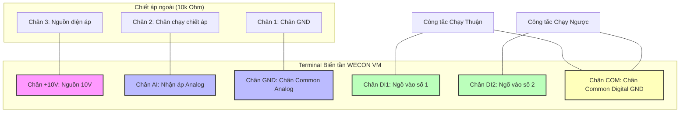
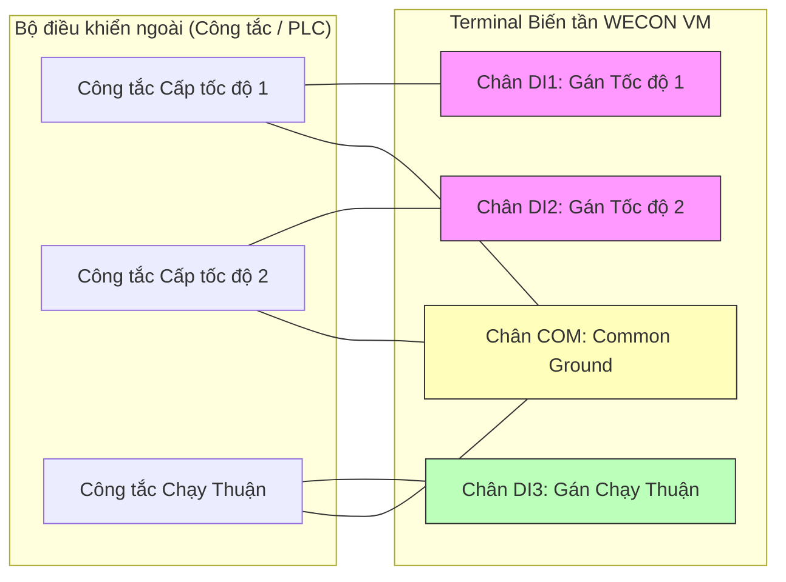
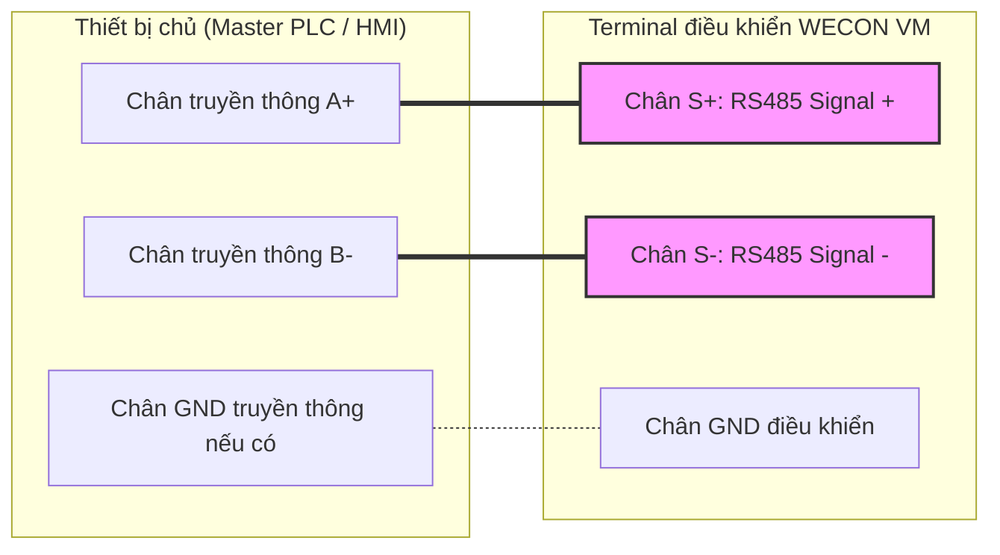

## 1. Nhóm lệnh cơ bản và chế độ vận hành

| Mã lệnh | Tên thông số / Chức năng | Dải cài đặt | Mặc định | Địa chỉ Modbus (RAM) |
| --- | --- | --- | --- | --- |
| **F1.00** | Default Setting Restoring (Khôi phục cài đặt gốc) | `0`: Không thực hiện `1`: Khôi phục cài đặt gốc (trừ nhóm F2) `2`: Xóa lịch sử lỗi | 0 | 0100H |
| **F0.01** | Command source selection (Chọn nguồn lệnh chạy) | `0`: Bàn phím điều khiển (LED REMOTE tắt) `1`: Terminal ngoài (LED REMOTE sáng) `2`: Truyền thông RS-485 (LED REMOTE nhấp nháy) | 0 | 0001H |
| **F0.02** | Setting main frequency source X (Chọn nguồn đặt tần số) | `0`: Cài đặt số (không lưu khi mất điện) `1`: Cài đặt số (lưu khi mất điện) `2`: Núm xoay trên bàn phím (Potentiometer) `3`: Ngõ vào tương tự AI `4`: Đa cấp tốc độ (Multi-stage speed) `5`: PLC đơn giản (Simple PLC) `6`: Truyền thông RS-485 | 2 | 0002H |
| **F0.03** | Keypad setting frequency (Tần số cài bằng bàn phím) | `0.00 Hz` ~ [`F0.05`](#f005) | 50.0 Hz | 0003H |
| **F0.04** | Running direction selection (Chọn hướng quay mặc định) | `0`: Chạy thuận (Forward) `1`: Chạy ngược (Reverse) | 0 | 0004H |
| **F0.12** | Stop Mode (Chế độ dừng động cơ) | `0`: Dừng giảm tốc (Decelerate to stop) `1`: Dừng tự do (Free stop) | 0 | 000CH |
| **F0.13** | Retentive of digital setting frequency (Lưu tần số cài đặt) | `0`: Không lưu khi mất điện `1`: Lưu khi mất điện | 1 | 000DH |
| **F7.01** | STOP Button Function (Chức năng nút STOP trên bàn phím) | `0`: Chỉ có tác dụng ở chế độ bàn phím `1`: Có tác dụng trong mọi chế độ điều khiển (An toàn) | 1 | 0701H |
| **F1.01** | Parameters Lockup (Khóa bảo vệ tham số) | `0`: Không khóa (Cho phép chỉnh sửa) `1`: Khóa ghi tham số | 0 | 0101H |
| **F1.02** | User Password (Mật khẩu bảo vệ người dùng) | `0` ~ `65000` (Cài đặt `0` để tắt mật khẩu) | 0 | 0102H |

### F1.00 (Khôi phục cài đặt gốc)

- `1`: Đưa toàn bộ các tham số về mặc định nhà sản xuất để cấu hình lại từ đầu. Lưu ý là lệnh này **không làm thay đổi nhóm tham số động cơ F2** để tránh việc người dùng phải cài đặt lại thông số động cơ đã thiết lập trước đó.

### F0.01 (Nguồn nhận lệnh chạy Start/Stop)

- `0 (Bàn phím)`: Nhấn phím **RUN** và **STOP/RESET** trên mặt biến tần để vận hành.
- `1 (Terminal ngoài)`: Ra lệnh chạy thông qua các công tắc/nút nhấn nối vào các chân digital input (`DI1` ~ `DI4`) và chân chung `COM`.
- `2 (Truyền thông)`: Ra lệnh chạy thuận/ngược/dừng qua mạng RS-485 từ PLC hoặc màn hình HMI.

### F0.02 (Nguồn đặt giá trị Tần số/Tốc độ)

- Quy định thiết bị nào sẽ kiểm soát tần số đầu ra của biến tần. Giá trị mặc định là `2` nghĩa là xoay núm chiết áp tích hợp trên bàn phím để tăng/giảm tốc độ. Nếu muốn điều khiển qua chiết áp ngoài nối vào chân AI, ta phải chuyển giá trị này sang `3`.

---

## 2. Nhóm lệnh giới hạn tần số và đa cấp tốc độ

| Mã lệnh | Tên thông số / Chức năng | Dải cài đặt | Mặc định | Địa chỉ Modbus (RAM) |
| --- | --- | --- | --- | --- |
| **F0.05** | Maximum Output Frequency (Tần số đầu ra tối đa) | `50.00 Hz` ~ `400.00 Hz` | 50.0 Hz | 0005H |
| **F0.06** | Upper Limit of Frequency (Giới hạn tần số trên) | [`F0.07`](#f007) ~ [`F0.05`](#f005) | 50.0 Hz | 0006H |
| **F0.07** | Lower Limit of Frequency (Giới hạn tần số dưới) | `0.00 Hz` ~ [`F0.06`](#f006) | 0.0 Hz | 0007H |
| **F0.08** | Option of frequency lower limit (Xử lý khi dưới giới hạn dưới) | `0`: Tiếp tục chạy ở giới hạn dưới `1`: Dừng động cơ (Stop) `2`: Chờ (Standby) | 0 | 0008H |
| **FD.00** | Multistage speed 0 (Tần số cấp tốc độ 0) | `-100.0%` ~ `100.0%` (Tỉ lệ so với [`F0.05`](#f005)) | 0.00% | 0D00H |
| **FD.01** | Multistage speed 1 (Tần số cấp tốc độ 1) | `-100.0%` ~ `100.0%` | 0.00% | 0D01H |
| **FD.02** | Multistage speed 2 (Tần số cấp tốc độ 2) | `-100.0%` ~ `100.0%` | 0.00% | 0D02H |
| **FD.03** | Multistage speed 3 (Tần số cấp tốc độ 3) | `-100.0%` ~ `100.0%` | 0.00% | 0D03H |
| **F5.07** | AI minimum input (Điện áp tối thiểu ngõ vào AI) | `0.00 V` ~ [`F5.09`](#f509) | 0.00 V | 0507H |
| **F5.08** | Percentage rate of AI minimum input (Tỉ lệ ứng với AI tối thiểu) | `-100.0%` ~ `100.0%` | 0.0% | 0508H |
| **F5.09** | AI maximum input (Điện áp tối đa ngõ vào AI) | [`F5.07`](#f507) ~ `10.00 V` | 10.00 V | 0509H |
| **F5.10** | Percentage rate of AI maximum input (Tỉ lệ ứng với AI tối đa) | `-100.0%` ~ `100.0%` | 100.0% | 050AH |
| **F5.11** | AI filter time (Thời gian lọc nhiễu analog AI) | `0.00 s` ~ `10.00 s` | 0.10 s | 050BH |
| **F0.15** | AI1 Input Option (Cấu hình loại ngõ vào tương tự AI) | `0`: 0-10V `1`: 4-20mA `2`: 0-20mA `3`: 0-5V `4`: 0.5-4.5V | 0 | 000FH |

### F5.07 ~ F5.10 (Hiệu chuẩn tín hiệu Analog AI)

Bộ tham số này dùng để định cấu hình mối quan hệ giữa điện áp Analog ngõ vào (chân AI) và tần số ngõ ra. Ví dụ, mặc định nguồn điện áp từ `0` đến `10V` tương đương tần số chạy từ `0%` đến `100%` tần số tối đa (tức là 0 - 50Hz). Nếu muốn khi vặn chiết áp hết cỡ (10V) biến tần chỉ chạy tối đa 40Hz, ta có thể cài đặt giới hạn tần số trên [`F0.06`](#f006) về `40.0Hz` hoặc điều chỉnh [`F5.10`](#f510) phù hợp.

---

## 3. Nhóm lệnh động lực học, tăng/giảm tốc và bảo vệ

| Mã lệnh | Tên thông số / Chức năng | Dải cài đặt | Mặc định | Địa chỉ Modbus (RAM) |
| --- | --- | --- | --- | --- |
| **F0.10** | Acceleration Time 1 (Thời gian tăng tốc 1) | `0.0 s` ~ `100.0 s` | 10.0 s | 000AH |
| **F0.11** | Deceleration Time 1 (Thời gian giảm tốc 1) | `0.0 s` ~ `100.0 s` | 10.0 s | 000BH |
| **F4.00** | Torque Boost (Mức tăng cường mô-men xoắn khởi động) | `0.0%` ~ `30.0%` | 4.0% | 0400H |
| **F4.01** | Cut-off frequency of torque boost (Tần số cắt tăng mô-men) | `0.00 Hz` ~ [`F0.05`](#f005) | 50.00 Hz | 0401H |
| **F0.09** | Carrier Frequency (Tần số băm xung sóng mang - Carrier) | `1.0 kHz` ~ `6.0 kHz` | 6.0 kHz | 0009H |
| **F4.06** | Auto carrier frequency adjustment (Tự động chỉnh tần số băm) | `0`: Không kích hoạt `1`: Kích hoạt theo nhiệt độ | 0 | 0406H |
| **F4.02** | DC braking start frequency (Tần số bắt đầu phanh DC khi dừng) | `0.00 Hz` ~ [`F0.05`](#f005) | 0.00 Hz | 0402H |
| **F4.03** | Delay time of DC braking at stop (Thời gian chờ trước khi phanh DC) | `0.0 s` ~ `50.0 s` | 0.0 s | 0403H |
| **F4.04** | Current of DC braking at stop (Dòng điện phanh DC khi dừng) | `0%` ~ `100%` | 0% | 0404H |
| **F4.05** | Time of DC braking at stop (Thời gian thực hiện phanh DC) | `0.0 s` ~ `50.0 s` | 0.0 s | 0405H |

### F4.00 (Mô-men xoắn khởi động)

Mức bù áp ở tần số thấp giúp tăng lực kéo khởi động cho động cơ (đặc biệt cần thiết đối với tải nặng như băng tải, máy nâng hạ). Đặt giá trị này quá cao có thể gây ra lỗi quá dòng khởi động (`Err02`) hoặc làm động cơ quá nhiệt.

---

## 4. Nhóm lệnh cấu hình động cơ (Vector Control / Auto-Tuning)

Một điểm đặc biệt nổi bật của dòng biến tần **WECON VM** là nó được thiết kế hỗ trợ vận hành cả **Động cơ 1 pha** (Single-Phase Motor - rất phổ biến trong dân dụng và nông nghiệp) ngoài các loại động cơ 3 pha thông thường.

| Mã lệnh | Tên thông số / Chức năng | Dải cài đặt | Mặc định | Địa chỉ Modbus (RAM) |
| --- | --- | --- | --- | --- |
| **F2.00** | Motor Rated Power (Công suất định mức động cơ) | `0.1 kW` ~ `2.2 kW` | Theo model | 0200H |
| **F2.01** | Motor Rated Voltage (Điện áp định mức động cơ) | `0` ~ `380 V` | Theo model | 0201H |
| **F2.02** | Motor Rated Frequency (Tần số định mức động cơ) | `0` ~ [`F0.05`](#f005) | Theo model | 0202H |
| **F2.03** | Motor Rated Current (Dòng điện định mức động cơ) | `1.00 A` ~ `10.00 A` | Theo model | 0203H |
| **F2.05** | Type of Motor (Lựa chọn loại động cơ sử dụng) | `0`: Động cơ 1 pha (Single Phase) `1`: Động cơ 3 pha (Three Phase) | 0 | 0205H |
| **F2.06** | Single-phase motor turns ratio (Tỷ số vòng dây chính/phụ) | `10` ~ `200` | 80 | 0206H |
| **F2.07** | Single-phase motor current factor (Hệ số sửa dòng động cơ 1 pha) | `50` ~ `200` | 130 | 0207H |

:::important[Lưu ý cấu hình động cơ 1 pha:]
Nếu sử dụng biến tần để điều khiển động cơ 1 pha thông thường (bơm nước dân dụng, quạt trần...), hãy chắc chắn rằng **[F2.05](#f205) = 0**. Lúc này biến tần sẽ kích hoạt thuật toán điều khiển chuyên dụng cho động cơ 1 pha dựa trên các thông số tự cảm phụ trợ tại [`F2.06`](#f206) và [`F2.07`](#f207).
:::

---

## 5. Nhóm lệnh cấu hình Terminal I/O và PID nâng cao

| Mã lệnh | Tên thông số / Chức năng | Dải cài đặt | Mặc định | Địa chỉ Modbus (RAM) |
| --- | --- | --- | --- | --- |
| **F5.00** | DI1 terminal function selection (Chức năng ngõ vào số DI1) | `0` ~ `14` | 1 (FWD) | 0500H |
| **F5.01** | DI2 terminal function selection (Chức năng ngõ vào số DI2) | `0` ~ `14` | 2 (REV) | 0501H |
| **F5.02** | DI3 terminal function selection (Chức năng ngõ vào số DI3) | `0` ~ `14` | 6 (Reset) | 0502H |
| **F5.03** | DI4 terminal function selection (Chức năng ngõ vào số DI4) | `0` ~ `14` | 0 | 0503H |
| **F5.05** | Terminal Command Option (Chế độ công tắc chạy ngoài) | `0` ~ `3` | 0 | 0505H |
| **F5.16** | AI Input Digital Functional Option (Dùng AI làm nút số ảo) | `0` ~ `10` | 0 | 0510H |
| **F5.17** | AI Input Valid Level Option (Mức logic tác động của AI ảo) | `0`: Tác động mức thấp `1`: Tác động mức cao | 1 | 0511H |
| **F6.00** | Relay Output Option (Chức năng ngõ ra Relay RA-RC) | `0` ~ `5` | 0 | 0600H |
| **F6.08** | AO1 Output Option (Chức năng ngõ ra Analog AO1) | `0` ~ `5` | 0 | 0608H |
| **F0.14** | Fan operating mode (Chế độ quạt tản nhiệt) | `0`: Chỉ chạy khi động cơ chạy `1`: Luôn chạy khi có nguồn | 0 | 000EH |

### Bảng gán chức năng cho chân Digital Input (DI1 ~ DI4)

- `0`: Không sử dụng (No function)
- `1`: Lệnh chạy thuận (FWD)
- `2`: Lệnh chạy ngược (REV)
- `3`: Điều khiển chạy 3 dây (Three-wire operation control)
- `4`: Chạy nhấp thuận (FJOG)
- `5`: Chạy nhấp ngược (RJOG)
- `6`: Reset báo lỗi biến tần (Error Reset)
- `7`: Tăng tần số ngoài (Terminal UP)
- `8`: Giảm tần số ngoài (Terminal Down)
- `9`: Xóa giá trị tần số UP/DOWN
- `10`: Ngõ vào báo lỗi ngoại vi (External error input - Thường Hở)
- `11`: Khôi phục trạng thái bộ PLC (PLC Status reset)
- `12`: Chân chọn cấp tốc độ 1 (Multistage speed terminal 1)
- `13`: Chân chọn cấp tốc độ 2 (Multistage speed terminal 2)

### F5.05 (Chế độ nút nhấn ngoài điều khiển chạy)

- `0 (Hai dây chế độ 1)`: Mặc định. Chân DI1 gán FWD (khi nối DI1 với COM thì chạy thuận, ngắt ra thì dừng). Chân DI2 gán REV (nối DI2 với COM thì chạy ngược, ngắt ra thì dừng).
- `2 (Ba dây chế độ 1)`: Sử dụng nút nhấn nhả (Push-button). Chân được gán chức năng `3` sẽ hoạt động như một nút STOP (thường đóng). Chân FWD và REV hoạt động như nút RUN (thường hở) tự giữ.

### F6.00 (Chức năng ngõ ra Relay RA-RC)

- `0`: Không sử dụng.
- `1`: Báo biến tần đang chạy động cơ (VFD Running).
- `2`: Báo biến tần đang bị lỗi ngắt ngõ ra (Fault Output).
- `3`: Báo biến tần đã sẵn sàng hoạt động (Ready).
- `4`: Kích hoạt/ngắt relay thông qua truyền thông Modbus.

---

## 6. Các ví dụ cấu hình và sơ đồ đấu nối thực tế

### Ví dụ 1: Điều khiển bằng Công tắc ngoài & Chiết áp ngoài (Chế độ Terminal)

Cấu hình phổ biến nhất để khởi động biến tần bằng công tắc xoay vật lý bên ngoài và điều chỉnh tần số (tốc độ) bằng chiết áp xoay 3 chân 10kΩ.

#### 1. Sơ đồ đấu nối dây (Wiring Diagram)

#### 2. Các bước cài đặt tham số (Parameter Settings)

- **Bước 1:** Chuyển nguồn nhận lệnh chạy sang cầu đấu điều khiển ngoài:
  - Cài đặt **[F0.01](#f001) = 1** (Terminal control).
- **Bước 2:** Chuyển nguồn cài đặt tần số nhận từ ngõ vào Analog:
  - Cài đặt **[F0.02](#f002) = 3** (Nhận tín hiệu từ cổng AI).
- **Bước 3:** Kiểm tra dải tín hiệu ngõ vào AI tương ứng là dải điện áp `0 - 10 VDC`:
  - Cài đặt **[F0.15](#f015) = 0** (AI input 0-10V).
- **Bước 4:** Định nghĩa chức năng cho ngõ vào DI1 và DI2 chạy Thuận/Ngược:
  - Cài đặt **[F5.00](#f500) = 1** (DI1 gán chạy FWD).
  - Cài đặt **[F5.01](#f501) = 2** (DI2 gán chạy REV).

---

### Ví dụ 2: Điều khiển Đa cấp tốc độ (Multi-speed Operation)

Ứng dụng thiết lập các tốc độ chạy cố định (ví dụ tốc độ chậm khi khởi tạo, tốc độ trung bình khi khuấy, tốc độ cao khi ly tâm) kích hoạt trực tiếp từ hệ thống điều khiển ngoài (nút gạt hoặc ngõ ra relay của PLC).

#### 1. Sơ đồ đấu nối dây (Wiring Diagram)

#### 2. Các bước cài đặt tham số (Parameter Settings)

- **Bước 1:** Kích hoạt chế độ chạy ngoài bằng cách cài **[F0.01](#f001) = 1**.
- **Bước 2:** Chọn nguồn đặt tần số là đa cấp tốc độ bằng cách cài **[F0.02](#f002) = 4** (Multi-stages speed).
- **Bước 3:** Lập trình các chân DI đầu vào:
  - **[F5.00](#f500) = 12** (DI1 gán chức năng: Chọn cấp tốc độ 1).
  - **[F5.01](#f501) = 13** (DI2 gán chức năng: Chọn cấp tốc độ 2).
  - **[F5.02](#f502) = 1** (DI3 gán chức năng: Chạy Thuận FWD).
- **Bước 4:** Cài đặt các giá trị tần số tương ứng theo phần trăm của tần số tối đa [F0.05](#f005) (giả sử [F0.05](#f005) = 50.0Hz):
  - **[FD.00](#fd00) = 10.00%** (Cấp tốc độ 0, tương đương 5.0 Hz).
  - **[FD.01](#fd01) = 40.00%** (Cấp tốc độ 1, tương đương 20.0 Hz).
  - **[FD.02](#fd02) = 70.00%** (Cấp tốc độ 2, tương đương 35.0 Hz).
  - **[FD.03](#fd03) = 100.00%** (Cấp tốc độ 3, tương đương 50.0 Hz).

#### Bảng logic kích hoạt các cấp tốc độ:

| Công tắc Tốc độ 2 (DI2) | Công tắc Tốc độ 1 (DI1) | Cấp tốc độ kích hoạt | Tần số ngõ ra thực tế (Hz) |
| :---: | :---: | :---: | :---: |
| OFF | OFF | Cấp tốc độ 0 ([`FD.00`](#fd00)) | **5.00 Hz** |
| OFF | **ON** | Cấp tốc độ 1 ([`FD.01`](#fd01)) | **20.00 Hz** |
| **ON** | OFF | Cấp tốc độ 2 ([`FD.02`](#fd02)) | **35.00 Hz** |
| **ON** | **ON** | Cấp tốc độ 3 ([`FD.03`](#fd03)) | **50.00 Hz** |

---

### Ví dụ 3: Điều khiển và giám sát qua truyền thông Modbus RTU (RS-485)

Kết nối truyền thông Modbus RTU sử dụng cổng RS-485 dạng Domino để gửi lệnh điều khiển tần số, ra lệnh chạy và giám sát dòng điện, điện áp, mã lỗi từ PLC hoặc HMI.

#### 1. Sơ đồ đấu nối truyền thông RS-485

Biến tần WECON VM có hai cầu đấu tín hiệu truyền thông chuyên dụng là **S+** và **S-** ngay trên Terminal điều khiển, giúp việc đấu nối 2 dây truyền thông Modbus cực kỳ nhanh chóng mà không cần thông qua giắc cắm mạng RJ45 phức tạp.

#### 2. Các bước cài đặt tham số truyền thông Modbus RTU

Thực hiện cài đặt các tham số sau trên bàn phím biến tần trước khi kết nối mạng:

1.  [**F0.01 = 2**](#f001) (Chọn nguồn lệnh chạy là cổng truyền thông RS-485).
2.  [**F0.02 = 6**](#f002) (Chọn nguồn cài đặt tần số chính là cổng truyền thông RS-485).
3.  **FC.00 = 1** (Đặt địa chỉ Station của biến tần trong mạng là địa chỉ 1).
4.  **FC.01 = 1** (Baudrate là `9600 bps`. Các giá trị khác: `0` là 4800 bps, `2` là 19200 bps).
5.  **FC.02 = 0** (Định dạng khung truyền tin Modbus là `8-N-1` - 8 data bits, no parity check, 1 stop bit. Giá trị khác: `1` cho 8-O-1, `2` cho 8-E-1).
6.  **FC.03 = 2** (Thời gian trễ phản hồi phản hồi là 2ms).

#### 3. Bản đồ địa chỉ truyền thông Modbus RTU (Control Register Map)

Biến tần hỗ trợ các mã lệnh Modbus cơ bản như **03H** (Đọc nhiều thanh ghi) và **06H / 10H** (Ghi một hoặc nhiều thanh ghi).

| Địa chỉ (Hex) | Chức năng điều khiển / Giám sát | Hướng | Mô tả chi tiết dải giá trị |
| :---: | --- | :---: | --- |
| **1000H** | Cài đặt tần số qua truyền thông | R/W | Dải giá trị từ `-10000` đến `10000`, tương đương `-100.00%` ~ `100.00%` tần số tối đa [`F0.05`](#f005) |
| **2000H** | Lệnh chạy (Control Command) | W | `0001`: Chạy thuận (FWD) `0002`: Chạy ngược (REV) `0003`: Chạy nhấp thuận (JOG FWD) `0004`: Chạy nhấp ngược (JOG REV) `0005`: Dừng tự do (Free Stop) `0006`: Dừng giảm tốc (Decelerate Stop) `0007`: Reset lỗi (Fault Reset) |
| **3000H** | Trạng thái chạy hiện tại | R | `0001`: Đang chạy thuận (FWD) `0002`: Đang chạy ngược (REV) `0003`: Đã dừng (Stopped) |
| **1001H** | Giám sát tần số hoạt động (Hz) | R | Đọc tần số thực tế đầu ra động cơ (Độ phân giải: 2 số thập phân) |
| **1002H** | Giám sát tần số cài đặt (Hz) | R | Đọc tần số cài đặt hiện hành (Độ phân giải: 2 số thập phân) |
| **1003H** | Giám sát điện áp DC Bus (V) | R | Điện áp trên bus DC (Độ phân giải: 1 số thập phân) |
| **1004H** | Giám sát điện áp đầu ra (V) | R | Điện áp đầu ra động cơ (Độ phân giải: 1 số thập phân) |
| **1005H** | Giám sát dòng điện đầu ra (A) | R | Dòng điện hoạt động thực tế (Độ phân giải: 2 số thập phân) |
| **1006H** | Giám sát nhiệt độ cánh tản nhiệt | R | Đọc nhiệt độ khối IGBT (Độ phân giải: 1 số thập phân) |
| **1007H** | Giám sát trạng thái ngõ vào DI | R | Trạng thái vật lý chân DI1 ~ DI4. Quy đổi theo trọng số nhị phân (DI1: bit 0, DI2: bit 1, DI3: bit 2, DI4: bit 3) |
| **8000H** | Đọc mã sự cố lỗi hiện hành | R | `0000`: Không có lỗi `0002`: Lỗi quá dòng khi tăng tốc (`Err02`)... |

#### 4. Ghi tham số vào RAM và EEPROM thông qua truyền thông Modbus

Mặc định, khi ta sử dụng lệnh ghi ghi vào các địa chỉ dạng `0xxxH` (ví dụ `0006H` để ghi giới hạn trên tần số), biến tần sẽ ghi dữ liệu vào bộ nhớ tạm thời **RAM** (giá trị sẽ bị mất và khôi phục về cũ khi tắt nguồn biến tần).

Để lưu trữ vĩnh viễn các tham số vào bộ nhớ **EEPROM** để khởi động lại vẫn giữ nguyên giá trị, ta áp dụng quy tắc đổi địa chỉ: **Thay thế số `0` ở đầu địa chỉ RAM bằng ký tự `F`**.

- _Ví dụ 1:_ Cài đặt thời gian tăng tốc [`F0.10`](#f010). Địa chỉ RAM là `000AH`. Địa chỉ ghi lưu trữ EEPROM là `F00AH`.
- _Ví dụ 2:_ Đổi tần số giới hạn trên [`F0.06`](#f006). Địa chỉ RAM là `0006H`. Địa chỉ ghi lưu trữ EEPROM là `F006H`.

> [!WARNING]
> Tuổi thọ ghi của chip EEPROM chỉ đạt khoảng 1 triệu lần. Nếu hệ thống điều khiển PLC/HMI liên tục thay đổi giá trị tần số chạy của động cơ dựa theo tải, bạn **phải ghi tần số chạy vào địa chỉ RAM (1000H)** để bảo vệ phần cứng biến tần, tuyệt đối không được ghi liên tục vào địa chỉ lưu trữ EEPROM để tránh hỏng chíp nhớ.