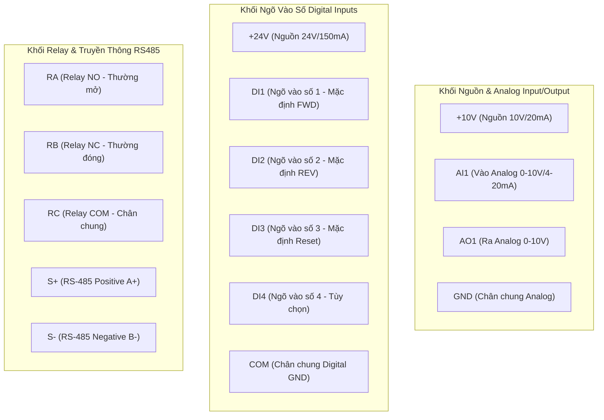
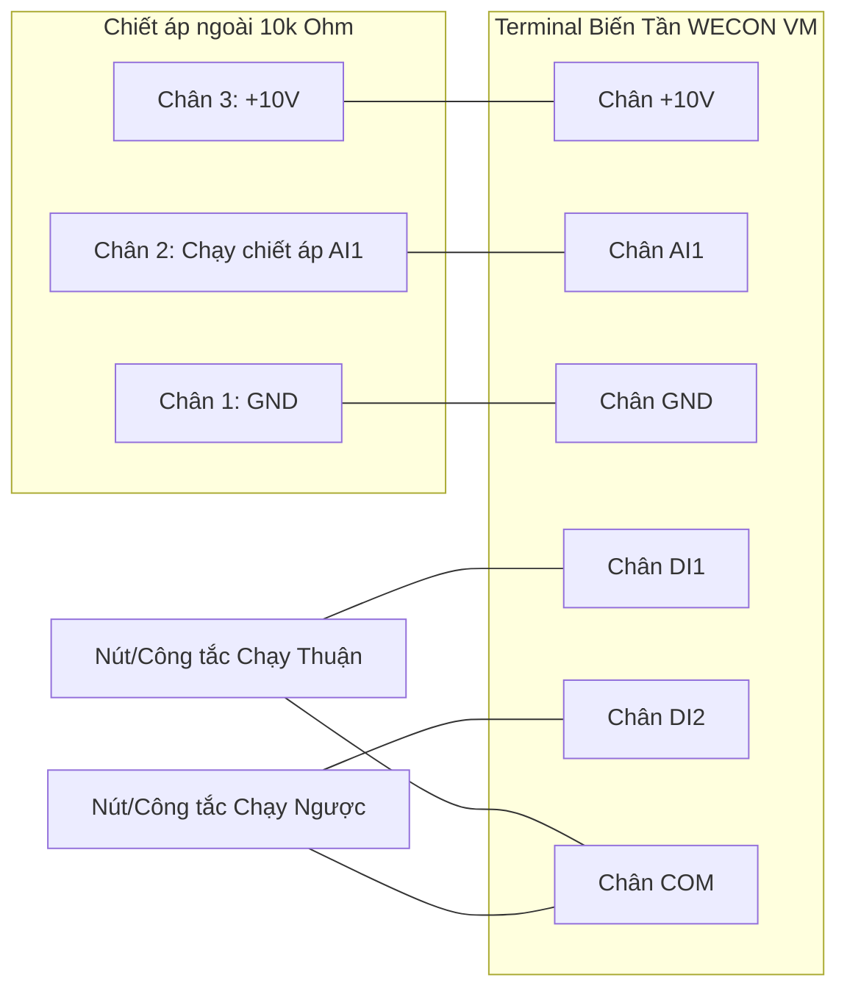

Biến tần **WECON VM Series AC Drive** (Phiên bản tài liệu chuẩn **V2.0**) là dòng biến tần đa năng cao cấp của hãng WECON, hỗ trợ công suất từ `0.4 kW` đến `1000.0 kW` (Nguồn vào 1 pha 220V / 3 pha 380V). Điểm đặc biệt nổi bật của dòng WECON VM là khả năng vận hành linh hoạt cho cả **Động cơ 3 pha** và **Động cơ 1 pha** (Single-Phase AC Motor), tích hợp sẵn bộ điều khiển Vector, phanh DC, truyền thông Modbus RTU và bộ PLC nội hàm 16 cấp tốc độ.

Tài liệu này tổng hợp toàn bộ cấu trúc kỹ thuật, sơ đồ đấu nối, bàn phím điều khiển và phương pháp cài đặt chi tiết từ tài liệu chính hãng mới nhất của WECON.

---

## 1. Thông số kỹ thuật & Phân loại Model (Technical Specifications)

### 1.1 Bảng thông số kỹ thuật cơ bản

| Hạng mục | Thông số chi tiết |
| :--- | :--- |
| **Điện áp ngõ vào** | 1 Phase 220V ±15% (dòng 2S) hoặc 3 Phase 380V ±15% (dòng 4T) |
| **Tần số ngõ vào** | 50 Hz / 60 Hz (Dải cho phép: 47 Hz ~ 63 Hz) |
| **Điện áp ngõ ra** | 0 ~ Điện áp ngõ vào định mức |
| **Tần số ngõ ra** | `0.00 Hz` ~ `320.00 Hz` (Độ phân giải cài đặt: 0.01 Hz) |
| **Loại động cơ hỗ trợ** | Động cơ không đồng bộ 3 pha và **Động cơ 1 pha** |
| **Chế độ điều khiển** | Điều khiển V/F (V/F Control) và Điều khiển Vector vòng hở (Sensorless Vector Control) |
| **Khả năng chịu quá tải** | `150%` dòng định mức trong 60 giây, `180%` dòng định mức trong 3 giây |
| **Tần số sóng mang (Carrier)** | `0.6 kHz` ~ `15.0 kHz` (Tự động điều chỉnh theo nhiệt độ IGBT) |
| **Cổng truyền thông** | Tích hợp sẵn RS-485 (Hỗ trợ chuẩn Modbus RTU, 1200 ~ 38400 bps) |
| **Tiêu chuẩn bảo vệ** | IP20, Làm mát bằng quạt gió cưỡng bức |

---

## 2. Sơ đồ đấu nối mạch động lực & Cầu đấu điều khiển (Terminal Connection)

### 2.1 Cầu đấu mạch động lực (Main Circuit Terminals)

* **`R/L, S, T/N`**: Cầu đấu nguồn điện vào (Dòng 1 pha nối R-S hoặc R-N; dòng 3 pha nối R-S-T).
* **`U, V, W`**: Cầu đấu ngõ ra nối trực tiếp tới Động cơ (Không được nối nguồn AC vào 3 chân này).
* **`Earth / PE`**: Chân tiếp địa bảo vệ an toàn chống rò điện.

### 2.2 Cầu đấu điều khiển tín hiệu (Control Terminals)

| Tên chân | Chức năng chi tiết | Mô tả kỹ thuật |
| :--- | :--- | :--- |
| **`+10V / GND`** | Nguồn cấp áp chiết áp ngoài | Điện áp 10 VDC, dòng ra tối đa 20 mA |
| **`AI1 / GND`** | Ngõ vào tương tự Analog | Nhận áp `0 ~ 10V` hoặc dòng `0/4 ~ 20mA` (cấu hình qua [`F5.41`](./parameter-configuration.mdx#f541)) |
| **`AO1 / GND`** | Ngõ ra tương tự Analog | Phát áp `0 ~ 10V` (giám sát tần số, dòng điện, điện áp) |
| **`+24V / COM`** | Nguồn cấp ngõ vào số DI | Điện áp 24 VDC, dòng ra tối đa 150 mA |
| **`DI1 ~ DI4`** | Ngõ vào điều khiển số Digital | Kết nối công tắc/nút nhấn/Relay PLC tới chân `COM` |
| **`RA / RB / RC`** | Ngõ ra Relay báo trạng thái | RA-RC thường mở (NO), RB-RC thường đóng (NC). Khả năng chịu tải: 250VAC/3A |
| **`S+ / S-`** | Cổng truyền thông RS-485 | Kết nối dây xoắn đôi tín hiệu A(+) và B(-) truyền thông Modbus RTU |

---

## 3. Bàn phím điều khiển & Thao tác vận hành (Keypad Operation)

### 3.1 Cấu trúc màn hình LED và Đèn báo hiệu

* **Đèn `RUN`**: Sáng khi biến tần đang chạy động cơ; Tắt khi biến tần dừng.
* **Đèn `REMOTE`**: Tắt khi điều khiển bằng Bàn phím; Sáng khi chạy bằng Terminal ngoài; Nhấp nháy khi chạy qua Truyền thông RS-485.
* **Đèn `FWD/REV`**: Sáng khi quay Thuận (FWD); Tắt khi quay Ngược (REV); Nhấp nháy khi đang chuyển đổi hướng quay.
* **Đèn `ALARM`**: Tắt khi bình thường; Nhấp nháy/Sáng khi biến tần bị lỗi (Fault).
* **Núm xoay Potentiometer**: Dùng để thay đổi trực tiếp tần số chạy khi chọn `F0.03 = 1`.

### 3.2 Ý nghĩa các phím bấm

| Phím bấm | Tên phím | Chức năng chính |
| :---: | :--- | :--- |
| **`PRG`** | Programming / Escape | Chuyển đổi giữa màn hình giám sát và danh mục cài đặt tham số (Group F0 - FD) |
| **`ENT`** | Enter / Save | Truy cập chi tiết mã hàm và lưu giá trị vừa thay đổi |
| **`▲` / `▼`** | Up / Down | Tăng / giảm mã tham số hoặc điều chỉnh giá trị số |
| **`>>`** | Shift / Switch | Di chuyển con trỏ vị trí nhập số; Chuyển đổi hiển thị thông số giám sát (Hz, A, V...) |
| **`RUN / STOP`** | Run / Stop / Reset | Kích hoạt Lệnh Chạy / Dừng (chế độ bàn phím) hoặc xóa mã lỗi sau khi xử lý sự cố |

---

## 4. Các ví dụ cài đặt mạch ứng dụng thực tế

### Ví dụ 1: Chạy bằng Công tắc ngoài & Chiết áp ngoài (Chế độ Terminal)

#### 1. Sơ đồ đấu nối dây vật lý (Wiring Diagram)

#### 2. Bảng cài đặt thông số chi tiết từ A - Z khi đưa biến tần mới vào vận hành

Bảng dưới đây liệt kê toàn bộ các mã tham số cần cấu hình, kèm theo **chi tiết các mã tùy chọn giá trị bên trong từng mã hàm** và mục đích sử dụng thực tế:

    
    | Nhóm tham số | Mã hàm | Tên thông số / Chức năng | Các giá trị tùy chọn bên trong Mã hàm (Internal Options & Meaning) | Giá trị chọn | Giải thích tác dụng & Mục đích cấu hình |
    | :--- | :---: | --- | --- | :---: | --- |
    | **1. Nguồn điều khiển & Tần số** | **[F0.01](./parameter-configuration.mdx#f001)** | Start/Stop Channel | `0`: Điều khiển từ Bàn phím (Keypad) `1`: Điều khiển từ Cầu đấu ngoài (DI Terminal) `2`: Điều khiển qua Truyền thông RS-485 | **`1`** | Chuyển nguồn nhận lệnh Chạy/Dừng sang cầu đấu Terminal ngoài (công tắc/nút nhấn). |
    | | **[F0.03](./parameter-configuration.mdx#f003)** | Main Frequency Source X | `0`: Cài bằng phím bấm `F0.08` `1`: Chiết áp tích hợp trên bàn phím `2`: Ngõ vào Analog AI1 (Chiết áp ngoài) `4`: Nút Tăng/Giảm ngoài (Terminal UP/DW) `6`: Đa cấp tốc độ (Multi-Stage Speed) `7`: Bộ PLC nội hàm (Inner Simple PLC) `8`: Điều khiển vòng kín PID `9`: Truyền thông RS-485 | **`2`** | Chuyển nguồn đặt tần số sang ngõ vào Analog AI1 để điều chỉnh tốc độ bằng chiết áp 10kΩ ngoài. |
    | | **[F0.10](./parameter-configuration.mdx#f010)** | Max Output Frequency | Dải cài: `50.00 Hz` ~ `320.00 Hz` (Mặc định: `50.00 Hz`) | **`50.00 Hz`** | Giới hạn tần số tối đa biến tần có thể phát ra (cài khớp tần số định mức motor). |
    | | **[F0.12](./parameter-configuration.mdx#f012)** | Upper Limit Frequency | Dải cài: [`F0.14`](./parameter-configuration.mdx#f014) ~ [`F0.10`](./parameter-configuration.mdx#f010) (Mặc định: `50.00 Hz`) | **`50.00 Hz`** | Khóa trần tần số hoạt động thực tế tối đa. |
    | | **[F0.18](./parameter-configuration.mdx#f018)** | Acceleration Time 1 | Dải cài: `0.01 s` ~ `650.00 s` (Thời gian tăng tốc 1) | **`5.00 s`** | Thời gian biến tần tăng tốc từ 0 Hz lên 50 Hz khi đóng công tắc chạy. |
    | | **[F0.19](./parameter-configuration.mdx#f019)** | Deceleration Time 1 | Dải cài: `0.01 s` ~ `650.00 s` (Thời gian giảm tốc 1) | **`5.00 s`** | Thời gian biến tần giảm tốc từ 50 Hz về 0 Hz khi ngắt công tắc chạy. |
    | **2. Cấu hình Cầu đấu Ngõ vào** | **[F5.00](./parameter-configuration.mdx#f500)** | DI1 Function Option | `0`: Không dùng `1`: Chạy Thuận (FWD Running) `2`: Chạy Ngược (REV Running) `3`: Điều khiển 3 dây `4`: Chạy nhấp Thuận (FJOG) `6`: Reset lỗi biến tần `12`: Chọn cấp tốc độ 1 | **`1`** | Gán chân DI1 làm lệnh Chạy Thuận (nối DI1 với COM thì biến tần chạy Thuận). |
    | | **[F5.01](./parameter-configuration.mdx#f501)** | DI2 Function Option | Các tùy chọn mã hàm tương tự chân DI1 | **`2`** | Gán chân DI2 làm lệnh Chạy Ngược (nối DI2 với COM thì biến tần chạy Ngược). |
    | | **[F5.41](./parameter-configuration.mdx#f541)** | AI Input Signal Selection | `0`: Điện áp `0 ~ 10 VDC` `1`: Dòng điện `0/4 ~ 20 mA` | **`0`** | Đặt cổng AI1 nhận tín hiệu dạng điện áp `0 ~ 10V` tương thích chiết áp xoay 3 chân. |
    | **3. Thông số Động cơ (Motor Params)** | **[F2.00](./parameter-configuration.mdx#f200)** | Type of Motor | `0`: Động cơ 1 pha (Single Phase Motor) `1`: Động cơ 3 pha (Three Phase Motor) | **`1`** | Chọn đúng loại động cơ 3 pha (chọn = `0` nếu dùng động cơ 1 pha). |
    | | **[F2.01](./parameter-configuration.mdx#f201)** | Motor Rated Power | Dải cài: `0.4 kW` ~ `1000.0 kW` (Công suất motor) | **`1.5 kW`** | Nhập công suất định mức động cơ ghi trên tem nhãn (kW). |
    | | **[F2.02](./parameter-configuration.mdx#f202)** | Motor Rated Voltage | Dải cài: `0 V` ~ `440 V` (Điện áp motor) | **`220V / 380V`** | Nhập điện áp định mức động cơ ghi trên tem nhãn (Volt). |
    | | **[F2.03](./parameter-configuration.mdx#f203)** | Motor Rated Current | Dải cài: `0.1 A` ~ `2000.0 A` (Dòng điện motor) | **`6.2 A`** | Nhập dòng điện định mức động cơ ghi trên tem nhãn (Ampe) – Căn cứ bảo vệ rơ-le nhiệt. |
    | | **[F2.04](./parameter-configuration.mdx#f204)** | Motor Rated Frequency | Dải cài: `0.01 Hz` ~ [`F0.10`](./parameter-configuration.mdx#f010) (Tần số motor) | **`50.00 Hz`** | Nhập tần số định mức động cơ ghi trên tem nhãn (Hz). |
    | | **[F2.05](./parameter-configuration.mdx#f205)** | Motor Rated RPM | Dải cài: `0` ~ `65000 RPM` (Tốc độ vòng quay) | **`1430 RPM`** | Nhập tốc độ vòng quay định mức của motor (Vòng/phút) để màn hình hiển thị đúng RPM. |
    | **4. Tham số Bảo vệ & Ổn định** | **[F4.01](./parameter-configuration.mdx#f401)** | Manual Torque Boost | `0.1%` ~ `30.0%` (0 = Tự động bù áp) | **`4.0 %`** | Bù áp ở tần số thấp giúp khởi động kéo tải nặng không bị khựng. |
    | | **[F4.16](./parameter-configuration.mdx#f416)** | Auto Voltage Regular (AVR) | `0`: Tắt chế độ ổn áp AVR `1`: Bật chế độ tự động ổn định điện áp AVR | **`1`** | Tự động ổn định điện áp ngõ ra U,V,W giữ motor chạy êm kể cả khi nguồn lưới trồi sụt. |
    | | **[FA.00](./parameter-configuration.mdx#fa00)** | Motor Overload Option | `0`: Tắt bảo vệ quá tải motor `1`: Bật rơ-le nhiệt điện tử bảo vệ quá tải motor | **`1`** | Kích hoạt rơ-le nhiệt điện tử bảo vệ động cơ chống chạy quá tải gây cháy cuộn dây. |
    | | **[FA.01](./parameter-configuration.mdx#fa01)** | Motor Overload Level | Dải cài: `20.0%` ~ `250.0%` dòng định mức | **`100.0 %`** | Mức dòng điện kích hoạt rơ-le quá tải (100% dòng định mức `F2.03`). |
    | | **[FA.03](./parameter-configuration.mdx#fa03)** | Frequency Limit | Dải cài: `0.00 Hz` ~ `99.99 Hz` | **`0.00 Hz`** | Ngưỡng tần số giới hạn bảo vệ. |
    | | **[FA.04](./parameter-configuration.mdx#fa04)** | Overvoltage Stall Gain | Dải cài: `0%` ~ `500%` | **`100 %`** | Hệ số tự động kéo dài giảm tốc khi Bus DC dâng cao để tránh báo lỗi quá áp `ERR06`. |
    | | **[FA.07](./parameter-configuration.mdx#fa07)** | Overcurrent Stall Gain | Dải cài: `0%` ~ `500%` | **`20 %`** | Hệ số tự động hãm dòng khi tải tăng đột ngột để tránh báo lỗi quá dòng `ERR02/ERR04`. |
    | | **[FA.11](./parameter-configuration.mdx#fa11)** | AC Input Phase Loss | `0`: Tắt bảo vệ `1`: Bật bảo vệ mất pha ngõ vào AC | **`1`** | Tự động báo lỗi `ERR12` và ngắt ngõ ra khi phát hiện mất 1 pha nguồn điện AC ngõ vào. |
    | | **[FA.12](./parameter-configuration.mdx#fa12)** | AC Output Phase Loss | `0`: Tắt bảo vệ `1`: Bật bảo vệ mất pha ngõ ra Motor | **`1`** | Tự động báo lỗi `ERR13` và ngắt ngõ ra khi bị đứt dây pha hoặc đứt cuộn dây motor ngõ ra. |
    

---

### Ví dụ 2: Cấu hình điều khiển Động cơ 1 pha (Single-Phase Motor)

Dòng WECON VM được tối ưu hóa đặc biệt cho động cơ 1 pha (bơm nước dân dụng, quạt hút...).

:::important[Các bước cài đặt động cơ 1 pha:]
1. Đấu nối 2 dây nguồn động cơ 1 pha vào 2 trong 3 chân ngõ ra `U, V, W` của biến tần.
2. Cài đặt mã tham số **[F2.00 = 0](./parameter-configuration.mdx#f200)** để chuyển sang chế độ Động cơ 1 pha (Single Phase Motor).
3. Nhập đầy đủ thông số motor: Công suất **[F2.01](./parameter-configuration.mdx#f201)** (kW), điện áp **[F2.02](./parameter-configuration.mdx#f202)** (V), dòng điện **[F2.03](./parameter-configuration.mdx#f203)** (A), tần số **[F2.04](./parameter-configuration.mdx#f204)** (Hz) và vòng quay **[F2.05](./parameter-configuration.mdx#f205)** (RPM) chuẩn theo tem motor.
:::

---

## 5. Tài liệu liên quan trong hệ thống

:::tip[CHUYỂN ĐẾN CÁC TRANG TRA CỨU CHI TIẾT]
* 📋 **[Bảng Tham Số Cài Đặt Chi Tiết F0 - FD (parameter-configuration.mdx)](./parameter-configuration.mdx)**  
  *Tra cứu toàn bộ danh mục mã hàm, giá trị mặc định, dải cài đặt và địa chỉ RAM.*
* ⚠️ **[Bảng Mã Lỗi & Hướng Dẫn Xử Lý Sự Cố (error-codes.mdx)](./error-codes.mdx)**  
  *Tra cứu danh sách mã lỗi ERR02 ~ ERR22, nguyên nhân và các bước khắc phục.*
* 📡 **[Truyền Thông Modbus RS-485 & Bản Đồ Thanh Ghi (registers-rs485.mdx)](./registers-rs485.mdx)**  
  *Hướng dẫn lập trình kết nối PLC/HMI qua Modbus RTU, bảng địa chỉ 1000H, 2000H, 3000H.*
:::