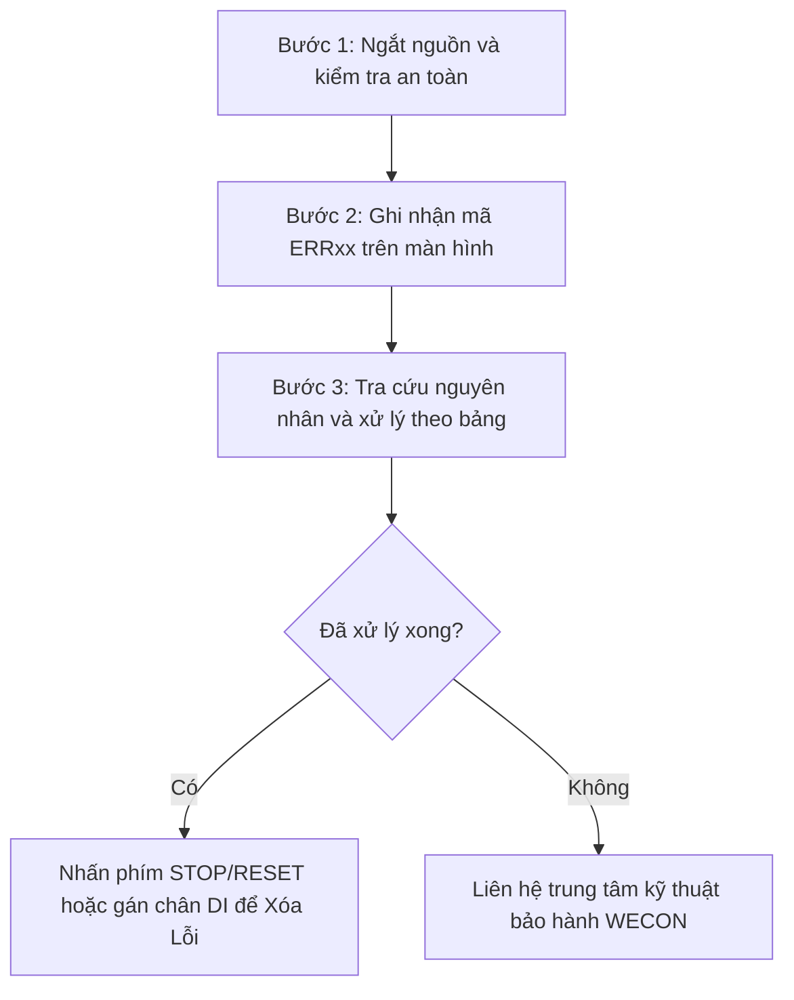

Khi xảy ra sự cố trong quá trình vận hành, biến tần **WECON VM Series** sẽ ngắt ngõ ra để bảo vệ thiết bị và hiển thị mã lỗi dạng **ERRXX** trên bàn phím (đồng thời đèn `ALARM` nhấp nháy). 

Tài liệu này tổng hợp chi tiết toàn bộ bảng mã lỗi chuẩn xác từ **Sổ tay chính thức V2.0 (20251203)**, phân tích nguyên nhân và các bước xử lý từng mã lỗi thực tế.

---

## 1. Bảng tra cứu nhanh mã lỗi & Hướng dẫn khắc phục (ERR02 ~ ERR22)

| Mã lỗi | Tên lỗi chuẩn (English) | Nguyên nhân phổ biến gây ra lỗi | Hướng dẫn khắc phục thực tế |
| :---: | --- | --- | --- |
| **ERR02** | Overcurrent during acceleration | • Ngắn mạch ngõ ra hoặc rò điện tiếp địa dây động cơ • Thời gian tăng tốc [`F0.18`](./parameter-configuration.mdx#f018) quá ngắn • Biến tần chọn công suất nhỏ hơn công suất động cơ | • Kiểm tra cách điện cuộn dây motor và dây cáp ngõ ra U, V, W • Tăng thời gian tăng tốc `F0.18` • Lựa chọn model biến tần phù hợp với động cơ |
| **ERR03** | Overcurrent during deceleration | • Ngắn mạch ngõ ra ngắt quãng • Thời gian giảm tốc [`F0.19`](./parameter-configuration.mdx#f019) quá ngắn | • Kiểm tra lại dây cáp ngõ ra động cơ • Tăng thời gian giảm tốc `F0.19` hoặc lắp thêm điện trở phanh |
| **ERR04** | Overcurrent at constant speed | • Tải cơ khí bị kẹt đột ngột khi đang chạy ổn định • Biến tần chọn công suất quá nhỏ | • Giảm tải cơ khí, kiểm tra ổ bi và trục máy • Thay thế biến tần công suất lớn hơn |
| **ERR05** | Overvoltage during acceleration | • Điện áp nguồn cấp đầu vào quá cao • Thời gian tăng tốc `F0.18` quá ngắn | • Điều chỉnh điện áp nguồn vào về dải định mức (220V/380V) • Tăng thời gian tăng tốc `F0.18` |
| **ERR06** | Overvoltage during deceleration | • Điện áp nguồn đầu vào cao • Thời gian giảm tốc `F0.19` quá ngắn làm năng lượng phản hồi lớn • Chưa lắp bộ phanh / điện trở hãm (Braking Resistor) | • Tăng thời gian giảm tốc `F0.19` • Lắp đặt thêm Điện trở xả phanh hãm DC cho ứng dụng có quán tính lớn |
| **ERR07** | Overvoltage at constant speed | • Điện áp lưới điện đầu vào tăng cao bất thường khi đang chạy | • Kiểm tra biến áp nguồn hoặc điều chỉnh lại điện áp lưới |
| **ERR08** | Snubber resistor overload | • Điện áp nguồn đầu vào không nằm trong dải quy định | • Điều chỉnh lại điện áp nguồn ngõ vào |
| **ERR09** | Low input voltage (Undervoltage) | • Điện áp nguồn ngõ vào quá thấp hoặc mất pha nguồn • Hỏng cầu chỉnh lưu hoặc mạch sụt áp Bus DC | • Kiểm tra nguồn cấp ngõ vào R, S, T • Liên hệ bộ phận hỗ trợ kỹ thuật nếu nguồn vào đủ mà biến tần vẫn báo ERR09 |
| **ERR10** | VFD overload | • Quá tải biến tần (tải cơ khí quá nặng hoặc bị kẹt) • Chọn model biến tần nhỏ hơn tải | • Giảm tải cơ khí • Thay biến tần có dòng định mức lớn hơn |
| **ERR11** | Motor overload | • Cài đặt tham số bảo vệ quá tải [`FA.01-FA.02`](./parameter-configuration.mdx#fa00) không đúng • Động cơ chạy quá tải lâu ngày | • Cài đặt lại tham số dòng điện định mức động cơ `F2.03` • Kiểm tra tải cơ khí động cơ |
| **ERR12** | Input phase loss | • Mất 1 pha nguồn cấp ngõ vào AC • Hỏng bo điều khiển hoặc bo động lực | • Kiểm tra hệ thống cầu chì, Aptomat và dây nguồn đầu vào |
| **ERR13** | Output phase loss | • Đứt 1 dây pha ngõ ra nối tới động cơ (`U, V, W`) • Cuộn dây bên trong động cơ bị hở mạch • Hỏng mô-đun công suất IGBT | • Kiểm tra lực siết ốc cầu đấu ngõ ra U, V, W • Đo điện trở 3 pha cuộn dây động cơ xem có bị đứt dây không |
| **ERR14** | IGBT overheat | • Quạt tản nhiệt bị hỏng hoặc ngừng quay • Đường thông gió tản nhiệt bị bám bụi bẩn tắc nghẽn • Nhiệt độ môi trường tủ điện quá cao (> 40°C) | • Thay quạt tản nhiệt mới • Vệ sinh cánh tản nhiệt và khe thông gió • Gắn thêm quạt thông gió làm mát tủ điện |
| **ERR15** | External alarm input | • Có tín hiệu báo lỗi ngoại vi tác động qua ngõ vào DI | • Kiểm tra thiết bị ngoại vi và xóa tín hiệu lỗi ngõ vào DI |
| **ERR18** | Current detection failure | • Hỏng mạch cảm biến đo dòng điện (Current Hall sensor) | • Liên hệ trung tâm bảo hành hỗ trợ sửa chữa bo mạch |
| **ERR21** | Parameter R/W failure | • Lỗi đọc/ghi bo mạch điều khiển trung tâm | • Tắt nguồn khởi động lại hoặc thay bo điều khiển |
| **ERR22** | EEPROM failure | • Chip nhớ EEPROM trên bo mạch bị lỗi không lưu dữ liệu | • Đưa về cài đặt gốc `F0.20 = 1`, nếu không được cần thay chip EEPROM |

---

## 2. Mã lỗi giám sát qua Truyền thông Modbus (Địa chỉ thanh ghi 8000H)

Khi kết nối biến tần WECON VM với PLC hoặc HMI qua cổng truyền thông RS-485, bạn có thể đọc trực tiếp mã lỗi hiện hành bằng cách đọc thanh ghi **`8000H`**:

| Giá trị đọc về (Hex) | Mã lỗi tương ứng | Ý nghĩa sự cố |
| :---: | :---: | :--- |
| **`0000H`** | Không lỗi (Normal) | Hệ thống hoạt động bình thường |
| **`0002H`** | **ERR02** | Quá dòng điện trong quá trình tăng tốc |
| **`0003H`** | **ERR03** | Quá dòng điện trong quá trình giảm tốc |
| **`0004H`** | **ERR04** | Quá dòng điện khi đang chạy tốc độ ổn định |
| **`0005H`** | **ERR05** | Quá điện áp Bus DC khi tăng tốc |
| **`0006H`** | **ERR06** | Quá điện áp Bus DC khi giảm tốc |
| **`0007H`** | **ERR07** | Quá điện áp Bus DC khi chạy ổn định |
| **`0009H`** | **ERR09** | Thấp điện áp Bus DC (Nguồn vào yếu) |
| **`000AH`** | **ERR10** | Quá tải biến tần (VFD Overload) |
| **`000BH`** | **ERR11** | Quá tải động cơ (Motor Overload) |
| **`000DH`** | **ERR13** | Mất pha ngõ ra động cơ (Output Phase Loss) |
| **`000EH`** | **ERR14** | Quá nhiệt mô-đun IGBT |
| **`000FH`** | **ERR15** | Báo lỗi thiết bị ngoại vi qua ngõ vào DI |
| **`0012H`** | **ERR18** | Lỗi mạch cảm biến dòng điện |
| **`0015H`** | **ERR21** | Lỗi đọc/ghi tham số |

---

## 3. Quy trình 3 bước xử lý sự cố tại công trường

1. **Bước 1**: Khi biến tần báo lỗi, nhấn phím **`STOP/RESET`** trên bàn phím (hoặc kích hoạt chân DI có chức năng Reset `F5.00 = 6`) để cố gắng xóa trạng thái lỗi.
2. **Bước 2**: Nếu lỗi không hết hoặc vừa bấm `RUN` lại tiếp tục bị báo lỗi, ngắt nguồn điện và dùng đồng hồ VOM kiểm tra nguội (đo cách điện dây động cơ, đo ngắn mạch cầu diode ngõ vào R-S-T và ngõ ra U-V-W).
3. **Bước 3**: Kiểm tra lại thông số cài đặt thời gian tăng/giảm tốc (`F0.18`, `F0.19`) và thông số motor (`F2.01` ~ `F2.05`).

---

## 4. Tài liệu liên quan

:::tip[CÁC TRANG LIÊN QUAN]
* 📄 **[Sổ Tay Hướng Dẫn Vận Hành WECON VM (Manual.mdx)](./Manual.mdx)**
* 📋 **[Bảng Tham Số Cài Đặt Chi Tiết F0 - FD (parameter-configuration.mdx)](./parameter-configuration.mdx)**
* 📡 **[Truyền Thông Modbus RS-485 & Bản Đồ Thanh Ghi (registers-rs485.mdx)](./registers-rs485.mdx)**
:::
