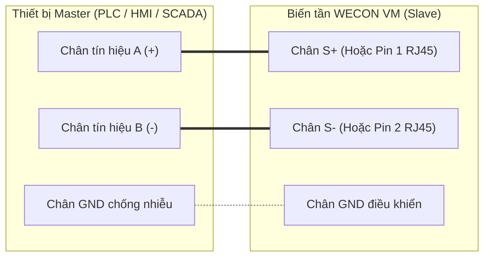

Biến tần **WECON VM Series** tích hợp sẵn cổng truyền thông nối tiếp **RS-485** (hỗ trợ giao thức **Modbus RTU** chuẩn công nghiệp). Tính năng này cho phép điều khiển tập trung biến tần từ hệ thống PLC (Siemens, Mitsubishi, Omron, WECON...) hoặc màn hình HMI/máy tính SCADA để đọc/ghi lệnh vận hành, giám sát thông số thời gian thực và cài đặt tham số từ xa.

Tài liệu này tổng hợp toàn bộ cấu hình cổng truyền thông, quy tắc chuyển đổi địa chỉ và bản đồ thanh ghi Modbus chuẩn từ **Sổ tay chính thức V2.0 (20251203)**.

---

## 1. Cấu hình phần cứng & Tham số truyền thông RS-485

### 1.1 Sơ đồ đấu nối dây vật lý

* **Cầu đấu `S+` và `S-`**: Cầu đấu dạng vặn ốc tiện lợi ngay trên Terminal điều khiển. Nối `S+` tới chân A(+) và `S-` tới chân B(-) của Master.
* **Cổng `RJ45`**: Chân 1 (Pin 1) tương ứng với tín hiệu `S+`, Chân 2 (Pin 2) tương ứng với `S-`.

### 1.2 Bảng cài đặt tham số truyền thông trên bàn phím (Nhóm FC)

Trước khi kết nối mạng Modbus, cần cài đặt các tham số thuộc nhóm **FC** trên bàn phím biến tần:

| Mã hàm | Tên thông số | Dải giá trị cài đặt chi tiết | Mặc định | Địa chỉ RAM |
| :---: | --- | --- | :---: | :---: |
| **[FC.00](./parameter-configuration.mdx#fc00)** | Modbus Station Address | `1` ~ `247` (Địa chỉ Trạm Slave duy nhất trong mạng) | 1 | 0C00H |
| **[FC.01](./parameter-configuration.mdx#fc01)** | Communication Baud Rate | `0`: 1200 bps `1`: 2400 bps `2`: 4800 bps `3`: **9600 bps** (Phổ biến) `4`: 19200 bps `5`: 38400 bps | 3 | 0C01H |
| **[FC.02](./parameter-configuration.mdx#fc02)** | Modbus Data Format | `0`: **(N,8,1)** Không Parity, 8 data bits, 1 stop bit `1`: (E,8,1) Parity chẵn (Even), 8 data bits, 1 stop bit `2`: (O,8,1) Parity lẻ (Odd), 8 data bits, 1 stop bit `3`: (N,8,2) Không Parity, 8 data bits, 2 stop bits | 0 | 0C02H |
| **[FC.03](./parameter-configuration.mdx#fc03)** | Communication Reply Delay | `0` ~ `500 ms` (Thời gian trễ phản hồi tin nhắn) | 1 ms | 0C03H |
| **[FC.04](./parameter-configuration.mdx#fc04)** | Timeout Alarm Delay | `0.1` ~ `100.0 s` (Thời gian ngắt kết nối trước khi báo lỗi) | 1.0 s | 0C04H |

---

## 2. Quy tắc chuyển đổi địa chỉ RAM và EEPROM

Giao thức Modbus trên biến tần WECON VM sử dụng các mã lệnh chuẩn:
* **`03H`**: Đọc một hoặc nhiều thanh ghi (Read Holding Registers).
* **`06H`**: Ghi một thanh ghi đơn (Write Single Register).
* **`10H`**: Ghi nhiều thanh ghi liên tiếp (Write Multiple Registers).

###  Quy tắc phân biệt địa chỉ RAM và EEPROM:
1. **Ghi vào bộ nhớ RAM (Địa chỉ dạng `0XXXH`)**:
   * Giá trị chỉ lưu tạm thời. Khi tắt nguồn biến tần, giá trị sẽ mất và khôi phục lại giá trị cũ.
   * *Ứng dụng*: Dùng cho lệnh ghi thay đổi tần số liên tục từ PLC để **tránh gây hỏng chip nhớ**.
2. **Ghi vào bộ nhớ EEPROM (Địa chỉ dạng `FXXXH`)**:
   * Đổi ký tự **`0`** đầu tiên của địa chỉ RAM thành ký tự **`F`**.
   * Giá trị sẽ được lưu cố định vào bộ nhớ EEPROM (khởi động lại nguồn vẫn giữ nguyên).
   * *Ví dụ*: Tham số thời gian tăng tốc `F0.18` có địa chỉ RAM là `0012H`. Nếu muốn lưu vĩnh viễn vào EEPROM, PLC phải ghi vào địa chỉ **`F012H`**.

> [!WARNING]
> Tuổi thọ ghi của chip nhớ EEPROM trên biến tần đạt khoảng **1 triệu lần**. Nếu hệ thống của bạn liên tục thay đổi giá trị tần số chạy theo tải (ví dụ thuật toán PID của PLC), bạn **bắt buộc phải ghi vào địa chỉ RAM (`1000H` hoặc `0XXXH`)** để bảo vệ phần cứng.

---

## 3. Bảng thanh ghi điều khiển & Giám sát hệ thống (Modbus Register Map)

### 3.1 Thanh ghi lệnh điều khiển & Cài đặt tần số

| Tên thanh ghi | Địa chỉ (Hex) | Hướng | Dải giá trị và Mô tả chi tiết | Đặc tính |
| :--- | :---: | :---: | --- | :---: |
| **Set Frequency** | **`1000H`** | R/W | Dải giá trị từ `-10000` đến `10000`, tương ứng với `-100.00%` ~ `100.00%` của tần số tối đa [`F0.10`](./parameter-configuration.mdx#f010) | RAM |
| **Control Command** | **`2000H`** | Write | • `0001H`: Ra lệnh Chạy Thuận (FWD Running) • `0002H`: Ra lệnh Chạy Ngược (REV Running) • `0003H`: Chạy Nhấp Thuận (FWD JOG) • `0004H`: Chạy Nhấp Ngược (REV JOG) • `0005H`: Dừng tự do (Free Stop / Coast to Stop) • `0006H`: Dừng giảm tốc (Deceleration Stop) • `0007H`: Xóa báo lỗi (Error Reset) | Write Only |
| **Running Status** | **`3000H`** | Read | • `0001H`: Biến tần đang chạy Thuận (FWD) • `0002H`: Biến tần đang chạy Ngược (REV) • `0003H`: Biến tần đã Dừng (Stopped) | Read Only |

---

### 3.2 Thanh ghi dữ liệu giám sát thời gian thực (Monitoring Registers)

| Tên thông số giám sát | Địa chỉ (Hex) | Đơn vị & Tỷ lệ hiển thị | Hướng |
| :--- | :---: | --- | :---: |
| **Running Frequency** | **`1001H`** | Tần số đầu ra thực tế (Độ phân giải: 2 số thập phân, `5000` = 50.00 Hz) | Read Only |
| **Set Frequency** | **`1002H`** | Tần số cài đặt hiện tại (Độ phân giải: 2 số thập phân) | Read Only |
| **Bus Voltage** | **`1003H`** | Điện áp DC Bus thực tế (Độ phân giải: 1 số thập phân, `3105` = 310.5 V) | Read Only |
| **Output Voltage** | **`1004H`** | Điện áp ngõ ra động cơ (Độ phân giải: 1 số thập phân) | Read Only |
| **Output Current** | **`1005H`** | Dòng điện đầu ra thực tế (Độ phân giải: 2 số thập phân, `250` = 2.50 A) | Read Only |
| **DI Input Status** | **`1008H`** | Trạng thái các ngõ vào số (Cộng dồn bit nhị phân: Bit 0 = DI1, Bit 1 = DI2, Bit 2 = DI3, Bit 3 = DI4) | Read Only |
| **AI Input Voltage** | **`100AH`** | Điện áp ngõ vào Analog AI1 (Độ phân giải: 1 số thập phân) | Read Only |
| **Potentiometer Voltage** | **`100CH`** | Điện áp chiết áp trên bàn phím (Độ phân giải: 1 số thập phân) | Read Only |
| **IGBT Temperature** | **`100DH`** | Nhiệt độ khối công suất IGBT (Độ phân giải: 1 số thập phân, `450` = 45.0 °C) | Read Only |
| **Motor RPM** | **`100FH`** | Tốc độ vòng quay thực tế của motor (Độ phân giải: 1 RPM) | Read Only |
| **Inner PLC Stage** | **`1012H`** | Cấp bước PLC nội hàm hiện tại (`0` ~ `15`) | Read Only |

---

### 3.3 Thanh ghi nhật ký lỗi & Sự cố truyền thông

| Tên thanh ghi | Địa chỉ (Hex) | Mã giá trị đọc về & Ý nghĩa | Hướng |
| :--- | :---: | --- | :---: |
| **Error Record Code** | **`8000H`** | • `0000H`: Không có lỗi • `0002H`: **ERR02** Quá dòng tăng tốc • `0003H`: **ERR03** Quá dòng giảm tốc • `0005H`: **ERR05** Quá áp Bus DC khi tăng tốc • `0006H`: **ERR06** Quá áp Bus DC khi giảm tốc • `0009H`: **ERR09** Thấp áp Bus DC • `000AH`: **ERR10** Quá tải biến tần • `000BH`: **ERR11** Quá tải động cơ • `000DH`: **ERR13** Mất pha ngõ ra • `000EH`: **ERR14** Quá nhiệt IGBT • `000FH`: **ERR15** Lỗi ngõ vào ngoài DI | Read Only |
| **Comm Failure Record** | **`8001H`** | • `0000H`: Không có lỗi truyền thông • `0001H`: Sai mã Function Code • `0002H`: Lỗi truyền dẫn đường truyền • `0003H`: Sai mã kiểm tra CRC Check • `0004H`: Địa chỉ thanh ghi không hợp lệ (Invalid Address) • `0005H`: Dữ liệu gửi không hợp lệ (Invalid Data) • `0006H`: Cài đặt tham số không hợp lệ • `0007H`: Hệ thống bị khóa | Read Only |

---

## 4. Ví dụ lập trình khung truyền Modbus RTU thực tế

### Ví dụ 1: Gửi lệnh Chạy Thuận (FWD Run)
Master (PLC) gửi câu lệnh ghi một thanh ghi (`06H`) vào địa chỉ `2000H` với giá trị `0001H`:

* **Frame gửi đi (Master $\rightarrow$ VFD)**: `01 06 20 00 00 01 43 CA` (Địa chỉ 1, Function 06, Register 2000H, Data 0001H, CRC16).
* **Frame phản hồi (VFD $\rightarrow$ Master)**: `01 06 20 00 00 01 43 CA`.

### Ví dụ 2: Gửi lệnh Dừng giảm tốc (Deceleration Stop)
Master gửi câu lệnh ghi giá trị `0006H` vào địa chỉ `2000H`:

* **Frame gửi đi**: `01 06 20 00 00 06 03 C8` (Địa chỉ 1, Function 06, Register 2000H, Data 0006H, CRC16).

---

## 5. Tài liệu liên quan

:::tip[CÁC TRANG LIÊN QUAN]
* 📄 **[Sổ Tay Hướng Dẫn Vận Hành WECON VM (Manual.mdx)](./Manual.mdx)**
* 📋 **[Bảng Tham Số Cài Đặt Chi Tiết F0 - FD (parameter-configuration.mdx)](./parameter-configuration.mdx)**
* ⚠️ **[Bảng Mã Lỗi & Cách Khắc Phục ERR02 - ERR22 (error-codes.mdx)](./error-codes.mdx)**
:::
