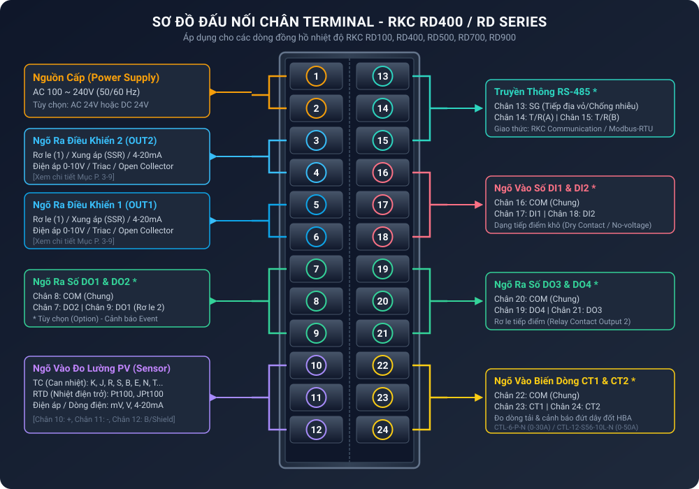

import React from 'react';

# Đồng Hồ Điều Khiển Nhiệt Độ RKC RD400 / RD Series

Bộ điều khiển nhiệt độ kỹ thuật số dòng **RKC RD Series** (gồm các model: **RD100, RD400, RD500, RD700, RD900**) là thiết bị điều khiển công nghiệp độ chính xác cao đến từ hãng **RKC Instrument Inc. (Nhật Bản)**. Thiết bị được tích hợp các thuật toán điều khiển PID tiên tiến như **Auto-Tuning (AT)** và **Self-Tuning (ST)**, hỗ trợ 2 ngõ ra điều khiển độc lập (Heating/Cooling), ngõ vào cảm biến đa dạng và truyền thông nối tiếp RS-485 chuẩn Modbus RTU.

---

## 1. Sơ Đồ Đấu Nối Chân (Terminal Wiring Diagram)

Sơ đồ chân bên dưới áp dụng trực tiếp cho model **RKC RD400** (kích thước chuẩn DIN $96 \times 48 \text{ mm}$) với 24 chân đấu nối phía sau thiết bị:

### Bảng Tra Cứu Chân Terminal (1 đến 24)

| Nhóm chức năng | Chân số | Tên tín hiệu | Diễn giải chi tiết kỹ thuật |
| :--- | :---: | :--- | :--- |
| **Nguồn cấp (Power Supply)** | **1 - 2** | `AC 100-240V` / `24V` | Nguồn cấp tiêu chuẩn: AC 100~240V (50/60 Hz). Option: AC 24V hoặc DC 24V. |
| **Ngõ ra điều khiển 2 (OUT2)** | **3 - 4** | `OUT2` | Ngõ ra chính/phụ (Relay, Xung áp SSR, 4-20mA, 0-10V, Triac hoặc Open Collector). |
| **Ngõ ra điều khiển 1 (OUT1)** | **5 - 6** | `OUT1` | Ngõ ra điều khiển chính (Relay contact, Xung áp kích SSR, Dòng 4-20mA, Áp 0-10V). |
| **Ngõ ra số DO1 & DO2** `*` | **7 - 8 - 9** | `DO1`, `DO2`, `COM` | Chân **8** là chân chung (COM). Chân **7** là ngõ ra `DO2`, chân **9** là ngõ ra `DO1` (Rơ le cảnh báo Event 1, Event 2). |
| **Ngõ vào cảm biến PV** | **10 - 11 - 12** | `PV Input` | **Thermocouple (TC)**: 10 (+), 11 (-). **RTD (Pt100/JPt100)**: 10 (A), 11 (B), 12 (B). **Điện áp/Dòng điện (mV/V/mA)**: 10 (+), 11 (-). |
| **Truyền thông RS-485** `*` | **13 - 14 - 15** | `SG`, `T/R(A)`, `T/R(B)` | Chân **13**: Tiếp địa chống nhiễu (`SG`). Chân **14**: Tín hiệu A (+), Chân **15**: Tín hiệu B (-). Chuẩn RKC / Modbus-RTU. |
| **Ngõ vào số DI1 & DI2** `*` | **16 - 17 - 18** | `DI1`, `DI2`, `COM` | Chân **16** là chân chung (COM). Chân **17** ngõ vào `DI1`, Chân **18** ngõ vào `DI2`. Tiếp điểm khô (Dry Contact / No-voltage). |
| **Ngõ ra số DO3 & DO4** `*` | **19 - 20 - 21** | `DO3`, `DO4`, `COM` | Chân **20** là chân chung (COM). Chân **19** ngõ ra `DO4`, Chân **21** ngõ ra `DO3` (Rơ le cảnh báo Event 3, Event 4). |
| **Ngõ vào biến dòng CT** `*` | **22 - 23 - 24** | `CT1`, `CT2`, `COM` | Chân **22** là chân chung (COM). Chân **23** ngõ vào biến dòng `CT1`, Chân **24** ngõ vào `CT2` (Cảnh báo đứt điện trở HBA). |

:::note Ghi chú
Các mục đánh dấu ký hiệu `*` là các tính năng tùy chọn (Option Code) đi kèm theo từng mã hàng của đồng hồ.
:::

---

## 2. Danh Sách Thông Số Kỹ Thuật & Cấu Hình Parameter

Dựa trên tài liệu kỹ thuật chính thức **IMR02C44-C1** của RKC Instrument Inc., các thông số được phân loại thành các tầng menu quản lý như sau:

### 2.1. Màn Hình Giám Sát (Monitor Display Mode)

Màn hình hiển thị giá trị làm việc thời gian thực khi thiết bị đang ở chế độ vận hành bình thường:

| Tên hiển thị | Diễn giải thuộc tính | Dải giá trị / Mô tả kỹ thuật | Giá trị mặc định |
| :--- | :--- | :--- | :---: |
| **PV / SV** | Màn hình chính | Hàng trên (PV): Giá trị nhiệt độ đo thực tế từ cảm biến. Hàng dưới (SV): Giá trị nhiệt độ cài đặt mục tiêu. | — |
| **CT1 / CT2** | Dòng điện tải | Dòng điện đo qua biến dòng: $0.0 \sim 30.0\text{ A}$ (với CT `CTL-6-P-N`) hoặc $0.0 \sim 50.0\text{ A}$ (với CT `CTL-12-S56-10L-N`). | — |
| **MV1** | Ngõ ra Gia nhiệt % | Phần trăm công suất ngõ ra điều khiển 1 (Heating Output MV): $0.0\% \sim 100.0\%$. | — |
| **MV2** | Ngõ ra Làm lạnh % | Phần trăm công suất ngõ ra điều khiển 2 (Cooling Output MV): $0.0\% \sim 100.0\%$. | — |
| **TIME** | Bộ định thời Timer | Thời gian còn lại của bộ định thời: `00:01` đến `99:59` (Giờ:Phút hoặc Phút:Giây). | — |

---

### 2.2. Chế Độ Cài Đặt Giá Trị Mục Tiêu (SV Setting Mode)

| Mã tham số | Tên tiếng Việt | Mô tả & Dải cài đặt kỹ thuật | Mặc định |
| :--- | :--- | :--- | :---: |
| `SV1` | Giá trị cài đặt 1 | Cài đặt nhiệt độ mục tiêu vùng memory 1 (Trong giới hạn SV Low ~ High Limit). | `0` (`0.0`) |
| `SV2` | Giá trị cài đặt 2 | Cài đặt nhiệt độ mục tiêu vùng memory 2. | `0` (`0.0`) |
| `SV3` | Giá trị cài đặt 3 | Cài đặt nhiệt độ mục tiêu vùng memory 3. | `0` (`0.0`) |
| `SV4` | Giá trị cài đặt 4 | Cài đặt nhiệt độ mục tiêu vùng memory 4. | `0` (`0.0`) |

---

### 2.3. Chế Độ Chuyển Đổi Nhanh (Mode Selection)

| Mã tham số | Chức năng | Mô tả cài đặt | Mặc định |
| :--- | :--- | :--- | :---: |
| `AUTO/MAN` | Tự động / Thủ công | `0000`: Chế độ tự động (AUTO Mode). `0001`: Chế độ thủ công (MANUAL Mode - Chỉnh tay MV). | `0000` |
| `RUN/STOP` | Chạy / Dừng | `0000`: Cho phép điều khiển (RUN). `0001`: Tắt ngõ ra điều khiển (STOP). | `0000` |
| `Lock` | Khóa phím cài đặt | `0000`: Mở khóa phím. `0001`: Khóa cài đặt (Chống can thiệp phím bấm ngoài ý muốn). | `0000` |

---

### 2.4. Chế Độ Cài Đặt Thông Số PID & Cảnh Báo (Parameter Mode)

Chế độ cài đặt các thông số vận hành cốt lõi PID, cảnh báo sự cố và bộ lọc số:

| Mã Ký Hiệu | Tên Thuật Ngữ Kỹ Thuật | Mô Tả & Dải Giá Trị Cài Đặt | Giá Trị Mặc Định |
| :---: | :--- | :--- | :---: |
| **`AT`** | **Auto-Tuning (Tự dò PID)** | `0`: Tắt dò tự động. `1`: Kích hoạt tự động dò tìm thông số PID (Thực thi Auto-Tuning). | `0` |
| **`ST`** | **Self-Tuning (Tự điều chỉnh)** | `0`: Tắt tự điều chỉnh. `1`: Bật tính năng Self-Tuning tự tối ưu PID liên tục theo tải. | `0` |
| **`P`** | **Proportional Band (Dải tỷ lệ)** | Dải tỷ lệ điều khiển gia nhiệt: $0.0 \sim \text{Max Range}$ ($0$: Điều khiển ON/OFF). | `30` (`30.0`) |
| **`I`** | **Integral Time (Thời gian tích phân)** | Thời gian tích phân $I$: $1 \sim 3600\text{ s}$ ($0$: Tắt tích phân, thành điều khiển PD). | `240` |
| **`D`** | **Derivative Time (Thời gian vi phân)** | Thời gian vi phân $D$: $1 \sim 3600\text{ s}$ ($0$: Tắt vi phân, thành điều khiển PI). | `60` |
| **`ARW`** | **Anti-Reset Windup** | Giới hạn chống tích lũy bão hòa tích phân: $1 \sim 100\%$ dải tỷ lệ $P$. | `100` |
| **`DB`** | **Deadband / Overlap** | Dải chết (Deadband) hoặc dải chồng lấp (Overlap) giữa Heating và Cooling: $-10.0 \sim +10.0^\circ\text{C}$. | `0.0` |
| **`T1`** | **Heat Cycle Time** | Chu kỳ xung ngõ ra gia nhiệt `OUT1`: $1 \sim 100\text{ s}$ (Dành cho rơ le hoặc SSR). | `20` (Relay) / `2` (SSR) |
| **`T2`** | **Cool Cycle Time** | Chu kỳ xung ngõ ra làm lạnh `OUT2`: $1 \sim 100\text{ s}$. | `20` (Relay) / `2` (SSR) |
| **`EV1`** | **Event 1 Alarm Set** | Giá trị cài đặt cảnh báo 1 (Độ lệch nhiệt độ High/Low, tuyệt đối, dải băng...). | `50` (`5.0`) |
| **`EV2`** | **Event 2 Alarm Set** | Giá trị cài đặt cảnh báo 2. | `50` (`5.0`) |
| **`EV3`** | **Event 3 Alarm Set** | Giá trị cài đặt cảnh báo 3. | `50` (`5.0`) |
| **`EV4`** | **Event 4 Alarm Set** | Giá trị cài đặt cảnh báo 4. | `50` (`5.0`) |
| **`HBA1`** | **Heater Break Alarm 1** | Ngưỡng cảnh báo đứt dây đốt điện trở 1: $0.0 \sim 100.0\text{ A}$ ($0.0$: Tắt cảnh báo). | `0.0` |
| **`HBA2`** | **Heater Break Alarm 2** | Ngưỡng cảnh báo đứt dây đốt điện trở 2: $0.0 \sim 100.0\text{ A}$ ($0.0$: Tắt cảnh báo). | `0.0` |
| **`LBA`** | **Loop Break Alarm Time** | Thời gian phát hiện lỗi đứt vòng lặp điều khiển PID: $0 \sim 7200\text{ s}$ ($0$: Tắt LBA). | `480` |
| **`pb`** | **PV Sensor Bias (Offset)** | Hiệu chỉnh sai lệch giá trị đo cảm biến nhiệt: $-1999 \sim +9999^\circ\text{C}$. | `0.0` |
| **`FIL`** | **PV Digital Filter** | Hằng số thời gian bộ lọc số tín hiệu ngõ vào PV: $0 \sim 100\text{ s}$. | `0` |

---

### 2.5. Chế Độ Kỹ Thuật Hệ Thống (Engineering Mode - F00 đến F91)

:::warning Cảnh Báo Cài Đặt
Các tham số trong chế độ **Engineering Mode** tác động trực tiếp đến cấu trúc phần cứng, loại ngõ vào cảm biến và giao thức truyền thông của đồng hồ. **Không tự ý thay đổi khi không nắm rõ thông số thiết bị.**
:::

| Mã Nhóm | Thuật Ngữ Kỹ Thuật | Chi Tiết Cấu Hình & Chức Năng |
| :---: | :--- | :--- |
| **`F00`** | **Parameter Lock Code** | Mật khẩu khóa bảo vệ các nhóm tham số (Giá trị `0` đến `10`). |
| **`F01`** | **Sensor Input & Decimal** | **Chọn loại cảm biến ngõ vào & Dấu chấm động**: • Thermocouple: `K`, `J`, `R`, `S`, `B`, `E`, `N`, `T`, `W5Re/W26Re`, `PLII`. • RTD: `Pt100`, `JPt100`. • Điện áp/Dòng điện: `0-5V`, `1-5V`, `0-20mA`, `4-20mA`. • Định dạng số thập phân: `0` (nguyên $1^\circ\text{C}$), `1` (thập phân $0.1^\circ\text{C}$). |
| **`F02`** | **SV Limit (High / Low)** | Khống chế giới hạn cài đặt nhiệt độ SV nhỏ nhất (Low Limit) và lớn nhất (High Limit). |
| **`F03`** | **Event 1 Type** | Định nghĩa dạng cảnh báo Event 1 (Cảnh báo độ lệch trên/dưới, dải băng, tuyệt đối...). |
| **`F04`** | **Event 2 Type** | Định nghĩa dạng cảnh báo Event 2. |
| **`F05`** | **Event 3 Type** | Định nghĩa dạng cảnh báo Event 3. |
| **`F06`** | **Event 4 Type** | Định nghĩa dạng cảnh báo Event 4. |
| **`F07`** | **Control Action** | Chọn tác động điều khiển: `Reverse Action` (Gia nhiệt / Heating) hoặc `Direct Action` (Làm lạnh / Cooling). |
| **`F08`** | **OUT1 Function** | Khai báo chức năng ngõ ra `OUT1`: Điều khiển gia nhiệt (Heating), làm lạnh (Cooling) hoặc báo Alarm. |
| **`F09`** | **OUT2 Function** | Khai báo chức năng ngõ ra `OUT2`: Điều khiển làm lạnh (Cooling) hoặc ngõ ra báo động. |
| **`F10`** | **DO1 ~ DO4 Assignment** | Phân công chức năng xuất rơ le ngõ ra số `DO1`, `DO2`, `DO3`, `DO4` tương ứng các Event 1~4, HBA, LBA. |
| **`F21`** | **DI1 / DI2 Function** | Định nghĩa chức năng ngõ vào số `DI1` & `DI2`: • Chuyển đổi dải nhiệt độ `SV1 ~ SV4`. • Chuyển chế độ `RUN/STOP`. • Chuyển đổi `AUTO/MANUAL`. • Xóa trạng thái cảnh báo (Alarm Reset). |
| **`F50`** | **RS-485 Communication** | **Cấu hình thông số truyền thông RS-485**: • Protocol: `0` (RKC ANSI Standard), `1` (Modbus-RTU). • Baud rate: `2400`, `4800`, `9600`, `19200 bps`. • Data bit: `7` hoặc `8` bit. • Parity bit: `None`, `Even`, `Odd`. • Stop bit: `1` hoặc `2` bit. • Địa chỉ Trạm (Slave Station Address): $1 \sim 99$. |

---

## 3. Quy Trình Cấu Hình & Vận Hành Nhanh (Quick Setup Guide)

### Bước 1: Kiểm tra đấu nối phần cứng
1. Cấp nguồn $100 \sim 240\text{ VAC}$ vào chân **1** và **2**.
2. Đấu nối cảm biến nhiệt độ (ví dụ Can nhiệt K) vào chân **10 (+)** và chân **11 (-)**.
3. Đấu ngõ ra điều khiển `OUT1` (chân **5** và **6**) tới khởi động từ (Contactor) hoặc rơ le bán dẫn (SSR).

### Bước 2: Chọn đúng loại cảm biến (Sensor Input)
1. Nhấn giữ phím **SET** kết hợp phím **`<`** trong $4\text{ s}$ để truy cập tầng **Engineering Mode**.
2. Chuyển đến tham số **`F01`**.
3. Cài đặt mã cảm biến tương ứng (ví dụ: `K01` hoặc `K02` đối với Can K dải $0 \sim 400.0^\circ\text{C}$).
4. Nhấn **SET** để lưu.

### Bước 3: Cài đặt nhiệt độ mục tiêu (Set Value - SV)
1. Ở màn hình chính, nhấn phím **SET**.
2. Sử dụng các phím mũi tên **`▲`**, **`▼`**, **`<`** để thay đổi giá trị nhiệt độ mong muốn (ví dụ $150.0^\circ\text{C}$).
3. Nhấn **SET** để lưu cài đặt.

### Bước 4: Kích hoạt tự động dò thông số PID (Auto-Tuning)
1. Nhấn phím **SET** trong $2\text{ s}$ để vào menu cài đặt Parameter Mode.
2. Tìm đến tham số **`AT`**.
3. Chuyển từ `0` sang `1`.
4. Nhấn **SET**. Màn hình sẽ chớp tắt biểu tượng `AT` báo hiệu đồng hồ đang trong quá trình tự dò và tính toán bộ thông số $P, I, D$ tối ưu nhất cho hệ thống.

---

## 4. Bảng Chẩn Đoán Lỗi & Xử Lý Sự Cố (Troubleshooting)

| Biểu hiện / Mã lỗi | Nguyên nhân sự cố | Phương án xử lý kỹ thuật |
| :--- | :--- | :--- |
| **`uuuu`** chớp tắt | Ngược cực cảm biến ngõ vào $PV$ hoặc giá trị nhiệt độ đo thấp hơn giới hạn dải đo (`PV < Low Limit`). | • Kiểm tra chiều đấu dây $(+)$ và $(-)$ của can nhiệt. • Kiểm tra dải đo cài đặt trong tham số `F01`. |
| **`oooo`** chớp tắt | Đứt dây cảm biến (Sensor Break) hoặc giá trị nhiệt độ đo cao vượt quá giới hạn dải đo (`PV > High Limit`). | • Kiểm tra đứt dây can nhiệt / RTD Pt100. • Thay thế cảm biến mới nếu hỏng. |
| **Báo lỗi `HBA`** | Điện trở đốt bị đứt hoặc dây tải thông qua biến dòng CT bị ngắt kết nối. | • Kiểm tra dây mayso/điện trở đốt. • Kiểm tra cầu chì công suất hoặc rơ le bán dẫn SSR. |
| **Báo lỗi `LBA`** | Mất tín hiệu phản hồi trong vòng lặp PID (Hỏng ngõ ra điều khiển, Contactor/SSR không đóng). | • Kiểm tra ngõ ra điều khiển `OUT1`. • Kiểm tra nguồn cấp tải động lực. |

---

## 5. Tài Liệu Tham Khảo Chính Thức (Official References)

* **RKC Instrument Inc. Official Download**: [Manual Library RKC](https://www.rkcinst.co.jp/english/download-center/)
* **RKC RD Series Operation Manual**: Document Code `IMR02C44-C1`
* **RKC RB/RD Series Communication Manual**: Document Code `IMR02C16-E`
