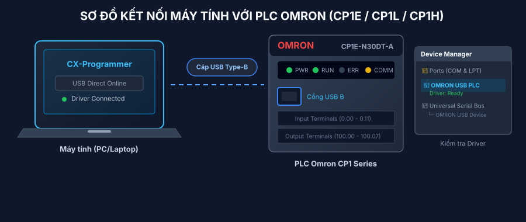
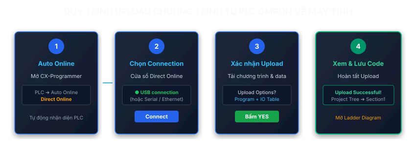
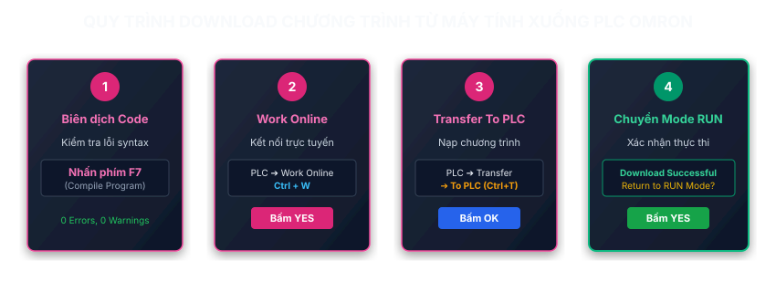

## Giới thiệu

Bài viết hướng dẫn chi tiết cách kết nối phần mềm **CX-Programmer** (thuộc bộ **CX-One**) với các dòng PLC Omron phổ biến (như **CP1E**, **CP1L**, **CP1H**, **CJ1M**, **CJ2M**...). Nội dung bao gồm chuẩn bị phần cứng, kiểm tra Driver, quy trình **Upload** (sao lưu chương trình từ PLC về máy tính) và **Download** (nạp chương trình từ máy tính xuống PLC) kèm các lưu ý an toàn quan trọng khi vận hành.

---

## 1. Chuẩn bị phần cứng và phần mềm

### Phần mềm và cáp nạp cần thiết

- **Phần mềm:** Omron CX-Programmer (nằm trong bộ phần mềm Omron CX-One v4.x trở lên).
- **Cáp kết nối:**
  - **Cáp USB Type-A to Type-B** (chuẩn cáp máy in thông dụng) dùng trực tiếp cho các dòng **CP1E, CP1L, CP1H**.
  - **Cáp sê-ri RS-232 / USB-to-Serial (DB9)** dành cho các dòng PLC sử dụng cổng RS-232/RS-422/RS-485 cũ hoặc dòng CJ/CS.
  - **Cáp mạng Ethernet (RJ45)** đối với các dòng có cổng Ethernet (như CP1L-EM, CJ2M-EIP).



---

### Kiểm tra Driver trên máy tính (Device Manager)

Trước khi kết nối phần mềm, bạn cần đảm bảo Windows đã nhận diện driver PLC Omron:

1. Cắm cáp USB nối từ máy tính đến cổng USB lập trình trên PLC Omron.
2. Cấp nguồn điện 24VDC hoặc 220VAC cho PLC.
3. Nhấp chuột phải vào **This PC** (hoặc My Computer) ➔ chọn **Manage** ➔ chọn **Device Manager**.
4. Kiểm tra mục **OMRON USB PLC Device** hoặc **Ports (COM & LPT)**:
   - Nếu hiển thị thiết bị có biểu tượng màu xanh hoặc không có dấu chấm cảm vàng `(!)`, nghĩa là máy tính đã nhận Driver thành công.
   - Nếu có dấu chấm cảm vàng, cần tiến hành cài đặt lại Driver từ thư mục: `C:\OMRON\CX-One\Drivers\USB`.

:::tip[Mẹo kiểm tra nhanh]
Đối với dòng CP1E/CP1L/CP1H, khi cắm cáp USB vào máy tính, hệ thống sẽ phát ra tiếng bíp nhận diện thiết bị USB của Windows và cờ LED `COMM` trên PLC sẽ nháy nhẹ.
:::

---

## 2. Quy trình Upload chương trình (Tải từ PLC lên Máy tính)

**Upload** (hay còn gọi là Read / Backup) là thao tác đọc toàn bộ chương trình logic Ladder, cấu hình phần cứng (IO Table) và các tập lệnh từ PLC lưu vào máy tính. Thao tác này cực kỳ hữu ích khi bạn tiếp nhận máy mới, sao lưu dự phòng hoặc khắc phục sự cố.



### Các bước thực hiện Upload (Auto Online)

#### Bước 1: Khởi chạy phần mềm và chọn Auto Online

1. Mở phần mềm **CX-Programmer**.
2. Trên thanh Menu chính, chọn **PLC** ➔ **Auto Online** ➔ **Direct Online** (hoặc nhấn vào biểu tượng _Direct Online_ trên thanh công cụ).

```text
CX-Programmer Menu:
[PLC]
 └── [Auto Online]
      └── [Direct Online]  <-- Tự động quét và nhận dạng PLC
```

#### Bước 2: Chọn chuẩn kết nối (Connection Type)

1. Cửa sổ **Direct Online** xuất hiện.
2. Tích chọn **USB connection** (nếu bạn sử dụng cáp USB Type-B).
   _(Nếu dùng cáp RS-232 hoặc Ethernet, chọn Serial port hoặc Ethernet tương ứng)._
3. Nhấp chọn nút **Connect**.

#### Bước 3: Xác nhận đồng ý Upload

1. Hộp thoại thông báo xuất hiện hỏi bạn có muốn tải toàn bộ chương trình và bảng cấu hình (IO Table/Unit Information) từ PLC về máy tính hay không.
2. Nhấp chọn **Yes**.

#### Bước 4: Hoàn tất và kiểm tra dữ liệu

1. Phần mềm hiển thị thanh tiến trình nạp dữ liệu (_Uploading from PLC..._).
2. Sau khi upload thành công, giao diện làm việc chính của CX-Programmer sẽ xuất hiện tên PLC (ví dụ `NewPLC1[CP1E]`).
3. Tại khung cây thư mục **Project Tree** bên trái:
   - Nhấp đúp vào **Program** ➔ **NewProgram1** ➔ **Section1** để mở sơ đồ Ladder và kiểm tra mã logic.

:::caution[Lưu ý về Mật khẩu (Password)]
Nếu PLC Omron bị đặt mật khẩu bảo vệ (UM Read Protect), một cửa sổ yêu cầu nhập Password sẽ hiện ra. Bạn phải nhập chính xác mật khẩu thì mới có thể Upload chương trình.
:::

---

## 3. Quy trình Download chương trình (Nạp từ Máy tính xuống PLC)

**Download** (nạp chương trình) là thao tác ghi đè bản mã logic Ladder và cấu hình từ máy tính vào bộ nhớ RAM/EEPROM của PLC Omron.



### Các bước thực hiện Download

#### Bước 1: Biên dịch chương trình (Compile / Check Syntax)

Trước khi nạp vào PLC, hãy luôn biên dịch để đảm bảo chương trình không bị lỗi cú pháp:

- Nhấn phím **F7** (hoặc chọn menu **Program** ➔ **Compile**).
- Quan sát cửa sổ **Compile Window** ở góc dưới: Cần đảm bảo báo `0 Errors, 0 Warnings`.

#### Bước 2: Kết nối trực tuyến (Work Online)

1. Chọn menu **PLC** ➔ **Work Online** (hoặc bấm tổ hợp phím **Ctrl + W**).
2. Chọn **Yes** khi được hỏi xác nhận kết nối với PLC.
3. Khi kết nối Online thành công, màn hình sẽ chuyển sang chế độ theo dõi (giao diện Ladder có các đường kẻ đứt hoặc nền xám/xanh lá).

#### Bước 3: Nạp chương trình xuống PLC (Transfer To PLC)

1. Chọn menu **PLC** ➔ **Transfer** ➔ **To PLC...** (hoặc bấm tổ hợp phím **Ctrl + T**).

```text
Thao tác nạp:
[PLC] ➔ [Transfer] ➔ [To PLC...] (Ctrl + T)
```

2. Cửa sổ **Download Options** xuất hiện:
   - Tích chọn **Program(s)**: Nạp chương trình Ladder.
   - Tích chọn **PLC Settings**: Nạp cấu hình cài đặt vùng nhớ / cổng giao tiếp.
   - Tích chọn **Expansion Instruction / Symbols** (nếu cần).
3. Nhấp chọn **OK**.

#### Bước 4: Chuyển Mode và xác nhận ghi dữ liệu

1. Hộp thoại cảnh báo xuất hiện thông báo PLC sẽ phải ngắt chế độ vận hành (chuyển sang **PROGRAM mode**) để ghi dữ liệu vào bộ nhớ.
2. Nhấp chọn **Yes**.
3. Chờ phần mềm nạp dữ liệu hoàn tất (_Transfer Successful_), chọn **OK**.
4. Cửa sổ hỏi có muốn đưa PLC quay trở lại chế độ chạy **RUN mode** (hoặc MONITOR mode) hay không ➔ Chọn **Yes**.

:::warning[CẢNH BÁO AN TOÀN KHI DOWNLOAD]
Khi PLC chuyển sang **PROGRAM mode** hoặc nạp lại chương trình, tất cả các ngõ ra vật lý (`Y` / `100.xx`) sẽ lập tức ngắt (OFF). Bạn **phải đảm bảo thiết bị máy móc đang ở trạng thái dừng an toàn** trước khi bấm **Download / Transfer To PLC**!
:::

---

## 4. Các chế độ hoạt động (PLC Operating Modes) của Omron

PLC Omron có 3 chế độ hoạt động chính cần lưu ý trong quá trình nạp/rút và Online:

| Chế độ (Mode) | Đặc điểm & Chức năng                                                                                                                  | Trạng thái ngõ ra           | Mục đích sử dụng                                                       |
| :------------ | :------------------------------------------------------------------------------------------------------------------------------------ | :-------------------------- | :--------------------------------------------------------------------- |
| **PROGRAM**   | PLC dừng thực thi chương trình logic.                                                                                                 | Ngắt toàn bộ ngõ ra vật lý  | Cho phép Nạp (Download), Xóa bộ nhớ, Cấu hình IO Table.                |
| **MONITOR**   | PLC chạy chương trình logic bình thường và cho phép máy tính can thiệp chỉnh sửa Online (Online Edit), Force Bit / Change Word Value. | Ngõ ra hoạt động theo logic | Dùng trong quá trình Chạy thử máy, Debug và chỉnh sửa logic trực tiếp. |
| **RUN**       | PLC chạy chương trình ở tốc độ tối ưu độc lập, không cho phép can thiệp chỉnh sửa dữ liệu từ máy tính để đảm bảo an toàn tuyệt đối.   | Ngõ ra hoạt động theo logic | Chế độ vận hành sản xuất thực tế tại nhà máy.                          |

---

## 5. Các sự cố thường gặp và cách khắc phục (Troubleshooting)

### 1. Không kết nối được PLC (Lỗi "Failed to connect to the PLC")

- **Nguyên nhân:** Chưa cài Driver USB, cáp hỏng, chọn sai cổng kết nối (Com Port) hoặc sai loại PLC (PLC Type).
- **Khắc phục:**
  - Vào **Device Manager** kiểm tra lại Driver OMRON USB.
  - Nếu dùng cáp USB, hãy ưu tiên chọn chế độ **PLC ➔ Auto Online ➔ Direct Online**.
  - Kiểm tra lại nguồn cấp điện cho PLC (đèn `PWR` phải sáng xanh).

### 2. Báo lỗi khi Download ("Memory is write-protected")

- **Nguyên nhân:** Gạt công tắc bảo vệ ghi trên PLC (DIP Switch) hoặc cờ bảo vệ phần mềm đang mở.
- **Khắc phục:** Kiểm tra DIP Switch 1 hoặc 2 trên thân PLC Omron (đưa về vị trí OFF) và bỏ chọn Write Protection trong phần mềm.

### 3. Đèn ERR/ALM sáng đỏ hoặc nhấp nháy

- **Nguyên nhân:** Lỗi chương trình (Fatal Error như vòng lặp vô tận, thiếu lệnh END, tràn thanh ghi) hoặc thiếu pin duy trì dữ liệu (Battery Error).
- **Khắc phục:**
  - Vào menu **PLC ➔ Error Log** trong CX-Programmer để đọc mã lỗi chi tiết.
  - Thêm lệnh `END(001)` ở rắc ranh cuối cùng của chương trình.

---

## Tổng kết

Việc thao tác **Upload** và **Download** chương trình trên PLC Omron bằng phần mềm **CX-Programmer** rất đơn giản và linh hoạt nhờ tính năng **Auto Online (Direct Online)**. Hãy luôn ghi nhớ nguyên tắc: **Backup (Upload) chương trình cũ trước khi nạp (Download) chương trình mới** để tránh nguy cơ mất dữ liệu sản xuất!
